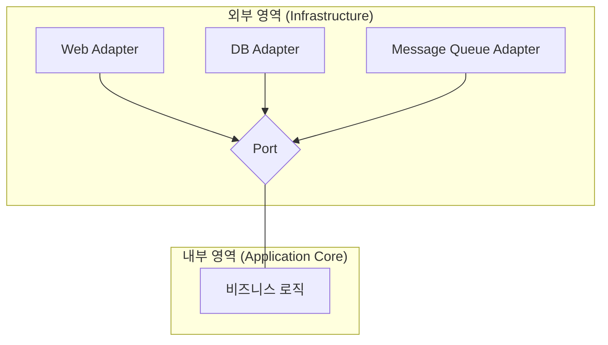

소프트웨어를 개발하다 보면 우리는 두 종류의 코드를 작성하게 됩니다. 하나는 "우리가 무엇을 해야 하는가"를 정의하는 **비즈니스 로직**이고, 다른 하나는 "그것을 어떻게 할 것인가"를 정의하는 **구현 기술**입니다. 과거에는 이 둘을 명확히 구분하지 않고 밀접하게 섞어 작성하는 경우가 많았습니다. 하지만 이런 방식은 당장 개발하기에는 편할지 몰라도, 드러나지 않은 문제를 가지고 있습니다.

예를 들어, 우리가 사용하던 특정 데이터베이스 라이브러리가 더 이상 유지보수되지 않거나, 새로운 기술 트렌드에 맞춰 메시지 큐 시스템을 도입해야 하는 상황을 가정해봅시다. 만약 비즈니스 로직 코드 곳곳에 특정 라이브러리의 코드가 녹아있다면 어떻게 될까요? 코드를 수정하는 과정에서 비즈니스 로직을 수정해야하고 이는 **불필요한 노동**과 **예상치 못한 버그를 발생**시킬 수 있습니다.

이 글에서는 이렇게 중요한 **비즈니스 로직(기능)을 특정 기술로부터 보호하기 위해 코드를 분리하는 것의 필요성**과 구체적인 방법에 대해 이야기합니다.

---

## 왜 기능과 기술을 분리해야 할까?

기능과 기술의 분리는 단순히 '좋은 설계'라는 막연한 개념을 넘어, 코드의 생존과 직결된 매우 실용적인 이유들을 가지고 있습니다.

### 1. 유지보수성의 극대화

코드의 생존에는 버그 수정, 기능 추가 그리고 리팩토링등 지속적인 관리(유지보수)가 필요합니다. 만약 비즈니스 로직과 기술 구현이 분리되어 있다면 디버깅시 로직의 문제인지 기술의 문제인지 쉽게 확인할 수 있고, 수정 시에도 서로의 영향을 최소화하면 작업해 유지보수성을 극대화할 수 있습니다.

### 2. 테스트 용이성 확보

핵심 비즈니스 로직은 외부 세계(DB, API, UI 등)에 대한 의존성 없이 순수하게 로직 그 자체만으로 테스트할 수 있어야 합니다. 기능과 기술이 분리되면, 무거운 프레임워크나 데이터베이스 연결 없이도 **비즈니스 로직을 빠르고 안정적으로 테스트**할 수 있습니다. 이는 [[단위 테스트(Unit Test)]]의 효율을 극대화하고 코드의 신뢰성을 높여줍니다.

### 3. 기술 변화에 대한 유연성

분리된 구조는 소프트웨어를 훨씬 더 유연하게 만듭니다. 예를 들어, 처음에는 `REST API`로 외부 시스템과 통신했지만, 나중에 `Kafka` 같은 메시지 큐 방식으로 변경해야 할 때, 변경된는 부분 교체만으로 간단히 끝날 수 있습니다. 비즈니스 로직은 어떤 통신 기술이 사용되는지 전혀 알 필요가 없습니다.

---

## 어떻게 분리할 수 있을까?

기능과 기술을 분리하는 핵심 아이디어는 **추상화(Abstraction)를 통해 둘 사이에 경계를 만드는 것**입니다. 그리고 이 아이디어를 구체화한 것이 바로 여러 아키텍처 패턴과 설계 원칙입니다.

### 헥사고날 아키텍처 (Hexagonal Architecture)

가장 대표적인 분리 구조는 [[헥사고널 아키텍처(Hexagonal Architecture)]]이며, **포트와 어댑터(Ports and Adapters)** 구조라고도 불립니다.

이 아키텍처의 핵심은 애플리케이션의 **순수한 비즈니스 로직(Application Core)**을 중앙에 배치하고, 외부 세계와의 모든 상호작용을 '포트(Port)'라는 인터페이스를 통해 정의하는 것입니다. 그리고 이 '포트'의 실제 구현체를 '어댑터(Adapter)'라고 부릅니다.



- **내부 영역 (Application Core)**: 오직 순수한 비즈니스 규칙만을 담고 있으며, 외부의 기술에 대해 전혀 알지 못합니다.
    
- **포트 (Port)**: 내부 영역이 외부와 소통하기 위한 창구이며, 항상 **인터페이스(Interface)**로 정의됩니다. 예를 들어, `주문 정보를 저장하는 기능`은 `OrderRepository`라는 인터페이스로 정의됩니다.
    
- **어댑터 (Adapter)**: 포트 인터페이스를 실제로 구현한 클래스입니다. `JPA`를 사용해 주문 정보를 저장한다면 `JpaOrderRepository`가 어댑터가 되고, `MongoDB`를 사용한다면 `MongoOrderRepository`가 어댑터가 됩니다.
    

이 구조는 [[의존성 역전 원칙(Dependency Inversion Principle)]]을 통해 완성됩니다. 즉, **세부 구현(어댑터)이 추상화(포트)에 의존**하게 만들어, 비즈니스 로직이 특정 기술에 종속되는 것을 원천적으로 차단합니다.

이와 유사한 목표를 가진 아키텍처로 [[클린 아키텍처(Clean Architecture)]]가 있으며, 이 역시 계층 간의 의존성 규칙을 통해 비즈니스 로직을 보호하는 것을 최우선으로 합니다.

---

## Spring 예제로 살펴보기

개념만으로는 와닿지 않을 수 있으니, 간단한 Spring 예제를 통해 알아보겠습니다.

초기 개발 단계에서는 빠르다는 이유로 다음과 같이 코드를 작성하기 쉽습니다.
```java
// OrderService: 비즈니스 로직을 처리하는 클래스
@Service
public class OrderService {

    private final JpaOrderRepository jpaOrderRepository; // 구현 기술에 직접 의존

    public OrderService(JpaOrderRepository jpaOrderRepository) {
        this.jpaOrderRepository = jpaOrderRepository;
    }

    public void createOrder(OrderData data) {
        // 비즈니스 로직 중간에 JPA 관련 코드가 섞여 들어갈 수 있음
        OrderEntity entity = new OrderEntity(data);
        jpaOrderRepository.save(entity); // JPA의 save 메서드를 직접 호출
    }
}
```

위 코드의 문제는 `OrderService`가 `JpaOrderRepository`라는 **구체적인 기술에 직접 의존**한다는 점입니다. 만약 데이터베이스 기술을 `JPA`가 아닌 다른 것으로 바꾸려면 `OrderService` 코드의 수정이 불가피합니다.

이제 포트와 어댑터 패턴을 적용하여 코드를 분리해 보겠습니다.

1. Port 정의 (Interface)

먼저, 비즈니스 로직 영역에 데이터 저장 기능에 대한 '포트'를 인터페이스로 정의합니다.

```java
// src/main/java/com/example/order/domain/OrderRepository.java
public interface OrderRepository {
    void save(Order order);
}
```

이 인터페이스는 '주문을 저장한다'는 **기능(what)만 정의**할 뿐, 어떻게(how) 저장하는지는 전혀 관심이 없습니다.

2. 비즈니스 로직은 Port에만 의존

이제 OrderService는 구체적인 클래스가 아닌, 우리가 정의한 OrderRepository 인터페이스에만 의존합니다.

```java
// src/main/java/com/example/order/domain/OrderService.java
@Service
public class OrderService {

    private final OrderRepository orderRepository; // 추상화(인터페이스)에 의존

    public OrderService(OrderRepository orderRepository) {
        this.orderRepository = orderRepository;
    }

    public void createOrder(OrderData data) {
        Order order = new Order(data);
        // 비즈니스 규칙 검증 로직...
        orderRepository.save(order);
    }
}
```

3. Adapter 구현 (Concrete Class)

마지막으로, 외부 인프라 영역에서 JPA를 이용해 OrderRepository 인터페이스를 실제로 구현한 '어댑터'를 만듭니다.

```java
// src/main/java/com/example/order/adapter/persistence/JpaOrderRepository.java
@Repository
public class JpaOrderRepository implements OrderRepository {

    private final SpringDataJpaRepository springDataJpaRepository;

    public JpaOrderRepository(SpringDataJpaRepository springDataJpaRepository) {
        this.springDataJpaRepository = springDataJpaRepository;
    }

    @Override
    public void save(Order order) {
        OrderEntity entity = mapToEntity(order);
        springDataJpaRepository.save(entity);
    }
}
```

이제 `OrderService`는 `JPA`의 존재를 전혀 모릅니다. 훗날 데이터베이스 기술을 바꾸고 싶다면, `OrderRepository`를 구현하는 새로운 어댑터(예: `MongoOrderRepository`)를 만들고, [[의존성 역전 원칙 (Dependency Inversion Principle)]]설정만 변경해주면 됩니다. **핵심 비즈니스 로직은 전혀 수정할 필요가 없습니다.**

---
## 주의할 점

물론 이 방식이 항상 올바른 것은 아닙니다(No Silver Bullet). 위 예시 코드를 보듯, 분리를 위해서는 코드의 접점 부분을 별도의 인터페이스로 정의해야합니다. 프로젝트 규모가 작거나 기술 변경 가능성이 낮은 프로젝트의 경우 오히려 코드 사이즈를 키우는 불필요한 작업이 될 수 있습니다. 개인적으로 프로젝트마다 성격이 다르기 때문에 직접 적용해보기 전까지는 확실한 장단점을 확인하기 어렵다고 생각합니다. 또한, 최근에는 LLM 을 이용해 초기 코드를 작성 장벽이 낮아졌기 때문에 PoC를 위해 일부 기능만이라도 직접 개발해 체감해보는 것이 가장 정확하다고 생각합니다.

## 결론

기능과 기술의 분리는 처음에는 인터페이스를 만들고 계층을 나누는 등 조금 더 번거로운 작업을 요구하는 것처럼 보일 수 있습니다. 하지만 이는 소프트웨어의 미래를 위한 현명한 투자입니다.

이렇게 구축된 시스템은 **변화에 유연하게 대처**할 수 있고, **시간이 지나도 가치를 잃지 않는 견고한 비즈니스 로직**을 가질 수 있게 됩니다. 결국, 기술은 언제나 변하지만 잘 정의된 비즈니스 로직은 비즈니스가 존재하는 한 계속해서 그 가치를 발휘하기 때문입니다.

---

## 참고 자료

- [Hexagonal Architecture - Alistair Cockburn](https://alistair.cockburn.us/hexagonal-architecture/)
- [The Clean Code Blog - The Clean Architecture](https://blog.cleancoder.com/uncle-bob/2012/08/13/the-clean-architecture.html)
- [Martin Fowler - Dependency Inversion Principle](https://martinfowler.com/articles/dipInTheWild.html)