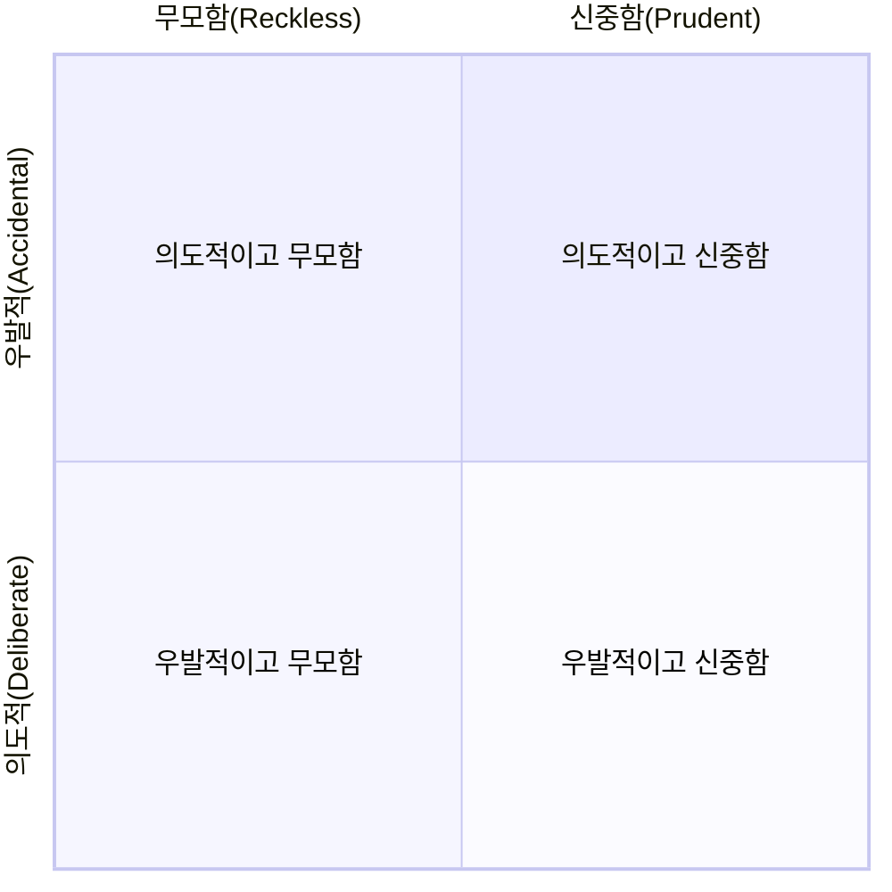

소프트웨어 개발에서 **기술 부채(Technical Debt)**란, 지금 당장 최적의 해결책을 선택하지 않고 더 빠른, 쉬운 방법을 선택함으로써 미래에 발생할 수 있는 추가적인 작업 비용을 의미합니다. 마치 돈을 빌리면 이자를 내야 하는 것처럼, 기술적인 지름길은 당장의 개발 속도를 높여줄 수 있지만, 장기적으로는 시스템의 복잡도를 높이고 유지보수를 어렵게 만들어 더 큰 비용(시간, 노력)을 초래하게 됩니다. 

이 용어는 워드 커닝햄(Ward Cunningham)에 의해 처음 사용되었으며, 개발자가 아닌 이해관계자들에게 소프트웨어 품질 관리의 중요성을 설명하기 위한 강력한 은유입니다. 기술 부채는 의도적으로 발생시킬 수도, 혹은 자신도 모르게 쌓일 수도 있습니다.

---

## 기술 부채는 왜 발생하는가?

기술 부채는 다양한 원인으로 발생하며, 이를 이해하는 것은 부채를 관리하고 예방하는 첫걸음입니다.

- **비즈니스 압박**: 시장 출시일을 맞추거나 경쟁사보다 빠르게 기능을 선보여야 한다는 압박감 속에서, 개발자들은 종종 '좋은' 코드보다 '작동하는' 코드를 우선시하게 됩니다.
- **불충분한 요구사항 정의**: 프로젝트 초기에 요구사항이 명확하게 정의되지 않으면, 계속되는 변경과 추가로 인해 코드 구조가 누더기처럼 변질될 수 있습니다.
- **설계 부족**: 충분한 설계 없이 개발을 시작하면, 애플리케이션의 규모가 커짐에 따라 구조적인 문제에 봉착하게 됩니다. 이는 나중에 대규모 리팩토링을 야기합니다.
- **[[테스트 (Testing)]]의 부재**: 테스트 코드가 없으면 개발자들은 코드 변경에 대한 자신감을 잃게 됩니다. 이는 버그를 수정하거나 새로운 기능을 추가할 때 기존 코드를 건드리기보다는 우회하는 코드를 추가하게 만들어 부채를 누적시킵니다.
- **개발팀의 경험 부족**: 특정 기술이나 도메인에 대한 이해가 부족한 경우, 비효율적이거나 잘못된 방식으로 코드를 작성하여 의도치 않은 기술 부채를 만들 수 있습니다.

---

## 기술 부채의 종류

기술 부채는 그 발생 원인과 인지 여부에 따라 크게 네 가지 유형으로 분류할 수 있습니다. 이는 "기술 부채 사분면"으로 잘 알려져 있습니다.



1. **의도적이고 신중한 부채 (Deliberate and Prudent)**: 비즈니스 목표를 위해 의식적으로 기술적 타협을 하는 경우입니다. 예를 들어, "빠른 프로토타입 출시를 위해 이 부분은 일단 간단하게 구현하고, 정식 버전에서는 반드시 개선해야 한다"고 팀 전체가 인지하고 넘어가는 상황입니다.
2. **의도적이고 무모한 부채 (Deliberate and Reckless)**: "나중에 무슨 일이 생기든 상관없어, 그냥 빨리 만들어!" 와 같이 장기적인 품질을 전혀 고려하지 않고 무책임하게 빠른 길을 택하는 경우입니다.
3. **우발적이고 신중한 부채 (Accidental and Prudent)**: 개발 당시에는 최선이라고 생각했지만, 나중에 더 나은 방법을 알게 되면서 기존 코드가 부채로 전환되는 경우입니다. 이는 배움의 자연스러운 과정에서 발생합니다.
4. **우발적이고 무모한 부채 (Accidental and Reckless)**: 개발자가 해당 도메인이나 기술에 대한 지식이 부족하여 자신도 모르게 잘못된 설계를 하거나 엉망인 코드를 작성하는 경우입니다.

---

## 기술 부채가 미치는 영향

기술 부채가 쌓이면 다음과 같은 부정적인 영향을 미치게 됩니다.

- **생산성 저하**: 코드를 이해하고 수정하는 데 걸리는 시간이 점점 길어져 새로운 기능 개발 속도가 현저히 느려집니다.
- **유지보수 비용 증가**: 작은 변경사항 하나가 예상치 못한 곳에서 버그를 유발하여(Side Effect) 디버깅과 수정에 많은 시간이 소요됩니다.
- **예측 불가능성**: 개발 일정을 예측하기 어려워지고, 비즈니스 계획에 차질이 생깁니다.
- **개발자 사기 저하**: 복잡하고 관리하기 어려운 코드베이스 위에서 일하는 것은 개발자들에게 큰 스트레스를 주며, 동기 부여를 떨어뜨리고 이직률을 높일 수 있습니다.

---

## 기술 부채 관리하기

기술 부채는 피할 수 없는 경우가 많으므로, 발생 자체를 막기보다는 현명하게 관리하는 것이 중요합니다.

1. **[[기술 부채 측정 및 시각화|측정 및 시각화]]**: 코드 복잡도, 중복도, 테스트 커버리지 등의 정적 분석 도구를 사용하여 기술 부채를 정량적으로 측정하고 팀원 모두가 인지할 수 있도록 시각화합니다.
2. **우선순위 결정**: 모든 기술 부채를 한 번에 해결할 수는 없습니다. 비즈니스 영향도와 해결 비용을 고려하여 가장 시급하고 중요한 부채부터 상환 계획을 세워야 합니다.
3. **점진적 리팩토링**: "보이스카우트 규칙(The Boy Scout Rule)"을 적용하여, 왔을 때보다 조금이라도 더 깨끗한 코드를 남기고 가는 문화를 만듭니다. 즉, 기존 코드를 수정할 때마다 관련된 작은 부채들을 함께 정리하는 것입니다.
4. **부채 상환 스프린트**: 정기적으로 기술 부채 해결에만 집중하는 스프린트를 계획하여 부채가 통제 불능 상태가 되는 것을 막습니다.

기술 부채를 해결하는 구체적인 방법들은 기술 부채 해결 방법 노트에서 더 자세히 다루겠습니다.

---

### 예시: Spring에서 발생하는 기술 부채

서비스 레이어의 비즈니스 로직이 너무 비대해져 하나의 메서드가 수백 줄에 달하고 여러 책임을 갖게 되는 경우를 생각해 볼 수 있습니다.

```java
// Bad: 거대한 서비스 메서드 (기술 부채)
@Service
public class OrderService {

    public void placeOrder(OrderRequest request) {
        // 1. 사용자 정보 확인
        // ...

        // 2. 상품 재고 확인
        // ...

        // 3. 쿠폰 유효성 검사 및 적용
        // ...

        // 4. 결제 처리
        // ...

        // 5. 주문 생성 및 저장
        // ...

        // 6. 이메일 및 푸시 알림 발송
        // ...
    }
}
```

위 코드는 당장은 작동할 수 있지만, 각 로직이 서로 강하게 결합되어 있어 요구사항이 변경될 때마다 수정하기 매우 어렵습니다. 예를 들어, 알림 방식을 변경하고 싶을 뿐인데 주문 로직 전체를 테스트해야 하는 비효율이 발생합니다. 이는 [[단일 책임 원칙(Single Responsibility Principle)]]을 위반한 대표적인 사례입니다.

이러한 부채는 각 책임을 별도의 컴포넌트로 분리하는 [[리팩토링(Refactoring)]]을 통해 상환할 수 있습니다.
```java
// Good: 책임을 분리하여 리팩토링
@Service
public class OrderService {

    private final UserService userService;
    private final ProductService productService;
    private final CouponService couponService;
    private final PaymentService paymentService;
    private final NotificationService notificationService;

    // ... 생성자 주입 ...

    @Transactional
    public void placeOrder(OrderRequest request) {
        userService.validateUser(request.getUserId());
        productService.checkStock(request.getProductId());
        couponService.applyCoupon(request.getCouponId());
        paymentService.processPayment(request.getPaymentInfo());

        Order order = createOrder(request);
        orderRepository.save(order);

        notificationService.sendOrderConfirmation(order);
    }

    // ...
}
```

이렇게 코드를 개선하면 각 컴포넌트는 독립적으로 테스트하고 수정할 수 있게 되어 시스템 전체의 유연성과 유지보수성이 크게 향상됩니다.

---

## 결론

기술 부채는 무조건적인 '악'이 아닙니다. 때로는 비즈니스의 성공을 위해 전략적으로 감수해야 하는 비용일 수 있습니다. 중요한 것은 **부채의 존재를 인지하고, 측정하며, 지속적으로 관리하려는 노력**입니다. 건강한 소프트웨어는 부채가 전혀 없는 상태가 아니라, 통제 가능한 수준의 부채를 유지하며 꾸준히 상환해나가는 상태일 것입니다. 기술 부채에 대한 논의를 팀 문화의 일부로 만들어, 더 견고하고 지속 가능한 소프트웨어를 만들어 나가야 합니다.

---

## 참고 자료

- [TechnicalDebtQuadrant by Martin Fowler](https://martinfowler.com/bliki/TechnicalDebtQuadrant.html)
- [Ward Explains Debt Metaphor - YouTube](https://www.google.com/search?q=https://www.youtube.com/watch%3Fv%3DpqeJBe-V92s)
- 리팩토링 2판 - 마틴 파울러 저