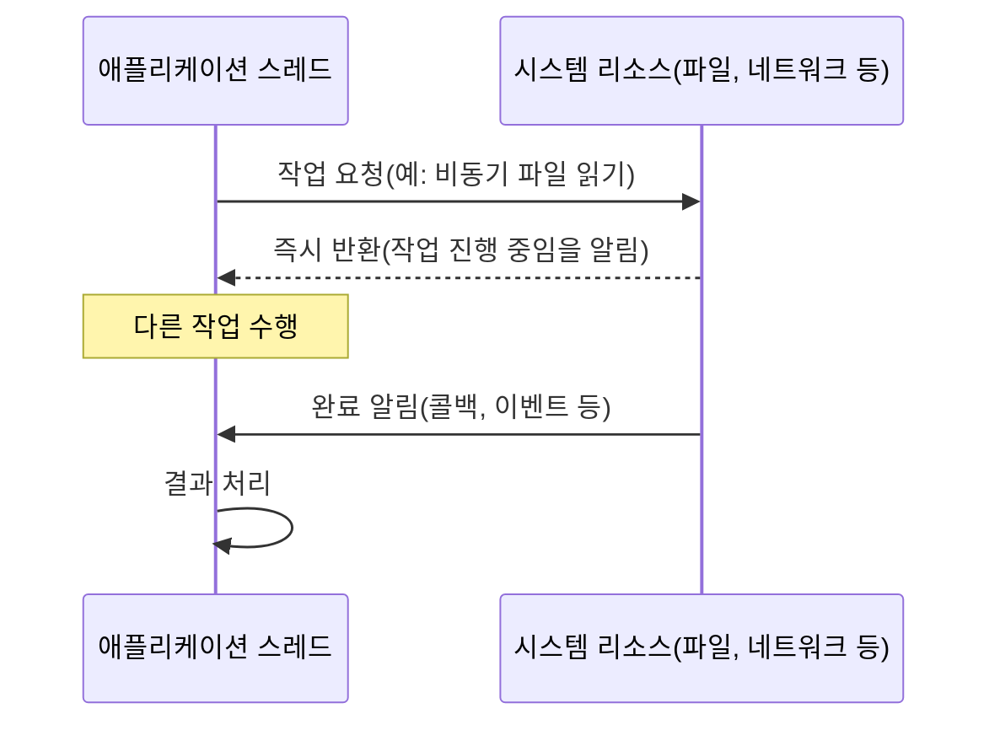

논블로킹(Non-blocking)은 프로그래밍에서 작업 실행 중에 스레드가 대기 상태로 들어가지 않고 즉시 반환되어 다른 작업을 계속 수행할 수 있는 방식을 의미합니다. 이러한 접근 방식은 특히 I/O 작업, 네트워크 통신, 데이터베이스 처리 등 지연 시간이 긴 작업을 처리할 때 시스템 자원을 효율적으로 활용할 수 있게 해줍니다. 논블로킹을 더 깊이 이해하기 위해서는 [[블로킹(Blocking)]]과의 차이점을 이해하는 것이 중요합니다.

## 논블로킹의 핵심 개념

논블로킹 작업의 핵심 특성은 다음과 같습니다:

1. **즉시 반환**: 작업이 완료되지 않았더라도 제어권이 즉시 호출자에게 반환됩니다.
2. **자원 효율성**: 작업이 완료되기를 기다리는 동안에도 스레드가 다른 작업을 수행할 수 있습니다.
3. **완료 확인 메커니즘**: 작업 완료를 확인하기 위한 별도의 메커니즘(콜백, 폴링, 이벤트 등)이 필요합니다.
4. **동시성 증가**: 단일 스레드로도 여러 작업을 동시에 처리할 수 있습니다.
5. **비결정적 순서**: 작업 완료 순서가 호출 순서와 다를 수 있습니다.

## 논블로킹과 블로킹의 차이

자세한 내용은 [[블로킹과 논블로킹의 차이]]를 참고해주세요.

## 논블로킹 동작 방식

논블로킹 작업의 기본적인 동작 흐름은 다음과 같습니다:



이 다이어그램에서 볼 수 있듯이, 애플리케이션 스레드는 작업을 요청한 후 즉시 제어권을 돌려받아 다른 작업을 수행할 수 있습니다. 작업이 완료되면 콜백이나 이벤트를 통해 결과가 전달됩니다.

## 논블로킹 작업의 종류

### 1. 논블로킹 I/O (NIO)

Java의 NIO(New I/O) 패키지는 논블로킹 I/O 작업을 지원합니다:

```java
// 논블로킹 I/O 예제
ServerSocketChannel serverChannel = ServerSocketChannel.open();
serverChannel.configureBlocking(false); // 논블로킹 모드 설정
serverChannel.socket().bind(new InetSocketAddress(8080));

Selector selector = Selector.open();
serverChannel.register(selector, SelectionKey.OP_ACCEPT);

while (true) {
    int readyChannels = selector.select();
    if (readyChannels == 0) continue;
    
    Set<SelectionKey> selectedKeys = selector.selectedKeys();
    Iterator<SelectionKey> keyIterator = selectedKeys.iterator();
    
    while (keyIterator.hasNext()) {
        SelectionKey key = keyIterator.next();
        
        if (key.isAcceptable()) {
            // 클라이언트 연결 수락
            ServerSocketChannel server = (ServerSocketChannel) key.channel();
            SocketChannel client = server.accept();
            client.configureBlocking(false);
            client.register(selector, SelectionKey.OP_READ);
        } else if (key.isReadable()) {
            // 데이터 읽기
            SocketChannel client = (SocketChannel) key.channel();
            ByteBuffer buffer = ByteBuffer.allocate(1024);
            client.read(buffer);
            buffer.flip();
            client.write(buffer);
        }
        
        keyIterator.remove();
    }
}
```

### 2. 비동기 콜백

작업 완료 시 콜백 함수를 호출하는 방식입니다:

```java
// 비동기 콜백 예제
CompletableFuture.supplyAsync(() -> {
    // 시간이 오래 걸리는 작업 수행
    try {
        Thread.sleep(2000); // 작업 시뮬레이션
    } catch (InterruptedException e) {
        e.printStackTrace();
    }
    return "작업 결과";
}).thenAccept(result -> {
    // 작업 완료 후 콜백
    System.out.println("결과: " + result);
});

// 메인 스레드는 계속 다른 작업 수행
System.out.println("다른 작업 수행 중...");
```

### 3. [[이벤트 기반 아키텍처(Event-Driven Architecture)]]

이벤트 루프를 통해 작업 완료 이벤트를 처리하는 방식입니다:

```java
// 이벤트 기반 프로그래밍 예제 (Vert.x 사용)
Vertx vertx = Vertx.vertx();

vertx.createHttpServer().requestHandler(request -> {
    // 비동기적으로 요청 처리
    request.response()
        .putHeader("content-type", "text/plain")
        .end("Hello from Vert.x!");
}).listen(8080, ar -> {
    if (ar.succeeded()) {
        System.out.println("서버가 8080 포트에서 실행 중입니다.");
    } else {
        System.out.println("서버 시작 실패: " + ar.cause());
    }
});

// 메인 스레드는 여기서 즉시 반환됩니다
System.out.println("서버 시작 중...");
```

### 4. 반응형 프로그래밍

데이터 스트림과 변화 전파 개념에 기반한 비동기 처리 방식입니다:

```java
// 반응형 프로그래밍 예제 (Project Reactor 사용)
Flux.just("Apple", "Orange", "Banana")
    .delayElements(Duration.ofMillis(100)) // 각 항목 발행을 지연
    .map(String::toUpperCase)
    .filter(s -> s.startsWith("A"))
    .subscribe(
        item -> System.out.println("처리된 항목: " + item),
        error -> System.err.println("에러 발생: " + error),
        () -> System.out.println("처리 완료")
    );

// 메인 스레드는 여기서 즉시 반환됩니다
System.out.println("구독 시작 완료");
```

## 논블로킹 구현 패턴

### 1. 콜백 패턴

작업 완료 시 호출될 함수를 전달하는 방식입니다:

```java
public void fetchDataAsync(String url, Callback<Data> callback) {
    executor.execute(() -> {
        try {
            Data data = fetchDataFromUrl(url); // 블로킹 작업
            callback.onSuccess(data); // 성공 콜백
        } catch (Exception e) {
            callback.onError(e); // 실패 콜백
        }
    });
}

// 사용 예제
fetchDataAsync("https://example.com/api/data", new Callback<Data>() {
    @Override
    public void onSuccess(Data data) {
        System.out.println("데이터 수신: " + data);
    }
    
    @Override
    public void onError(Exception e) {
        System.err.println("에러 발생: " + e.getMessage());
    }
});
```

### 2. Future/Promise 패턴

작업 결과를 나중에 접근할 수 있는 객체로 반환하는 방식입니다:

```java
public CompletableFuture<Data> fetchDataAsync(String url) {
    return CompletableFuture.supplyAsync(() -> {
        return fetchDataFromUrl(url); // 블로킹 작업
    });
}

// 사용 예제
CompletableFuture<Data> future = fetchDataAsync("https://example.com/api/data");

// 논블로킹 처리
future.thenAccept(data -> {
    System.out.println("데이터 수신: " + data);
}).exceptionally(e -> {
    System.err.println("에러 발생: " + e.getMessage());
    return null;
});
```

### 3. 리액티브 스트림 패턴

데이터 스트림을 비동기적으로 처리하는 방식입니다:

```java
// Project Reactor 사용 예제
public Flux<Data> fetchDataStream(String url) {
    return Flux.create(sink -> {
        try {
            DataStream stream = openStream(url);
            stream.onData(data -> sink.next(data));
            stream.onError(error -> sink.error(error));
            stream.onComplete(() -> sink.complete());
        } catch (Exception e) {
            sink.error(e);
        }
    });
}

// 사용 예제
fetchDataStream("https://example.com/api/stream")
    .map(this::processData)
    .filter(this::isValid)
    .subscribe(
        data -> System.out.println("데이터 처리: " + data),
        error -> System.err.println("에러 발생: " + error),
        () -> System.out.println("스트림 완료")
    );
```

## 논블로킹의 장단점

### 장점

1. **리소스 효율성**: 스레드가 대기 상태에 머무르지 않아 시스템 자원을 효율적으로 활용할 수 있습니다.
2. **확장성**: 더 적은 수의 스레드로 더 많은 동시 작업을 처리할 수 있습니다.
3. **응답성**: 긴 작업을 기다리는 동안에도 UI나 서비스가 응답 가능한 상태를 유지할 수 있습니다.
4. **처리량 향상**: I/O 작업이 많은 애플리케이션에서 전체 처리량이 향상될 수 있습니다.
5. **백프레셔 지원**: 일부 논블로킹 프레임워크는 시스템 과부하를 방지하는 백프레셔 메커니즘을 제공합니다.

### 단점

1. **복잡성 증가**: 콜백 지옥, 상태 관리 등으로 인해 코드가 복잡해질 수 있습니다.
2. **디버깅 어려움**: 비동기 실행 흐름은 디버깅이 더 어려울 수 있습니다.
3. **학습 곡선**: 개발자에게 새로운 프로그래밍 패러다임의 학습이 필요합니다.
4. **에러 처리 복잡성**: 비동기 코드에서 예외 처리가 더 복잡해질 수 있습니다.
5. **메모리 오버헤드**: 콜백 및 이벤트 핸들러 관리를 위한 추가 메모리가 필요할 수 있습니다.

## Java에서의 논블로킹 API

Java는 여러 논블로킹 API를 제공합니다:

### 1. Java NIO

```java
// 논블로킹 파일 채널 예제
FileChannel fileChannel = FileChannel.open(
    Paths.get("large-file.txt"), 
    StandardOpenOption.READ
);

ByteBuffer buffer = ByteBuffer.allocate(1024);
Future<Integer> future = fileChannel.read(buffer, 0);

while (!future.isDone()) {
    // 읽기 작업이 완료되지 않은 동안 다른 작업 수행
    performOtherTasks();
}

buffer.flip();
byte[] data = new byte[buffer.limit()];
buffer.get(data);
```

### 2. CompletableFuture

```java
// CompletableFuture 예제
CompletableFuture<String> future1 = CompletableFuture.supplyAsync(() -> {
    // 첫 번째 서비스 호출
    return "결과1";
});

CompletableFuture<String> future2 = CompletableFuture.supplyAsync(() -> {
    // 두 번째 서비스 호출
    return "결과2";
});

// 두 작업을 병렬로 실행하고 모두 완료되면 결과 조합
CompletableFuture<String> combinedFuture = future1.thenCombine(
    future2,
    (result1, result2) -> result1 + " + " + result2
);

// 최종 결과 처리
combinedFuture.thenAccept(System.out::println);
```

### 3. ReactiveX (RxJava)

```java
// RxJava 예제
Observable.just("데이터1", "데이터2", "데이터3")
    .subscribeOn(Schedulers.io()) // I/O 스레드에서 실행
    .observeOn(Schedulers.computation()) // 연산 스레드에서 처리
    .map(String::toUpperCase)
    .filter(s -> s.endsWith("2"))
    .subscribe(
        data -> System.out.println("데이터: " + data),
        error -> System.err.println("에러: " + error),
        () -> System.out.println("완료")
    );
```

### 4. Project Reactor

```java
// Project Reactor 예제
Flux<String> flux = Flux.just("데이터1", "데이터2", "데이터3")
    .delayElements(Duration.ofMillis(100))
    .publishOn(Schedulers.parallel())
    .map(String::toUpperCase)
    .filter(s -> s.endsWith("2"));

flux.subscribe(
    data -> System.out.println("데이터: " + data),
    error -> System.err.println("에러: " + error),
    () -> System.out.println("완료")
);
```

## 스프링 프레임워크에서의 논블로킹 지원

스프링 프레임워크는 Spring WebFlux를 통해 논블로킹 웹 애플리케이션 개발을 지원합니다:

### 1. WebFlux 컨트롤러

```java
@RestController
@RequestMapping("/api")
public class ReactiveController {
    
    @Autowired
    private ReactiveUserService userService;
    
    @GetMapping("/users/{id}")
    public Mono<User> getUser(@PathVariable String id) {
        return userService.findById(id);
    }
    
    @GetMapping("/users")
    public Flux<User> getAllUsers() {
        return userService.findAll();
    }
    
    @PostMapping("/users")
    public Mono<User> createUser(@RequestBody Mono<User> userMono) {
        return userMono.flatMap(userService::save);
    }
}
```

### 2. 반응형 리포지토리

```java
@Repository
public interface ReactiveUserRepository extends ReactiveCrudRepository<User, String> {
    
    Flux<User> findByLastName(String lastName);
    
    Mono<User> findByEmail(String email);
    
    @Query("{ 'activeStatus': true }")
    Flux<User> findAllActiveUsers();
}
```

### 3. 반응형 WebClient

```java
@Service
public class ReactiveClientService {
    
    private final WebClient webClient;
    
    public ReactiveClientService(WebClient.Builder webClientBuilder) {
        this.webClient = webClientBuilder.baseUrl("https://api.example.com").build();
    }
    
    public Mono<Data> fetchData(String id) {
        return webClient.get()
                .uri("/data/{id}", id)
                .retrieve()
                .bodyToMono(Data.class)
                .timeout(Duration.ofSeconds(5))
                .onErrorResume(e -> Mono.empty());
    }
    
    public Flux<Data> streamData() {
        return webClient.get()
                .uri("/data/stream")
                .retrieve()
                .bodyToFlux(Data.class);
    }
}
```

Spring WebFlux에 대한 자세한 내용은 [[스프링 WebFlux]]를 참고해주세요.

## 논블로킹 구현시 주의 사항

### 1. 블로킹 코드 방지

반응형/논블로킹 파이프라인에 블로킹 코드가 포함되면 전체 시스템의 성능이 저하될 수 있습니다:

```java
// 잘못된 예: 논블로킹 파이프라인에 블로킹 코드 포함
Flux<Data> dataFlux = Flux.just("id1", "id2", "id3")
    .map(id -> {
        // 블로킹 호출! 전체 파이프라인이 블로킹될 수 있습니다
        return blockingDao.findById(id);
    });

// 올바른 예: 블로킹 코드를 별도 스케줄러로 분리
Flux<Data> dataFlux = Flux.just("id1", "id2", "id3")
    .flatMap(id -> Mono.fromCallable(() -> blockingDao.findById(id))
                    .subscribeOn(Schedulers.boundedElastic()));
```

### 2. 에러 처리

논블로킹 코드에서는 적절한 에러 처리가 더욱 중요합니다:

```java
Mono<Data> result = service.fetchData()
    .onErrorResume(NetworkException.class, e -> {
        log.error("네트워크 오류 발생", e);
        return fallbackService.fetchData();
    })
    .onErrorResume(TimeoutException.class, e -> {
        log.error("타임아웃 발생", e);
        return Mono.just(Data.empty());
    })
    .onErrorMap(e -> new ServiceException("데이터 조회 실패", e))
    .doFinally(signalType -> {
        // 성공/실패 상관없이 항상 실행되는 정리 코드
    });
```

### 3. 백프레셔 처리

데이터 생산자가 소비자보다 빠를 경우를 대비한 백프레셔 처리가 필요합니다:

```java
// 백프레셔 처리 예제 (RxJava 2)
Flowable.range(1, 1000000)
    .onBackpressureBuffer(1000, () -> {
        log.warn("버퍼 오버플로우 발생");
    }, BackpressureOverflowStrategy.DROP_OLDEST)
    .observeOn(Schedulers.computation(), false, 20)
    .subscribe(new Subscriber<Integer>() {
        @Override
        public void onSubscribe(Subscription s) {
            s.request(10); // 최초 10개 요청
        }
        
        @Override
        public void onNext(Integer value) {
            // 데이터 처리 (느린 처리 시뮬레이션)
            try {
                Thread.sleep(50);
            } catch (InterruptedException e) {
                e.printStackTrace();
            }
            System.out.println("처리된 값: " + value);
        }
        
        @Override
        public void onError(Throwable t) {
            t.printStackTrace();
        }
        
        @Override
        public void onComplete() {
            System.out.println("완료");
        }
    });
```

### 4. 리소스 해제

논블로킹 코드에서도 리소스 해제는 중요합니다:

```java
// 리소스 해제 예제
Flux<Data> dataFlux = Flux.using(
    () -> openResource(), // 리소스 획득
    resource -> processWithResource(resource), // 리소스 사용
    Resource::close // 리소스 해제
);
```

논블로킹 프로그래밍의 모범 사례에 대한 자세한 내용은 [[논블로킹 프로그래밍 모범 사례]]를 참고해주세요.

## 논블로킹 디버깅 기법

논블로킹 코드 디버깅을 위한 방법은 다음과 같습니다:

### 1. 로깅 활용

```java
Flux<Data> dataFlux = service.fetchData()
    .doOnSubscribe(s -> log.info("구독 시작"))
    .doOnNext(data -> log.info("데이터 수신: {}", data))
    .doOnError(e -> log.error("에러 발생: {}", e.getMessage()))
    .doOnComplete(() -> log.info("스트림 완료"))
    .doFinally(signalType -> log.info("종료 신호: {}", signalType));
```

### 2. 블로킹 디버깅 (개발/테스트 환경에서만)

```java
// 테스트 환경에서만 사용!
Data result = service.fetchData()
    .doOnNext(data -> log.debug("데이터: {}", data))
    .block(); // 블로킹 호출(프로덕션 환경에서는 사용 금지)

assertEquals("기대값", result.getValue());
```

### 3. 리액터 디버그 모드

```java
// 애플리케이션 시작 시 한 번만 설정
Hooks.onOperatorDebug();

// 또는 특정 체인에만 적용
Flux<Data> dataFlux = service.fetchData()
    .checkpoint("fetchData 호출 후")
    .map(this::processData)
    .checkpoint("processData 후");
```

### 4. 테스트 스케줄러

```java
@Test
public void testAsyncOperation() {
    // 가상 시간을 사용하는 테스트 스케줄러
    VirtualTimeScheduler scheduler = VirtualTimeScheduler.create();
    
    Mono<String> delayedMono = Mono.just("Hello")
        .delayElement(Duration.ofHours(1), scheduler);
    
    // 1시간 가상으로 진행
    scheduler.advanceTimeBy(Duration.ofHours(1));
    
    // 블로킹 없이 결과 검증
    StepVerifier.create(delayedMono)
        .expectNext("Hello")
        .verifyComplete();
}
```

## 논블로킹 성능 측정

논블로킹 시스템의 성능을 측정하는 방법은 다음과 같습니다:

### 1. 스루풋 측정

```java
long startTime = System.currentTimeMillis();
int count = 10000;

Flux.range(1, count)
    .flatMap(i -> service.processAsync(i))
    .doOnComplete(() -> {
        long endTime = System.currentTimeMillis();
        double durationSec = (endTime - startTime) / 1000.0;
        System.out.printf("처리 완료: %d 작업, %.2f 초, 초당 %.2f 작업%n", 
                          count, durationSec, count / durationSec);
    })
    .subscribe();
```

### 2. 지연 시간 측정

```java
Flux.range(1, 100)
    .flatMap(i -> {
        long start = System.nanoTime();
        return service.processAsync(i)
            .doOnSuccess(result -> {
                long end = System.nanoTime();
                long durationMs = (end - start) / 1_000_000;
                System.out.printf("작업 %d 완료: %d ms%n", i, durationMs);
            });
    })
    .subscribe();
```

### 3. Micrometer를 통한 메트릭 수집

```java
@Configuration
public class MetricsConfig {
    
    @Bean
    public MeterRegistry meterRegistry() {
        return new SimpleMeterRegistry();
    }
    
    @Bean
    public ReactorCorePublisherMetrics reactorMetrics(MeterRegistry registry) {
        return new ReactorCorePublisherMetrics(registry);
    }
}

// 사용 예제
Timer timer = Timer.builder("service.fetch.timer")
    .description("서비스 fetch 메소드 타이머")
    .register(meterRegistry);

Mono<Data> dataWithMetrics = Mono.fromSupplier(() -> {
    Timer.Sample sample = Timer.start(meterRegistry);
    return service.fetch()
        .doFinally(signalType -> {
            sample.stop(timer);
        });
});
```

## 논블로킹이 적합한 상황

논블로킹 방식이 더 적합한 경우는 다음과 같습니다:

1. **I/O 집약적 애플리케이션**: 네트워크 통신, 파일 I/O가 많은 애플리케이션
2. **높은 동시성 요구**: 동시에 많은 요청을 처리해야 하는 경우
3. **마이크로서비스 아키텍처**: 여러 서비스 간 통신이 많은 환경
4. **이벤트 기반 시스템**: 비동기 이벤트 처리가 중요한 시스템
5. **스트리밍 처리**: 데이터 스트림을 지속적으로 처리해야 하는 경우
6. **실시간 애플리케이션**: 채팅, 알림, 실시간 대시보드 등

## 실제 사용 사례

논블로킹은 다양한 상황에서 활용됩니다:

1. **고성능 웹 서버**: Netty, Undertow 등의 비동기 웹 서버
2. **API 게이트웨이**: 다수의 백엔드 서비스 요청을 병렬로 처리
3. **실시간 데이터 처리**: 대용량 데이터 스트림 처리 시스템
4. **채팅 애플리케이션**: 다수의 클라이언트 연결을 효율적으로 관리
5. **금융 거래 시스템**: 높은 처리량이 요구되는 트랜잭션 처리

## 스프링 Boot WebFlux 애플리케이션 예제

다음은 간단한 스프링 Boot WebFlux 애플리케이션 예제입니다:

```java
@SpringBootApplication
public class ReactiveApplication {
    
    public static void main(String[] args) {
        SpringApplication.run(ReactiveApplication.class, args);
    }
    
    @Bean
    public RouterFunction<ServerResponse> routes(UserHandler userHandler) {
        return RouterFunctions.route()
            .GET("/users", userHandler::getAllUsers)
            .GET("/users/{id}", userHandler::getUser)
            .POST("/users", userHandler::createUser)
            .build();
    }
}

@Component
public class UserHandler {
    
    private final ReactiveUserRepository repository;
    
    public UserHandler(ReactiveUserRepository repository) {
        this.repository = repository;
    }
    
    public Mono<ServerResponse> getAllUsers(ServerRequest request) {
        return ServerResponse.ok()
            .contentType(MediaType.APPLICATION_JSON)
            .body(repository.findAll(), User.class);
    }
    
    public Mono<ServerResponse> getUser(ServerRequest request) {
        String id = request.pathVariable("id");
        return repository.findById(id)
            .flatMap(user -> ServerResponse.ok()
                .contentType(MediaType.APPLICATION_JSON)
                .bodyValue(user))
            .switchIfEmpty(ServerResponse.notFound().build());
    }
    
    public Mono<ServerResponse> createUser(ServerRequest request) {
        return request.bodyToMono(User.class)
            .flatMap(repository::save)
            .flatMap(savedUser -> ServerResponse.created(
                UriComponentsBuilder.fromPath("/users/{id}")
                    .buildAndExpand(savedUser.getId()).toUri())
                .bodyValue(savedUser));
    }
}
```

## 결론

논블로킹 프로그래밍은 현대적인 고성능, 고확장성 애플리케이션 개발에 있어 중요한 패러다임입니다. I/O 작업이 많거나 높은 동시성이 요구되는 시스템에서 논블로킹 방식은 제한된 자원으로 더 많은 작업을 처리할 수 있게 해줍니다.

하지만 논블로킹 방식은 복잡성이 증가하고 디버깅이 어려워질 수 있다는 단점도 있습니다. 따라서 애플리케이션의 요구사항과 특성에 맞게 블로킹과 논블로킹 방식을 적절히 선택하는 것이 중요합니다.

특히 Java 생태계에서는 NIO, CompletableFuture, RxJava, Project Reactor 등 다양한 논블로킹 API와 프레임워크를 제공하고 있으며, 스프링 WebFlux를 통해 완전한 논블로킹 웹 애플리케이션을 개발할 수 있습니다.

논블로킹 프로그래밍의 기본 원칙과 패턴을 이해하고, 적절한 상황에서 활용한다면 높은 성능과 확장성을 갖춘 현대적인 애플리케이션을 구축할 수 있습니다.

## 참고 자료

- Reactive Programming with RxJava - Tomasz Nurkiewicz, Ben Christensen
- Hands-On Reactive Programming in Spring 5 - Oleh Dokuka, Igor Lozynskyi
- Netty in Action - Norman Maurer, Marvin Allen Wolfthal
- 스프링 공식 문서(https://docs.spring.io/spring-framework/docs/current/reference/html/web-reactive.html)
- Project Reactor Reference Guide(https://projectreactor.io/docs/core/release/reference/)
- Learning RxJava - Thomas Nield