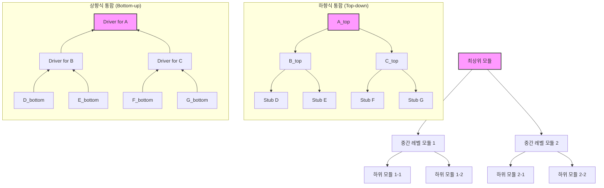
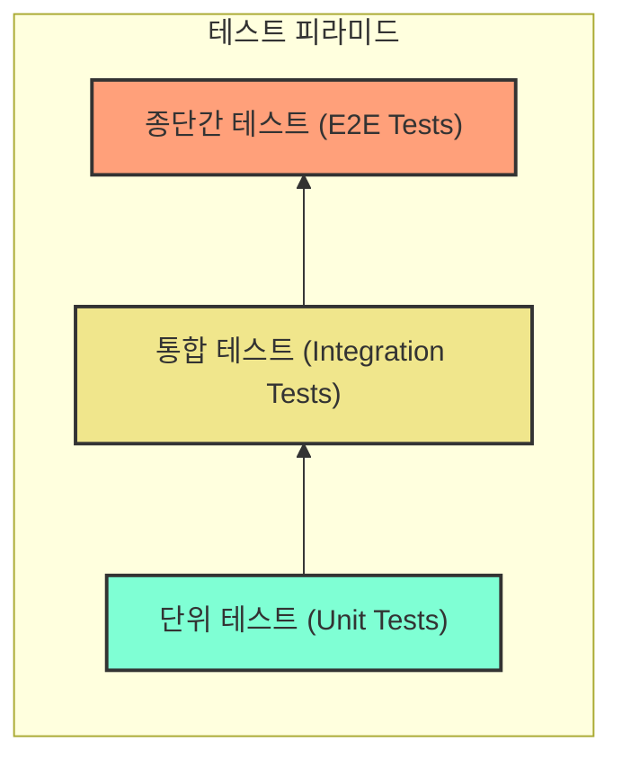

소프트웨어 개발에서 테스트는 선택이 아닌 필수입니다. 견고하고 안정적인 애플리케션을 만들기 위해서는 다양한 종류의 테스트를 적절히 활용해야 합니다. 그중에서도 개발자들이 가장 기본적으로 접하고 또 중요하게 생각해야 할 테스트가 바로 [[단위 테스트(Unit Test)]]와 [[통합 테스트(Integration Test)]]입니다.

이 두 가지 테스트는 서로 다른 목적과 범위를 가지며, 프로젝트의 품질을 다각도로 보증하는 데 핵심적인 역할을 합니다. 이번 글에서는 단위 테스트와 통합 테스트가 각각 무엇인지, 어떤 차이점이 있는지, 그리고 언제 어떻게 사용해야 하는지에 대해 명확하고 논리적으로 알아보겠습니다.

## 1. 단위 테스트 (Unit Test) 란?

단위 테스트는 소프트웨어의 가장 작은 단위, 즉 함수(메서드)나 클래스 같은 개별 컴포넌트가 의도한 대로 정확히 작동하는지 검증하는 테스트입니다. 마치 현미경으로 세포 하나하나를 관찰하듯, 코드의 각 부분을 독립적으로 테스트하여 문제점을 조기에 발견하고 수정할 수 있도록 돕습니다. 자세한 내용은 [[단위 테스트(Unit Test)]] 에서 확인하실 수 있습니다.

### 단위 테스트 예시 (Java - JUnit, Mockito)

간단한 주문 서비스에서 특정 상품의 재고가 충분한지 확인하는 메서드를 단위 테스트하는 상황을 가정해 보겠습니다.

```java
// OrderService.java
public class OrderService {
    private ProductRepository productRepository;

    public OrderService(ProductRepository productRepository) {
        this.productRepository = productRepository;
    }

    public boolean canOrderProduct(String productId, int quantity) {
        Product product = productRepository.findById(productId);
        if (product == null) {
            throw new IllegalArgumentException("상품을 찾을 수 없습니다: " + productId);
        }
        return product.getStock() >= quantity;
    }
}

// Product.java (데이터 클래스)
public class Product {
    private String id;
    private int stock;
    // 생성자, getter 등 생략
}

// ProductRepository.java (인터페이스)
public interface ProductRepository {
    Product findById(String productId);
}
```

위 `OrderService`의 `canOrderProduct` 메서드를 테스트하기 위해 `ProductRepository`는 외부 의존성이므로 Mock 객체를 사용하여 격리합니다.

```java
// OrderServiceTest.java
import org.junit.jupiter.api.Test;
import static org.junit.jupiter.api.Assertions.*;
import static org.mockito.Mockito.*;

public class OrderServiceTest {

    @Test
    void 주문가능_재고충분() {
        // Given: ProductRepository Mock 객체 생성
        ProductRepository mockRepository = mock(ProductRepository.class);
        Product sampleProduct = new Product("P001", 10); // 상품 ID P001, 재고 10개
        when(mockRepository.findById("P001")).thenReturn(sampleProduct);

        OrderService orderService = new OrderService(mockRepository);

        // When: 재고가 충분한 경우 (5개 주문 시도)
        boolean result = orderService.canOrderProduct("P001", 5);

        // Then: true를 반환해야 함
        assertTrue(result);
        verify(mockRepository, times(1)).findById("P001"); // findById가 1번 호출되었는지 검증
    }

    @Test
    void 주문불가_재고부족() {
        // Given
        ProductRepository mockRepository = mock(ProductRepository.class);
        Product sampleProduct = new Product("P002", 3); // 상품 ID P002, 재고 3개
        when(mockRepository.findById("P002")).thenReturn(sampleProduct);

        OrderService orderService = new OrderService(mockRepository);

        // When: 재고가 부족한 경우 (5개 주문 시도)
        boolean result = orderService.canOrderProduct("P002", 5);

        // Then: false를 반환해야 함
        assertFalse(result);
    }

    @Test
    void 주문시_상품없음_예외발생() {
        // Given
        ProductRepository mockRepository = mock(ProductRepository.class);
        when(mockRepository.findById("P999")).thenReturn(null); // 존재하지 않는 상품

        OrderService orderService = new OrderService(mockRepository);

        // When & Then: 예외가 발생하는지 검증
        assertThrows(IllegalArgumentException.class, () -> {
            orderService.canOrderProduct("P999", 1);
        });
    }
}
```

이처럼 단위 테스트는 특정 메서드가 다양한 시나리오(정상, 예외, 경계값)에 대해 올바르게 동작하는지 독립적으로 검증합니다. 자세한 Mockito 사용법은 Mockito 사용법을 참고해주세요.

## 2. 통합 테스트 (Integration Test) 란?

통합 테스트는 여러 개의 컴포넌트(모듈, 클래스, 서비스 등)들이 서로 결합되어 올바르게 상호작용하는지 검증하는 테스트입니다. 단위 테스트가 개별 부품의 기능을 확인한다면, 통합 테스트는 이 부품들이 조립되어 하나의 시스템으로서 제대로 작동하는지 확인하는 과정에 비유할 수 있습니다.

### 통합 테스트 유형 시각화 (Mermaid)

통합 테스트는 모듈을 통합하는 방식에 따라 여러 유형으로 나눌 수 있습니다. 대표적으로 상향식(Bottom-up), 하향식(Top-down), 빅뱅(Big Bang), 그리고 이 둘을 절충한 샌드위치/하이브리드 방식이 있습니다.



- **하향식 통합:** 상위 모듈부터 테스트하며, 하위 모듈은 [[테스트 스텁(Test Stub)]]으로 대체합니다.
- **상향식 통합:** 하위 모듈부터 테스트하며, 상위 모듈의 호출은 테스트 드라이버(Test Driver)를 사용합니다.
- 자세한 내용은 [[통합 테스트의 다양한 접근 방식]] 문서를 참고하세요.

### 통합 테스트 예시 (Spring Boot)

Spring Boot 환경에서 주문 서비스(`OrderService`)와 실제 데이터베이스 연동을 테스트하는 경우를 생각해 보겠습니다. 이때는 `@SpringBootTest` 어노테이션과 테스트용 데이터베이스(예: H2, 또는 Testcontainers를 이용한 실제 DB 환경)를 활용할 수 있습니다.

```java
// OrderController.java (간단한 API 엔드포인트)
@RestController
@RequestMapping("/api/orders")
public class OrderController {
    private final OrderService orderService;

    public OrderController(OrderService orderService) {
        this.orderService = orderService;
    }

    @PostMapping
    public ResponseEntity<String> placeOrder(@RequestBody OrderRequest request) {
        // 실제 주문 생성 로직 (OrderService를 통해 DB에 저장)
        // ...
        boolean canOrder = orderService.canOrderProduct(request.getProductId(), request.getQuantity());
        if (canOrder) {
            // 주문 처리 로직 (생략)
            return ResponseEntity.ok("주문 성공");
        } else {
            return ResponseEntity.badRequest().body("재고 부족");
        }
    }
}

// OrderRequest.java (DTO)
public class OrderRequest {
    private String productId;
    private int quantity;
    // getter, setter
}
```


```java
// OrderIntegrationTest.java
import org.junit.jupiter.api.Test;
import org.springframework.beans.factory.annotation.Autowired;
import org.springframework.boot.test.context.SpringBootTest;
import org.springframework.boot.test.web.client.TestRestTemplate;
import org.springframework.http.HttpStatus;
import org.springframework.http.ResponseEntity;
import org.springframework.test.context.ActiveProfiles; // "test" 프로파일 사용

@SpringBootTest(webEnvironment = SpringBootTest.WebEnvironment.RANDOM_PORT) // 실제 서블릿 환경에서 테스트
@ActiveProfiles("test") // test용 application.properties/yml 사용
public class OrderIntegrationTest {

    @Autowired
    private TestRestTemplate restTemplate; // HTTP 요청을 위한 클라이언트

    // 실제 DB에 테스트용 상품 데이터가 미리 준비되어 있다고 가정 (또는 @Sql 등으로 테스트 데이터 주입)
    // 예를 들어, test/resources/data.sql 에 INSERT INTO product (id, name, stock) VALUES ('P001', 'Test Product', 10);

    @Test
    void 주문API_성공_재고충분() {
        // Given
        OrderRequest request = new OrderRequest();
        request.setProductId("P001"); // DB에 존재하는 상품
        request.setQuantity(5);

        // When
        ResponseEntity<String> response = restTemplate.postForEntity("/api/orders", request, String.class);

        // Then
        assertEquals(HttpStatus.OK, response.getStatusCode());
        assertEquals("주문 성공", response.getBody());
        // 추가적으로 DB 상태를 검증할 수도 있습니다.
    }

    @Test
    void 주문API_실패_재고부족() {
        // Given
        OrderRequest request = new OrderRequest();
        request.setProductId("P001"); // DB에 존재하는 상품 (재고 10개)
        request.setQuantity(15); // 재고보다 많은 수량 주문

        // When
        ResponseEntity<String> response = restTemplate.postForEntity("/api/orders", request, String.class);

        // Then
        assertEquals(HttpStatus.BAD_REQUEST, response.getStatusCode());
        assertEquals("재고 부족", response.getBody());
    }
}
```

이 통합 테스트는 `OrderController`부터 `OrderService`, 그리고 실제 데이터베이스까지의 흐름을 모두 검증합니다. 스프링 환경에서의 테스트에 대한 자세한 내용은 스프링 부트 테스트 전략을 참고해주세요.

## 3. 단위 테스트 vs 통합 테스트: 핵심 비교

단위 테스트와 통합 테스트는 목적, 범위, 실행 속도, 격리 수준 등 여러 면에서 차이를 보입니다.

|   |   |   |
|---|---|---|
|**구분**|**단위 테스트 (Unit Test)**|**통합 테스트 (Integration Test)**|
|**목표**|개별 컴포넌트(함수/메서드/클래스)의 기능 검증|여러 컴포넌트 간의 상호작용 및 연동 검증|
|**범위**|코드의 매우 작은 부분 (단일 기능)|두 개 이상의 컴포넌트, 시스템의 일부 또는 전체|
|**격리성**|높음 (외부 의존성 Mocking 또는 Stubbing)|낮음 (실제 의존성 또는 테스트 대역 사용)|
|**실행 속도**|매우 빠름|단위 테스트보다 느림 (외부 시스템 연동, DB 접근 등)|
|**피드백 주기**|즉각적|상대적으로 느림|
|**작성 난이도**|상대적으로 낮음 (범위가 작고 명확)|상대적으로 높음 (환경 구성, 데이터 준비 등 고려)|
|**발견 오류**|로직 오류, 알고리즘 오류 등 특정 모듈 내의 문제|인터페이스 불일치, 데이터 형식 오류, 연동 실패 등 컴포넌트 간의 문제|
|**주요 도구**|JUnit, Mockito, NUnit, xUnit 등|Spring Test, TestRestTemplate, Postman, RestAssured, Testcontainers 등|

### 테스트 피라미드 관점에서의 위치

소프트웨어 테스트 전략을 이야기할 때 자주 등장하는 [[테스트 피라미드(Test Pyramid)]]에서 두 테스트의 위치는 다음과 같습니다.



테스트 피라미드는 안정적이고 효율적인 테스트 포트폴리오를 구축하기 위한 가이드라인을 제공합니다.

- **단위 테스트:** 피라미드의 가장 넓은 부분을 차지하며, 가장 많이 작성되어야 합니다. 실행 속도가 빠르고 격리가 잘 되어 있어 개발 초기 단계에서 버그를 신속하게 발견하고 수정하는 데 매우 효과적입니다.
- **통합 테스트:** 단위 테스트보다는 적지만, 종단간 테스트(E2E Test)보다는 많이 수행됩니다. 모듈 간의 연동 지점에서 발생하는 문제를 찾는 데 중점을 둡니다.
- 자세한 내용은 테스트 피라미드 전략을 참고해주세요.

## 4. 언제 어떤 테스트를 사용해야 할까?

단위 테스트와 통합 테스트는 상호 배타적인 관계가 아니라 **상호 보완적인 관계**입니다. 어느 하나만으로는 소프트웨어의 품질을 완벽하게 보장하기 어렵습니다.

- **단위 테스트는 항상 기본입니다.** 새로운 기능을 추가하거나 기존 코드를 수정할 때, 해당 코드 조각이 독립적으로 올바르게 작동하는지 확인하기 위해 반드시 작성해야 합니다. [[테스트 주도 개발(TDD)]]에서는 테스트 코드를 먼저 작성하고 이를 통과하는 프로덕션 코드를 작성하는 방식을 따르기도 합니다.
- **통합 테스트는 다음과 같은 경우에 중요합니다:**
    - 여러 모듈(서비스, 컴포넌트)이 함께 작동하여 특정 기능을 수행할 때
    - 외부 시스템(데이터베이스, 메시지 큐, 외부 API 등)과의 연동을 검증해야 할 때
    - 프레임워크(예: Spring)의 설정이나 기능이 올바르게 통합되어 동작하는지 확인할 때

성공적인 테스트 전략은 두 가지 테스트를 적절한 비율로 혼합하여 사용하는 것입니다. 일반적으로는 더 많은 단위 테스트와 그보다 적은 수의 통합 테스트, 그리고 가장 적은 수의 E2E 테스트로 구성하는 것이 권장됩니다.

## 5. 결론

단위 테스트와 통합 테스트는 소프트웨어 개발 생명주기에서 핵심적인 역할을 수행하며, 각각 고유한 가치를 제공합니다.

- **단위 테스트**는 코드의 가장 작은 부분을 신속하고 정확하게 검증하여 개발 초기 단계에서부터 품질을 확보하고, 리팩토링에 대한 자신감을 높여줍니다.
- **통합 테스트**는 여러 컴포넌트가 조화롭게 작동하는지 확인하여 시스템 전체의 안정성을 보장하고, 인터페이스 오류나 연동 문제를 조기에 발견할 수 있도록 합니다.

이 두 가지 테스트를 올바르게 이해하고 프로젝트의 특성에 맞게 적용함으로써, 우리는 더욱 견고하고 신뢰할 수 있는 소프트웨어를 만들 수 있습니다. 테스트는 단순히 버그를 찾는 활동을 넘어, 더 나은 설계와 유지보수 가능한 코드를 만드는 데 기여하는 중요한 개발 프랙티스임을 기억해야 합니다.

## 참고 자료

- Martin Fowler - Unit Test ([https://martinfowler.com/bliki/UnitTest.html](https://martinfowler.com/bliki/UnitTest.html))
- Google Testing Blog - Test Sizes ([https://testing.googleblog.com/2010/12/test-sizes.html](https://testing.googleblog.com/2010/12/test-sizes.html))
- JUnit 5 User Guide ([https://junit.org/junit5/docs/current/user-guide/](https://junit.org/junit5/docs/current/user-guide/))
- Mockito Documentation ([https://site.mockito.org/](https://site.mockito.org/))
- Spring Boot Testing ([https://docs.spring.io/spring-boot/docs/current/reference/html/features.html#features.testing](https://www.google.com/search?q=https://docs.spring.io/spring-boot/docs/current/reference/html/features.html%23features.testing))
- Testcontainers ([https://www.testcontainers.org/](https://www.testcontainers.org/))