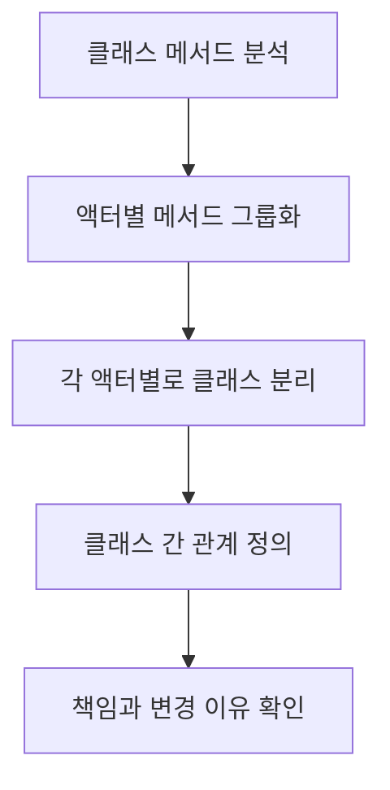

단일 책임 원칙(Single Responsibility Principle, SRP)은 [[SOLID 원칙]]의 첫 번째 원칙으로, "하나의 클래스는 오직 하나의 책임만 가져야 한다"는 객체 지향 설계의 핵심 개념입니다. 이 원칙은 로버트 마틴(Robert C. Martin)에 의해 제안되었으며, 소프트웨어의 설계, 유지보수, 확장성에 중요한 영향을 미칩니다.

## 단일 책임 원칙의 의미

단일 책임 원칙의 핵심은 "변경의 이유"에 있습니다. 한 클래스가 변경되어야 하는 이유는 오직 하나뿐이어야 합니다. 다시 말해, 클래스는 단 하나의 액터(actor)에 대해서만 책임을 져야 합니다.

여기서 "액터"란 변경을 요구하는 특정 그룹(사용자, 이해관계자 등)을 의미합니다. 예를 들어, 회계 부서와 인사 부서는 서로 다른 액터이므로, 두 부서의 요구사항을 모두 처리하는 클래스는 단일 책임 원칙을 위반하게 됩니다.

## 단일 책임 원칙 위반의 예

다음은 단일 책임 원칙을 위반하는 전형적인 예입니다:

```java
// SRP 위반: 너무 많은 책임을 가진 클래스
public class Employee {
    private String name;
    private String position;
    private double salary;
    
    // 직원 정보 관리 책임
    public String getName() { return name; }
    public void setName(String name) { this.name = name; }
    public String getPosition() { return position; }
    public void setPosition(String position) { this.position = position; }
    public double getSalary() { return salary; }
    public void setSalary(double salary) { this.salary = salary; }
    
    // 급여 계산 책임
    public double calculateMonthlyTax() {
        return salary * 0.3;
    }
    
    // 데이터베이스 저장 책임
    public void saveToDatabase() {
        // 데이터베이스 연결 및 저장 로직
        System.out.println("직원 정보를 데이터베이스에 저장합니다.");
    }
    
    // 보고서 생성 책임
    public void generateEmployeeReport() {
        // 보고서 생성 로직
        System.out.println("직원 보고서를 생성합니다.");
    }
}
```

위 클래스는 다음과 같은 여러 책임을 가지고 있습니다:

1. 직원 정보 관리
2. 급여 계산
3. 데이터베이스 저장
4. 보고서 생성

이로 인해 다음과 같은 문제가 발생할 수 있습니다:

- 데이터베이스 구조가 변경되면 `Employee` 클래스를 수정해야 합니다.
- 세금 계산 방식이 변경되면 `Employee` 클래스를 수정해야 합니다.
- 보고서 형식이 변경되면 `Employee` 클래스를 수정해야 합니다.

즉, 변경의 이유가 여러 개 있으므로 단일 책임 원칙을 위반하고 있습니다.

## 단일 책임 원칙에 따른 개선

SRP를 적용하여 위 코드를 개선해보겠습니다:

```java
// 직원 정보만 책임지는 클래스
public class Employee {
    private String name;
    private String position;
    private double salary;
    
    public String getName() { return name; }
    public void setName(String name) { this.name = name; }
    public String getPosition() { return position; }
    public void setPosition(String position) { this.position = position; }
    public double getSalary() { return salary; }
    public void setSalary(double salary) { this.salary = salary; }
}

// 급여 계산 책임을 담당하는 클래스
public class TaxCalculator {
    public double calculateMonthlyTax(Employee employee) {
        return employee.getSalary() * 0.3;
    }
}

// 데이터베이스 저장 책임을 담당하는 클래스
public class EmployeeRepository {
    public void save(Employee employee) {
        // 데이터베이스 연결 및 저장 로직
        System.out.println("직원 정보를 데이터베이스에 저장합니다.");
    }
}

// 보고서 생성 책임을 담당하는 클래스
public class EmployeeReportGenerator {
    public void generateReport(Employee employee) {
        // 보고서 생성 로직
        System.out.println("직원 보고서를 생성합니다.");
    }
}
```

이처럼 각 클래스는 단 하나의 책임만 갖게 되어 변경의 이유도 하나로 제한됩니다.

## 단일 책임 원칙의 이점

단일 책임 원칙을 적용함으로써 얻을 수 있는 이점은 다음과 같습니다:

1. **향상된 가독성**: 각 클래스가 명확한 목적을 가지므로 코드를 이해하기 쉽습니다.
2. **쉬운 유지보수**: 변경이 필요할 때 영향 범위가 제한적이므로 유지보수가 용이합니다.
3. **재사용성 증가**: 작고 집중된 클래스는 다른 컨텍스트에서 재사용하기 쉽습니다.
4. **테스트 용이성**: 책임이 분리되어 있어 단위 테스트가 간단해집니다.
5. **낮은 결합도**: 클래스 간의 의존성이 감소하여 코드의 유연성이 증가합니다.

## 단일 책임 원칙 적용 방법

### 책임의 식별

클래스의 책임을 식별하는 방법은 다음과 같습니다:

1. 클래스의 메서드들을 나열합니다.
2. 각 메서드가 누구를 위한 것인지, 어떤 액터(사용자, 관리자, 시스템 등)를 위한 것인지 생각합니다.
3. 서로 다른 액터를 위한 메서드들은 다른 클래스로 분리합니다.



### 응집도와 결합도

단일 책임 원칙은 높은 응집도와 낮은 결합도를 추구합니다:

- **높은 응집도(High Cohesion)**: 클래스의 모든 요소가 하나의 책임을 위해 함께 동작합니다.
- **낮은 결합도(Low Coupling)**: 클래스 간의 의존성이 최소화되어 변경의 영향이 제한됩니다.

## 실제 개발에서의 단일 책임 원칙

스프링 프레임워크에서의 단일 책임 원칙 적용 예제를 살펴보겠습니다:

```java
// 도메인 모델 - 엔티티
@Entity
public class Product {
    @Id
    @GeneratedValue(strategy = GenerationType.IDENTITY)
    private Long id;
    private String name;
    private double price;
    
    // 게터와 세터
}

// 데이터 액세스 책임
@Repository
public interface ProductRepository extends JpaRepository<Product, Long> {
    List<Product> findByPriceGreaterThan(double price);
}

// 비즈니스 로직 책임
@Service
public class ProductService {
    private final ProductRepository productRepository;
    
    @Autowired
    public ProductService(ProductRepository productRepository) {
        this.productRepository = productRepository;
    }
    
    public List<Product> findPremiumProducts() {
        return productRepository.findByPriceGreaterThan(1000.0);
    }
}

// 프레젠테이션 책임
@RestController
@RequestMapping("/api/products")
public class ProductController {
    private final ProductService productService;
    
    @Autowired
    public ProductController(ProductService productService) {
        this.productService = productService;
    }
    
    @GetMapping("/premium")
    public List<Product> getPremiumProducts() {
        return productService.findPremiumProducts();
    }
}
```

스프링의 계층형 아키텍처는 기본적으로 단일 책임 원칙을 따르도록 설계되어 있습니다:

- **Controller**: HTTP 요청 처리 책임
- **Service**: 비즈니스 로직 처리 책임
- **Repository**: 데이터 액세스 책임
- **Entity**: 데이터 구조 정의 책임

## 단일 책임 원칙 적용 시 고려사항

### 1. 책임의 크기와 경계

책임을 어디까지 분리할 것인가는 상황에 따라 달라집니다. 너무 잘게 쪼개면 클래스 수가 폭발적으로 증가할 수 있고, 너무 크게 잡으면 SRP를 위반할 수 있습니다. 경험과 상황에 맞는 판단이 필요합니다.

### 2. 다른 SOLID 원칙과의 균형

단일 책임 원칙은 다른 SOLID 원칙, 특히 [[개방-폐쇄 원칙 (Open-Closed Principle)]]과 [[인터페이스 분리 원칙(Interface Segregation Principle)]]과 함께 고려되어야 합니다. 때로는 이러한 원칙들 간에 균형을 맞추는 것이 필요합니다.

### 3. 리팩토링을 통한 점진적 개선

기존 코드가 SRP를 위반한다면, 한 번에 모든 것을 바꾸려 하지 말고 점진적인 리팩토링을 통해 개선해나가는 것이 좋습니다.

## 단일 책임 원칙 위반의 징후

코드에서 다음과 같은 징후가 보인다면 단일 책임 원칙을 위반하고 있을 가능성이 높습니다:

1. 클래스가 매우 큰 경우 (수백 줄 이상)
2. 클래스 이름이 모호하거나 너무 일반적인 경우 (예: Manager, Processor, Handler)
3. 클래스의 메서드들이 서로 다른 데이터 필드를 사용하는 경우
4. 코드 변경이 연쇄적인 수정을 필요로 하는 경우
5. 클래스가 너무 많은 의존성을 가지는 경우

## 실용적인 접근법

실제 개발에서는 완벽한 SRP 준수보다는 실용적인 접근이 중요합니다:

1. **점진적 개선**: 코드 품질은 하루아침에 개선되지 않습니다. 지속적인 리팩토링을 통해 개선해나가세요.
2. **상황에 맞는 판단**: 프로젝트의 규모, 팀 구성, 기한 등을 고려하여 적절한 수준의 SRP 적용을 결정하세요.
3. **코드 리뷰**: 팀원들과의 코드 리뷰를 통해 책임 분리가 적절한지 논의하세요.

## 단일 책임 원칙과 함수형 프로그래밍

함수형 프로그래밍에서도 단일 책임 원칙의 개념은 적용됩니다. 순수 함수(pure function)는 하나의 작업만 수행하며 부작용이 없어야 합니다. 이는 객체 지향의 단일 책임 원칙과 맥락을 같이 합니다.

```java
// 함수형 스타일에서의 SRP 적용
public class FunctionalExample {
    // 단일 책임: 필터링만 수행
    public List<Integer> filterEvenNumbers(List<Integer> numbers) {
        return numbers.stream()
                     .filter(n -> n % 2 == 0)
                     .collect(Collectors.toList());
    }
    
    // 단일 책임: 매핑만 수행
    public List<Integer> doubleNumbers(List<Integer> numbers) {
        return numbers.stream()
                     .map(n -> n * 2)
                     .collect(Collectors.toList());
    }
    
    // 여러 책임을 조합해서 사용
    public List<Integer> processNumbers(List<Integer> numbers) {
        List<Integer> evenNumbers = filterEvenNumbers(numbers);
        return doubleNumbers(evenNumbers);
    }
}
```

## 결론

단일 책임 원칙은 단순해 보이지만, 올바르게 적용하기 위해서는 깊은 이해와 경험이 필요합니다. 이 원칙은 소프트웨어 설계의 핵심으로, 코드의 가독성, 유지보수성, 확장성을 크게 향상시킵니다.

클래스가 하나의 책임만 갖도록 설계함으로써, 변경의 영향 범위를 최소화하고 코드의 재사용성을 증가시킬 수 있습니다. 단일 책임 원칙은 다른 SOLID 원칙들과 함께 적용될 때 더욱 강력한 효과를 발휘합니다.

소프트웨어 개발에서 "변경은 불가피하다"는 사실을 기억하세요. 단일 책임 원칙은 이러한 변경에 효과적으로 대응할 수 있는 견고한 기반을 제공합니다.

## 참고 자료

- Clean Architecture - Robert C. Martin
- Agile Software Development: Principles, Patterns, and Practices - Robert C. Martin
- 스프링 프레임워크 공식 문서 (https://docs.spring.io/spring-framework/docs/current/reference/html/)
- Effective Java - Joshua Bloch
- Clean Code - Robert C. Martin