우리는 MSP 사업을 하고 있고, 그 운영의 중요한 한 축이 고객의 AWS 사용량과 비용을 안정적으로 분석하는 일이다. 이를 위해 AWS CUR 데이터를 수집하고 가공해 집계 결과를 만들고, 다시 조회와 내보내기 기능으로 연결해 왔다. 다루는 데이터 규모도 가볍지 않다. 실제로 한 번의 처리 대상이 대략 500만 건 안팎에 이르기 때문에, 단순히 “돌아간다” 수준으로는 부족하고, 성능과 안정성, 그리고 운영 중 예측 가능성까지 함께 챙겨야 한다.

처음에는 이 작업을 단순하게 봤다. CUR 1.0 대신 CUR 2.0을 읽게 만들면 되는 일, 많아도 CSV를 Parquet으로 바꾸는 정도라고 생각했다. 그런데 정책과 기능을 자세히 분석한 결과 생각이 바뀌었다. 문제는 파일 포맷 하나가 아니었다. CUR 1.0에 맞춰 굳어진 수집 방식, 집계 테이블, 조회 API, 크론 실행 경로가 서로 강하게 묶여 있었고, 하나를 건드리면 다른 문제가 자연스럽게 따라 나왔다.

이 글은 그 과정을 차근차근 정리한 기록이다. 어디에서 문제가 시작됐는지, 왜 전환 범위가 커졌는지, 어떤 방식으로 풀어 갔는지, 그리고 지금 어디까지 왔는지를 순서대로 정리한다. 결론부터 말하면, 정합성 확보와 운영 전환까지는 반영됐고, 이제는 후속 구조 정리를 계속 다듬는 단계다.

## 먼저 현재 구조를 한 장으로 보면

처음 구조를 머릿속으로만 이해하려고 하면 생각보다 헷갈린다. 그래서 가장 먼저 한 일은 “현재 경로를 한 장으로 그려 보는 것”이었다. 그리기 시작하자 왜 전환이 포맷 교체 이상의 일이 되는지가 훨씬 또렷해졌다.

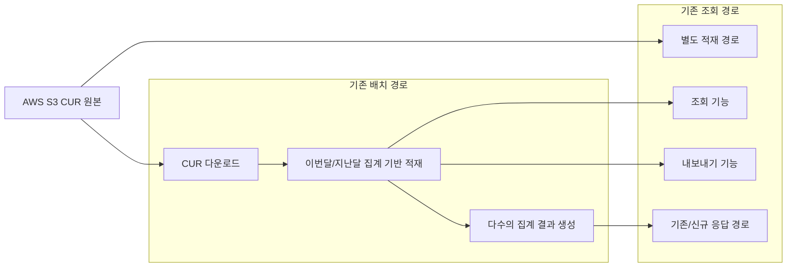

이 그림에서 핵심은 두 가지다. 첫째, 같은 CUR 원본을 바라보는 경로가 하나가 아니라는 점이다. 둘째, 이번달/지난달 집계 경로를 바꾸는 순간 집계와 조회가 동시에 영향을 받는다는 점이다. 이 구조를 보고 나서야 “왜 입력만 바꾸면 끝나지 않는가”가 명확해졌다.

## 1. 시작점은 레거시 CUR과 고정 스키마 의존이었다

가장 먼저 드러난 문제는 레거시 CUR과 고정 스키마 의존이다. 기존 구조는 gzip CSV 중심의 CUR 1.0 처리 방식 위에 올라가 있었고, 이번달 집계와 지난달 집계 경로도 고정 컬럼 구조를 전제로 동작했다. 실제 구조를 뜯어보니 이 방식은 태그나 빌링 정책 변화가 생길 때마다 시스템 전체의 수정 범위를 예상보다 크게 만들고 있었다.

이걸 이해하는 데 가장 도움이 됐던 그림은 아래 흐름이었다.

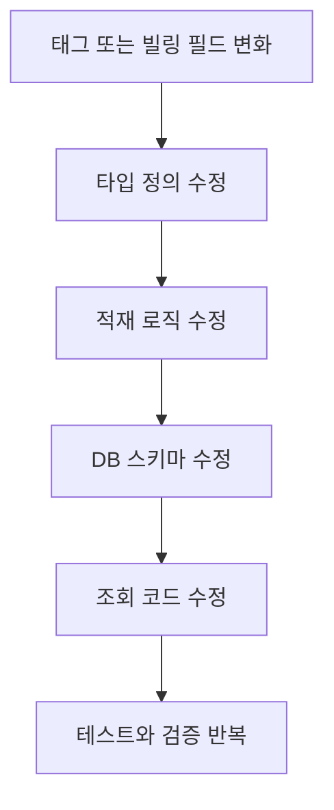

태그 하나가 추가되는 일이 단순한 데이터 변화로 끝나지 않고, 타입 정의부터 DB와 조회 코드까지 연쇄적으로 번지는 구조였던 셈이다. 여기서 CUR 2.0의 Parquet 기반 구조가 왜 필요한지가 분명해졌다. 새 포맷이 더 현대적이라서가 아니라, 변화 비용을 애플리케이션 전체로 퍼뜨리지 않기 위한 기반이었다. 이 지점이 특히 중요했다. 겉으로는 파일 포맷 전환처럼 보이는 작업이 실제로는 유지보수 비용 구조를 바꾸는 일이었기 때문이다.

그래서 CUR 2.0 전환은 단순 마이그레이션이 아니라 기술 부채 정리 작업이다. 지원 종료 시점이 명확히 고지되지 않았더라도, 계속 레거시 CUR에 묶여 있으면 앞으로의 변화는 점점 더 비싸진다. 이 사실을 받아들이는 순간, 왜 이 작업이 “지금 해 두어야 하는 일”인지도 자연스럽게 드러났다.

## 2. 포맷 문제를 따라가니 운영 리스크가 같이 나왔다

포맷 의존만 정리하면 될 줄 알았는데, 실행 흐름을 더 파고들자 곧바로 운영 리스크가 같이 따라 나왔다. 기존 흐름은 거의 “기존 집계를 비우고 -> S3에서 다시 내려받고 -> 대량 적재하는” 순서에 가까웠고, 다운로드 실패나 파일 검증 실패가 생겼을 때의 복구 전략도 충분히 탄탄하지 않았다.

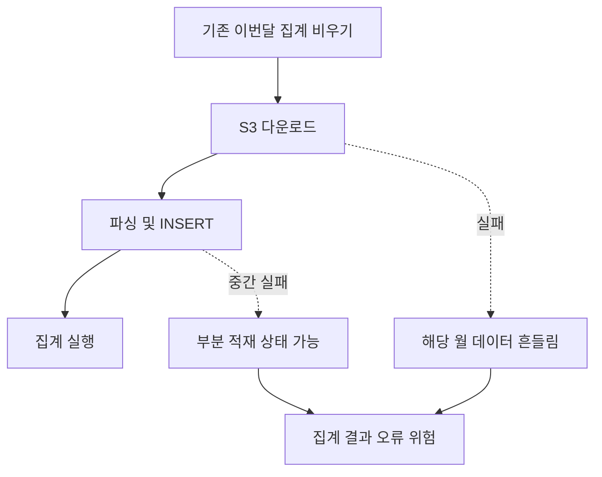

처음에는 “CSV 기반이라 불편하네” 정도의 문제로만 보였는데, 이 그림을 그리고 나니 훨씬 현실적으로 다가왔다. 한 번 실패하면 월 데이터 전체가 흔들릴 수 있고, 그 영향이 곧바로 집계 결과로 이어질 수 있었기 때문이다. 즉, CUR 1.0의 한계는 단지 낡은 포맷에 머문 것이 아니라, 그 포맷을 전제로 설계된 적재 방식 자체가 원자성과 복구 가능성 면에서 거칠었다.

그래서 새 경로가 CUR 2.0을 읽게 만드는 것만으로는 충분하지 않았다. 다운로드 재시도, snapshot 기반 반복 실행, 캐시 검증, 그리고 나중에는 shadow table swap과 멱등 재실행까지 같이 고민해야 했다. 실제로 S3 다운로드 재시도와 snapshot/cache 경로는 일부 넣었지만, 집계를 비우고 다시 적재하는 방식 자체는 아직 남아 있다. 이 지점에서 얻은 교훈은 명확했다. 정합성을 맞추는 일과 운영 안정성을 확보하는 일은 서로 연결돼 있지만 같은 단계는 아니다.

### 기존 배치 실행 그래프가 보여 준 것

말로만 설명하면 감이 잘 안 와서, 기존 배치 실행 그래프도 같이 확인했다. 아래 두 이미지는 기존 CPU 사용률과 메모리 사용량을 문서 안에서 바로 볼 수 있도록 정리한 것이다.

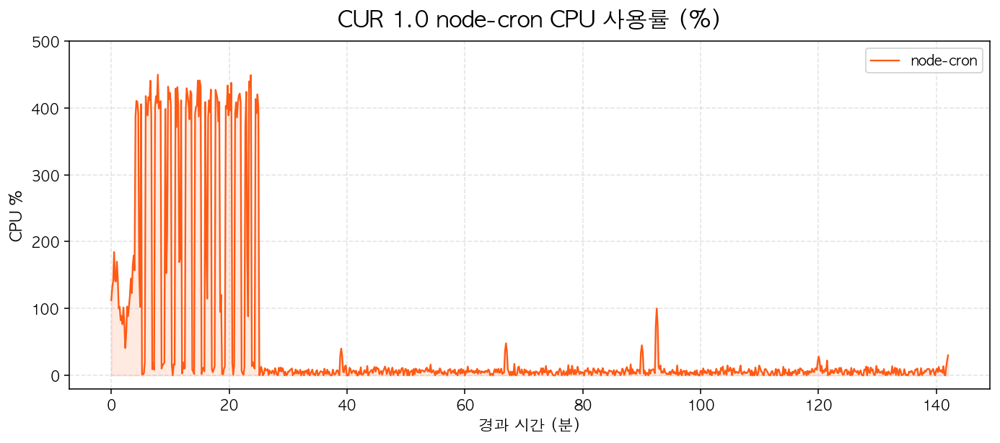

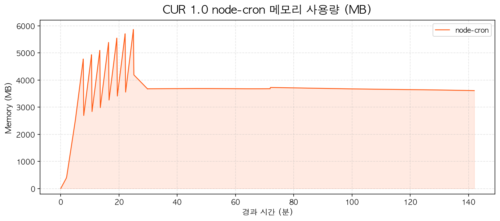

이 두 그래프를 나란히 보면 전환 필요성이 숫자보다 먼저 눈에 들어온다. CPU는 시작 후 약 25분 동안 100%에서 400%를 넘나드는 급격한 스파이크를 반복한다. 멀티코어를 강하게 쓰는 구간이 길고, 중간중간 거의 0%까지 떨어지는 구간도 함께 보인다. 즉, 작업은 짧고 단정하게 끝나는 형태가 아니라, 큰 배치를 밀어 넣고 쉬고 다시 밀어 넣는 burst 패턴으로 동작했다.

메모리 그래프는 더 직관적이다. 초반에 빠르게 5~6GB 가까이 치솟고, 이후에는 약 3.6GB 수준에서 오래 plateau를 만든다. 이 모습은 “초기 배치 처리 과정에서 메모리를 크게 사용하고, 작업이 끝난 뒤에도 high watermark가 높게 남는 구조”를 보여 준다. 이걸 바로 메모리 릭이라고 단정할 수는 없지만, CUR 1.0 기존 배치 실행 경로가 CPU와 메모리를 모두 공격적으로 쓰는 구조였다는 점은 분명하다.

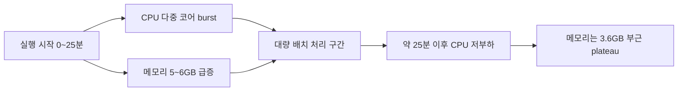

이 흐름을 보고 나니 왜 문서에서 기존 집계를 비우는 방식, 재시도, snapshot, 멱등성 같은 단어가 계속 등장하는지도 더 잘 이해됐다. 기존 구조는 단순히 “오래 걸리는 작업”이 아니라, 초반에 자원을 세게 몰아 쓰고 이후에는 높은 메모리 점유를 남기는 배치형 구조에 가까웠다.

## 3. 하나를 고치면 다른 중복이 더 선명하게 보였다

구조를 더 따라가 보니 왜 전환의 범위가 커질 수밖에 없었는지도 자연스럽게 드러났다. 여러 집계 결과와 전월 검증용 스냅샷이 따로 있고, 서비스명 치환, 리전 보정, 할인 계산 같은 전처리 규칙이 여러 쿼리와 서비스에 흩어져 있었다. 일부 집계는 별도 트랜잭션으로 실행돼 실패 시 정합성 판단도 단순하지 않았다. 여기에 기존 조회 경로와 기존 배치 경로가 같은 CUR 원본을 각자 내려받아 서로 다른 경로로 적재하고, 수동 실행과 스케줄 실행도 분리되어 있었다.

이걸 “왜 범위가 커졌는가” 관점으로 다시 그려 보면 아래와 같았다.

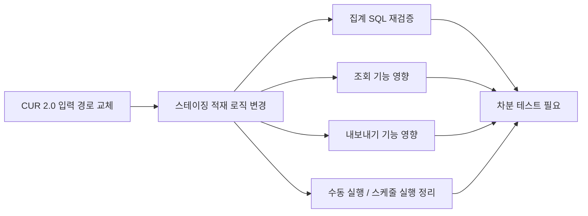

이 그림이 좋았던 이유는, 왜 이 작업이 생각보다 넓게 퍼지는지 한눈에 보여 주기 때문이다. 입력만 바꾸면 끝날 것 같았지만, 실제로는 집계와 조회와 실행 경로가 다 연결돼 있었다. 예를 들어 집계 로직만 옮기면 끝날 줄 알았는데, 곧 조회 기능과 내보내기 기능이 여전히 구 집계 경로에 묶여 있다는 사실이 따라왔다. 입력 경로를 일부 바꿔도 최종 조회 기능이 예전 집계 경로를 계속 읽고 있으면, 구 구조를 완전히 걷어낼 수 없다.

개인적으로는 이 구간이 가장 중요했다. 처음에는 단순 전환처럼 보이던 일이 실제로는 중복된 책임을 찾아내고, 어디까지를 이번 차수에서 정리할지 경계를 세우는 작업으로 바뀌었기 때문이다. 이런 일은 겉보기 성과는 느리지만, 한 번 방향을 잘 잡아 놓으면 그다음부터는 수정이 훨씬 쉬워진다.

## 4. 그래서 어떤 방식으로 풀어 갔나

여기서부터는 “한 번에 끝내는 전환”이 아니라 “기준선을 만들고 조금씩 옮기는 전환”으로 판단했다. 특히 핵심은, 문제를 찾고 끝내는 방식이 아니라, 바꾸고 비교하고 다시 다듬는 루프를 만드는 것이었다.

이번 작업에서 가장 중요했던 기준은 성능보다 먼저 정합성이었다. CUR 데이터는 결국 사용자에게 청구한 금액의 원장 데이터가 되기 때문에, 여기서 집계가 조금이라도 어긋나면 사용자에게 잘못된 금액을 청구할 위험이 생긴다. 이 위험은 운영에 올라간 뒤 발견하면 이미 늦다. 그래서 이번 전환에서는 “새 구조가 더 좋아 보인다”는 감각만으로는 절대 충분하지 않았고, 기존 로직으로 계산한 결과와 개선한 로직으로 계산한 결과가 완전히 같다는 사실을 먼저 증명해야 했다.

그 기준을 만들기 위해 선택한 방법이 차분 테스트였다. 먼저 기존 로직으로 돌린 집계 결과를 스냅샷으로 저장하고, 같은 입력 데이터에 대해 개선한 코드로 다시 집계를 수행한 뒤, 두 결과를 테이블 단위로 비교하는 방식이다. 여기서 비교 기준은 “대충 비슷함”이 아니라 “완전히 일치함”이었다. 이렇게 해야만 성능 개선이나 구조 개선이 실제 청구 결과를 건드리지 않았다는 확신을 가질 수 있었다. 결국 차분 테스트는 부가적인 검증 도구가 아니라, 이번 작업 전체를 지탱하는 가장 중요한 안전장치였다.

여기에 하나를 더 붙였다. 이번 개선은 정합성만 맞으면 끝나는 작업이 아니었기 때문에, 컨테이너 기반의 성능 테스트 코드도 같이 만들었다. 즉, 개선된 코드가 통과로 인정되려면 두 조건을 모두 만족해야 했다. 첫째는 기존 결과와 완전히 같은 결과를 내는 정합성 통과, 둘째는 실행 시간과 자원 사용량이 실제로 개선됐다는 성능 통과였다. 이 기반을 먼저 만들어 두고, 그 위에서 LLM 기반 코딩 에이전트를 적극적으로 굴렸다.

방식은 명확했다. 보통 퇴근 전에 작업 방향과 실패 원인, 다음 해결 방향을 정리해서 지시하면, 코딩 에이전트가 그 지시를 바탕으로 코드를 수정하고 테스트를 돌리고 결과를 정리하는 흐름으로 약 3시간 정도 스스로 작업했다. 다음 날에는 그 결과를 보고 다시 실패 원인을 분석하고, 해결 방향을 더 구체화해서 다음 차수를 지시하는 식으로 반복했다. 이 반복 끝에 10차에서 처음으로 정합성 테스트를 통과했고, 11차에서 성능 테스트까지 함께 통과했다.

이 과정에서 얻은 생산성도 분명했다. 평균 300줄 안팎의 수정이 들어간 44개 파일을 1주일 만에 개선할 수 있었다. 물론 이 숫자가 단순히 LLM이 코드를 빨리 썼다는 뜻은 아니다. 더 중요한 점은, 정합성과 성능을 동시에 통과해야만 다음 단계로 넘어갈 수 있는 기준을 먼저 만들었기 때문에, 에이전트가 빠르게 움직여도 결과를 신뢰할 수 있었다는 점이다.

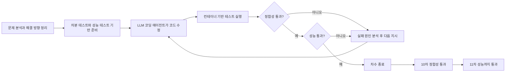

이 루프 덕분에 전환이 훨씬 신뢰할 만해졌다. 차분 테스트를 반복한 결과 `round-10`, `round-11`에서 16개 비교 대상이 모두 PASS했고, 신규 경로에는 Manifest/Parquet 기반 CUR 2.0 입력 처리, 집계 적재, Support Plan 합성, Marketplace 상품명 치환, 여러 빌링 집계와 Consumption 집계, 수동 실행 엔드포인트까지 이미 올라왔다. 이 말은 새 경로가 더 이상 아이디어 수준이 아니라, 실제로 결과를 만들고 기존 경로와 비교할 수 있는 수준이라는 뜻이다.

또 하나 중요했던 점은, 개선이 한 번에 거창하게 이뤄지지 않았다는 점이다. 테스트 기반을 먼저 만들고, 입력 경로를 바꾸고, 일부 재시도를 넣고, 실행 경로를 정리하고, 그다음에는 Repository 구조를 더 안전하게 바꾸는 식으로 한 단계씩 쌓아 갔다. 복잡한 집계 쿼리를 더 안전하게 관리하려는 후속 정리 작업도 바로 그 다음 단계로 이어지고 있다. 이 속도는 화려하진 않지만, 전환 작업에 필요한 속도였다.

## 5. 실제 비교 결과를 붙여 보니 개선 폭이 더 선명해졌다

기존 구조를 이해하고 나서 신규 전환 결과를 붙여 보면, 이 작업이 단순한 코드 스타일 변경이 아니었다는 점이 더 또렷해진다. 아래 이미지는 기존 배치 기반 처리와 신규 서버 기반 처리를 비교한 대시보드다.

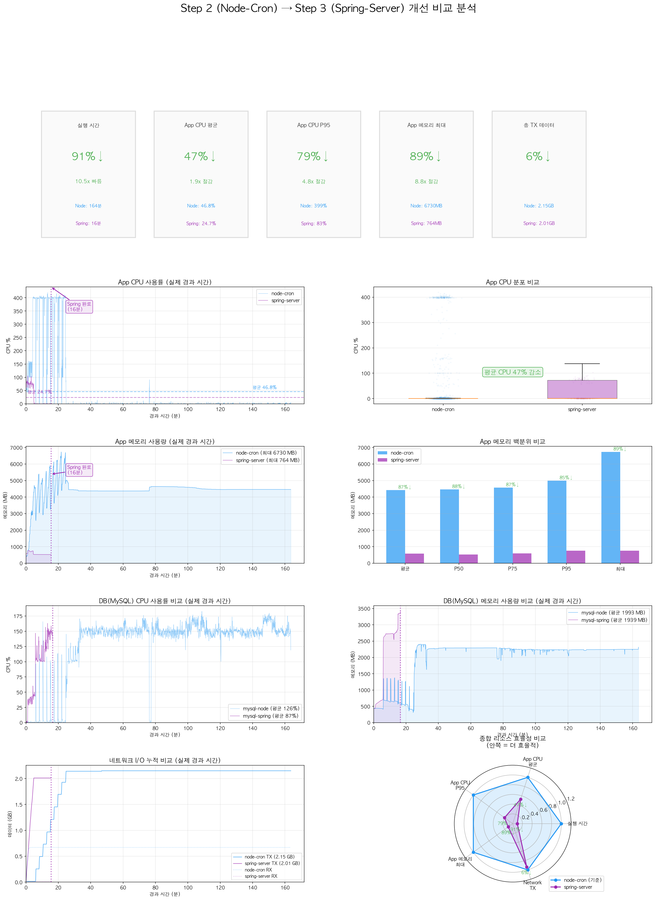

여기서 가장 먼저 눈에 들어오는 것은 실행 시간이다. 실제 비교 결과를 보면 Node는 164분, Spring은 16분 수준으로 약 91% 감소했다. App CPU 평균은 47% 감소했고, CPU P95는 79% 감소했다. App 메모리 최대 사용량도 6730MB에서 764MB 수준으로 약 89% 줄었다. 네트워크 TX는 약 6% 감소에 그쳐 거의 비슷한 수준이므로, 처리량을 크게 줄여서 빨라진 것이 아니라 비슷한 일을 훨씬 가볍게 처리한 결과라고 보는 것이 정확하다.

이 비교에서 중요한 지점은 “느낌상 좋아진 것 같다”를 넘어서, 어떤 축에서 좋아졌는지가 분명해졌다는 것이다. CPU는 더 짧게 쓰고, 메모리는 훨씬 적게 쓰고, DB CPU 부하도 낮아졌고, 네트워크 전송량은 크게 달라지지 않았다. 즉, 같은 종류의 작업을 더 효율적으로 수행하는 방향으로 개선이 일어났다고 볼 수 있다.

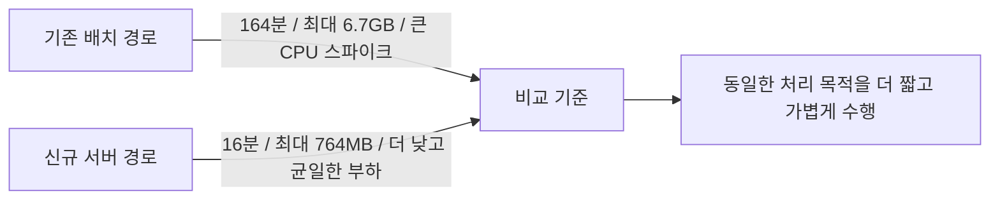

물론 이 결과를 두고 모든 문제가 끝났다고 말할 수는 없다. 하지만 “새 경로가 실제로 더 나은가”라는 질문에는 충분히 강한 근거가 생겼다. 구조를 정리하는 일은 종종 느리고 지루해 보이지만, 이렇게 결과가 숫자와 그림으로 돌아오면 그 과정의 가치가 분명해진다.

## 6. 지금까지의 결과와 후속 정리 과제

현재 상태는 후속 정리만 남아 있다. 이를 더 분명하게 보기 위해 상태를 세 구간으로 나누어 정리했다.

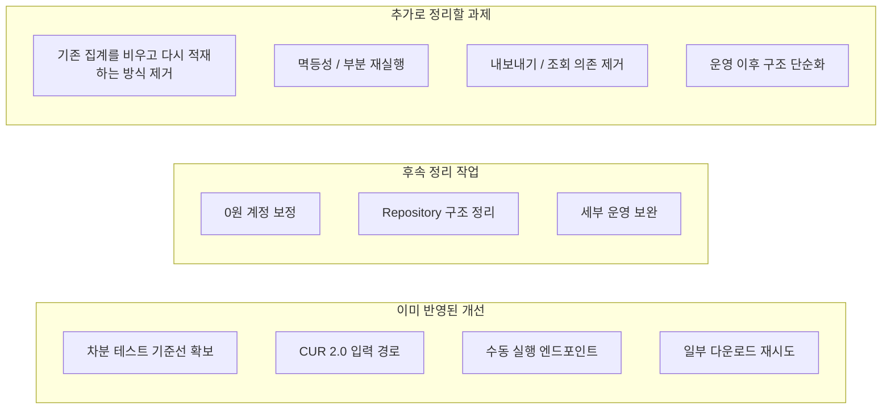

이 그림이 현재 상태를 가장 잘 설명한다. 정합성 확보와 핵심 포팅은 이미 의미 있는 진전이 있고, 운영 전환까지도 반영된 상태다. 다만 그 이후의 관점에서 보면 기존 집계를 비우고 다시 적재하는 방식, 부분 재실행과 멱등성, 실패 지점 추적, 구 집계 경로에 묶인 조회와 내보내기 정리는 아직 더 다듬어야 한다. 즉, 지금은 전환 이후 구조를 더 안정적이고 단순하게 정리하는 단계다.

## 마무리

이번 작업을 한 문장으로 요약하면 이렇다. CUR 2.0 전환은 파일 포맷 교체가 아니라, 레거시 CUR에 맞춰 굳어진 수집, 집계, 조회, 실행 구조를 더 다루기 쉬운 방향으로 옮기는 작업이다. 지금까지는 정합성 확보와 핵심 포팅을 넘어 운영 전환까지 반영됐고, 앞으로의 초점은 이 구조를 실제 운영에서 더 단순하고 안정적으로 유지할 수 있게 계속 정리하는 데 있다.

아마 이런 종류의 일은 앞으로도 비슷한 패턴으로 반복될 것이다. 문제를 하나 발견하고, 그림으로 단순화해 보고, 고쳐 보고, 다시 비교하고, 그다음 숨어 있던 중복과 결합을 또 발견하는 식으로 말이다. 그런데 이상하게도 바로 그 반복이 이런 작업을 지루하지 않게 만든다. 구조가 조금씩 정리되고, 다음 변경이 조금씩 쉬워지는 감각이 분명히 있기 때문이다. 이번 CUR 전환도 딱 그런 종류의 일이었다.
