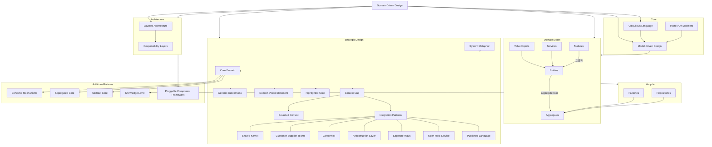

# 개요
Domain-Driven Design(DDD)은 복잡한 소프트웨어 시스템 개발에서 **[[도메인(Domain)]] 모델**을 중심으로 설계하고 구현하는 접근 방식입니다. DDD는 도메인 전문가와 개발자 사이의 긴밀한 협력을 통해 도메인 지식을 깊이 있게 이해하고, 이를 소프트웨어에 반영하여 비즈니스 가치에 부합하는 시스템을 구축합니다.

DDD의 핵심은 도메인 모델을 정확하고 효과적으로 표현하는 데 있으며, 이를 위해 다양한 개념들이 유기적으로 연결되어 있습니다.

---
## 개념
### [[유비쿼터스 언어(Ubiquitous Language)]]와 모델링

DDD에서는 팀 내 모든 구성원이 공유하는 공통된 언어인 유비쿼터스 언어를 사용하는 것을 중요하게 생각합니다. 이 언어는 도메인 전문가와 개발자 모두가 이해하고 사용하며, 도메인의 개념과 로직을 명확하게 표현합니다. 유비쿼터스 언어는 도메인 모델에서 사용되는 모든 용어와 개념을 포괄하며, 이를 통해 **[[모델 주도 설계(Model-Driven Design)]]** 을 구현합니다.

### [[모델 주도 설계(Model-Driven Design)]]과 도메인 모델

**[[모델 주도 설계(Model-Driven Design)]]**은 도메인 모델을 소프트웨어 설계의 중심에 두고, 모델과 구현이 일관성을 유지하도록 하는 접근 방식입니다. 이를 위해 개발자는 도메인 전문가와 긴밀히 협력하는 **[[Hands-On Modelers]]**가 되어, 도메인 지식을 모델에 반영하고 지속적으로 개선합니다.

도메인 모델은 시스템의 업무 로직과 규칙을 반영하며, 주요 구성 요소로는  [[엔티티(Entity)]], **[[값 객체(Value Objects)]]**, **[[서비스(Service)]]** 등이 있습니다.

### 도메인 객체와 그 관계

#### [[엔티티(Entity)]]와 [[값 객체(Value Objects)]]

- **[[엔티티(Entity)]]** 는 고유한 식별자를 가지며, 상태가 시간에 따라 변하는 객체입니다. 예를 들어, '주문', '고객' 등의 개념이 있습니다.
- **[[값 객체(Value Objects)]]**는 식별자 없이 값 그 자체로 의미를 가지는 불변 객체입니다. 예를 들어, '주소', '날짜' 등이 있습니다.
  
[[엔티티(Entity)]]는 [[값 객체(Value Objects)]]를 속성으로 가지며, 도메인 모델에서 중요한 역할을 수행합니다. [[Ubiquitous Language]]를 통해 정의된 개념들은 [[엔티티(Entity)]]와 [[값 객체(Value Objects)]]로 표현되며, 이를 통해 도메인을 구체화합니다.

#### [[서비스(Service)]]와 도메인 로직

도메인 모델에서 개념상 독립적인 작업이나 로직은 **[[서비스(Service)]]**로 표현됩니다. [[서비스(Service)]]는 [[엔티티(Entity)]]나 [[값 객체(Value Objects)]]로 표현하기 어려운 도메인 개념을 캡슐화하며, 중요한 도메인 로직을 담고 있습니다.

### 아키텍처와 계층화

#### [[Layered Architecture]]

DDD에서는 시스템을 분리된 계층으로 구성하는 **[[Layered Architecture]]**를 채택합니다. 일반적으로 표현 계층, 응용 계층, 도메인 계층, 인프라스트럭처 계층으로 나누며, 도메인 모델은 도메인 계층에 위치합니다. 이를 통해 각 계층은 자신의 책임에 집중할 수 있으며, 시스템의 유지보수성과 확장성을 높입니다.

#### [[Modules]]와 조직화

도메인 모델의 복잡도를 관리하기 위해 **[[Modules]]**를 사용하여 관련 있는 클래스와 개념을 그룹화합니다. [[Modules]]는 도메인 모델을 논리적으로 구분하고, 응집도를 높여 이해하기 쉽게 만듭니다.

### 객체의 생명주기 관리

#### [[Aggregates]]

**[[Aggregates]]**는 일관성 있는 변경을 보장하기 위해 하나의 단위로 묶인 연관된 객체들의 집합입니다. 각 Aggregate는 루트 엔티티(Aggregate Root)를 가지며, 외부에서는 루트 엔티티를 통해서만 내부 객체에 접근할 수 있습니다. 이는 복잡한 객체 관계를 관리하고 데이터 일관성을 유지하는 데 도움을 줍니다.

#### [[Factories]]와 [[Repositories]]

- **[[Factories]]**는 복잡한 객체나 Aggregate의 생성을 책임지는 역할을 합니다. [[Factories]]를 통해 객체 생성 로직을 캡슐화하여 클라이언트 코드의 단순화를 도모합니다.
- **[[Repositories]]**는 도메인 객체의 영속성을 관리하며, 마치 컬렉션처럼 동작합니다. [[Repositories]]를 통해 도메인 계층은 데이터 저장소의 구체적인 구현으로부터 독립됩니다.

### 경계 설정과 컨텍스트

#### [[Bounded Context]]

복잡한 도메인을 효과적으로 관리하기 위해서는 명확한 경계를 설정하는 것이 중요합니다. **[[Bounded Context]]**는 특정 도메인 모델이 유효한 경계를 정의하며, 모델의 의미가 일관되게 유지되는 컨텍스트입니다. 하나의 시스템 내에서도 여러 [[Bounded Context]]가 존재할 수 있으며, 동일한 용어가 다른 의미를 가질 수도 있습니다.

#### [[Context Map]]과 통합

여러 [[Bounded Context]] 간의 관계와 통합 방식을 시각화한 것이 **[[Context Map]]**입니다. [[Context Map]]은 시스템 전반의 구조를 이해하고 팀 간의 협업을 돕습니다.

통합 전략으로는 다음과 같은 패턴들이 있습니다:

- **[[Shared Kernel]]**: 여러 [[Bounded Context]]에서 공통으로 사용하는 모델을 공유하는 방식입니다.
- **[[Customer-Supplier Development Teams]]**: 한 팀의 산출물이 다른 팀의 입력이 되는 관계에서 협력하여 개발하는 방식입니다.
- **[[Conformist]]**: 다른 컨텍스트의 모델을 변경 없이 그대로 사용하는 방식으로, 통합을 단순화하지만 유연성은 떨어집니다.
- **[[Anticorruption Layer]]**: 이질적인 모델 간의 변환을 담당하여 도메인 모델의 순수성을 보호합니다.
- **[[Separate Ways]]**: 시스템 간의 통합을 피하고 독립적으로 운영하는 전략입니다.
- **[[Open Host Service]]**와 **[[Published Language]]**: 공개된 서비스를 통해 외부와 통합하고, 공유되는 언어를 정의하여 메시지나 데이터의 형식을 표준화합니다.

### 전략적 설계와 핵심 도메인

#### [[Core Domain]]과 [[Generic Subdomains]]

DDD에서는 시스템에서 가장 중요한 부분인 **[[Core Domain]]**에 집중하는 것을 강조합니다. [[Core Domain]]은 비즈니스에 경쟁 우위를 제공하며, 팀의 주요 역량이 투입됩니다. 반면에, **[[Generic Subdomains]]**는 핵심 도메인은 아니지만 필수적인 부분으로, 재사용 가능한 컴포넌트나 외부 솔루션을 활용할 수 있습니다.

#### 전략적 패턴과 구현

- **[[Domain Vision Statement]]**: 도메인 모델 개발의 방향성과 목표를 명확히 하기 위한 비전 서술입니다.
- **[[Highlighted Core]]**: 모델에서 핵심 영역을 강조하여 팀의 집중을 유도합니다.
- **[[Cohesive Mechanisms]]**: 복잡한 도메인 로직을 단순화하고 응집력 있게 만드는 메커니즘입니다.
- **[[Segregated Core]]**: 핵심 도메인을 다른 부분과 분리하여 모델의 순수성을 유지합니다.
- **[[Abstract Core]]**: 핵심 도메인의 복잡성을 추상화하여 단순화된 형태로 표현합니다.

### 대규모 구조와 시스템 설계

#### [[System Metaphor]]

**[[System Metaphor]]**는 시스템의 구조와 작동 방식을 이해하기 쉽게 비유적으로 표현한 것입니다. 이는 팀의 공통된 이해를 돕고 일관성 있는 설계를 유도합니다.

#### [[Responsibility Layers]]와 [[Knowledge Level]]

- **[[Responsibility Layers]]**는 시스템의 책임을 계층으로 분리하여 각 계층이 특정한 역할을 담당하도록 설계합니다.
- **[[Knowledge Level]]**은 도메인 지식과 구현을 분리하여 도메인 모델의 순수성을 유지하고 복잡도를 관리합니다.

#### [[Pluggable Component Framework]]

유연하고 확장 가능한 구조를 위해 **[[Pluggable Component Framework]]**를 도입합니다. 이는 시스템의 컴포넌트들이 모듈화되고 교체 가능하게 설계되어 새로운 요구사항이나 변경에 쉽게 대응할 수 있게 합니다.

### 구조

### 결론

Domain-Driven Design은 복잡한 도메인을 효과적으로 모델링하고 소프트웨어에 반영하기 위한 포괄적인 접근 방식입니다. [[Ubiquitous Language]]를 통해 팀 내의 원활한 의사소통을 이루고, [[모델 주도 설계(Model-Driven Design)]]으로 도메인 모델을 중심으로 시스템을 구축합니다. 도메인 모델의 구성 요소인 [[Entities]], [[값 객체(Value Objects)]], [[서비스(Service)]]는 유기적으로 연결되어 도메인을 표현하며, [[Bounded Context]]와 전략적 설계를 통해 복잡한 시스템을 효과적으로 관리합니다.

DDD의 다양한 개념과 패턴은 서로 긴밀히 연관되어 있으며, 이를 종합적으로 적용함으로써 비즈니스 가치를 실현하는 견고하고 유연한 소프트웨어를 개발할 수 있습니다.