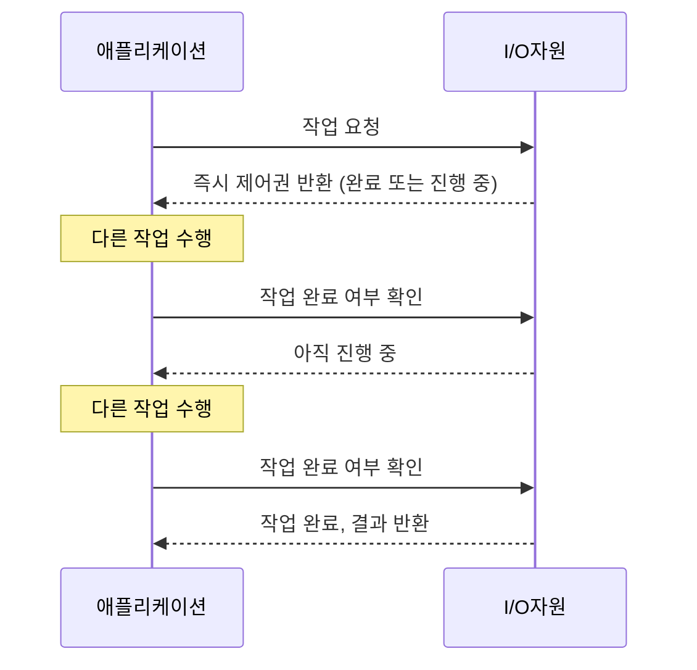

동기 논블로킹은 I/O 및 프로그래밍 모델에서 중요한 개념으로, 작업 처리 방식의 효율성에 큰 영향을 미칩니다. 이 방식은 스레드의 효율적인 사용을 통해 시스템의 성능을 향상시키는 접근법입니다. 동기적 논블로킹을 이해하기 위해서는 먼저 [[블로킹(blocking)]]과 [[논블로킹(Non-blocking)]]의 차이점, 그리고 [[동기(Synchronous)]]와 [[비동기(Asynchronous)]]의 개념을 이해하는 것이 중요합니다.

## 동기와 비동기, 블로킹과 논블로킹

I/O 및 작업 처리 방식은 크게 네 가지 조합으로 분류할 수 있습니다:

1. 동기 블로킹(Synchronous Blocking)
2. 동기 논블로킹(Synchronous Non-Blocking)
3. 비동기 블로킹(Asynchronous Blocking)
4. 비동기 논블로킹(Asynchronous Non-Blocking)

동기와 비동기는 작업 완료 결과를 어떻게 받는지에 관한 개념이며, 블로킹과 논블로킹은 작업을 호출한 스레드가 제어권을 어떻게 관리하는지에 관한 개념입니다. 

## 동기적 논블로킹의 정의

동기적 논블로킹은 호출자가 작업의 완료 여부를 직접 관리하지만(동기), 작업을 요청한 후 스레드가 차단되지 않고 다른 작업을 수행할 수 있는(논블로킹) 모델입니다. 이 방식에서는 호출자가 주기적으로 작업의 완료 여부를 확인하는 폴링(polling) 방식을 주로 사용합니다.

## 동기적 논블로킹의 작동 방식

동기적 논블로킹의 작동 방식을 이해하기 위해 다음과 같은 흐름을 살펴볼 수 있습니다:



1. 애플리케이션이 I/O 자원에 작업을 요청합니다.
2. I/O 자원은 작업 완료 여부와 관계없이 즉시 제어권을 애플리케이션에 반환합니다.
3. 애플리케이션은 주기적으로 작업 완료 여부를 확인하며, 그 사이에 다른 작업을 수행할 수 있습니다.
4. 작업이 완료되면 결과를 받아 처리합니다.

## 동기적 논블로킹 vs 다른 I/O 모델

각 모델의 차이점을 간략히 살펴보겠습니다:

### 동기 블로킹 (Synchronous Blocking)

작업을 요청한 후 작업이 완료될 때까지 스레드가 대기 상태로 들어가며, 다른 작업을 수행할 수 없습니다. 가장 단순하지만 자원 효율성이 낮은 모델입니다.

### 동기 논블로킹 (Synchronous Non-Blocking)

작업을 요청한 후 즉시 제어권을 돌려받아 다른 작업을 수행할 수 있으며, 주기적으로 작업 완료 여부를 확인합니다.

### 비동기 논블로킹 (Asynchronous Non-Blocking)

작업을 요청한 후 즉시 제어권을 돌려받으며, 작업이 완료되면 콜백이나 이벤트를 통해 결과를 받습니다. 가장 자원 효율적인 모델이지만 구현이 복잡합니다.

자세한 비교는 I/O 모델 비교를 참고해주세요.

## Java에서의 동기적 논블로킹 구현

Java에서는 NIO(New I/O) 패키지를 통해 논블로킹 I/O를 구현할 수 있습니다. 다음은 간단한 예시입니다:

```java
import java.nio.ByteBuffer;
import java.nio.channels.SelectionKey;
import java.nio.channels.Selector;
import java.nio.channels.SocketChannel;
import java.net.InetSocketAddress;
import java.util.Iterator;
import java.util.Set;

public class NonBlockingClient {
    public static void main(String[] args) throws Exception {
        // 소켓 채널 생성 및 논블로킹 모드 설정
        SocketChannel socketChannel = SocketChannel.open();
        socketChannel.configureBlocking(false);
        
        // 서버에 연결 시도
        socketChannel.connect(new InetSocketAddress("localhost", 8080));
        
        // 셀렉터 생성 및 채널 등록
        Selector selector = Selector.open();
        socketChannel.register(selector, SelectionKey.OP_CONNECT);
        
        ByteBuffer buffer = ByteBuffer.allocate(256);
        
        while (true) {
            // 셀렉터가 준비된 채널을 선택 (논블로킹)
            selector.select();
            
            Set<SelectionKey> selectedKeys = selector.selectedKeys();
            Iterator<SelectionKey> iter = selectedKeys.iterator();
            
            while (iter.hasNext()) {
                SelectionKey key = iter.next();
                iter.remove();
                
                if (key.isConnectable()) {
                    SocketChannel channel = (SocketChannel) key.channel();
                    
                    // 연결 완료 처리
                    if (channel.isConnectionPending()) {
                        channel.finishConnect();
                    }
                    
                    // 쓰기 작업을 위해 채널 등록
                    channel.register(selector, SelectionKey.OP_WRITE);
                } else if (key.isWritable()) {
                    SocketChannel channel = (SocketChannel) key.channel();
                    
                    // 데이터 전송
                    buffer.clear();
                    buffer.put("Hello, Server!".getBytes());
                    buffer.flip();
                    channel.write(buffer);
                    
                    // 읽기 작업을 위해 채널 등록
                    channel.register(selector, SelectionKey.OP_READ);
                } else if (key.isReadable()) {
                    SocketChannel channel = (SocketChannel) key.channel();
                    
                    // 데이터 수신
                    buffer.clear();
                    int bytesRead = channel.read(buffer);
                    
                    if (bytesRead > 0) {
                        buffer.flip();
                        System.out.println("서버로부터 받은 메시지: " + 
                                          new String(buffer.array(), 0, buffer.limit()));
                        break;
                    }
                }
            }
        }
    }
}
```

이 예제는 소켓 통신을 논블로킹 방식으로 구현한 것입니다. `selector.select()` 메서드는 셀렉터에 등록된 채널 중 작업 준비가 된 채널을 찾아주며, 채널의 상태에 따라 적절한 처리를 수행합니다.

Java NIO에 대한 자세한 내용은 Java NIO 활용법을 참고해주세요.

## 스프링 프레임워크에서의 논블로킹 모델

스프링 프레임워크는 5.0 버전부터 스프링 웹플럭스(Spring WebFlux)를 통해 논블로킹 웹 애플리케이션 개발을 지원합니다. 웹플럭스는 [[반응형 프로그래밍(Reactive Programming)]] 패러다임을 기반으로 하며, Project Reactor 라이브러리를 사용합니다.

```java
@RestController
public class NonBlockingController {

    @GetMapping("/data")
    public Mono<String> getData() {
        return Mono.just("Non-blocking response")
                .delayElement(Duration.ofSeconds(1));
    }

    @GetMapping("/data-stream")
    public Flux<String> getDataStream() {
        return Flux.interval(Duration.ofSeconds(1))
                .map(i -> "Data " + i)
                .take(5);
    }
}
```

이 예제에서 `Mono`와 `Flux`는 리액티브 스트림의 Publisher 인터페이스를 구현한 객체로, 각각 0-1개의 결과와 0-N개의 결과를 비동기적으로 처리합니다. `delayElement` 메서드는 지연 시간을 추가하지만, 이 동안 작업 스레드는 블로킹되지 않고 다른 요청을 처리할 수 있습니다.

스프링 웹플럭스에 대한 자세한 내용은 스프링 웹플럭스 활용법을 참고해주세요.

## 동기적 논블로킹의 장단점

### 장점

1. **자원 효율성**: 블로킹 방식에 비해 스레드를 효율적으로 사용할 수 있습니다.
2. **처리량 향상**: 동시에 더 많은 요청을 처리할 수 있어 처리량이 향상됩니다.
3. **확장성**: 스레드 풀 크기에 제한받지 않고 많은 연결을 관리할 수 있습니다.

### 단점

1. **복잡성**: 구현이 복잡하고 디버깅이 어려울 수 있습니다.
2. **CPU 사용량**: 폴링 방식으로 인해 CPU 사용량이 증가할 수 있습니다.
3. **학습 곡선**: 개발자가 이해하고 활용하기 위한 학습 곡선이 높습니다.
4. **콜백 지옥**: 복잡한 로직에서는 콜백 구조가 복잡해질 수 있습니다 (이는 [[CompletableFuture]]나 리액티브 프로그래밍으로 개선 가능).

## 실제 사용 사례

동기적 논블로킹 모델은 다음과 같은 상황에서 특히 유용합니다:

1. **고성능 웹 서버**: Nginx, Node.js 등은 논블로킹 I/O를 활용하여 적은 수의 스레드로 많은 연결을 처리합니다.
2. **실시간 채팅 애플리케이션**: 많은 클라이언트 연결을 유지하면서 메시지를 효율적으로 처리해야 하는 경우.
3. **API 게이트웨이**: 여러 서비스로부터 데이터를 수집하여 응답해야 하는 경우.
4. **IoT 서버**: 수많은 장치로부터의 요청을 처리해야 하는 경우.

## 성능 최적화 기법

동기적 논블로킹 구현의 성능을 최적화하기 위한 몇 가지 기법은 다음과 같습니다:

1. **적절한 버퍼 크기 설정**: 너무 작거나 큰 버퍼는 성능 저하를 가져올 수 있습니다.
2. **셀렉터 튜닝**: 적절한 타임아웃 설정과 셀렉터 구성으로 성능을 향상시킬 수 있습니다.
3. **백프레셔(Backpressure) 관리**: 데이터 생산과 소비 속도를 조절하여 시스템 과부하를 방지합니다.
4. **적절한 스레드 모델 선택**: 워커 스레드 풀을 적절히 구성하여 CPU 바인딩 작업과 I/O 바인딩 작업을 효율적으로 처리합니다.

자세한 내용은 논블로킹 I/O 성능 최적화를 참고해주세요.

## 디버깅 기법

논블로킹 애플리케이션의 디버깅은 전통적인 블로킹 애플리케이션보다 복잡할 수 있습니다. 다음과 같은 방법으로 디버깅을 수행할 수 있습니다:

1. **로깅**: 주요 이벤트와 상태 변화를 로깅합니다.
2. **모니터링 도구**: VisualVM, JMX 등을 활용하여 실시간 모니터링을 수행합니다.
3. **테스트 케이스 작성**: 단위 테스트와 통합 테스트를 통해 문제를 사전에 발견합니다.
4. **스레드 덤프 분석**: 스레드 경합이나 교착 상태를 파악합니다.

자세한 디버깅 기법은 논블로킹 애플리케이션 디버깅을 참고해주세요.

## 결론

동기적 논블로킹 모델은 고성능, 고확장성 애플리케이션을 개발하는 데 강력한 도구입니다. 전통적인 블로킹 모델보다 스레드 자원을 효율적으로 사용할 수 있어 높은 처리량과 확장성을 제공합니다. 하지만 구현 복잡성과 디버깅 어려움이 있으므로, 적절한 상황에서 사용하는 것이 중요합니다.

최근에는 비동기 논블로킹 모델이 콜백 기반 접근법의 단점을 보완하기 위해 리액티브 프로그래밍과 같은 패러다임과 함께 더 널리 사용되고 있습니다. 이러한 접근법은 코드의 가독성을 유지하면서도 논블로킹의 이점을 활용할 수 있게 해줍니다.

고성능 애플리케이션 개발에 있어서 동기적 논블로킹 모델은 여전히 중요한 개념이며, 이를 올바르게 이해하고 적용하는 것은 현대 개발자에게 필수적인 역량입니다.

## 참고 자료

- Java NIO 프로그래밍 - Ron Hitchens
- 스프링 인 액션, 5판 - Craig Walls
- 리액티브 애플리케이션 개발 - Kevin Webber
- Netty 인 액션 - Norman Maurer, Marvin Allen Wolfthal