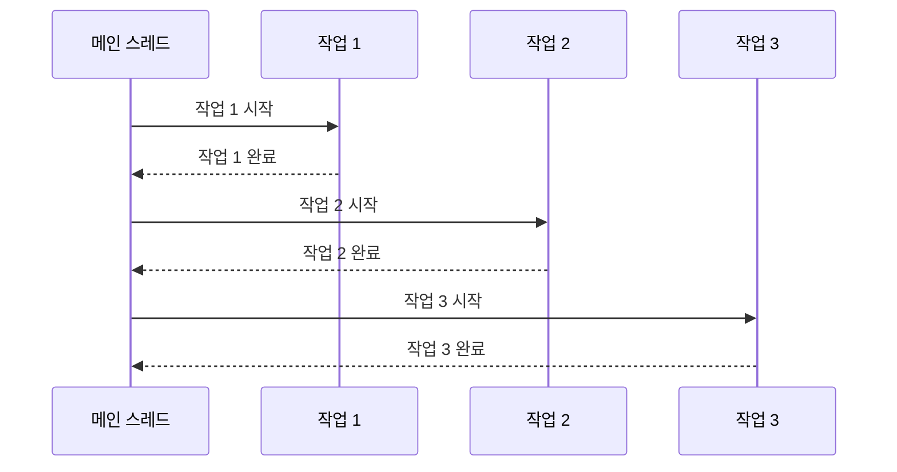

동기(Synchronous)는 프로그래밍에서 코드가 순차적으로 실행되는 방식을 의미합니다. 동기 방식에서는 한 작업이 완료될 때까지 다음 작업이 대기하며, 이는 프로그램의 흐름이 예측 가능하고 직관적이라는 장점이 있습니다. 이러한 특성은 많은 프로그래밍 상황에서 기본적인 실행 모델로 사용됩니다. 동기 방식을 더 잘 이해하기 위해서는 [[비동기(Asynchronous)]]와의 차이점을 알아보는 것이 중요합니다.

## 동기와 비동기의 차이

자세한 내용은 [[동기와 비동기의 차이]]를 참고해주세요.

## 동기 처리의 특징

동기 처리는 다음과 같은 핵심 특징을 가집니다:

1. **순차적 실행**: 코드가 작성된 순서대로 실행되며, 한 작업이 완료된 후에만 다음 작업이 시작됩니다.
2. **블로킹(Blocking)**: 작업이 완료될 때까지 프로그램의 실행이 차단됩니다.
3. **직관적인 코드 흐름**: 코드를 읽는 순서가 실행 순서와 일치하여 이해하기 쉽습니다.
4. **결과 즉시 반환**: 작업이 완료되면 즉시 결과를 반환받을 수 있습니다.
5. **에러 처리의 단순함**: 예외가 발생하면 즉시 감지하고 처리할 수 있습니다.

## 동기 처리의 동작 방식

동기 처리의 기본적인 흐름을 시각화하면 다음과 같습니다:



위 다이어그램에서 볼 수 있듯이, 각 작업은 이전 작업이 완료된 후에만 시작됩니다. 이는 동기 방식의 핵심 특성을 보여줍니다.

## Java에서의 동기 처리 구현

Java에서는 기본적으로 동기 방식으로 코드가 실행됩니다. 아래는 간단한 동기 처리 예제입니다:

```java
public class SynchronousExample {
    public static void main(String[] args) {
        System.out.println("작업 1 시작");
        performTask1();
        System.out.println("작업 2 시작");
        performTask2();
        System.out.println("작업 3 시작");
        performTask3();
        System.out.println("모든 작업 완료");
    }
    
    private static void performTask1() {
        // 첫 번째 작업 수행
        try {
            Thread.sleep(1000); // 작업 시간을 시뮬레이션
        } catch (InterruptedException e) {
            e.printStackTrace();
        }
        System.out.println("작업 1 완료");
    }
    
    private static void performTask2() {
        // 두 번째 작업 수행
        try {
            Thread.sleep(1000); // 작업 시간을 시뮬레이션
        } catch (InterruptedException e) {
            e.printStackTrace();
        }
        System.out.println("작업 2 완료");
    }
    
    private static void performTask3() {
        // 세 번째 작업 수행
        try {
            Thread.sleep(1000); // 작업 시간을 시뮬레이션
        } catch (InterruptedException e) {
            e.printStackTrace();
        }
        System.out.println("작업 3 완료");
    }
}
```

이 예제에서는 각 작업이 순차적으로 실행되며, 한 작업이 완료될 때까지 다음 작업은 실행되지 않습니다. 이는 동기 처리의 전형적인 모습입니다.

## 동기 처리의 주요 패턴

### 1. 직접 호출 패턴

가장 기본적인 동기 패턴으로, 메서드를 직접 호출하고 결과가 반환될 때까지 기다립니다.

```java
String result = service.processData(data);
// result를 사용한 후속 작업
```

### 2. 콜백 패턴

동기식 콜백은 함수 호출 시 콜백 함수를 전달하지만, 원래 함수가 완료된 후에만 콜백이 실행됩니다.

```java
public void processWithCallback(Data data, Callback callback) {
    // 데이터 처리
    Result result = process(data);
    // 동기적으로 콜백 실행
    callback.onComplete(result);
}
```

### 3. 폴링 패턴

작업 상태를 주기적으로 확인하는 방식으로, 각 확인은 동기적으로 수행됩니다.

```java
while (!service.isTaskComplete(taskId)) {
    Thread.sleep(1000); // 1초마다 상태 확인
}
Result result = service.getTaskResult(taskId);
```

동기 패턴에 대한 자세한 내용은 동기식 설계 패턴을 참고해주세요.

## 동기 처리의 장단점

### 장점

1. **단순성**: 코드가 직관적이고 이해하기 쉽습니다.
2. **예측 가능성**: 실행 순서가 명확하게 정의됩니다.
3. **디버깅 용이성**: 오류가 발생한 위치를 쉽게 찾을 수 있습니다.
4. **자원 관리**: 리소스 사용이 순차적이므로 관리가 용이합니다.
5. **즉시 결과**: 작업이 완료되면 즉시 결과를 얻을 수 있습니다.

### 단점

1. **성능 제한**: 한 번에 하나의 작업만 처리하므로 효율성이 떨어질 수 있습니다.
2. **블로킹 이슈**: 긴 작업 중에는 프로그램 전체가 대기 상태가 될 수 있습니다.
3. **자원 낭비**: I/O 대기 시간 동안 CPU가 유휴 상태로 남습니다.
4. **확장성 제한**: 동시 요청 처리에 한계가 있습니다.
5. **사용자 경험 저하**: UI 스레드가 블로킹되면 응용 프로그램이 응답하지 않는 것처럼 보일 수 있습니다.

## 동기 처리가 적합한 상황

동기 처리는 다음과 같은 상황에서 특히 유용합니다:

1. **간단한 연산**: 빠르게 완료되는 작업에는 동기 처리가 오버헤드가 적습니다.
2. **순차적 의존성**: 이전 작업의 결과가 다음 작업의 입력으로 필요한 경우입니다.
3. **트랜잭션 처리**: 데이터베이스 트랜잭션과 같이 원자성이 중요한 작업입니다.
4. **에러 처리 중요성**: 즉각적인 오류 감지와 처리가 필요한 경우입니다.
5. **일관된 상태 유지**: 시스템 상태가 예측 가능하게 변경되어야 하는 경우입니다.

## 스프링 프레임워크에서의 동기 처리

스프링 프레임워크에서는 기본적으로 동기 방식으로 요청을 처리합니다. 다음은 스프링 MVC에서의 동기 처리 예제입니다:

```java
@RestController
@RequestMapping("/api")
public class SynchronousController {
    
    @Autowired
    private UserService userService;
    
    @GetMapping("/users/{id}")
    public ResponseEntity<User> getUser(@PathVariable Long id) {
        // 동기적으로 사용자 정보 조회
        User user = userService.findById(id);
        if (user == null) {
            return ResponseEntity.notFound().build();
        }
        return ResponseEntity.ok(user);
    }
    
    @PostMapping("/users")
    public ResponseEntity<User> createUser(@RequestBody User user) {
        // 동기적으로 사용자 생성
        User createdUser = userService.create(user);
        return ResponseEntity.status(HttpStatus.CREATED).body(createdUser);
    }
}
```

이 예제에서 각 API 엔드포인트는 요청을 받으면 필요한 작업을 동기적으로 수행하고 결과를 반환합니다. 요청이 처리되는 동안 해당 스레드는 다른 요청을 처리할 수 없습니다.

## 동기 처리의 최적화

동기 처리의 제한 사항을 완화하기 위한 몇 가지 최적화 기법은 다음과 같습니다:

### 1. 스레드 풀 활용

여러 스레드를 사용하여 동시에 여러 동기 작업을 처리할 수 있습니다:

```java
ExecutorService executor = Executors.newFixedThreadPool(10);

for (Task task : tasks) {
    executor.submit(() -> {
        // 각 작업을 별도 스레드에서 동기적으로 처리
        processTask(task);
    });
}

executor.shutdown();
```

### 2. 배치 처리

여러 작업을 그룹화하여 한 번에 처리함으로써 효율성을 향상시킬 수 있습니다:

```java
List<Result> results = service.processBatch(dataBatch);
```

### 3. 캐싱

자주 요청되는 데이터를 캐시하여 반복적인 동기 호출을 줄일 수 있습니다:

```java
@Service
public class CachingUserService implements UserService {
    
    private final Map<Long, User> cache = new ConcurrentHashMap<>();
    private final UserRepository repository;
    
    @Override
    public User findById(Long id) {
        return cache.computeIfAbsent(id, repository::findById);
    }
}
```

동기 처리 최적화에 대한 자세한 내용은 동기 프로그래밍 최적화 기법을 참고해주세요.

## 동기와 비동기의 결합

현대적인 애플리케이션에서는 동기와 비동기 방식을 적절히 조합하여 사용하는 것이 일반적입니다. 다음은 두 방식을 결합한 예제입니다:

```java
@Service
public class HybridProcessingService {
    
    @Autowired
    private AsyncTaskExecutor taskExecutor;
    
    public Result processRequest(Data data) {
        // 동기적으로 데이터 검증
        validateData(data);
        
        // 비동기적으로 로깅 (결과를 기다리지 않음)
        taskExecutor.execute(() -> logProcessing(data));
        
        // 동기적으로 핵심 비즈니스 로직 처리
        return processBusinessLogic(data);
    }
}
```

이러한 하이브리드 접근 방식은 각 패러다임의 장점을 활용할 수 있게 해줍니다.

## 동기 프로그래밍의 모범 사례

### 1. 적절한 타임아웃 설정

동기 호출이 무한정 블로킹되는 것을 방지하기 위해 타임아웃을 설정합니다:

```java
try {
    result = service.processWithTimeout(data, 5, TimeUnit.SECONDS);
} catch (TimeoutException e) {
    // 타임아웃 처리
}
```

### 2. 예외 처리 철저히

동기 호출 중 발생할 수 있는 모든 예외를 적절히 처리합니다:

```java
try {
    result = service.process(data);
} catch (ServiceException e) {
    // 서비스 관련 예외 처리
} catch (RuntimeException e) {
    // 기타 런타임 예외 처리
} finally {
    // 리소스 정리
}
```

### 3. 병목 지점 최소화

장시간 실행되는 동기 작업은 애플리케이션의 병목 지점이 될 수 있으므로 최적화가 필요합니다.

### 4. 적절한 동기화 메커니즘 선택

여러 스레드에서 공유 자원에 접근할 때는 적절한 동기화 메커니즘을 사용합니다:

```java
public class ThreadSafeCache {
    private final Object lock = new Object();
    private final Map<String, Object> cache = new HashMap<>();
    
    public Object get(String key) {
        synchronized (lock) {
            return cache.get(key);
        }
    }
    
    public void put(String key, Object value) {
        synchronized (lock) {
            cache.put(key, value);
        }
    }
}
```

동기 프로그래밍 모범 사례에 대한 자세한 내용은 동기 프로그래밍 모범 사례를 참고해주세요.

## 실제 사용 사례

동기 처리는 다양한 상황에서 활용됩니다:

1. **데이터베이스 트랜잭션**: 데이터 일관성을 보장하기 위해 동기적으로 처리합니다.
2. **결제 처리**: 결제 확인이 즉시 필요한 경우 동기 처리가 적합합니다.
3. **사용자 인증**: 로그인 프로세스는 일반적으로 동기적으로 처리됩니다.
4. **API 요청/응답**: 결과가 즉시 필요한 API 호출은 동기적으로 처리됩니다.
5. **데이터 검증**: 입력 데이터의 유효성 검사는 보통 동기적으로 이루어집니다.

## 결론

동기 처리는 프로그래밍의 가장 기본적인 패러다임으로, 코드의 실행 흐름이 순차적이고 예측 가능하다는 장점이 있습니다. 간단한 애플리케이션이나 순차적 처리가 중요한 상황에서는 동기 방식이 매우 효과적입니다. 그러나 높은 처리량이나 응답성이 요구되는 현대적인 애플리케이션에서는 동기 방식만으로는 한계가 있습니다.

따라서 실제 애플리케이션에서는 동기와 비동기 방식을 상황에 맞게 적절히 조합하여 사용하는 것이 중요합니다. 각 작업의 특성, 성능 요구 사항, 에러 처리 방식 등을 고려하여 가장 적합한 처리 방식을 선택해야 합니다.

동기 프로그래밍의 기본 원칙과 패턴을 이해하고, 최적화 기법을 적용한다면, 성능과 코드 품질 사이의 균형을 맞춘 효과적인 애플리케이션을 개발할 수 있습니다.

## 참고 자료

- Effective Java, 3rd Edition - Joshua Bloch
- Java Concurrency in Practice - Brian Goetz
- Clean Code - Robert C. Martin
- 스프링 공식 문서(https://docs.spring.io/spring-framework/docs/current/reference/html/)
- Modern Java in Action - Raoul-Gabriel Urma, Mario Fusco, Alan Mycroft