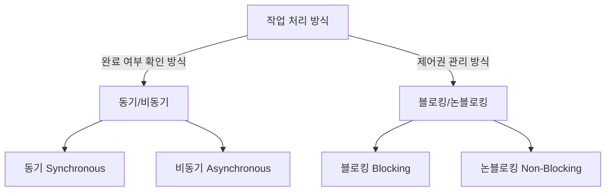

[[동기(Synchronous)]]와 [[블로킹(blocking)]]은 프로그래밍 모델에서 자주 혼동되는 개념입니다. 이 두 용어는 서로 관련되어 있지만 서로 다른 측면을 설명합니다. 이 문서에서는 두 개념의 명확한 차이점을 살펴보겠습니다.

## 개념적 차이

동기와 비동기는 작업의 **완료 여부를 어떻게 확인하는지**에 관한 개념인 반면, 블로킹과 논블로킹은 **호출한 함수가 제어권을 어떻게 다루는지**에 관한 개념입니다.



## 동기(Synchronous)의 정의

동기는 **작업의 완료 여부를 직접 확인하는 방식**입니다. 동기 방식에서는:

1. 호출자가 작업의 결과를 직접 받아 처리합니다.
2. 작업의 시작부터 종료까지의 과정이 순차적으로 진행됩니다.
3. 호출자는 작업이 완료될 때까지 계속 관심을 가지고 상태를 확인합니다.

## 블로킹(Blocking)의 정의

블로킹은 **호출된 함수가 제어권을 반환하지 않고, 자신의 작업이 완료될 때까지 대기하도록 만드는 방식**입니다. 블로킹 방식에서는:

1. 호출자는 다음 작업을 수행하기 위해 현재 작업의 완료를 기다려야 합니다.
2. 실행 중인 스레드는 다른 작업을 수행할 수 없고 대기 상태가 됩니다.
3. 시스템 자원이 유휴 상태로 놓이게 됩니다.

## 두 개념의 조합

이 두 개념은 독립적이지만 함께 사용되어 네 가지 조합을 만들 수 있습니다:

### 1. 동기 블로킹 (Synchronous Blocking)

가장 전통적인 I/O 모델입니다.

- 특징: 호출자는 작업 완료를 기다리는 동안 다른 일을 할 수 없습니다.
- 예시: Java의 기본 I/O 작업 (InputStream.read())

```java
// 동기 블로킹 예제
FileInputStream fis = new FileInputStream("file.txt");
byte[] data = new byte[1024];
int bytesRead = fis.read(data); // 이 줄에서 스레드가 블로킹됩니다
System.out.println("읽은 바이트: " + bytesRead);
```

### 2. 동기 논블로킹 (Synchronous Non-Blocking)

호출자가 작업 완료를 주기적으로 확인하지만, 그 사이에 다른 작업을 수행할 수 있습니다.

- 특징: 폴링(polling) 방식으로 완료 여부를 확인합니다.
- 예시: Java NIO의 셀렉터(Selector) 사용

```java
// 동기 논블로킹 예제 
Selector selector = Selector.open();
channel.configureBlocking(false);
channel.register(selector, SelectionKey.OP_READ);

while (true) {
    int readyChannels = selector.selectNow(); // 논블로킹 호출
    if (readyChannels == 0) {
        // 다른 작업 수행
        continue;
    }
    
    // 준비된 채널 처리
    Set<SelectionKey> selectedKeys = selector.selectedKeys();
    // ...
}
```

### 3. 비동기 블로킹 (Asynchronous Blocking)

잘 사용되지 않는 조합이지만, 작업을 비동기적으로 시작한 후 결과를 블로킹 방식으로 기다리는 경우입니다.

- 특징: 작업 시작은 비동기적으로 하지만, 결과를 얻기 위해 블로킹합니다.
- 예시: Future.get() 메서드 호출

```java
// 비동기 블로킹 예제
ExecutorService executor = Executors.newFixedThreadPool(10);
Future<String> future = executor.submit(() -> {
    // 시간이 오래 걸리는 작업
    return "결과";
});

// 다른 작업 수행 가능

String result = future.get(); // 이 줄에서 블로킹됩니다
System.out.println("결과: " + result);
```

### 4. 비동기 논블로킹 (Asynchronous Non-Blocking)

현대적인 고성능 애플리케이션에서 많이 사용되는 모델입니다.

- 특징: 콜백이나 이벤트 기반으로 작업 완료를 처리합니다.
- 예시: CompletableFuture, 리액티브 프로그래밍

```java
// 비동기 논블로킹 예제
CompletableFuture.supplyAsync(() -> {
    // 시간이 오래 걸리는 작업
    return "결과";
}).thenAccept(result -> {
    System.out.println("결과: " + result);
});

// 계속해서 다른 작업 수행
```

## 핵심 차이점 요약

|구분|동기 (Synchronous)|비동기 (Asynchronous)|
|---|---|---|
|**정의**|작업 완료 여부를 호출자가 직접 관리|작업 완료 여부를 시스템이나 콜백을 통해 알림|
|**처리 방식**|순차적으로 진행|병렬적으로 진행 가능|
|**결과 확인**|호출자가 직접 확인|콜백이나 이벤트를 통해 확인|

|구분|블로킹 (Blocking)|논블로킹 (Non-Blocking)|
|---|---|---|
|**정의**|제어권을 반환하지 않고 대기|즉시 제어권을 반환|
|**스레드 상태**|대기 상태로 전환|계속 활성 상태 유지|
|**자원 활용**|스레드 유휴 상태로 자원 낭비|스레드 활용도 높음|

## 실무적 적용

두 개념의 차이를 이해하는 것은 다음과 같은 상황에서 중요합니다:

1. **애플리케이션 설계**: 적절한 I/O 모델 선택을 통한 성능 최적화
2. **스레드 관리**: 효율적인 스레드 풀 구성 및 관리
3. **확장성 계획**: 대용량 트래픽 처리를 위한 아키텍처 설계

자세한 내용은 I/O 모델 선택 가이드를 참고해주세요.

## 결론

동기/비동기와 블로킹/논블로킹은 서로 다른 개념이지만 함께 사용되어 시스템의 동작 방식을 결정합니다. 동기는 작업의 완료 여부를 확인하는 방법에 관한 것이고, 블로킹은 작업 처리 중 제어권을 어떻게 관리하는지에 관한 것입니다.

현대 소프트웨어 개발에서는 높은 처리량과 효율적인 자원 활용을 위해 비동기 논블로킹 모델이 많이 사용되고 있지만, 각 상황에 맞는 적절한 모델을 선택하는 것이 중요합니다.

## 참고 자료

- Java Concurrency in Practice - Brian Goetz
- 리액티브 프로그래밍 - Kevin Webber
- 스프링 웹플럭스 공식 문서 - https://docs.spring.io/spring-framework/docs/current/reference/html/web-reactive.html