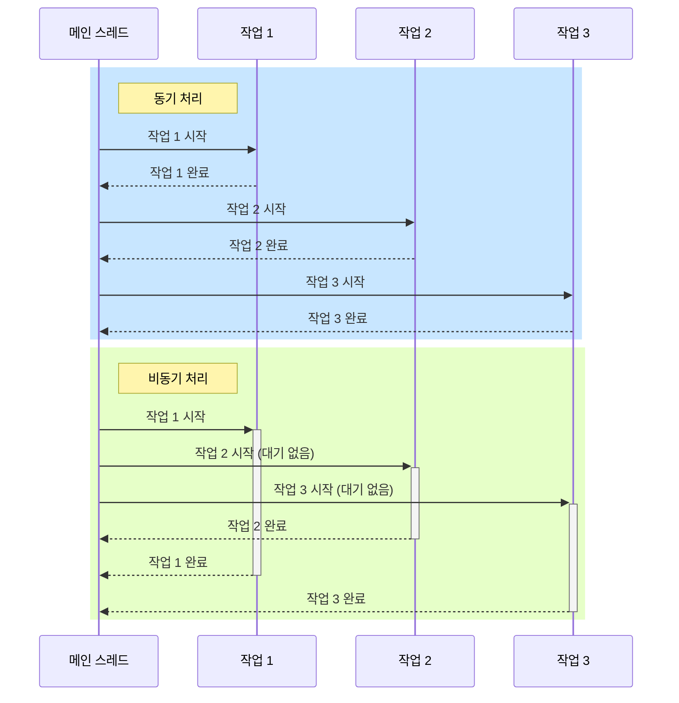

[[동기(Synchronous)]]와 [[비동기(Asynchronous)]]는 프로그래밍에서 작업을 처리하는 두 가지 기본적인 방식으로, 코드 실행 흐름과 제어 방식에 큰 차이가 있습니다. 이 두 방식을 이해하는 것은 효율적인 애플리케이션 설계와 구현에 매우 중요합니다. 이 문서에서는 동기와 비동기의 개념적 차이점, 구현 방식, 그리고 각각의 장단점에 대해 살펴보겠습니다.

## 기본 개념

### 동기 처리

동기 처리는 작업을 순차적으로 실행하는 방식입니다. 한 작업이 완료될 때까지 다음 작업은 시작되지 않으며, 프로그램의 실행 흐름이 [[블로킹(blocking)]]됩니다. 이는 마치 줄을 서서 순서대로 처리되는 방식과 유사합니다.

### 비동기 처리

비동기 처리는 작업의 완료를 기다리지 않고 다음 작업을 즉시 시작하는 방식입니다. 작업이 완료되면 콜백(callback), 프로미스(promise), 퓨처(future) 등의 메커니즘을 통해 결과를 처리합니다. 비동기 방식에서는 여러 작업이 동시에 진행될 수 있으며, 프로그램의 실행 흐름이 논블로킹(non-blocking)됩니다. 비동기 처리에 대한 자세한 내용은 [[비동기(Asynchronous)]] 문서를 참고해주세요.

## 작동 방식 비교

동기와 비동기의 작동 방식 차이를 시각화하면 다음과 같습니다:



이 다이어그램에서 볼 수 있듯이:

- 동기 처리에서는 작업이 순차적으로 진행됩니다.
- 비동기 처리에서는 여러 작업이 동시에 진행되며, 완료 순서가 시작 순서와 다를 수 있습니다.

## 코드 예제로 보는 차이

### Java에서의 동기 처리

```java
public class SynchronousExample {
    public static void main(String[] args) {
        System.out.println("작업 시작");
        
        // 동기 방식으로 파일 읽기
        String fileContent = readFile("data.txt");
        System.out.println("파일 내용: " + fileContent);
        
        // 동기 방식으로 네트워크 요청
        String response = sendHttpRequest("https://api.example.com/data");
        System.out.println("응답 데이터: " + response);
        
        System.out.println("모든 작업 완료");
    }
    
    private static String readFile(String fileName) {
        // 파일 읽기 작업 (시간이 걸리는 I/O 작업)
        System.out.println("파일 읽기 중...");
        try {
            Thread.sleep(2000); // 파일 읽기 시뮬레이션
        } catch (InterruptedException e) {
            e.printStackTrace();
        }
        return "파일 내용입니다.";
    }
    
    private static String sendHttpRequest(String url) {
        // HTTP 요청 작업 (시간이 걸리는 네트워크 작업)
        System.out.println("HTTP 요청 중...");
        try {
            Thread.sleep(3000); // 네트워크 요청 시뮬레이션
        } catch (InterruptedException e) {
            e.printStackTrace();
        }
        return "서버 응답 데이터";
    }
}
```

이 예제에서는 파일 읽기와 네트워크 요청이 순차적으로 실행되며, 각 작업이 완료될 때까지 프로그램이 다음 단계로 진행되지 않습니다.

### Java에서의 비동기 처리

```java
import java.util.concurrent.CompletableFuture;

public class AsynchronousExample {
    public static void main(String[] args) throws Exception {
        System.out.println("작업 시작");
        
        // 비동기 방식으로 파일 읽기
        CompletableFuture<String> fileReadFuture = CompletableFuture.supplyAsync(() -> {
            return readFile("data.txt");
        });
        
        // 비동기 방식으로 네트워크 요청 (파일 읽기를 기다리지 않음)
        CompletableFuture<String> httpRequestFuture = CompletableFuture.supplyAsync(() -> {
            return sendHttpRequest("https://api.example.com/data");
        });
        
        // 다른 작업 수행 가능
        System.out.println("백그라운드에서 I/O 작업이 진행 중입니다...");
        
        // 결과 처리 (필요할 때 결과 대기)
        String fileContent = fileReadFuture.get();
        System.out.println("파일 내용: " + fileContent);
        
        String response = httpRequestFuture.get();
        System.out.println("응답 데이터: " + response);
        
        System.out.println("모든 작업 완료");
    }
    
    private static String readFile(String fileName) {
        // 파일 읽기 작업 (시간이 걸리는 I/O 작업)
        System.out.println("파일 읽기 중...");
        try {
            Thread.sleep(2000); // 파일 읽기 시뮬레이션
        } catch (InterruptedException e) {
            e.printStackTrace();
        }
        return "파일 내용입니다.";
    }
    
    private static String sendHttpRequest(String url) {
        // HTTP 요청 작업 (시간이 걸리는 네트워크 작업)
        System.out.println("HTTP 요청 중...");
        try {
            Thread.sleep(3000); // 네트워크 요청 시뮬레이션
        } catch (InterruptedException e) {
            e.printStackTrace();
        }
        return "서버 응답 데이터";
    }
}
```

이 예제에서는 파일 읽기와 네트워크 요청이 동시에 시작되며, 메인 스레드는 블로킹되지 않고 다른 작업을 계속할 수 있습니다. 결과가 필요한 시점에서만 `get()` 메서드를 호출하여 결과를 기다립니다.

## 스프링 프레임워크에서의 구현 차이

### 동기 처리 (스프링 MVC)

```java
@RestController
@RequestMapping("/api")
public class SynchronousController {
    
    @Autowired
    private UserService userService;
    
    @GetMapping("/users/{id}")
    public ResponseEntity<User> getUser(@PathVariable Long id) {
        // 동기적으로 처리 (요청 스레드가 블로킹됨)
        User user = userService.findById(id);
        return ResponseEntity.ok(user);
    }
}

@Service
public class UserServiceImpl implements UserService {
    
    @Autowired
    private UserRepository userRepository;
    
    @Override
    public User findById(Long id) {
        // 동기적으로 데이터베이스에서 사용자 조회
        return userRepository.findById(id).orElse(null);
    }
}
```

### 비동기 처리 (스프링 WebFlux)

```java
@RestController
@RequestMapping("/api")
public class AsyncController {
    
    @Autowired
    private UserService userService;
    
    @GetMapping("/users/{id}")
    public Mono<ResponseEntity<User>> getUser(@PathVariable Long id) {
        // 비동기적으로 처리 (요청 스레드가 블로킹되지 않음)
        return userService.findById(id)
                .map(user -> ResponseEntity.ok(user))
                .defaultIfEmpty(ResponseEntity.notFound().build());
    }
}

@Service
public class ReactiveUserServiceImpl implements ReactiveUserService {
    
    @Autowired
    private ReactiveUserRepository userRepository;
    
    @Override
    public Mono<User> findById(Long id) {
        // 비동기적으로 데이터베이스에서 사용자 조회
        return userRepository.findById(id);
    }
}
```

## 주요 차이점 요약

### 1. 제어 흐름

- **동기**: 작업이 순차적으로 실행되며, 현재 작업이 완료될 때까지 다음 작업은 대기합니다.
- **비동기**: 작업이 병렬적으로 실행될 수 있으며, 작업의 완료를 기다리지 않고 다음 작업으로 진행합니다.

### 2. 블로킹 vs 논블로킹

- **동기**: 일반적으로 블로킹 방식으로, 작업이 완료될 때까지 스레드가 대기합니다.
- **비동기**: 일반적으로 논블로킹 방식으로, 작업 요청 후 스레드가 즉시 다른 작업을 수행할 수 있습니다.

### 3. 결과 처리

- **동기**: 작업이 완료되면 즉시 결과를 반환합니다.
- **비동기**: 작업 완료 시 콜백, 프로미스, 퓨처 등을 통해 결과를 처리합니다.

### 4. 에러 처리

- **동기**: try-catch 블록을 사용하여 직접적으로 예외를 처리합니다.
- **비동기**: 에러 처리 콜백이나 체인의 catch 메서드 등을 통해 예외를 처리합니다.

### 5. 복잡성

- **동기**: 코드 흐름이 직관적이고 단순합니다.
- **비동기**: 콜백, 이벤트 등으로 인해 코드 흐름이 더 복잡할 수 있습니다.

## 장단점 비교

### 동기 처리의 장단점

#### 장점

1. **단순성**: 코드가 순차적으로 실행되어 이해하고 디버깅하기 쉽습니다.
2. **예측 가능성**: 실행 순서가 명확하게 정의됩니다.
3. **에러 처리**: 예외가 발생하면 즉시 감지하고 처리할 수 있습니다.
4. **데이터 일관성**: 작업 간의 의존성을 쉽게 관리할 수 있습니다.

#### 단점

1. **성능 제한**: 한 번에 하나의 작업만 처리하므로 전체 처리 시간이 길어질 수 있습니다.
2. **자원 낭비**: I/O 작업이나 네트워크 대기 시간 동안 CPU가 유휴 상태로 남습니다.
3. **확장성 한계**: 동시 요청이 많은 환경에서 성능 저하가 발생할 수 있습니다.
4. **사용자 경험 저하**: UI 스레드가 블로킹되면 응용 프로그램이 응답하지 않는 것처럼 보일 수 있습니다.

### 비동기 처리의 장단점

#### 장점

1. **높은 처리량**: 여러 작업을 동시에 처리할 수 있어 전체 처리 시간이 단축됩니다.
2. **자원 효율성**: I/O 대기 시간 동안 다른 작업을 처리할 수 있습니다.
3. **응답성**: 사용자 인터페이스가 블로킹되지 않아 더 나은 사용자 경험을 제공합니다.
4. **확장성**: 동시 요청이 많은 환경에서도 효율적으로 처리할 수 있습니다.

#### 단점

1. **복잡성**: 콜백, 프로미스 등으로 인해 코드 구조가 복잡해질 수 있습니다.
2. **디버깅 어려움**: 실행 흐름이 분산되어 버그를 추적하기 어려울 수 있습니다.
3. **에러 처리 복잡성**: 비동기 작업의 예외 처리가 더 복잡합니다.
4. **콜백 지옥(Callback Hell)**: 중첩된 콜백으로 인해 코드 가독성이 저하될 수 있습니다.

## 적합한 사용 사례

### 동기 처리에 적합한 사례

1. **단순한 CRUD 작업**: 데이터베이스의 기본적인 읽기/쓰기 작업
2. **트랜잭션 처리**: 원자성이 중요한 작업
3. **순차적 의존성이 있는 작업**: 이전 단계의 결과가 다음 단계의 입력으로 필요한 경우
4. **배치 처리**: 대량의 데이터를 순차적으로 처리하는 경우
5. **간단한 계산 작업**: 메모리 내에서 빠르게 수행되는 작업

### 비동기 처리에 적합한 사례

1. **I/O 바운드 작업**: 파일 읽기/쓰기, 네트워크 요청 등
2. **사용자 인터페이스**: 응답성이 중요한 UI 관련 작업
3. **장시간 실행 작업**: 시간이 오래 걸리는 작업
4. **독립적인 작업**: 서로 의존성이 없는 여러 작업을 병렬로 처리
5. **실시간 애플리케이션**: 채팅, 알림 시스템 등
6. **마이크로서비스 간 통신**: 서비스 간 비동기 메시징

## 동기와 비동기의 결합

현대적인 애플리케이션에서는 동기와 비동기 방식을 상황에 맞게 적절히 조합하여 사용하는 것이 일반적입니다. 다음은 두 방식을 효과적으로 결합한 예제입니다:

```java
@Service
public class OrderService {
    
    @Autowired
    private PaymentGateway paymentGateway;
    
    @Autowired
    private NotificationService notificationService;
    
    @Autowired
    private InventoryService inventoryService;
    
    @Transactional
    public OrderResult processOrder(Order order) {
        // 1. 동기적으로 재고 확인 (즉시 결과 필요)
        boolean isInStock = inventoryService.checkStock(order.getItems());
        if (!isInStock) {
            return OrderResult.outOfStock();
        }
        
        // 2. 동기적으로 결제 처리 (트랜잭션 내에서 완료되어야 함)
        PaymentResult payment = paymentGateway.processPayment(order.getPaymentDetails());
        if (!payment.isSuccessful()) {
            return OrderResult.paymentFailed(payment.getErrorMessage());
        }
        
        // 3. 동기적으로 재고 업데이트 (트랜잭션의 일부)
        inventoryService.updateStock(order.getItems());
        
        // 4. 비동기적으로 주문 확인 이메일 발송 (즉시 완료될 필요 없음)
        CompletableFuture.runAsync(() -> {
            notificationService.sendOrderConfirmation(order);
        });
        
        // 5. 비동기적으로 배송 프로세스 시작 (백그라운드에서 처리)
        CompletableFuture.runAsync(() -> {
            notificationService.notifyShippingDepartment(order);
        });
        
        return OrderResult.success(order.getId());
    }
}
```

이 예제에서는:

- 재고 확인, 결제 처리, 재고 업데이트는 트랜잭션 일관성이 필요하므로 동기적으로 처리합니다.
- 주문 확인 이메일 발송과 배송 프로세스 시작은 주문 완료 후 백그라운드에서 비동기적으로 처리합니다.

## 동기식/비동기식 설계 결정 가이드

애플리케이션 설계 시 동기와 비동기 중 선택할 때 고려할 사항:

1. **응답 시간**: 사용자에게 즉각적인 응답이 필요한가?
2. **처리량**: 시스템이 얼마나 많은 요청을 동시에 처리해야 하는가?
3. **자원 제약**: 시스템의 하드웨어 리소스(CPU, 메모리)는 어느 정도인가?
4. **데이터 일관성**: 작업 간에 강한 데이터 일관성이 필요한가?
5. **복잡성 관리**: 개발 팀이 비동기 패턴을 효과적으로 다룰 수 있는가?
6. **에러 처리**: 작업 실패 시 어떻게 대응해야 하는가?
7. **확장성 요구사항**: 시스템이 어느 정도까지 확장되어야 하는가?

## 결론

동기와 비동기는 각각 고유한 장단점을 가진 서로 다른 프로그래밍 패러다임입니다. 동기 방식은 코드의 단순성과 예측 가능성이 중요한 경우에 적합하며, 비동기 방식은 높은 처리량과 응답성이 필요한 경우에 유용합니다.

실제 애플리케이션에서는 두 방식을 적절히 조합하여 사용하는 것이 일반적입니다. 각 작업의 특성, 시스템 요구사항, 사용자 경험 등을 고려하여 가장 적합한 접근 방식을 선택하는 것이 중요합니다.

동기와 비동기의 차이를 이해하고 각 방식의 장단점을 파악하면, 보다 효율적이고 확장 가능한 시스템을 설계하고 구현할 수 있습니다.

## 참고 자료

- Java Concurrency in Practice - Brian Goetz
- Clean Code - Robert C. Martin
- Spring in Action - Craig Walls
- Effective Java, 3rd Edition - Joshua Bloch
- 스프링 공식 문서(https://docs.spring.io/spring-framework/docs/current/reference/html/)
- Modern Java in Action - Raoul-Gabriel Urma, Mario Fusco, Alan Mycroft