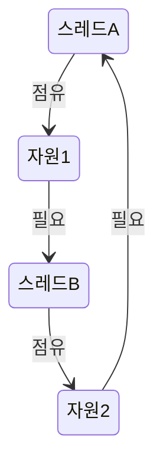

동시성(Concurrency)은 현대 소프트웨어 개발에서 필수적인 개념으로, 여러 작업을 논리적으로 동시에 실행하여 효율성과 성능을 높이는 프로그래밍 패러다임입니다. 특히 멀티코어 프로세서가 보편화되고 대용량 데이터 처리가 일상화된 오늘날의 개발 환경에서, 동시성을 올바르게 이해하고 활용하는 것은 뛰어난 성능의 애플리케이션을 개발하는 데 있어 핵심적인 요소가 되었습니다.

## 동시성과 병렬성의 차이

동시성(Concurrency)과 병렬성(Parallelism)은 자주 혼동되는 개념이지만, 명확한 차이가 있습니다.

- **동시성(Concurrency)**: 여러 작업을 논리적으로 동시에 진행하는 것을 의미합니다. 실제로는 시분할(time-slicing) 방식으로 CPU가 빠르게 작업 간 전환하며 진행하기 때문에, 물리적으로 동시에 실행되지 않더라도 사용자 입장에서는 동시에 실행되는 것처럼 보입니다.
    
- **병렬성(Parallelism)**: 여러 작업을 물리적으로 동시에 실행하는 것을 의미합니다. 이는 멀티코어 프로세서나 분산 컴퓨팅 환경에서 실제로 여러 작업이 동시에 처리됩니다.
    

간단히 말해, 동시성은 "동시에 여러 일을 다루는 것"이고, 병렬성은 "동시에 여러 일을 처리하는 것"입니다. 동시성이 작업 관리의 구조에 초점을 맞춘다면, 병렬성은 실제 실행 메커니즘에 초점을 맞춥니다.

자세한 개념적 차이는 [[동시성과 병렬성의 차이]]를 참고해주세요.

## 동시성 프로그래밍이 필요한 이유

동시성 프로그래밍은 다음과 같은 이유로 중요합니다:

1. **성능 향상**: 멀티코어 프로세서를 효율적으로 활용하여 애플리케이션의 처리량을 증가시킬 수 있습니다.
    
2. **응답성 개선**: 사용자 인터페이스 응답성을 유지하면서 백그라운드에서 시간이 오래 걸리는 작업을 수행할 수 있습니다.
    
3. **[[CPU 바운드 vs IO 바운드 작업|자원 활용 최적화]]**: CPU가 I/O 작업으로 인해 대기하는 시간을 다른 작업 처리에 활용할 수 있습니다.
    
4. **대용량 데이터 처리**: 대규모 데이터 셋을 여러 작업으로 분할하여 동시에 처리함으로써 전체 처리 시간을 단축할 수 있습니다.
    
5. **실시간 시스템 구현**: 동시에 여러 이벤트를 처리해야 하는 실시간 시스템(채팅 서버, 게임 서버 등)을 효과적으로 구현할 수 있습니다.
    

## 동시성의 기본 요소

### 스레드(Thread)

스레드는 프로세스 내에서 실행되는 작업의 가장 작은 단위입니다. 하나의 프로세스는 여러 개의 스레드를 가질 수 있으며, 각 스레드는 동일한 프로세스 내의 자원을 공유하면서 독립적으로 실행됩니다.

스레드에 대한 자세한 내용은 [[스레드(Thread)]]를 참고해주세요.

### 프로세스(Process)

[[프로세스(Process)]]는 실행 중인 프로그램의 인스턴스로, 독립된 메모리 공간과 자원을 할당받습니다. 각 프로세스는 최소 하나 이상의 스레드를 포함합니다.

프로세스와 스레드의 차이에 대한 자세한 내용은 [[프로세스와 스레드의 차이]]를 참고해주세요.

### 동시성 제어 메커니즘

동시성 프로그래밍에서는 여러 스레드가 공유 자원에 안전하게 접근할 수 있도록 하는 다양한 메커니즘이 있습니다:

1. **락(Lock)**: 공유 자원에 대한 배타적 접근을 보장합니다.
2. **세마포어(Semaphore)**: 한정된 수의 스레드만 공유 자원에 접근할 수 있도록 제어합니다.
3. **모니터(Monitor)**: 객체에 대한 상호 배제적 접근을 제공합니다.
4. **원자적 연산(Atomic Operations)**: 중단 없이 완전히 실행되는 연산을 제공합니다.

이러한 메커니즘에 대한 자세한 내용은 [[동시성 제어 메커니즘]]을 참고해주세요.

## 동시성 프로그래밍의 문제점

동시성 프로그래밍은 강력하지만, 다음과 같은 여러 문제를 야기할 수 있습니다:

### 경쟁 상태(Race Condition)

경쟁 상태는 두 개 이상의 스레드가 공유 자원에 동시에 접근하여 예측할 수 없는 결과를 초래하는 상황을 말합니다. 이는 실행 순서에 따라 결과가 달라질 수 있어 디버깅하기 매우 어려운 문제를 일으킵니다.

```java
public class Counter {
    private int count = 0;
    
    // 동기화 없이 count를 증가시키는 메서드
    public void increment() {
        count++; // 이 연산은 원자적이지 않습니다!
    }
    
    public int getCount() {
        return count;
    }
}
```

위 코드에서 `count++` 연산은 실제로 읽기, 증가, 쓰기의 세 단계로 이루어져 있어 여러 스레드가 동시에 실행하면 경쟁 상태가 발생할 수 있습니다.

자세한 내용은 [[경쟁 상태(Race Condition)]]를 참고해주세요.

### 교착 상태(Deadlock)

교착 상태는 두 개 이상의 스레드가 서로 상대방이 보유한 자원을 기다리며 무한정 대기하는 상황을 말합니다. 이로 인해 프로그램이 더 이상 진행되지 않을 수 있습니다.



위 다이어그램에서 스레드 A는 자원 1을 점유하고 자원 2를 기다리는 반면, 스레드 B는 자원 2를 점유하고 자원 1을 기다리고 있어 교착 상태가 발생합니다.

자세한 내용은 [[교착 상태(Deadlock)]]를 참고해주세요.

### 기아 상태(Starvation)

기아 상태는 특정 스레드가 필요한 자원을 계속해서 할당받지 못하는 상황을 말합니다. 우선순위가 낮은 스레드가 높은 우선순위의 스레드들에 의해 자원을 할당받지 못하는 경우에 발생할 수 있습니다.

자세한 내용은 [[기아 상태(Starvation)]]를 참고해주세요.

### 라이브락(Livelock)

라이브락은 스레드가 실행은 되지만 실제로 작업을 진행하지 못하는 상태를 말합니다. 두 스레드가 서로의 상태 변화에 반응하며 계속해서 상태를 변경하지만, 실제로는 진전이 없는 상황입니다.

자세한 내용은 [[라이브락(Livelock)]]을 참고해주세요.

## Java에서의 동시성 구현

Java는 동시성 프로그래밍을 위한 풍부한 API를 제공합니다. 기본적인 스레드 구현부터 고수준의 동시성 유틸리티까지 다양한 도구를 제공합니다.

### 기본 스레드 구현

Java에서 스레드를 구현하는 방법은 크게 두 가지가 있습니다:

1. **Thread 클래스 상속**

```java
public class MyThread extends Thread {
    @Override
    public void run() {
        System.out.println("스레드 실행 중: " + Thread.currentThread().getName());
    }
    
    public static void main(String[] args) {
        MyThread thread = new MyThread();
        thread.start(); // 스레드 시작
    }
}
```

2. **Runnable 인터페이스 구현 (권장)**

```java
public class MyRunnable implements Runnable {
    @Override
    public void run() {
        System.out.println("스레드 실행 중: " + Thread.currentThread().getName());
    }
    
    public static void main(String[] args) {
        Thread thread = new Thread(new MyRunnable());
        thread.start(); // 스레드 시작
    }
}
```

Runnable 인터페이스를 구현하는 방식이 더 권장되는 이유는 Java가 단일 상속만 지원하기 때문에, Thread 클래스를 상속받으면 다른 클래스를 상속받을 수 없는 제약이 생기기 때문입니다.

### java.util.concurrent 패키지

Java 5부터 도입된 `java.util.concurrent` 패키지는 동시성 프로그래밍을 위한 다양한 고수준 API를 제공합니다.

1. **ExecutorService와 스레드 풀**

스레드를 직접 생성하고 관리하는 대신, 스레드 풀을 사용하여 효율적으로 관리할 수 있습니다.

```java
import java.util.concurrent.ExecutorService;
import java.util.concurrent.Executors;

public class ThreadPoolExample {
    public static void main(String[] args) {
        // 고정 크기 스레드 풀 생성
        ExecutorService executor = Executors.newFixedThreadPool(5);
        
        // 작업 제출
        for (int i = 0; i < 10; i++) {
            final int taskId = i;
            executor.submit(() -> {
                System.out.println("작업 " + taskId + " 실행 중, 스레드: " + 
                                   Thread.currentThread().getName());
            });
        }
        
        // 스레드 풀 종료
        executor.shutdown();
    }
}
```

2. **Future와 Callable**

`Future`는 비동기 작업의 결과를 나타내는 인터페이스이며, `Callable`은 값을 반환하는 작업을 정의하는 인터페이스입니다.

```java
import java.util.concurrent.*;

public class FutureExample {
    public static void main(String[] args) throws Exception {
        ExecutorService executor = Executors.newSingleThreadExecutor();
        
        // Callable 작업 제출
        Future<Integer> future = executor.submit(() -> {
            // 시간이 오래 걸리는 계산
            Thread.sleep(2000);
            return 42;
        });
        
        // 결과가 준비될 때까지 다른 작업 수행 가능
        System.out.println("결과를 기다리는 중...");
        
        // 결과 가져오기 (블로킹 호출)
        Integer result = future.get();
        System.out.println("결과: " + result);
        
        executor.shutdown();
    }
}
```

3. **CompletableFuture**

Java 8에서 도입된 `CompletableFuture`는 비동기 작업의 조합과 처리를 위한 풍부한 API를 제공합니다.

```java
import java.util.concurrent.CompletableFuture;

public class CompletableFutureExample {
    public static void main(String[] args) {
        CompletableFuture<String> future = CompletableFuture.supplyAsync(() -> {
            // 비동기 작업
            return "Hello";
        }).thenApply(s -> {
            // 결과 변환
            return s + " World";
        }).thenAccept(result -> {
            // 결과 소비
            System.out.println(result);
        });
        
        // 모든 작업이 완료될 때까지 대기
        future.join();
    }
}
```

자세한 내용은 [[Java 동시성 API]]를 참고해주세요.

## 동시성 문제 해결 방법

### 동기화(Synchronization)

Java에서는 다양한 동기화 메커니즘을 제공합니다:

1. **synchronized 키워드**

```java
public class SynchronizedCounter {
    private int count = 0;
    
    // synchronized 메서드
    public synchronized void increment() {
        count++;
    }
    
    // synchronized 블록
    public void incrementWithBlock() {
        synchronized(this) {
            count++;
        }
    }
    
    public synchronized int getCount() {
        return count;
    }
}
```

2. **Lock 인터페이스**

`java.util.concurrent.locks` 패키지의 Lock 인터페이스는 synchronized보다 더 유연한 잠금 메커니즘을 제공합니다.

```java
import java.util.concurrent.locks.Lock;
import java.util.concurrent.locks.ReentrantLock;

public class LockCounter {
    private int count = 0;
    private final Lock lock = new ReentrantLock();
    
    public void increment() {
        lock.lock();
        try {
            count++;
        } finally {
            lock.unlock(); // 반드시 unlock 호출
        }
    }
    
    public int getCount() {
        lock.lock();
        try {
            return count;
        } finally {
            lock.unlock();
        }
    }
}
```

동기화에 대한 자세한 내용은 [[Java 동기화 메커니즘]]을 참고해주세요.

### 원자적 변수(Atomic Variables)

`java.util.concurrent.atomic` 패키지는 원자적 연산을 지원하는 클래스들을 제공합니다.

```java
import java.util.concurrent.atomic.AtomicInteger;

public class AtomicCounter {
    private AtomicInteger count = new AtomicInteger(0);
    
    public void increment() {
        count.incrementAndGet(); // 원자적 증가 연산
    }
    
    public int getCount() {
        return count.get();
    }
}
```

원자적 변수에 대한 자세한 내용은 [[원자적 변수(Atomic Variables)]]를 참고해주세요.

### 불변 객체(Immutable Objects)

불변 객체는 생성된 후에 상태가 변경되지 않는 객체로, 스레드 안전성을 보장하는 가장 간단한 방법 중 하나입니다.

```java
public final class ImmutablePoint {
    private final int x;
    private final int y;
    
    public ImmutablePoint(int x, int y) {
        this.x = x;
        this.y = y;
    }
    
    public int getX() {
        return x;
    }
    
    public int getY() {
        return y;
    }
    
    // 새로운 객체를 반환하는 메서드
    public ImmutablePoint translate(int dx, int dy) {
        return new ImmutablePoint(x + dx, y + dy);
    }
}
```

불변 객체에 대한 자세한 내용은 [[불변 객체(Immutable Objects)]]를 참고해주세요.

### 스레드 로컬 변수(ThreadLocal)

`ThreadLocal`은 각 스레드가 독립적인 변수 복사본을 가질 수 있도록 합니다.

```java
public class ThreadLocalExample {
    // 각 스레드마다 고유한 ID를 가지는 ThreadLocal 변수
    private static final ThreadLocal<Integer> threadId = new ThreadLocal<Integer>() {
        @Override
        protected Integer initialValue() {
            return 0;
        }
    };
    
    public static void main(String[] args) {
        for (int i = 0; i < 3; i++) {
            final int id = i;
            new Thread(() -> {
                threadId.set(id);
                System.out.println("스레드 " + Thread.currentThread().getName() + 
                                   "의 ID: " + threadId.get());
            }).start();
        }
    }
}
```

스레드 로컬 변수에 대한 자세한 내용은 [[ThreadLocal 변수]]를 참고해주세요.

## 스프링 프레임워크에서의 동시성

스프링 프레임워크는 동시성 프로그래밍을 위한 다양한 기능을 제공합니다.

### @Async 어노테이션

메서드에 `@Async` 어노테이션을 사용하면 별도의 스레드에서 비동기적으로 실행됩니다.

```java
import org.springframework.scheduling.annotation.Async;
import org.springframework.stereotype.Service;
import java.util.concurrent.CompletableFuture;

@Service
public class EmailService {
    
    @Async
    public CompletableFuture<Boolean> sendEmail(String to, String subject) {
        // 이메일 전송 로직 (시간이 오래 걸리는 작업)
        System.out.println("이메일 전송 중... Thread: " + 
                          Thread.currentThread().getName());
        // 이메일 전송 로직 실행
        return CompletableFuture.completedFuture(true);
    }
}
```

`@Async`를 사용하기 위해서는 설정 클래스에 `@EnableAsync` 어노테이션을 추가해야 합니다:

```java
import org.springframework.context.annotation.Bean;
import org.springframework.context.annotation.Configuration;
import org.springframework.scheduling.annotation.EnableAsync;
import org.springframework.scheduling.concurrent.ThreadPoolTaskExecutor;
import java.util.concurrent.Executor;

@Configuration
@EnableAsync
public class AsyncConfig {
    
    @Bean
    public Executor taskExecutor() {
        ThreadPoolTaskExecutor executor = new ThreadPoolTaskExecutor();
        executor.setCorePoolSize(5);
        executor.setMaxPoolSize(10);
        executor.setQueueCapacity(25);
        executor.setThreadNamePrefix("Async-");
        executor.initialize();
        return executor;
    }
}
```

스프링의 비동기 처리에 대한 자세한 내용은 [[스프링 비동기 처리]]를 참고해주세요.

### TaskScheduler

스프링은 주기적인 작업 실행을 위한 `TaskScheduler` 인터페이스를 제공합니다.

```java
import org.springframework.scheduling.annotation.EnableScheduling;
import org.springframework.scheduling.annotation.Scheduled;
import org.springframework.stereotype.Component;

@Component
@EnableScheduling
public class ScheduledTasks {
    
    @Scheduled(fixedRate = 5000) // 5초마다 실행
    public void reportCurrentTime() {
        System.out.println("현재 시간: " + new java.util.Date());
    }
    
    @Scheduled(cron = "0 0 12 * * ?") // 매일 정오에 실행
    public void dailyReport() {
        System.out.println("일일 보고서 생성 시작");
        // 보고서 생성 로직
    }
}
```

스프링의 작업 스케줄링에 대한 자세한 내용은 [[스프링 작업 스케줄링]]을 참고해주세요.

## 동시성 디자인 패턴

### 생산자-소비자 패턴(Producer-Consumer Pattern)

생산자-소비자 패턴은 작업을 생성하는 생산자 스레드와 작업을 처리하는 소비자 스레드로 나누어 처리하는 패턴입니다.

```java
import java.util.concurrent.BlockingQueue;
import java.util.concurrent.LinkedBlockingQueue;

public class ProducerConsumerExample {
    
    public static void main(String[] args) {
        // 공유 버퍼로 사용할 BlockingQueue
        BlockingQueue<Integer> queue = new LinkedBlockingQueue<>(10);
        
        // 생산자 스레드
        Thread producer = new Thread(() -> {
            try {
                for (int i = 0; i < 20; i++) {
                    queue.put(i); // 큐가 가득 차면 대기
                    System.out.println("생산: " + i);
                    Thread.sleep(100);
                }
            } catch (InterruptedException e) {
                Thread.currentThread().interrupt();
            }
        });
        
        // 소비자 스레드
        Thread consumer = new Thread(() -> {
            try {
                while (true) {
                    Integer value = queue.take(); // 큐가 비어있으면 대기
                    System.out.println("소비: " + value);
                    Thread.sleep(200);
                }
            } catch (InterruptedException e) {
                Thread.currentThread().interrupt();
            }
        });
        
        producer.start();
        consumer.start();
    }
}
```

### 읽기-쓰기 락 패턴(Read-Write Lock Pattern)

읽기-쓰기 락 패턴은 여러 스레드가 동시에 읽기 작업을 수행할 수 있지만, 쓰기 작업은 독점적으로 수행하도록 하는 패턴입니다.

```java
import java.util.concurrent.locks.ReadWriteLock;
import java.util.concurrent.locks.ReentrantReadWriteLock;

public class ReadWriteLockExample {
    private final ReadWriteLock lock = new ReentrantReadWriteLock();
    private String data = "Initial Data";
    
    public String read() {
        lock.readLock().lock();
        try {
            System.out.println("읽기 작업: " + Thread.currentThread().getName());
            return data;
        } finally {
            lock.readLock().unlock();
        }
    }
    
    public void write(String newData) {
        lock.writeLock().lock();
        try {
            System.out.println("쓰기 작업: " + Thread.currentThread().getName());
            this.data = newData;
        } finally {
            lock.writeLock().unlock();
        }
    }
}
```

동시성 디자인 패턴에 대한 자세한 내용은 [[동시성 디자인 패턴]]을 참고해주세요.

## 동시성 프로그래밍의 모범 사례

### 1. 불변성 활용하기

가능한 한 불변 객체를 사용하여 동시성 문제를 방지합니다.

### 2. 공유 상태 최소화하기

스레드 간에 공유되는 상태를 최소화하여 동시성 문제의 가능성을 줄입니다.

### 3. 고수준 동시성 유틸리티 사용하기

직접 스레드를 생성하고 관리하는 것보다 `ExecutorService`, `CompletableFuture` 등의 고수준 API를 사용합니다.

### 4. 락의 범위 최소화하기

락을 획득하는 코드 블록의 범위를 최소화하여 성능 저하를 방지합니다.

### 5. 데드락 방지하기

락을 획득하는 순서를 일관되게 유지하여 데드락을 방지합니다.

### 6. 스레드 안전성 문서화하기

API 문서에 스레드 안전성 정보를 명확히 기술합니다.

동시성 프로그래밍의 모범 사례에 대한 자세한 내용은 [[동시성 프로그래밍 모범 사례]]를 참고해주세요.

## 동시성 프로그래밍의 성능 측정 및 튜닝

### 성능 측정

동시성 프로그래밍의 성능을 측정하기 위한 도구와 방법:

1. **JMH(Java Microbenchmark Harness)**: 자바 코드의 미세 벤치마킹을 위한 도구
2. **VisualVM**: 자바 애플리케이션의 성능 프로파일링 도구
3. **Java Mission Control**: 자바 애플리케이션의 모니터링 및 프로파일링 도구

### 성능 튜닝 방법

1. **스레드 풀 크기 최적화**: 적절한 스레드 풀 크기를 결정하는 방법
2. **작업 분할 전략**: 작업을 효율적으로 분할하는 방법
3. **캐시 라인 패딩**: 거짓 공유(false sharing)를 방지하는 방법

성능 측정 및 튜닝에 대한 자세한 내용은 [[동시성 성능 측정 및 튜닝]]을 참고해주세요.

## 결론

동시성 프로그래밍은 현대 소프트웨어 개발에서 불가피한 요소이며, 올바르게 사용하면 애플리케이션의 성능과 응답성을 크게 향상시킬 수 있습니다. 그러나 경쟁 상태, 교착 상태 등의 문제를 야기할 수 있으므로, 동시성 제어 메커니즘을 이해하고 적절하게 적용하는 것이 중요합니다.

Java와 스프링 프레임워크는 동시성 프로그래밍을 위한 풍부한 API를 제공하여 개발자가 더 쉽고 안전하게 동시성 프로그램을 작성할 수 있도록 지원합니다.

동시성 프로그래밍에서는 코드의 정확성과 안전성이 최우선이며, 그 다음으로 성능을 고려해야 합니다. 잘못된 동시성 구현은 간헐적이고 재현하기 어려운 버그를 발생시켜 디버깅이 매우 어려울 수 있습니다.

동시성 프로그래밍은  [[CompletableFuture]], [[ReactiveX]], [[Project Loom]] 등의 새로운 기술을 통해 계속해서 발전하고 있습니다.