[[동시성(Concurrency)]]과 병렬성(Parallelism)은 현대 소프트웨어 개발에서 중요한 개념이지만, 종종 혼동되어 사용됩니다. 이 두 개념은 여러 작업을 동시에 처리하는 방식에 관한 것이지만, 실제 구현 방식과 목적에서 중요한 차이가 있습니다.

## 동시성(Concurrency)

동시성은 여러 작업을 논리적으로 동시에 실행하는 것처럼 보이게 하는 개념입니다. 실제로는 한 시점에 하나의 작업만 처리하지만, 빠르게 작업 간 전환(context switching)을 수행하여 마치 동시에 실행되는 것처럼 보이게 합니다.

### 동시성의 주요 특징

1. **시분할(Time-slicing)**: CPU가 짧은 시간 동안 여러 작업을 번갈아가며 실행합니다.
2. **작업 전환(Task switching)**: 작업 간 전환을 통해 여러 작업이 진행 중인 상태를 유지합니다.
3. **단일 코어에서도 구현 가능**: 물리적인 병렬 처리 능력이 없어도 논리적인 동시성 구현이 가능합니다.
4. **목적**: 주로 응답성 향상과 자원의 효율적 사용을 위해 활용됩니다.

```mermaid
gantt
    title 동시성 실행 모델
    dateFormat  s
    axisFormat %S
    section CPU 코어
    작업 A    :a1, 0, 1s
    작업 B    :b1, after a1, 1s
    작업 A    :a2, after b1, 1s
    작업 B    :b2, after a2, 1s
    작업 A    :a3, after b2, 1s
```



## 병렬성(Parallelism)

병렬성은 여러 작업을 물리적으로 동시에 실행하는 개념입니다. 이를 위해서는 다중 코어 프로세서나 분산 시스템과 같이 실제로 여러 연산을 동시에 수행할 수 있는 하드웨어가 필요합니다.

### 병렬성의 주요 특징

1. **동시 실행**: 여러 작업이 정확히 같은 시점에 물리적으로 실행됩니다.
2. **하드웨어 의존성**: 다중 처리 장치(멀티코어, 멀티프로세서)가 반드시 필요합니다.
3. **작업 분할**: 하나의 큰 작업을 여러 개의 작은 작업으로 분할하여 각각 독립적으로 처리합니다.
4. **목적**: 주로 처리 속도 향상과 성능 개선을 위해 활용됩니다.

```mermaid
gantt
    title 병렬성 실행 모델
    dateFormat s
    axisFormat %S
    section 코어 1
    작업 A    :a1, 0, 3s
    section 코어 2
    작업 B    :b1, 0, 3s
```



## 동시성과 병렬성의 주요 차이점

|특성|동시성(Concurrency)|병렬성(Parallelism)|
|---|---|---|
|정의|여러 작업을 번갈아가며 실행|여러 작업을 실제로 동시에 실행|
|목적|응답성 향상, 자원 효율성|처리 속도 향상, 성능 개선|
|작업 처리 방식|작업 간 전환(인터리빙)|작업 동시 처리|
|하드웨어 요구사항|단일 코어에서도 가능|다중 코어나 프로세서 필요|
|구현 복잡성|동기화, [[경쟁 상태(Race Condition)]] 등 고려 필요|작업 분배, 부하 균형 등 고려 필요|

## Java에서의 구현 예시

### 동시성 구현 예시

Java에서는 Thread나 ExecutorService를 사용하여 동시성을 구현할 수 있습니다.

```java
public class ConcurrencyExample {
    public static void main(String[] args) {
        ExecutorService executor = Executors.newSingleThreadExecutor();
        
        executor.submit(() -> {
            System.out.println("작업 1 실행 중...");
            try {
                Thread.sleep(100);
            } catch (InterruptedException e) {
                Thread.currentThread().interrupt();
            }
        });
        
        executor.submit(() -> {
            System.out.println("작업 2 실행 중...");
        });
        
        executor.shutdown();
    }
}
```

위 예제에서는 단일 스레드 실행기(SingleThreadExecutor)를 사용하여 두 작업을 번갈아가며 실행합니다.

### 병렬성 구현 예시

Java에서는 ForkJoinPool이나 멀티스레드 ExecutorService를 사용하여 병렬성을 구현할 수 있습니다.

```java
public class ParallelismExample {
    public static void main(String[] args) {
        // 병렬 스트림을 사용한 병렬 처리
        List<Integer> numbers = Arrays.asList(1, 2, 3, 4, 5, 6, 7, 8, 9, 10);
        
        // 병렬 스트림으로 처리
        long sum = numbers.parallelStream()
                          .mapToInt(i -> {
                              System.out.println("스레드: " + Thread.currentThread().getName() + ", 값: " + i);
                              return i * 2;
                          })
                          .sum();
        
        System.out.println("결과: " + sum);
    }
}
```

위 예제에서는 parallel 스트림을 사용하여 컬렉션의 요소들을 여러 코어에서 동시에 처리합니다.

## 실제 활용 사례

### 동시성 활용 사례

1. **웹 서버**: 다수의 클라이언트 요청을 동시에 처리합니다.
2. **GUI 애플리케이션**: 사용자 인터페이스의 응답성을 유지하면서 백그라운드 작업을 수행합니다.
3. **비동기 I/O**: 입출력 작업 중에도 다른 작업을 계속할 수 있게 합니다.

### 병렬성 활용 사례

1. **데이터 처리**: 대용량 데이터셋을 여러 코어에 분산하여 처리합니다.
2. **이미지/비디오 처리**: 픽셀 단위 연산을 여러 코어에 분산합니다.
3. **수치 계산**: 행렬 연산, 시뮬레이션 등의 계산 집약적 작업을 병렬화합니다.

## 스프링 프레임워크에서의 활용

스프링 프레임워크는 동시성과 병렬성을 지원하기 위한 다양한 기능을 제공합니다.

### @Async 어노테이션을 통한 동시성 구현

```java
@Service
public class EmailService {
    
    @Async
    public CompletableFuture<Boolean> sendEmail(String to, String subject) {
        // 이메일 전송 로직 수행
        System.out.println("스레드: " + Thread.currentThread().getName());
        return CompletableFuture.completedFuture(true);
    }
}
```

### 병렬 스트림 처리

```java
@Service
public class DataProcessingService {
    
    public List<Result> processData(List<DataItem> items) {
        return items.parallelStream()
                    .map(this::processItem)
                    .collect(Collectors.toList());
    }
    
    private Result processItem(DataItem item) {
        // 데이터 처리 로직
        return new Result();
    }
}
```

## 주의사항과 모범 사례

### 동시성 프로그래밍 주의사항

1. **동기화 메커니즘 사용**: 공유 자원에 접근할 때는 synchronized, Lock 등을 사용합니다.
2. **데드락 방지**: 락 획득 순서를 일관되게 유지하고, 타임아웃을 설정합니다.
3. **상태 공유 최소화**: 불변 객체(Immutable Object)를 사용하거나 스레드 지역 변수를 활용합니다.

### 병렬 프로그래밍 모범 사례

1. **작업 크기 최적화**: 너무 작은 작업은 오버헤드가 커질 수 있으므로 적절한 크기로 분할합니다.
2. **부하 균형**: 작업을 균등하게 분배하여 특정 처리 장치에 부하가 집중되지 않도록 합니다.
3. **확장성 고려**: 코어 수에 따라 자동으로 확장될 수 있는 알고리즘을 설계합니다.

자세한 프로그래밍 기법에 대해서는 동시성 프로그래밍 기법과 병렬 처리 최적화 방법을 참고해주세요.

## 결론

동시성과 병렬성은 모두 여러 작업을 효율적으로 처리하기 위한 개념이지만, 구현 방식과 목적에서 차이가 있습니다. 동시성은 단일 처리 장치에서도 작업 전환을 통해 여러 작업을 "마치 동시에" 처리하는 것처럼 보이게 하는 반면, 병렬성은 여러 처리 장치를 활용하여 작업을 "실제로 동시에" 처리합니다.

현대 소프트웨어 개발에서는 두 개념이 모두 중요하며, 상황에 따라 적절한 접근 방식을 선택하거나 두 방식을 결합하여 최적의 성능과 응답성을 달성할 수 있습니다. 특히 다중 코어 환경이 일반화된 현재는 병렬성을 활용한 성능 향상이 더욱 중요해지고 있습니다.

## 참고 자료

- Java Concurrency in Practice - Brian Goetz
- Effective Java, 3rd Edition - Joshua Bloch
- Seven Concurrency Models in Seven Weeks - Paul Butcher
- Spring Framework 공식 문서