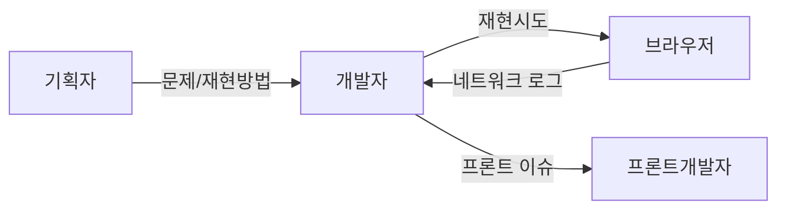

# 현재 디버깅 프로세스
1. 기획에서 문제와 문제 재현방법을 정의
	1. 벡엔드에서는 프론트 페이지에서 문제를 재현
	2. 재현을 완료하고 네트워크 탭에서 요청/응답을 분석함
		1. 파라미터가 잘 안들어가거느 응답에 다른 데이터를 쓰는등 프론트 이슈가 있는 경우 프론트로 전달
		2. 에러가 발생한 경우 센트리 분석해 원인을 확인
			1. 원인을 해결하는 코드를 작성해 브랜치를 따고 푸시, 리뷰 요청
		3. 조회 결과 불일치 등은 로컬에서 쿼리를 재현해 원인을 확인
			1. 원인이 운영포털등 외부 서비스에 해당하는 경우 확인 요청
			2. 원인을 해결하는 코드를 작성해 브랜치를 따고 푸시, 리뷰 요청
