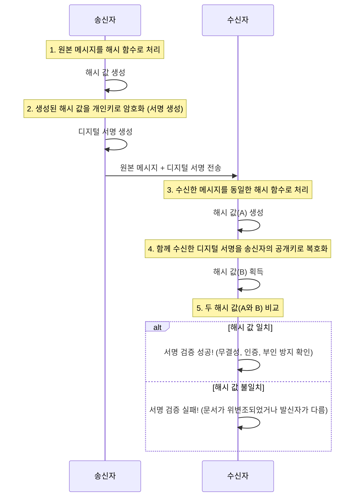

디지털 서명(Digital Signature)은 디지털 문서의 **진위성**과 **무결성**을 보장하기 위해 사용되는 암호화 기술입니다. 마치 우리가 종이 계약서에 직접 서명하여 계약의 유효성을 증명하는 것처럼, 디지털 서명은 사이버 공간에서 보낸 사람이 누구인지, 그리고 내용이 위변조되지 않았는지를 수학적으로 증명해 줍니다.

단순히 문서에 서명 이미지를 첨부하는 것이 아니라, [[공개 키 암호화 (Public Key Cryptography)]]기술을 기반으로 한 정교한 메커니즘입니다. 디지털 서명을 제대로 이해하려면, 먼저 [[해시 함수]]와 공개 키 암호화라는 두 가지 핵심 개념을 알아야 합니다.

---

## 디지털 서명의 핵심 원리

디지털 서명은 '서명 생성'과 '서명 검증'이라는 두 단계로 이루어집니다. 이 과정은 송신자와 수신자 간의 신뢰를 구축하는 핵심적인 역할을 합니다.

전체적인 흐름을 그림으로 보면 다음과 같습니다.




### 1. 서명 생성 (송신자)

1. **해시 값 생성**: 송신자는 원본 메시지(예: 계약서 파일)를 [[해시 함수]]를 사용해 고정된 길이의 고유한 값, 즉 **해시(Hash) 값**으로 압축합니다. 메시지가 단 한 글자라도 바뀌면 해시 값은 완전히 달라집니다.
    
2. **개인키로 암호화**: 송신자는 자신의 **개인키(Private Key)**를 이용해 이 해시 값을 암호화합니다. 이렇게 암호화된 해시 값이 바로 **디지털 서명**입니다.
    
3. **메시지와 서명 전송**: 송신자는 원본 메시지와 생성된 디지털 서명을 수신자에게 함께 전송합니다.
    

### 2. 서명 검증 (수신자)

1. **서명 복호화**: 수신자는 사전에 공유받은 송신자의 **공개키(Public Key)**를 사용해 함께 전송된 디지털 서명을 복호화합니다. 성공적으로 복호화되면 원본 메시지의 해시 값이 나타납니다. (이것을 '해시 A'라고 하겠습니다.)
    
2. **해시 값 계산**: 수신자는 함께 받은 원본 메시지를 서명 생성 시 사용된 것과 **동일한 [[해시 함수]]**로 계산하여 새로운 해시 값을 얻습니다. (이것을 '해시 B'라고 하겠습니다.)
    
3. **해시 값 비교**: '해시 A'와 '해시 B'를 비교합니다. 만약 두 값이 **완벽하게 일치**한다면, 이 서명은 유효한 것으로 간주됩니다.
    

---

## 디지털 서명이 보장하는 세 가지

위와 같은 검증 과정을 통해 디지털 서명은 다음과 같은 세 가지 중요한 보안 요소를 보장합니다.

1. **무결성 (Integrity)**
    
    - 메시지가 전송 도중에 변경되지 않았음을 보장합니다. 만약 누군가 메시지를 조금이라도 수정했다면, 수신자가 계산한 '해시 B'가 송신자가 보낸 '해시 A'와 달라지기 때문에 위변조 사실을 즉시 알 수 있습니다.
        
2. **인증 (Authentication)**
    
    - 메시지를 보낸 사람이 진짜 그 사람이 맞는지 증명합니다. 디지털 서명은 송신자의 **개인키**로만 생성할 수 있으므로, 해당 서명을 송신자의 **공개키**로 성공적으로 복호화할 수 있다는 사실 자체가 송신자의 신원을 보증하는 역할을 합니다.
        
3. **부인 방지 (Non-repudiation)**
    
    - 송신자가 메시지를 보냈다는 사실을 나중에 부인할 수 없도록 합니다. 개인키는 오직 소유자만 가지고 있으므로, 해당 개인키로 생성된 서명이 존재한다는 것은 송신자가 직접 서명했다는 강력한 증거가 됩니다.
        

---

## Java를 이용한 디지털 서명 예시 코드

Java의 `java.security` 패키지를 사용하면 디지털 서명을 간단하게 구현해볼 수 있습니다. 다음은 `SHA256withRSA` 알고리즘을 사용한 예시입니다.

```java
import java.security.*;

public class DigitalSignatureExample {

    public static void main(String[] args) throws Exception {
        // 1. 원본 데이터
        String originalMessage = "이것은 디지털 서명을 위한 원본 메시지입니다.";
        byte[] data = originalMessage.getBytes("UTF8");

        // 2. RSA 키 쌍(개인키, 공개키) 생성
        KeyPairGenerator keyGen = KeyPairGenerator.getInstance("RSA");
        keyGen.initialize(2048);
        KeyPair keyPair = keyGen.generateKeyPair();
        PrivateKey privateKey = keyPair.getPrivate();
        PublicKey publicKey = keyPair.getPublic();

        // 3. 서명 생성 (송신자 측)
        // 개인키를 사용하여 서명 객체 초기화
        Signature signature = Signature.getInstance("SHA256withRSA");
        signature.initSign(privateKey);
        // 원본 데이터를 업데이트
        signature.update(data);
        // 서명 생성
        byte[] digitalSignature = signature.sign();
        System.out.println("디지털 서명(생성됨): " + new String(digitalSignature, "ISO-8859-1"));

        // 4. 서명 검증 (수신자 측)
        // 공개키를 사용하여 검증 객체 초기화
        Signature verifier = Signature.getInstance("SHA256withRSA");
        verifier.initVerify(publicKey);
        // 검증할 원본 데이터 업데이트
        verifier.update(data);
        // 서명 검증 수행
        boolean isVerified = verifier.verify(digitalSignature);
        System.out.println("서명 검증 결과: " + (isVerified ? "성공" : "실패"));

        // 5. 데이터가 변조된 경우의 검증 실패 테스트
        byte[] tamperedData = (originalMessage + " (내용 변경됨)").getBytes("UTF8");
        verifier.update(tamperedData); // 올바른 데이터 대신 변경된 데이터로 업데이트
        // 참고: verify를 다시 호출하기 전에 update를 다시 해야 하는 경우,
        // Signature 객체를 다시 초기화해야 하지만 여기서는 간단한 시연을 위해 생략합니다.
        // 실제로는 새 객체를 만들거나 initVerify를 다시 호출해야 합니다.
        Signature tamperedVerifier = Signature.getInstance("SHA256withRSA");
        tamperedVerifier.initVerify(publicKey);
        tamperedVerifier.update(tamperedData);
        boolean isTamperedVerified = tamperedVerifier.verify(digitalSignature);
        System.out.println("변조된 데이터에 대한 서명 검증 결과: " + (isTamperedVerified ? "성공" : "실패"));
    }
}
```

위 코드는 키 쌍을 생성하고, 원본 데이터로 서명을 만든 뒤, 동일한 데이터와 다른 데이터로 각각 검증하여 그 결과를 보여줍니다. 이를 통해 무결성이 어떻게 동작하는지 직관적으로 이해할 수 있습니다.

---

## 디지털 서명 vs. 암호화

종종 디지털 서명과 암호화를 혼동하는 경우가 있습니다. 두 기술은 목적이 다릅니다.

- **암호화 (Encryption)**: 데이터의 **기밀성(Confidentiality)**을 보장하는 것이 주 목적입니다. 허가된 사용자 외에는 내용을 볼 수 없도록 숨기는 기술입니다. 보통 수신자의 **공개키**로 암호화하고 수신자의 **개인키**로 복호화합니다.
    
- **디지털 서명 (Digital Signature)**: 데이터의 **무결성, 인증, 부인 방지**를 보장하는 것이 주 목적입니다. 내용이 변조되지 않았고, 누가 보냈는지 증명하는 기술입니다. 송신자의 **개인키**로 암호화(서명)하고 송신자의 **공개키**로 복호화(검증)합니다.

---

## 결론

디지털 서명은 단순한 보안 기술을 넘어, 온라인 비즈니스, 전자 정부, 금융 거래 등 디지털 사회의 신뢰를 지탱하는 핵심 인프라입니다. 개발자로서 디지털 서명의 원리를 이해하는 것은 안전하고 신뢰성 있는 시스템을 구축하는 데 필수적인 역량이라고 할 수 있습니다.

---

## 참고 자료

- Oracle Java Documentation - Signature Class ([https://docs.oracle.com/javase/8/docs/api/java/security/Signature.html](https://docs.oracle.com/javase/8/docs/api/java/security/Signature.html))
- RFC 3279 - Algorithms and Identifiers for the Internet X.509 Public Key Infrastructure Certificate ([https://www.rfc-editor.org/rfc/rfc3279](https://www.rfc-editor.org/rfc/rfc3279))
- Introduction to Digital Signatures - Thales Group ([https://www.thalesgroup.com/en/markets/digital-identity-and-security/iam/encryption/digital-signatures](https://www.google.com/search?q=https://www.thalesgroup.com/en/markets/digital-identity-and-security/iam/encryption/digital-signatures))