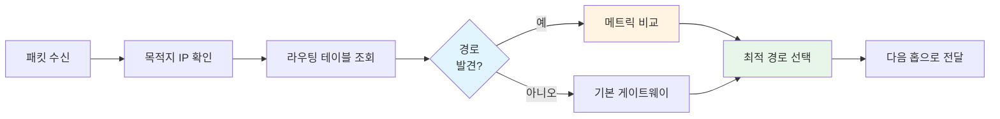
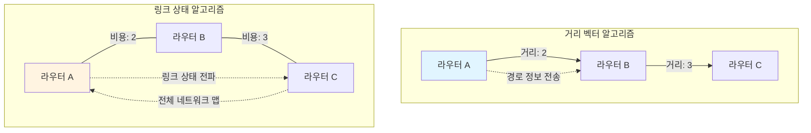
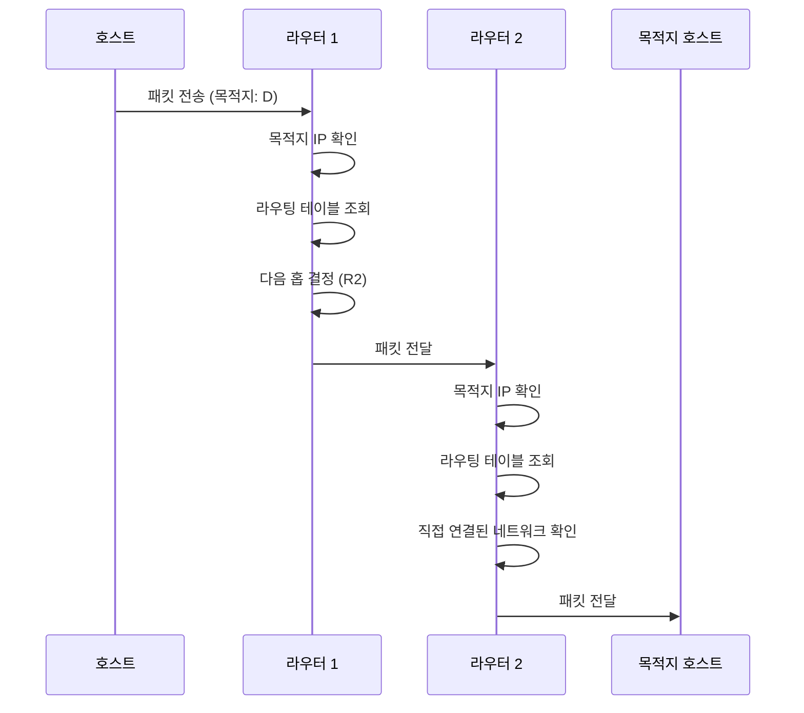

라우팅(Routing)은 네트워크에서 데이터 패킷을 출발지에서 목적지까지 전달하기 위한 최적의 경로를 결정하고 선택하는 과정입니다. 라우팅은 [[OSI 모델]]의 네트워크 계층(3계층)에서 수행되며, [[IP 주소]]를 기반으로 패킷의 전달 경로를 결정합니다.

라우팅은 인터넷과 같은 대규모 네트워크에서 데이터가 올바른 목적지에 도달할 수 있도록 하는 핵심 메커니즘입니다. 라우팅을 이해하기 위해서는 [[Network]], [[IP 주소]], [[Router]], [[서브넷 마스크(Subnet Mask)]] 등의 개념을 함께 이해하는 것이 중요합니다.

## 라우팅의 등장 배경

초기 네트워크는 단일 세그먼트로 구성되어 있어 모든 장치가 직접 통신할 수 있었습니다. 하지만 네트워크가 확장되면서 다음과 같은 문제들이 발생했습니다:

1. **경로 선택의 필요성**: 목적지까지 여러 경로가 존재할 때 어떤 경로를 선택할지 결정해야 했습니다.
2. **네트워크 분리**: 서로 다른 네트워크 간의 통신을 위해서는 중간 장치가 필요했습니다.
3. **확장성 문제**: 대규모 네트워크에서 모든 경로 정보를 관리하는 것이 어려워졌습니다.
4. **장애 대응**: 특정 경로에 장애가 발생했을 때 대체 경로를 찾아야 했습니다.

라우팅은 이러한 문제들을 해결하기 위해 등장했습니다. 라우팅을 통해 네트워크는 효율적으로 확장할 수 있게 되었고, 여러 경로 중 최적의 경로를 선택하여 통신의 효율성과 안정성을 향상시킬 수 있게 되었습니다.

## 라우팅의 기본 원리

라우팅은 다음과 같은 기본 원리로 동작합니다:

### 1. 목적지 식별

패킷의 헤더에 포함된 목적지 [[IP 주소]]를 확인하여 패킷이 어디로 가야 하는지 파악합니다.

### 2. 경로 정보 조회

[[라우팅 테이블]]을 조회하여 목적지 네트워크로 가는 경로 정보를 찾습니다.

### 3. 최적 경로 선택

여러 경로가 존재하는 경우, 메트릭(Metric)을 기준으로 최적의 경로를 선택합니다.

### 4. 패킷 전달

선택된 경로를 따라 패킷을 다음 홉(Next Hop)으로 전달합니다.



## 라우팅 테이블

라우팅 테이블은 라우터가 패킷을 전달할 때 참조하는 경로 정보의 데이터베이스입니다. 각 라우터는 자신의 라우팅 테이블을 유지하며, 패킷의 목적지에 따라 적절한 경로를 선택합니다.

### 라우팅 테이블의 구성 요소

라우팅 테이블의 각 항목은 다음과 같은 정보를 포함합니다:

- **목적지 네트워크**: 패킷이 도달해야 할 네트워크 주소
- **서브넷 마스크**: 네트워크 ID와 호스트 ID를 구분하는 마스크
- **다음 홉(Next Hop)**: 패킷을 전달할 다음 라우터의 IP 주소 또는 인터페이스
- **인터페이스**: 패킷을 전송할 물리적 인터페이스
- **메트릭(Metric)**: 경로의 비용이나 우선순위 (값이 낮을수록 우선순위가 높음)
- **관리 거리(Administrative Distance)**: 라우팅 정보의 신뢰도

### 라우팅 테이블 예시

```
목적지 네트워크      서브넷 마스크        다음 홉          인터페이스    메트릭
192.168.1.0         255.255.255.0      직접 연결        eth0         0
10.0.0.0            255.0.0.0         192.168.1.1      eth0         1
172.16.0.0          255.255.0.0       192.168.1.2      eth0         5
0.0.0.0             0.0.0.0           192.168.1.254    eth0         10
```

위 예시에서:
- `192.168.1.0/24`는 직접 연결된 네트워크이므로 메트릭이 0입니다.
- `10.0.0.0/8`은 `192.168.1.1`을 통해 접근 가능합니다.
- `0.0.0.0/0`은 기본 게이트웨이(Default Gateway)로, 다른 모든 목적지에 대한 기본 경로입니다.

### 라우팅 테이블 조회 방법

라우팅 테이블은 가장 구체적인 경로부터 일반적인 경로 순서로 매칭됩니다. 이는 Longest Prefix Match(최장 접두사 일치) 원칙에 따라 동작합니다.

예를 들어:
- 목적지가 `192.168.1.100`인 경우: `192.168.1.0/24` 경로가 매칭됩니다.
- 목적지가 `10.5.5.5`인 경우: `10.0.0.0/8` 경로가 매칭됩니다.
- 목적지가 `203.0.113.1`인 경우: 기본 게이트웨이(`0.0.0.0/0`)가 매칭됩니다.

## 라우팅 프로토콜

라우팅 프로토콜은 라우터들이 네트워크 경로 정보를 교환하고 라우팅 테이블을 자동으로 업데이트하기 위한 규칙과 절차입니다.

### 정적 라우팅 (Static Routing)

관리자가 수동으로 라우팅 테이블을 구성하는 방식입니다.

**장점**:
- 설정이 간단하고 예측 가능합니다
- 라우터의 CPU와 메모리 사용량이 적습니다
- 보안이 강화됩니다 (라우팅 정보가 자동으로 변경되지 않음)
- 작은 네트워크에서 효율적입니다

**단점**:
- 네트워크 변경 시 수동으로 업데이트해야 합니다
- 대규모 네트워크에서는 관리가 어렵습니다
- 장애 발생 시 자동으로 대체 경로를 찾지 못합니다

**사용 사례**:
- 소규모 네트워크
- 보안이 중요한 환경
- 트래픽이 예측 가능한 환경

### 동적 라우팅 (Dynamic Routing)

라우터가 자동으로 경로 정보를 교환하여 라우팅 테이블을 업데이트하는 방식입니다.

**장점**:
- 네트워크 변경에 자동으로 대응합니다
- 대규모 네트워크에서 효율적입니다
- 장애 발생 시 자동으로 대체 경로를 찾습니다
- 관리 부담이 적습니다

**단점**:
- 라우터의 리소스를 더 많이 사용합니다
- 설정이 복잡할 수 있습니다
- 라우팅 프로토콜 간 호환성 문제가 발생할 수 있습니다

**사용 사례**:
- 대규모 네트워크
- 네트워크 토폴로지가 자주 변경되는 환경
- 고가용성이 중요한 환경

### 라우팅 알고리즘

동적 라우팅 프로토콜은 다양한 알고리즘을 사용하여 최적 경로를 계산합니다:

#### 1. 거리 벡터 알고리즘 (Distance Vector Algorithm)

각 라우터가 자신의 이웃 라우터에게 자신이 알고 있는 모든 경로 정보를 주기적으로 전송합니다. 라우터는 수신한 정보를 바탕으로 최단 경로를 계산합니다.

**특징**:
- 구현이 간단합니다
- 주기적으로 라우팅 정보를 교환합니다
- 수렴 시간이 느릴 수 있습니다 (Count-to-Infinity 문제)

**대표 프로토콜**: RIP (Routing Information Protocol)

#### 2. 링크 상태 알고리즘 (Link State Algorithm)

각 라우터가 자신의 링크 상태 정보를 모든 라우터에게 전파하고, 모든 라우터가 동일한 네트워크 맵을 구성합니다. 각 라우터는 이 맵을 기반으로 최단 경로를 계산합니다.

**특징**:
- 빠른 수렴 시간
- 정확한 경로 계산
- 더 많은 메모리와 CPU 자원 필요

**대표 프로토콜**: OSPF (Open Shortest Path First), IS-IS

#### 3. 경로 벡터 알고리즘 (Path Vector Algorithm)

AS(Autonomous System) 간 라우팅에 사용되며, 경로 자체를 벡터로 전달합니다.

**특징**:
- 대규모 네트워크에 적합
- 정책 기반 라우팅 지원
- 루프 방지 메커니즘 내장

**대표 프로토콜**: BGP (Border Gateway Protocol)



### 주요 라우팅 프로토콜

#### RIP (Routing Information Protocol)

- **타입**: 거리 벡터 알고리즘
- **메트릭**: 홉 수(Hop Count)
- **최대 홉 수**: 15
- **업데이트 주기**: 30초
- **적용 범위**: 소규모 네트워크

#### OSPF (Open Shortest Path First)

- **타입**: 링크 상태 알고리즘
- **메트릭**: 대역폭 기반 비용
- **영역 개념**: 네트워크를 영역으로 분할하여 확장성 제공
- **적용 범위**: 대규모 엔터프라이즈 네트워크

#### BGP (Border Gateway Protocol)

- **타입**: 경로 벡터 알고리즘
- **적용 범위**: 인터넷 백본, AS 간 라우팅
- **특징**: 정책 기반 라우팅 지원

자세한 내용은 [[라우팅 프로토콜]]을 참고해주세요.

## 라우팅의 동작 과정

패킷이 라우터를 통과하는 과정은 다음과 같습니다:



### 상세 동작 단계

1. **패킷 수신**: 라우터는 인터페이스로부터 패킷을 수신합니다.

2. **목적지 확인**: 패킷 헤더에서 목적지 [[IP 주소]]를 추출합니다.

3. **라우팅 테이블 조회**: 목적지 IP 주소와 일치하는 네트워크를 라우팅 테이블에서 찾습니다. Longest Prefix Match 원칙을 적용합니다.

4. **경로 선택**: 여러 경로가 있는 경우 메트릭을 기준으로 최적 경로를 선택합니다.

5. **TTL 확인**: 패킷의 TTL(Time To Live) 값을 확인하고, 0이면 패킷을 폐기합니다. 그렇지 않으면 TTL 값을 1 감소시킵니다.

6. **패킷 전달**: 선택된 인터페이스를 통해 다음 홉으로 패킷을 전송합니다.

7. **ARP 조회**: 다음 홉이 같은 네트워크에 있는 경우, ARP를 통해 MAC 주소를 조회합니다.

## 라우팅의 종류

### 직접 라우팅 (Direct Routing)

패킷의 목적지가 라우터와 직접 연결된 네트워크에 있는 경우입니다. 이 경우 라우터는 ARP를 사용하여 목적지의 MAC 주소를 조회하고 직접 전달합니다.

### 간접 라우팅 (Indirect Routing)

패킷의 목적지가 다른 네트워크에 있는 경우입니다. 라우터는 라우팅 테이블을 참조하여 다음 홉 라우터로 패킷을 전달합니다.

### 기본 라우팅 (Default Routing)

라우팅 테이블에 명시적인 경로가 없는 경우, 기본 게이트웨이(Default Gateway)를 통해 패킷을 전달합니다. 기본 게이트웨이는 `0.0.0.0/0` 경로로 표현됩니다.

## 라우팅 메트릭

메트릭은 여러 경로 중 최적의 경로를 선택하기 위한 기준입니다. 메트릭 값이 낮을수록 우선순위가 높습니다.

### 주요 메트릭 종류

1. **홉 수(Hop Count)**: 목적지까지 거쳐야 하는 라우터의 개수
2. **대역폭(Bandwidth)**: 링크의 데이터 전송 용량
3. **지연 시간(Delay)**: 패킷이 전송되는 데 걸리는 시간
4. **신뢰성(Reliability)**: 링크의 안정성
5. **로드(Load)**: 링크의 현재 사용률
6. **비용(Cost)**: 관리자가 설정한 임의의 값

### 복합 메트릭

일부 라우팅 프로토콜은 여러 메트릭을 조합하여 사용합니다. 예를 들어, EIGRP는 대역폭과 지연 시간을 조합하여 복합 메트릭을 계산합니다.

## 라우팅 루프 방지

라우팅 루프는 패킷이 같은 라우터들을 반복적으로 순환하는 현상입니다. 이를 방지하기 위한 여러 메커니즘이 있습니다:

### 1. TTL (Time To Live)

패킷의 TTL 값을 감소시키고, 0이 되면 패킷을 폐기하여 무한 루프를 방지합니다.

### 2. Split Horizon

라우터가 특정 인터페이스를 통해 학습한 경로 정보를 같은 인터페이스로 다시 전송하지 않는 규칙입니다.

### 3. Route Poisoning

장애가 발생한 경로에 대해 무한대의 메트릭 값을 할당하여 다른 라우터들이 해당 경로를 사용하지 않도록 합니다.

### 4. Hold-Down Timer

경로에 문제가 발생했을 때 일정 시간 동안 새로운 경로 정보를 수락하지 않는 타이머입니다.


## 라우팅 최적화 기법

### 1. 라우트 요약 (Route Summarization)

여러 세부 경로를 하나의 요약 경로로 통합하여 라우팅 테이블의 크기를 줄입니다.

### 2. 라우트 필터링

불필요한 라우팅 정보를 필터링하여 라우팅 테이블의 크기를 줄이고 보안을 강화합니다.

### 3. 라우팅 프로토콜 선택

네트워크 규모와 요구사항에 맞는 적절한 라우팅 프로토콜을 선택합니다.

### 4. 부하 분산

여러 경로가 있을 때 트래픽을 분산시켜 네트워크 성능을 향상시킵니다.

## 라우팅의 장단점

### 장점

- **확장성**: 대규모 네트워크에서 효율적으로 동작합니다
- **자동화**: 동적 라우팅을 통해 네트워크 변경에 자동으로 대응합니다
- **장애 복구**: 장애 발생 시 자동으로 대체 경로를 찾습니다
- **최적화**: 여러 경로 중 최적의 경로를 선택합니다

### 단점

- **복잡성**: 대규모 네트워크에서 라우팅 설정이 복잡해질 수 있습니다
- **리소스 사용**: 라우팅 프로토콜이 라우터의 CPU와 메모리를 사용합니다
- **보안 위험**: 잘못된 라우팅 정보가 전파되면 네트워크 문제가 발생할 수 있습니다
- **수렴 시간**: 네트워크 변경 시 라우팅 테이블이 업데이트되는 데 시간이 걸립니다

## 실제 활용 사례

1. **인터넷 백본**: BGP를 사용한 AS 간 라우팅
2. **엔터프라이즈 네트워크**: OSPF를 사용한 내부 네트워크 라우팅
3. **소규모 네트워크**: 정적 라우팅 또는 RIP를 사용한 라우팅
4. **마이크로서비스**: 스프링 클라우드 게이트웨이를 사용한 서비스 간 라우팅
5. **로드 밸런싱**: 여러 경로를 통한 트래픽 분산

## 라우팅 시 주의사항

1. **라우팅 루프**: 잘못된 라우팅 설정으로 인한 루프 발생을 주의해야 합니다.

2. **비대칭 라우팅**: 요청과 응답이 다른 경로를 통해 전달되는 경우 문제가 발생할 수 있습니다.

3. **보안**: 라우팅 프로토콜 인증을 사용하여 잘못된 라우팅 정보의 전파를 방지해야 합니다.

4. **메트릭 설정**: 적절한 메트릭 값을 설정하여 최적의 경로가 선택되도록 해야 합니다.

5. **라우팅 테이블 크기**: 대규모 네트워크에서는 라우팅 테이블의 크기를 관리해야 합니다.

## 결론

라우팅은 네트워크에서 데이터 패킷을 목적지로 전달하기 위한 핵심 메커니즘입니다. 라우팅 테이블, 라우팅 프로토콜, 라우팅 알고리즘 등을 이해하는 것은 효과적인 네트워크 설계와 관리에 필수적입니다.

라우팅을 설계하고 구현할 때는 네트워크 규모, 성능 요구사항, 보안 요구사항 등을 종합적으로 고려해야 하며, [[Router]], [[Network]], [[IP 주소]] 등의 관련 개념들을 함께 이해하는 것이 중요합니다.

또한 현대적인 애플리케이션 아키텍처에서는 스프링 클라우드 게이트웨이와 같은 소프트웨어 라우터를 활용하여 애플리케이션 레벨의 라우팅을 구현할 수 있습니다.

## 참고 자료

- Computer Networks, 5th Edition - Andrew S. Tanenbaum
- TCP/IP Illustrated, Volume 1 - W. Richard Stevens
- CCNA Routing and Switching Study Guide - Todd Lammle

