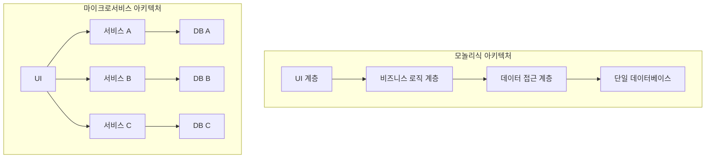

마이크로서비스 아키텍처는 하나의 큰 애플리케이션을 작고 독립적인 서비스 모음으로 개발하는 소프트웨어 설계 접근 방식입니다. 각 서비스는 자체 프로세스에서 실행되며, 경량 메커니즘(주로 HTTP 기반 API)을 통해 통신합니다. 이러한 서비스는 비즈니스 기능을 중심으로 구축되며, 완전히 자동화된 배포 시스템을 통해 독립적으로 배포될 수 있습니다.

## 마이크로서비스의 핵심 원칙

마이크로서비스 아키텍처는 다음과 같은 핵심 원칙을 기반으로 합니다:

1. **단일 책임 원칙**: 각 서비스는 비즈니스 도메인의 특정 부분에 집중하며, 하나의 책임을 가집니다.
2. **자율성**: 각 서비스는 독립적으로 개발, 배포, 운영될 수 있습니다.
3. **분산 데이터 관리**: 각 서비스는 자체 데이터베이스를 관리하며, 데이터의 일관성은 [[이벤트 기반 아키텍처(Event-Driven Architecture)]]를 통해 유지됩니다.
4. **인프라 자동화**: 지속적 통합(CI)과 지속적 배포(CD)를 통해 개발과 배포 과정을 자동화합니다.
5. **장애 격리**: 한 서비스의 장애가 전체 시스템에 영향을 미치지 않도록 설계합니다.
6. **진화적 설계**: 시스템은 시간이 지남에 따라 점진적으로 변화하고 발전할 수 있습니다.

## 모놀리식 아키텍처와의 비교

마이크로서비스 아키텍처를 이해하기 위해서는 기존의 [[모놀리식 아키텍처]]와 비교하는 것이 도움이 됩니다.



모놀리식 애플리케이션은 단일 코드베이스로 구성되어 있고, 모든 비즈니스 기능이 하나의 애플리케이션 내에 존재합니다. 반면, 마이크로서비스는 여러 개의 작은 서비스로 분리되어 있으며, 각각은 특정 비즈니스 기능을 담당합니다.

자세한 차이점은 [[모놀리식 vs 마이크로서비스 비교]]를 참고해주세요.

## 마이크로서비스의 이점

마이크로서비스 아키텍처는 다음과 같은 이점을 제공합니다:

1. **기술적 다양성**: 각 서비스는 적합한 기술 스택을 독립적으로 선택할 수 있습니다.
2. **확장성**: 필요한 서비스만 선택적으로 확장할 수 있어 자원을 효율적으로 사용할 수 있습니다.
3. **개발 속도**: 작은 팀이 독립적으로 개발하므로 개발 속도가 향상됩니다.
4. **높은 가용성**: 한 서비스의 장애가 전체 시스템에 영향을 미치지 않습니다.
5. **지속적 배포**: 작은 서비스 단위로 독립적인 배포가 가능하므로 릴리스 주기를 단축할 수 있습니다.
6. **비즈니스 정렬**: 서비스가 비즈니스 기능 단위로 구성되어 있어 비즈니스 요구사항을 보다 효과적으로 지원할 수 있습니다.

## 마이크로서비스의 도전과제와 해결책

마이크로서비스 아키텍처는 많은 이점을 제공하지만, 동시에 다양한 도전과제도 가져옵니다:

### 1. 복잡한 분산 시스템

여러 서비스로 구성된 분산 시스템은 모니터링, 디버깅, 테스트가 어렵습니다.

**해결책**: [[분산 추적]]과 [[중앙 집중식 로깅]] 시스템을 도입하여 복잡성을 관리합니다.

### 2. 네트워크 지연

서비스 간 통신은 네트워크 지연을 초래할 수 있습니다.

**해결책**: 비동기 통신, 캐싱, 그리고 [[서비스 메시]]를 활용하여 네트워크 지연을 최소화합니다.

### 3. 데이터 일관성

분산 데이터 관리로 인해 데이터 일관성을 유지하기 어렵습니다.

**해결책**: [[사가 패턴(Saga Pattern)]]을 활용하여 분산 트랜잭션을 관리하고, [[이벤트 소싱(Event Sourcing)]]을 통해 데이터 일관성을 유지합니다.

### 4. 운영 복잡성

많은 서비스를 관리하는 것은 운영 측면에서 복잡성을 증가시킵니다.

**해결책**: [[컨테이너화]]와 [[오케스트레이션 도구]]를 활용하여 배포와 운영을 자동화합니다.

자세한 도전과제와 해결책은 [[마이크로서비스 도전과제 해결책]]을 참고해주세요.

## 마이크로서비스 통신 패턴

마이크로서비스 간 통신은 크게 동기 통신과 비동기 통신으로 나눌 수 있습니다:

### 1. 동기 통신 (Synchronous)

- **REST API**: HTTP 프로토콜을 사용한 REST 아키텍처 스타일의 API
- **gRPC**: 고성능 RPC 프레임워크, Protocol Buffers를 사용
- **GraphQL**: 클라이언트가 필요한 데이터를 정확히 요청할 수 있는 쿼리 언어

### 2. 비동기 통신 (Asynchronous)

- **메시지 큐**: RabbitMQ, Apache Kafka 등을 통한 메시지 기반 통신
- **이벤트 소싱**: 이벤트를 기반으로 상태 변경을 기록하고 전파
- **발행/구독 모델**: 이벤트 발행자와 구독자 간의 느슨한 결합

다양한 통신 패턴에 대한 자세한 내용은 [[마이크로서비스 통신 패턴]]을 참고해주세요.

## 데이터 관리 전략

마이크로서비스에서 데이터 관리는 중요한 고려사항입니다:

### 1. 데이터베이스 패턴

- **데이터베이스 per 서비스**: 각 서비스는 자체 데이터베이스를 가집니다.
- **공유 데이터베이스**: 일부 서비스가 데이터베이스를 공유합니다.
- **CQRS(Command Query Responsibility Segregation)**: 명령과 쿼리를 분리하여 처리합니다.

### 2. 데이터 일관성

- **최종 일관성**: 시스템은 결국 일관된 상태가 됩니다.
- **사가 패턴**: 분산 트랜잭션을 관리하기 위한 패턴입니다.
- **이벤트 소싱**: 상태 변화를 이벤트로 저장합니다.

데이터 관리 전략에 대한 자세한 내용은 [[마이크로서비스 데이터 관리]]를 참고해주세요.

## 서비스 디스커버리와 레지스트리

마이크로서비스 환경에서는 서비스의 위치가 동적으로 변할 수 있으므로, 서비스 디스커버리 메커니즘이 필요합니다:

### 1. 클라이언트 사이드 디스커버리

클라이언트가 서비스 레지스트리에서 서비스 인스턴스의 위치 정보를 조회합니다.

```java
@Service
public class ProductClient {
    
    @Autowired
    private DiscoveryClient discoveryClient;
    
    @Autowired
    private RestTemplate restTemplate;
    
    public Product getProduct(Long id) {
        // 서비스 인스턴스 조회
        List<ServiceInstance> instances = discoveryClient.getInstances("product-service");
        
        if (instances != null && !instances.isEmpty()) {
            ServiceInstance instance = instances.get(0);
            String url = instance.getUri().toString() + "/products/" + id;
            
            // 서비스 호출
            return restTemplate.getForObject(url, Product.class);
        }
        return null;
    }
}
```

### 2. 서버 사이드 디스커버리

로드 밸런서가 서비스 레지스트리와 통합되어 클라이언트 요청을 적절한 서비스 인스턴스로 라우팅합니다.

### 3. Spring Cloud Netflix Eureka

Spring 기반 마이크로서비스에서 널리 사용되는 서비스 디스커버리 솔루션입니다:

```java
@SpringBootApplication
@EnableEurekaServer
public class EurekaServerApplication {
    public static void main(String[] args) {
        SpringApplication.run(EurekaServerApplication.class, args);
    }
}
```

클라이언트 측 구성:

```java
@SpringBootApplication
@EnableDiscoveryClient
public class ProductServiceApplication {
    public static void main(String[] args) {
        SpringApplication.run(ProductServiceApplication.class, args);
    }
}
```

서비스 디스커버리에 대한 자세한 내용은 [[마이크로서비스 서비스 디스커버리]]를 참고해주세요.

## 장애 허용과 회복력

마이크로서비스 아키텍처에서는 네트워크 오류, 서비스 장애 등 다양한 장애 상황에 대비해야 합니다:

### 1. 서킷 브레이커 패턴

서비스 호출 시 장애가 발생하면 서킷을 열어 추가 호출을 차단하고, 대체 응답(fallback)을 제공합니다.

```java
@Service
public class ProductService {

    @Autowired
    private RestTemplate restTemplate;
    
    @HystrixCommand(fallbackMethod = "getDefaultProduct")
    public Product getProduct(Long id) {
        return restTemplate.getForObject("http://product-service/products/" + id, Product.class);
    }
    
    public Product getDefaultProduct(Long id) {
        // 장애 시 기본 응답 제공
        return new Product(id, "기본 상품", 0);
    }
}
```

### 2. 벌크헤드 패턴

리소스를 격리하여 한 부분의 장애가 전체 시스템에 영향을 미치지 않도록 합니다.

### 3. 재시도 패턴

일시적인 장애에 대응하기 위해 자동 재시도 메커니즘을 구현합니다.

```java
@Configuration
public class RetryConfig {
    
    @Bean
    public RetryTemplate retryTemplate() {
        RetryTemplate retryTemplate = new RetryTemplate();
        
        SimpleRetryPolicy retryPolicy = new SimpleRetryPolicy();
        retryPolicy.setMaxAttempts(3);
        
        ExponentialBackOffPolicy backOffPolicy = new ExponentialBackOffPolicy();
        backOffPolicy.setInitialInterval(1000);
        backOffPolicy.setMultiplier(2.0);
        
        retryTemplate.setRetryPolicy(retryPolicy);
        retryTemplate.setBackOffPolicy(backOffPolicy);
        
        return retryTemplate;
    }
}
```

장애 허용과 회복력에 대한 자세한 내용은 [[마이크로서비스 회복력 패턴]]을 참고해주세요.

## 배포 전략

마이크로서비스는 다양한 배포 전략을 활용하여 위험을 최소화하면서 지속적으로 배포할 수 있습니다:

### 1. 블루-그린 배포

두 개의 동일한 환경(블루와 그린)을 운영하면서, 새 버전을 그린 환경에 배포한 후 트래픽을 전환합니다.

### 2. 카나리 배포

새 버전을 일부 사용자에게만 점진적으로 노출시켜 위험을 줄입니다.

### 3. 롤링 업데이트

서비스 인스턴스를 하나씩 순차적으로 업데이트합니다.

배포 전략에 대한 자세한 내용은 [[마이크로서비스 배포 전략]]을 참고해주세요.

## 모니터링과 관찰성

마이크로서비스 환경에서는 효과적인 모니터링과 관찰성이 필수적입니다:

### 1. 로깅

중앙 집중식 로깅 시스템을 통해 모든 서비스의 로그를 수집하고 분석합니다:

- ELK 스택(Elasticsearch, Logstash, Kibana)
- Fluentd
- Graylog

### 2. 메트릭

시스템 성능 및 상태를 측정하고 모니터링합니다:

- Prometheus
- Grafana
- Micrometer

### 3. 분산 추적

여러 서비스에 걸친 요청 흐름을 추적합니다:

- Zipkin
- Jaeger
- Spring Cloud Sleuth

```java
@SpringBootApplication
@EnableZipkinServer
public class ZipkinServerApplication {
    public static void main(String[] args) {
        SpringApplication.run(ZipkinServerApplication.class, args);
    }
}
```

모니터링과 관찰성에 대한 자세한 내용은 [[마이크로서비스 모니터링과 관찰성]]을 참고해주세요.

## 실제 사용 사례

마이크로서비스 아키텍처는 다양한 기업에서 성공적으로 도입되었습니다:

### 1. Netflix

Netflix는 모놀리식 DVD 대여 시스템에서 600개 이상의 마이크로서비스로 구성된 스트리밍 플랫폼으로 전환했습니다. Eureka, Hystrix, Zuul과 같은 다양한 마이크로서비스 도구를 개발하여 오픈소스로 공개했습니다.

### 2. Amazon

Amazon은 초기 모놀리식 아키텍처에서 수천 개의 마이크로서비스로 전환하여 확장성과 개발 속도를 크게 향상시켰습니다.

### 3. Uber

Uber는 초기 모놀리식 시스템에서 마이크로서비스 아키텍처로 전환하여 빠른 성장과 글로벌 확장을 지원했습니다.

## Spring Cloud를 활용한 마이크로서비스

Spring Cloud는 Spring Boot 기반 마이크로서비스 개발을 위한 도구 모음을 제공합니다:

### 1. [[Spring Cloud Config]]

중앙 집중식 구성 관리를 제공합니다:

```java
@SpringBootApplication
@EnableConfigServer
public class ConfigServerApplication {
    public static void main(String[] args) {
        SpringApplication.run(ConfigServerApplication.class, args);
    }
}
```

### 2. Spring Cloud Netflix

Netflix OSS 통합을 제공합니다:

- Eureka: 서비스 디스커버리
- Hystrix: 서킷 브레이커
- Zuul: API 게이트웨이

### 3. Spring Cloud Gateway

모던 API 게이트웨이를 제공합니다:

```java
@Bean
public RouteLocator customRouteLocator(RouteLocatorBuilder builder) {
    return builder.routes()
        .route("product_route", r -> r.path("/products/**")
            .filters(f -> f.addRequestHeader("X-Request-Source", "API Gateway"))
            .uri("lb://product-service"))
        .route("order_route", r -> r.path("/orders/**")
            .uri("lb://order-service"))
        .build();
}
```

Spring Cloud에 대한 자세한 내용은 [[Spring Cloud 마이크로서비스]]를 참고해주세요.

## 결론

마이크로서비스 아키텍처는 복잡한 애플리케이션을 개발하고 관리하는 데 있어 확장성, 유연성, 그리고 회복력을 제공하는 강력한 접근 방식입니다. 그러나 이러한 이점은 분산 시스템의 복잡성, 데이터 일관성 관리, 네트워크 오버헤드 등의 도전과제와 함께 제공됩니다.

마이크로서비스로의 전환은 조직적, 기술적, 그리고 문화적 변화를 수반하므로 점진적인 접근이 권장됩니다. 모든 시스템에 마이크로서비스가 적합한 것은 아니므로, 비즈니스 요구사항, 팀 구조, 그리고 기술적 성숙도를 고려하여 결정해야 합니다.

성공적인 마이크로서비스 도입을 위해서는 서비스 경계 설정, 통신 패턴 선택, 데이터 관리 전략, 그리고 운영 도구 구축에 세심한 주의를 기울여야 합니다. 이러한 노력을 통해 시스템의 유연성, 확장성, 그리고 회복력을 극대화할 수 있습니다.

## 참고 자료

- Microservices Patterns - Chris Richardson
- Building Microservices - Sam Newman
- Domain-Driven Design - Eric Evans
- Spring Microservices in Action - John Carnell
- 스프링 5.0 마이크로서비스 2/e - Rajesh RV
- 마이크로서비스 패턴 - Chris Richardson