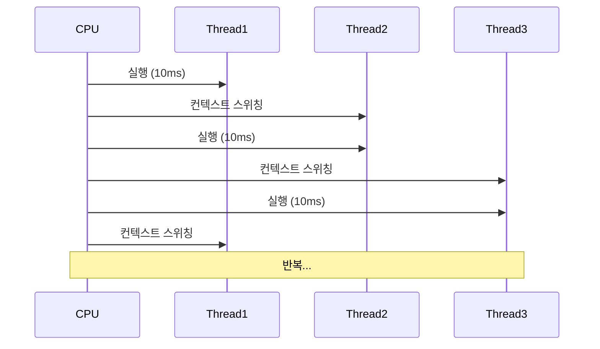

 하나의 프로세스 내에서 여러 개의 스레드를 동시에 실행하는 프로그래밍 기법입니다. 이 기술을 통해 CPU의 사용률을 극대화하고, 프로그램의 응답성을 향상시키며, 자원을 효율적으로 활용할 수 있습니다. 현대 소프트웨어 개발에서 멀티스레딩은 더 이상 선택이 아닌 필수적인 요소로 자리 잡았습니다.

멀티스레딩을 이해하기 위해서는 먼저 [[스레드(Thread)]]의 개념과 [[병렬 처리(Parallel Processing)]]에 대한 기본적인 이해가 필요합니다.

## 멀티스레딩 vs 단일 스레딩

단일 스레딩(Single-threading) 프로그램은 한 번에 하나의 작업만 처리할 수 있습니다. 이에 반해 멀티스레딩 프로그램은 여러 작업을 동시에 처리할 수 있습니다. 이것은 마치 한 명의 요리사가 한 가지 요리만 할 수 있는 것과 여러 요리를 동시에 준비할 수 있는 것의 차이와 같습니다.

멀티스레딩과 [[멀티프로세싱(Multiprocessing)]]의 차이점에 대한 자세한 내용은 [[멀티스레딩 vs 멀티프로세싱]]을 참고해주세요.

## 멀티스레딩의 작동 방식

멀티스레딩이 작동하는 방식은 CPU의 타임 슬라이싱(Time Slicing)과 밀접한 관련이 있습니다. 하나의 CPU 코어는 실제로 한 번에 하나의 스레드만 실행할 수 있지만, 매우 빠른 속도로 여러 스레드 간에 전환하며 실행함으로써 마치 동시에 실행되는 것처럼 보이게 합니다.



[[컨텍스트 스위칭(Context Switching)]]은 한 스레드에서 다른 스레드로 CPU 제어권이 넘어가는 과정으로, 이 과정에서 현재 스레드의 상태를 저장하고 다음 스레드의 상태를 로드하는 작업이 이루어집니다. 컨텍스트 스위칭은 일정한 오버헤드를 발생시키므로, 너무 자주 발생하면 성능 저하의 원인이 될 수 있습니다.

## 멀티스레딩의 장점

멀티스레딩을 사용함으로써 얻을 수 있는 주요 이점은 다음과 같습니다:

1. **응답성 향상**: UI 스레드가 차단되지 않아 애플리케이션이 더 반응적으로 동작합니다.
2. **자원 활용 최적화**: 한 스레드가 I/O 작업으로 대기 중일 때 다른 스레드가 CPU를 활용할 수 있습니다.
3. **처리량 증가**: 여러 작업을 병렬로 처리하여 전체 처리 시간을 단축할 수 있습니다.
4. **비용 효율성**: 새로운 프로세스를 생성하는 것보다 스레드를 생성하는 것이 자원 측면에서 더 효율적입니다.
5. **정보 공유 용이성**: 같은 프로세스 내의 스레드들은 메모리 공간을 공유하므로 정보 교환이 쉽습니다.

## 멀티스레딩의 도전 과제

멀티스레딩의 이점에도 불구하고, 다음과 같은 도전 과제가 있습니다:

1. **[[동시성 문제(Concurrency Issues)]]**: 여러 스레드가 공유 자원에 동시에 접근할 때 예상치 못한 결과가 발생할 수 있습니다.
2. **[[데드락(Deadlock)]]**: 두 개 이상의 스레드가 서로 상대방이 점유한 자원을 기다리며 무한정 대기하는 상황이 발생할 수 있습니다.
3. **[[라이브락(Livelock)]]**: 스레드들이 서로의 작업에 반응하여 계속해서 상태를 변경하지만 실제로는 진전이 없는 상황입니다.
4. **[[기아 상태(Starvation)]]**: 특정 스레드가 필요한 자원을 계속해서 얻지 못하는 상황입니다.
5. **디버깅 어려움**: 멀티스레드 프로그램의 버그는 재현하기 어렵고 찾아내기 어려운 경우가 많습니다.

동시성 문제에 대한 자세한 내용은 [[동시성 문제와 해결 방법]]을 참고해주세요.

## Java에서의 멀티스레딩 구현

Java는 멀티스레딩을 위한 강력한 지원을 제공합니다. 다음은 Java에서 멀티스레딩을 구현하는 기본적인 방법입니다:

### 1. Thread 클래스 상속

```java
public class MyThread extends Thread {
    @Override
    public void run() {
        for (int i = 0; i < 5; i++) {
            System.out.println("스레드 #" + Thread.currentThread().getId() + ": " + i);
            try {
                Thread.sleep(1000); // 1초 대기
            } catch (InterruptedException e) {
                e.printStackTrace();
            }
        }
    }
    
    public static void main(String[] args) {
        // 3개의 스레드 생성 및 시작
        for (int i = 0; i < 3; i++) {
            MyThread thread = new MyThread();
            thread.start();
        }
    }
}
```

### 2. Runnable 인터페이스 구현 (권장)

```java
public class MyRunnable implements Runnable {
    @Override
    public void run() {
        for (int i = 0; i < 5; i++) {
            System.out.println("스레드 #" + Thread.currentThread().getId() + ": " + i);
            try {
                Thread.sleep(1000); // 1초 대기
            } catch (InterruptedException e) {
                e.printStackTrace();
            }
        }
    }
    
    public static void main(String[] args) {
        // 3개의 스레드 생성 및 시작
        for (int i = 0; i < 3; i++) {
            Thread thread = new Thread(new MyRunnable());
            thread.start();
        }
    }
}
```

### 3. 람다 표현식 사용 (Java 8 이상)

```java
public class LambdaThread {
    public static void main(String[] args) {
        // 람다 표현식으로 Runnable 구현
        Runnable task = () -> {
            for (int i = 0; i < 5; i++) {
                System.out.println("스레드 #" + Thread.currentThread().getId() + ": " + i);
                try {
                    Thread.sleep(1000);
                } catch (InterruptedException e) {
                    e.printStackTrace();
                }
            }
        };
        
        // 3개의 스레드 생성 및 시작
        for (int i = 0; i < 3; i++) {
            Thread thread = new Thread(task);
            thread.start();
        }
    }
}
```

Java의 스레드 생성 및 관리에 대한 자세한 내용은 [[Java 스레드 프로그래밍]]을 참고해주세요.

## 스레드 동기화

여러 스레드가 공유 자원에 동시에 접근할 때 발생하는 문제를 방지하기 위해 스레드 동기화가 필요합니다. Java에서는 다음과 같은 동기화 메커니즘을 제공합니다:

### 1. synchronized 키워드

```java
public class Counter {
    private int count = 0;
    
    // 메서드 레벨 동기화
    public synchronized void increment() {
        count++;
    }
    
    // 블록 레벨 동기화
    public void decrement() {
        synchronized(this) {
            count--;
        }
    }
    
    public int getCount() {
        return count;
    }
}
```

### 2. Lock 인터페이스

```java
import java.util.concurrent.locks.Lock;
import java.util.concurrent.locks.ReentrantLock;

public class Counter {
    private int count = 0;
    private final Lock lock = new ReentrantLock();
    
    public void increment() {
        lock.lock();
        try {
            count++;
        } finally {
            lock.unlock(); // 반드시 unlock 호출
        }
    }
    
    public int getCount() {
        return count;
    }
}
```

### 3. volatile 키워드

```java
public class Flag {
    private volatile boolean flag = false;
    
    public void setFlag(boolean value) {
        flag = value;
    }
    
    public boolean isFlag() {
        return flag;
    }
}
```

스레드 동기화에 대한 자세한 내용은 [[Java 스레드 동기화 기법]]을 참고해주세요.

## 스레드 간 통신

스레드 간에 정보를 교환하고 협력하기 위한 다양한 방법이 있습니다:

### 1. wait()와 notify() 메서드

```java
public class MessageQueue {
    private String message;
    private boolean isEmpty = true;
    
    public synchronized String receive() {
        while (isEmpty) {
            try {
                wait(); // 메시지가 없으면 대기
            } catch (InterruptedException e) {
                Thread.currentThread().interrupt();
            }
        }
        isEmpty = true;
        notifyAll(); // 생산자 스레드에게 알림
        return message;
    }
    
    public synchronized void send(String message) {
        while (!isEmpty) {
            try {
                wait(); // 큐가 차있으면 대기
            } catch (InterruptedException e) {
                Thread.currentThread().interrupt();
            }
        }
        isEmpty = false;
        this.message = message;
        notifyAll(); // 소비자 스레드에게 알림
    }
}
```

### 2. BlockingQueue 사용

```java
import java.util.concurrent.BlockingQueue;
import java.util.concurrent.LinkedBlockingQueue;

public class ProducerConsumerExample {
    public static void main(String[] args) {
        BlockingQueue<String> queue = new LinkedBlockingQueue<>(10);
        
        // 생산자 스레드
        new Thread(() -> {
            try {
                for (int i = 0; i < 20; i++) {
                    String message = "메시지 #" + i;
                    queue.put(message); // 큐가 가득 차면 블로킹
                    System.out.println("생산: " + message);
                    Thread.sleep(100);
                }
            } catch (InterruptedException e) {
                Thread.currentThread().interrupt();
            }
        }).start();
        
        // 소비자 스레드
        new Thread(() -> {
            try {
                for (int i = 0; i < 20; i++) {
                    String message = queue.take(); // 큐가 비어있으면 블로킹
                    System.out.println("소비: " + message);
                    Thread.sleep(200);
                }
            } catch (InterruptedException e) {
                Thread.currentThread().interrupt();
            }
        }).start();
    }
}
```

스레드 간 통신에 대한 자세한 내용은 [[스레드 간 통신 방법]]을 참고해주세요.

## 고급 멀티스레딩 API: java.util.concurrent

Java 5부터 도입된 java.util.concurrent 패키지는 멀티스레딩 프로그래밍을 위한 고수준 API를 제공합니다:

### 1. ExecutorService와 스레드 풀

```java
import java.util.concurrent.ExecutorService;
import java.util.concurrent.Executors;

public class ThreadPoolExample {
    public static void main(String[] args) {
        // 고정 크기 스레드 풀 생성
        ExecutorService executor = Executors.newFixedThreadPool(5);
        
        // 작업 제출
        for (int i = 0; i < 10; i++) {
            final int taskId = i;
            executor.submit(() -> {
                System.out.println("작업 #" + taskId + " 실행 중 - 스레드: " + 
                                  Thread.currentThread().getName());
                try {
                    Thread.sleep(1000);
                } catch (InterruptedException e) {
                    Thread.currentThread().interrupt();
                }
                return "작업 #" + taskId + " 완료";
            });
        }
        
        // 작업 완료 후 스레드 풀 종료
        executor.shutdown();
    }
}
```

### 2. Future와 CompletableFuture

```java
import java.util.concurrent.CompletableFuture;
import java.util.concurrent.ExecutionException;

public class CompletableFutureExample {
    public static void main(String[] args) throws ExecutionException, InterruptedException {
        // 비동기 작업 생성
        CompletableFuture<String> future = CompletableFuture.supplyAsync(() -> {
            try {
                Thread.sleep(2000); // 시간이 걸리는 작업 시뮬레이션
            } catch (InterruptedException e) {
                Thread.currentThread().interrupt();
            }
            return "Hello";
        });
        
        // 결과 변환 및 처리
        CompletableFuture<String> finalResult = future
            .thenApply(s -> s + " World") // 결과 변환
            .thenApply(String::toUpperCase); // 추가 변환
        
        // 결과 출력 (최대 5초 대기)
        System.out.println("결과: " + finalResult.get());
    }
}
```

### 3. Fork/Join 프레임워크

```java
import java.util.concurrent.ForkJoinPool;
import java.util.concurrent.RecursiveTask;

public class ForkJoinExample {
    // 배열 요소 합계를 계산하는 작업
    static class SumTask extends RecursiveTask<Long> {
        private static final int THRESHOLD = 1000;
        private final long[] array;
        private final int start;
        private final int end;
        
        SumTask(long[] array, int start, int end) {
            this.array = array;
            this.start = start;
            this.end = end;
        }
        
        @Override
        protected Long compute() {
            int length = end - start;
            if (length <= THRESHOLD) {
                // 임계값 이하면 직접 계산
                return computeDirectly();
            }
            
            // 작업 분할
            int middle = start + length / 2;
            SumTask leftTask = new SumTask(array, start, middle);
            SumTask rightTask = new SumTask(array, middle, end);
            
            // 왼쪽 작업 포크 (별도 스레드에서 비동기 실행)
            leftTask.fork();
            
            // 오른쪽 작업 현재 스레드에서 실행
            long rightResult = rightTask.compute();
            
            // 왼쪽 작업 결과 대기 및 결합
            long leftResult = leftTask.join();
            
            return leftResult + rightResult;
        }
        
        private long computeDirectly() {
            long sum = 0;
            for (int i = start; i < end; i++) {
                sum += array[i];
            }
            return sum;
        }
    }
    
    public static void main(String[] args) {
        // 1백만 개의 요소를 가진 배열 생성
        long[] numbers = new long[1_000_000];
        for (int i = 0; i < numbers.length; i++) {
            numbers[i] = i + 1;
        }
        
        // Fork/Join 풀 생성 및 작업 실행
        ForkJoinPool pool = ForkJoinPool.commonPool();
        long sum = pool.invoke(new SumTask(numbers, 0, numbers.length));
        
        System.out.println("합계: " + sum);
    }
}
```

java.util.concurrent 패키지에 대한 자세한 내용은 [[Java 동시성 프레임워크]]를 참고해주세요.

## 스프링 프레임워크에서의 멀티스레딩

스프링 프레임워크는 멀티스레딩 애플리케이션 개발을 위한 다양한 기능을 제공합니다:

### 1. @Async 어노테이션을 이용한 비동기 처리

```java
import org.springframework.scheduling.annotation.Async;
import org.springframework.scheduling.annotation.EnableAsync;
import org.springframework.stereotype.Service;
import java.util.concurrent.CompletableFuture;

@Service
public class AsyncService {
    
    @Async
    public CompletableFuture<String> processDataAsync(String input) {
        // 시간이 걸리는 작업 시뮬레이션
        try {
            Thread.sleep(2000);
        } catch (InterruptedException e) {
            Thread.currentThread().interrupt();
        }
        
        return CompletableFuture.completedFuture("처리된 결과: " + input.toUpperCase());
    }
}

@Configuration
@EnableAsync
public class AsyncConfig {
    
    @Bean
    public Executor asyncExecutor() {
        ThreadPoolTaskExecutor executor = new ThreadPoolTaskExecutor();
        executor.setCorePoolSize(5);
        executor.setMaxPoolSize(10);
        executor.setQueueCapacity(25);
        executor.setThreadNamePrefix("Async-");
        executor.initialize();
        return executor;
    }
}
```

### 2. @Scheduled 어노테이션을 이용한 작업 스케줄링

```java
import org.springframework.scheduling.annotation.EnableScheduling;
import org.springframework.scheduling.annotation.Scheduled;
import org.springframework.stereotype.Component;

@Component
@EnableScheduling
public class ScheduledTasks {
    
    @Scheduled(fixedRate = 5000) // 5초마다 실행
    public void reportCurrentTime() {
        System.out.println("현재 시간: " + new java.util.Date());
    }
    
    @Scheduled(cron = "0 0 9 * * MON-FRI") // 평일 오전 9시에 실행
    public void sendDailyReport() {
        System.out.println("일일 보고서 전송 중...");
    }
}
```

스프링의 비동기 처리와 스케줄링에 대한 자세한 내용은 [[스프링 비동기 프로그래밍]]을 참고해주세요.

## 멀티스레딩 디자인 패턴

효과적인 멀티스레드 프로그래밍을 위한 몇 가지 중요한 디자인 패턴이 있습니다:

### 1. 싱글턴 패턴 (스레드 안전)

```java
public class ThreadSafeSingleton {
    // volatile 키워드로 가시성 보장
    private static volatile ThreadSafeSingleton instance;
    
    private ThreadSafeSingleton() {
        // 생성자는 private
    }
    
    // Double-Checked Locking 패턴
    public static ThreadSafeSingleton getInstance() {
        if (instance == null) {
            synchronized (ThreadSafeSingleton.class) {
                if (instance == null) {
                    instance = new ThreadSafeSingleton();
                }
            }
        }
        return instance;
    }
}
```

### 2. 생산자-소비자 패턴

```java
import java.util.concurrent.BlockingQueue;
import java.util.concurrent.LinkedBlockingQueue;

public class ProducerConsumerPattern {
    private static final BlockingQueue<String> queue = new LinkedBlockingQueue<>(10);
    
    static class Producer implements Runnable {
        @Override
        public void run() {
            try {
                for (int i = 0; i < 20; i++) {
                    String message = "메시지 #" + i;
                    queue.put(message);
                    System.out.println("생산: " + message);
                    Thread.sleep(100);
                }
            } catch (InterruptedException e) {
                Thread.currentThread().interrupt();
            }
        }
    }
    
    static class Consumer implements Runnable {
        @Override
        public void run() {
            try {
                for (int i = 0; i < 20; i++) {
                    String message = queue.take();
                    System.out.println("소비: " + message);
                    Thread.sleep(200);
                }
            } catch (InterruptedException e) {
                Thread.currentThread().interrupt();
            }
        }
    }
    
    public static void main(String[] args) {
        new Thread(new Producer()).start();
        new Thread(new Consumer()).start();
    }
}
```

### 3. 읽기-쓰기 락 패턴

```java
import java.util.concurrent.locks.ReadWriteLock;
import java.util.concurrent.locks.ReentrantReadWriteLock;

public class ReadWriteLockPattern {
    private final ReadWriteLock lock = new ReentrantReadWriteLock();
    private final String[] data = new String[10];
    
    public String read(int index) {
        lock.readLock().lock();
        try {
            return data[index];
        } finally {
            lock.readLock().unlock();
        }
    }
    
    public void write(int index, String value) {
        lock.writeLock().lock();
        try {
            data[index] = value;
        } finally {
            lock.writeLock().unlock();
        }
    }
}
```

멀티스레딩 디자인 패턴에 대한 자세한 내용은 [[멀티스레딩 디자인 패턴]]을 참고해주세요.

## 멀티스레딩 성능 최적화

멀티스레딩 애플리케이션의 성능을 최적화하기 위한 몇 가지 중요한 고려사항이 있습니다:

1. **적절한 스레드 수 선택**: 일반적으로 CPU 코어 수에 맞게 스레드 수를 조정하는 것이 좋습니다.
2. **스레드 풀 사용**: 스레드 생성 및 소멸의 오버헤드를 줄이기 위해 스레드 풀을 사용합니다.
3. **락 경합 최소화**: 락의 범위를 최소화하고, 필요한 경우에만 사용합니다.
4. **불필요한 동기화 피하기**: 동기화가 필요하지 않은 경우 사용하지 않습니다.
5. **효율적인 데이터 구조 선택**: `ConcurrentHashMap`, `CopyOnWriteArrayList` 등 스레드 안전한 컬렉션을 활용합니다.
6. **Amdahl의 법칙 고려**: 병렬화할 수 없는 코드 부분이 전체 성능 향상의 한계를 결정합니다.

멀티스레딩 성능 최적화에 대한 자세한 내용은 [[멀티스레딩 성능 최적화 기법]]을 참고해주세요.

## 실제 사용 사례

멀티스레딩은 다양한 분야에서 활용됩니다:

1. **웹 서버**: 각 클라이언트 요청을 별도의 스레드로 처리하여 동시에 많은 요청을 처리할 수 있습니다.
2. **데이터베이스 시스템**: 여러 쿼리를 병렬로 처리하여 처리량을 증가시킵니다.
3. **게임 엔진**: 물리 연산, 렌더링, AI 등의 작업을 별도의 스레드로 처리합니다.
4. **빅데이터 처리**: 대용량 데이터를 병렬로 처리하여 처리 시간을 단축합니다.
5. **이미지/비디오 처리**: 이미지나 비디오의 각 부분을 별도의 스레드로 처리합니다.

## 멀티스레딩의 미래 동향

멀티스레딩은 계속 발전하고 있으며, 다음과 같은 미래 동향이 있습니다:

1. **함수형 프로그래밍 접근법**: 불변 데이터 구조를 사용하여 동시성 문제를 줄이는 방향으로 발전하고 있습니다.
2. **리액티브 프로그래밍**: 이벤트 기반 비동기 프로그래밍 모델이 점점 더 인기를 얻고 있습니다.
3. **병렬 스트림**: Java 8부터 도입된 병렬 스트림을 통해 손쉬운 데이터 병렬 처리가 가능해졌습니다.
4. **가상 스레드(Project Loom)**: Java에서는 가상 스레드를 통해 기존 스레드의 한계를 극복하고자 하는 노력이 진행 중입니다.

최신 멀티스레딩 동향에 대한 자세한 내용은 [[멀티스레딩의 최신 동향]]을 참고해주세요.

## 결론

멀티스레딩은 현대 소프트웨어 개발에서 필수적인 기술이며, 적절히 활용할 경우 애플리케이션의 성능과 응답성을 크게 향상시킬 수 있습니다. 그러나 동시성 문제, 데드락, 라이브락 등의 도전 과제도 함께 존재하므로, 스레드 안전성, 동기화 메커니즘, 스레드 풀 등의 개념을 잘 이해하고 적용하는 것이 중요합니다.

Java와 스프링 프레임워크는 멀티스레딩을 위한 다양한 도구와 API를 제공하고 있으며, 개발자는 이를 적절히 활용하여 안정적이고 성능이 우수한 멀티스레딩 애플리케이션을 개발할 수 있습니다.

멀티스레딩은 학습 곡선이 가파르지만, 그만큼 강력한 기술이므로 지속적인 학습과 실습을 통해 숙달하는 것을 권장합니다.

## 참고 자료

- Java Concurrency in Practice - Brian Goetz
- Effective Java, 3rd Edition - Joshua Bloch
- 스프링 공식 문서(https://docs.spring.io/spring-framework/docs/current/reference/html/integration.html#scheduling)
- 모던 자바 인 액션 - Raoul-Gabriel Urma, Mario Fusco, Alan Mycroft

위 다이어그램은 Java에서 스레드의 생명주기를 보여줍니다. 스레드는 생성, 실행대기, 실행, 대기, 종료의 상태를 거치며, 각 상태 간의 전환은 특정 메서드 호출이나 이벤트에 의해 발생합니다.