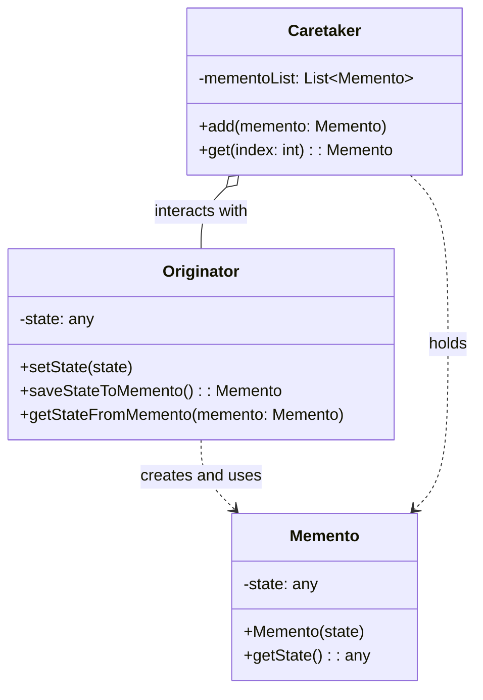

### **메멘토 패턴이란 무엇일까요?**

**메멘토 패턴**은 객체의 내부 상태를 외부에 저장하여, 나중에 그 상태로 복원할 수 있도록 하는 패턴입니다. 여기서 가장 중요한 포인트는 **[[캡슐화(Encapsulation)]]를 깨뜨리지 않는다**는 점입니다. 즉, 객체의 내부 구조나 상태 정보를 외부에 직접 노출하지 않으면서도 상태 저장 및 복원 기능을 구현할 수 있게 해줍니다.

'메멘토(Memento)'는 '기념품' 또는 '기억할 것'이라는 뜻의 라틴어입니다. 이름처럼 객체의 특정 순간을 스냅샷처럼 찍어 '기념품'으로 남겨두었다가, 필요할 때 그 '기념품'을 사용해 과거의 모습으로 돌아가는 것을 상상하면 이해하기 쉽습니다.

---

### **메멘토 패턴의 구조**

메멘토 패턴은 세 가지 주요 역할로 구성됩니다. 이들의 관계가 조금 독특하니 집중해서 봐주세요.

1. **Originator (생성자)**: 상태를 저장하고 복원할 원본 객체입니다. 자신의 현재 상태를 담은 `Memento` 객체를 생성하는 역할을 합니다. 또한, `Memento` 객체를 받아 자신의 상태를 과거 시점으로 복원합니다.
2. **Memento (메멘토)**: `Originator`의 내부 상태를 저장하는 객체입니다. `Originator`의 상태에 대한 어떤 정보도 외부에 공개하지 않습니다. 즉, `Memento`를 생성한 `Originator`만이 그 내부 상태에 접근할 수 있어야 합니다.
3. **Caretaker (관리자)**: `Originator`로부터 받은 `Memento`를 보관하고 관리하는 역할을 합니다. `Caretaker`는 `Memento`의 내부를 들여다보거나 조작하지 않습니다. 단지 필요할 때까지 안전하게 보관했다가 `Originator`에게 다시 전달해주는 역할만 수행합니다.

이 구조를 `Mermaid`로 시각화하면 다음과 같습니다.




- **Originator**는 자신의 상태(`state`)를 이용해 `Memento`를 생성합니다.
- **Caretaker**는 `Originator`가 생성한 `Memento`를 받아 `mementoList`에 저장합니다. 이때 `Caretaker`는 `Memento`의 `state`가 무엇인지 알지 못합니다.
- 사용자가 '되돌리기'를 요청하면, **Caretaker**는 보관하고 있던 `Memento`를 **Originator**에게 전달합니다.
- **Originator**는 전달받은 `Memento`를 사용해 자신의 상태를 복원합니다.

---

### **왜 메멘토 패턴을 사용해야 할까요?**

메멘토 패턴은 다음과 같은 강력한 장점을 제공합니다.

- **캡슐화 유지**: 객체의 상태 정보가 외부에 직접 노출되지 않습니다. 상태 저장 및 복원 로직이 모두 `Originator` 내부에 있기 때문에, 객체의 내부 구현을 안전하게 보호할 수 있습니다.
- **단순화된 Originator**: `Originator`는 상태 저장 및 복원 기능만 구현하면 됩니다. 상태들을 히스토리로 관리하는 복잡한 책임(예: undo/redo 스택 관리)은 `Caretaker`에게 위임되므로 [[단일 책임 원칙(Single Responsibility Principle)]]을 잘 따를 수 있습니다.
- **높은 유연성**: 상태를 저장하고 관리하는 로직(`Caretaker`)이 원본 객체(`Originator`)와 완전히 분리되어 있어, 다양한 저장 전략을 쉽게 구현하고 변경할 수 있습니다.

물론 단점도 있습니다. 상태를 저장할 때마다 `Memento` 객체가 생성되므로, `Originator`의 상태가 크거나 저장 횟수가 잦을 경우 **메모리 사용량이 크게 증가**할 수 있습니다. 따라서 시스템 리소스를 고려하여 신중하게 사용해야 합니다.

---

### **Java에서의 메멘토 패턴 활용**

간단한 텍스트 편집기의 Undo 기능을 예로 들어 메멘토 패턴을 구현해 보겠습니다.

```java
import java.util.Stack;

// Memento
class EditorMemento {
    private final String content; // private final로 불변성 보장

    public EditorMemento(String content) {
        this.content = content;
    }

    // Originator만이 접근할 수 있도록 package-private 또는 private으로 선언
    String getContent() {
        return content;
    }
}

// Originator
class Editor {
    private String content;

    public void type(String words) {
        this.content = (this.content == null ? "" : this.content) + words;
    }

    public String getContent() {
        return content;
    }

    // 현재 상태를 Memento로 저장
    public EditorMemento save() {
        return new EditorMemento(this.content);
    }

    // Memento로부터 상태 복원
    public void restore(EditorMemento memento) {
        this.content = memento.getContent();
    }
}

// Caretaker
class History {
    private Stack<EditorMemento> mementos = new Stack<>();

    public void push(EditorMemento memento) {
        mementos.push(memento);
    }

    public EditorMemento pop() {
        return mementos.pop();
    }
}


// Client
public class MementoPatternDemo {
    public static void main(String[] args) {
        Editor editor = new Editor();
        History history = new History();

        editor.type("This is the first sentence.");
        history.push(editor.save()); // 첫 번째 상태 저장

        editor.type(" This is the second.");
        history.push(editor.save()); // 두 번째 상태 저장

        editor.type(" And this is the third.");

        System.out.println("Current Content: " + editor.getContent()); // 모든 문장 출력

        // Undo 실행 (두 번째 상태로 복원)
        editor.restore(history.pop());
        System.out.println("After first undo: " + editor.getContent());

        // Undo 한 번 더 실행 (첫 번째 상태로 복원)
        editor.restore(history.pop());
        System.out.println("After second undo: " + editor.getContent());
    }
}
```

위 예제에서 `Editor`는 `History`가 자신의 상태를 어떻게 저장하고 관리하는지 전혀 알지 못합니다. `History` 또한 `EditorMemento`에 어떤 내용이 들어있는지 알 수 없습니다. 이처럼 각자의 책임을 철저히 분리하면서도 Undo 기능을 완벽하게 구현한 것을 볼 수 있습니다.

---

### **스프링 프레임워크와 메멘토 패턴**

[[스프링 프레임워크(Spring Framework)]]에서 메멘토 패턴이 명시적으로 사용되는 대표적인 예는 찾기 어렵지만, 그 원리는 여러 곳에 적용되어 있습니다. 예를 들어, **스프링 웹 플로우(Spring Web Flow)**는 대화형 웹 애플리케이션의 상태를 관리합니다. 사용자가 여러 페이지를 거쳐 작업을 수행할 때, 각 단계의 상태(스냅샷)가 저장됩니다. 사용자가 '뒤로 가기'를 누르면 이전 단계의 스냅샷으로 복원하여 플로우를 이어갈 수 있는데, 이는 메멘토 패턴의 기본 원리와 매우 유사합니다.

상태를 캡슐화하여 저장하고, 필요할 때 복원한다는 아이디어는 트랜잭션 관리나 상태 기반의 워크플로우를 구현하는 다양한 시나리오에서 응용될 수 있습니다. 자세한 내용은 상태 기반 워크플로우 설계를 참고해주세요.

---

### **결론**

메멘토 패턴은 객체의 캡슐화를 훼손하지 않으면서도 **실행 취소(Undo), 재실행(Redo), 트랜잭션, 체크포인트** 등 강력한 기능을 구현할 수 있게 해주는 우아한 해결책입니다. 객체의 상태를 특정 시점으로 되돌려야 하는 요구사항이 있다면, 메멘토 패턴은 여러분의 코드를 더욱 견고하고 유연하게 만들어 줄 것입니다.