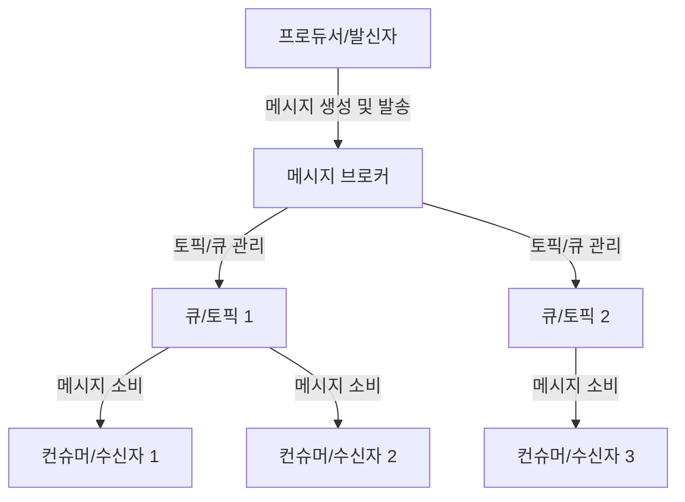
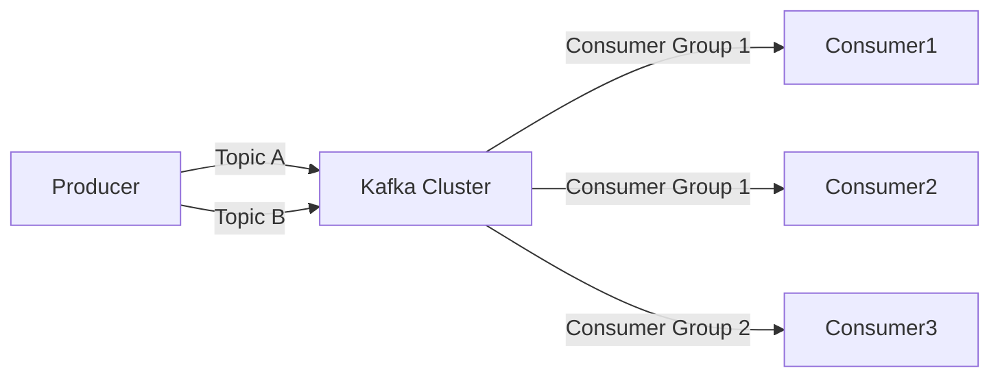

메시지 기반 아키텍처는 시스템 간의 통신을 메시지 교환을 통해 수행하는 소프트웨어 설계 패턴입니다. 이 아키텍처에서는 시스템 구성 요소가 직접적인 호출 대신 메시지를 통해 정보를 교환하며, 이를 통해 느슨한 결합(Loose Coupling)과 [[비동기(Asynchronous)]] 처리가 가능해집니다. 메시지 기반 아키텍처는 현대 분산 시스템, 마이크로서비스, 대규모 엔터프라이즈 애플리케이션 등에서 널리 활용되고 있습니다.

메시지 기반 아키텍처를 깊이 이해하기 위해서는 먼저 [[분산 시스템(Distributed System)]]과 동기식 vs 비동기식 통신의 개념을 이해하는 것이 중요합니다.

## 핵심 개념

메시지 기반 아키텍처의 핵심 개념은 다음과 같습니다:

### [[메시지(Message)]]

메시지는 시스템 간에 교환되는 정보의 기본 단위입니다. 일반적으로 메시지는 다음과 같은 구성 요소를 포함합니다:

1. **헤더(Header)**: 메시지 식별자, 타임스탬프, 라우팅 정보 등 메타데이터
2. **본문(Body)**: 실제 전송되는 데이터 내용
3. **속성(Properties)**: 메시지 처리 방식에 영향을 주는 추가 정보

### [[메시지 브로커(Message Broker)]]

메시지 브로커는 메시지의 중개자 역할을 하며, 다음과 같은 책임을 갖습니다:

1. **메시지 라우팅**: 발신자로부터 수신자에게 메시지 전달
2. **메시지 버퍼링**: 일시적인 시스템 장애 시 메시지 저장
3. **변환(Transformation)**: 필요한 경우 메시지 형식 변환
4. **보안**: 인증 및 권한 부여를 통한 메시지 보호

대표적인 메시지 브로커로는 [[아파치 카프카(Apache Kafka)]], RabbitMQ, ActiveMQ, Amazon SQS 등이 있습니다.

### 메시지 큐(Message Queue)

메시지 큐는 메시지가 처리되기 전까지 임시로 저장되는 공간으로, FIFO(First In, First Out) 방식으로 동작하는 경우가 많습니다. 메시지 큐의 주요 특징은 다음과 같습니다:

1. **비동기 처리**: 발신자는 수신자의 응답을 기다리지 않고 계속 작업 가능
2. **부하 분산**: 여러 소비자가 큐에서 메시지를 가져와 처리 가능
3. **내구성**: 시스템 장애 시에도 메시지 손실 방지

### 발행-구독(Publish-Subscribe) 패턴

발행-구독 패턴은 메시지 기반 아키텍처에서 자주 사용되는 패턴으로, 다음과 같은 특징이 있습니다:

1. **일대다 통신**: 하나의 메시지가 여러 구독자에게 전달될 수 있음
2. **토픽 기반**: 특정 주제(토픽)에 관심 있는 구독자만 메시지 수신
3. **발신자-수신자 분리**: 발신자는 구독자의 존재를 알 필요가 없음

발행-구독 패턴에 대한 자세한 내용은 발행-구독 패턴(Publish-Subscribe)을 참고해주세요.

## 아키텍처 구성

메시지 기반 아키텍처의 기본 구성은 다음과 같습니다:



1. **프로듀서(Producer)**: 메시지를 생성하고 브로커에 전송하는 시스템 구성 요소
2. **메시지 브로커(Message Broker)**: 메시지 라우팅과 저장을 담당
3. **큐/토픽(Queue/Topic)**: 메시지가 저장되는 중간 저장소
4. **컨슈머(Consumer)**: 메시지를 수신하고 처리하는 시스템 구성 요소

## 메시지 교환 패턴

메시지 기반 아키텍처에서는 다양한 메시지 교환 패턴이 사용됩니다:

### 1. 점대점(Point-to-Point)

한 발신자가 한 수신자에게 메시지를 전송하는 패턴입니다. 각 메시지는 단 하나의 수신자에 의해서만 처리됩니다.

### 2. 발행-구독(Publish-Subscribe)

앞서 설명한 대로, 발신자가 메시지를 특정 토픽에 발행하면 해당 토픽을 구독하는 모든 수신자가 메시지를 받습니다.

### 3. 요청-응답(Request-Reply)

발신자가 메시지를 보내고 수신자로부터 응답을 기다리는 패턴입니다. 비동기적으로 구현되기도 합니다.

### 4. 경쟁 소비자(Competing Consumers)

여러 소비자가 하나의 큐에서 메시지를 가져와 처리하지만, 각 메시지는 단 하나의 소비자에 의해서만 처리됩니다.

메시지 교환 패턴에 대한 자세한 내용은 메시지 교환 패턴(Message Exchange Patterns)을 참고해주세요.

## 메시지 보장 수준

메시지 기반 아키텍처에서는 다양한 수준의 메시지 전달 보장을 제공합니다:

### 1. 최대 한 번(At Most Once)

메시지가 한 번 또는 전혀 전달되지 않을 수 있습니다. 중복은 발생하지 않지만 손실 가능성이 있습니다.

### 2. 적어도 한 번(At Least Once)

메시지가 반드시 한 번 이상 전달됩니다. 손실은 없지만 중복 가능성이 있습니다.

### 3. 정확히 한 번(Exactly Once)

메시지가 정확히 한 번 전달됩니다. 가장 이상적이지만 구현이 복잡합니다.

메시지 전달 보장에 대한 자세한 내용은 메시지 전달 보장(Message Delivery Guarantees)을 참고해주세요.

## 장점과 단점

### 장점

1. **느슨한 결합(Loose Coupling)**: 시스템 구성 요소 간의 직접적인 의존성 감소
2. **확장성(Scalability)**: 시스템 구성 요소를 독립적으로 확장 가능
3. **탄력성(Resilience)**: 일부 구성 요소의 장애가 전체 시스템에 미치는 영향 최소화
4. **비동기 처리**: 자원을 효율적으로 사용하고 응답성 향상
5. **부하 분산**: 여러 소비자가 메시지를 처리함으로써 작업 부하 분산

### 단점

1. **복잡성 증가**: 직접 호출보다 아키텍처 설계와 디버깅이 복잡해짐
2. **지연 시간**: 메시지 중개로 인한 추가 지연 발생 가능
3. **일관성 관리**: 분산 시스템에서 데이터 일관성 유지가 어려워짐
4. **운영 오버헤드**: 메시지 브로커 관리 및 모니터링에 추가 리소스 필요
5. **오류 처리 복잡성**: 비동기 통신에서 오류 처리와 추적이 더 복잡해짐

## Java에서의 구현

Java에서 메시지 기반 아키텍처를 구현하는 방법은 여러 가지가 있습니다. 가장 일반적인 방법 중 하나는 [[JMS(Java Message Service)]]를 사용하는 것입니다.

### JMS 기본 예제

```java
// 메시지 생산자 예제
public void sendMessage() {
    try (Connection connection = connectionFactory.createConnection()) {
        Session session = connection.createSession(false, Session.AUTO_ACKNOWLEDGE);
        Destination destination = session.createQueue("example.queue");
        
        MessageProducer producer = session.createProducer(destination);
        TextMessage message = session.createTextMessage("Hello, Message-Based Architecture!");
        
        producer.send(message);
        System.out.println("메시지 전송 완료: " + message.getText());
    } catch (JMSException e) {
        e.printStackTrace();
    }
}

// 메시지 소비자 예제
public void receiveMessage() {
    try (Connection connection = connectionFactory.createConnection()) {
        connection.start();
        Session session = connection.createSession(false, Session.AUTO_ACKNOWLEDGE);
        Destination destination = session.createQueue("example.queue");
        
        MessageConsumer consumer = session.createConsumer(destination);
        consumer.setMessageListener(message -> {
            try {
                if (message instanceof TextMessage) {
                    String text = ((TextMessage) message).getText();
                    System.out.println("메시지 수신: " + text);
                }
            } catch (JMSException e) {
                e.printStackTrace();
            }
        });
    } catch (JMSException e) {
        e.printStackTrace();
    }
}
```

## 스프링에서의 구현

스프링 프레임워크는 메시지 기반 아키텍처를 구현하기 위한 다양한 기능을 제공합니다. 특히 Spring Integration과 Spring Cloud Stream은 메시지 기반 시스템을 쉽게 구축할 수 있도록 지원합니다.

### Spring JMS 예제

```java
@Service
public class MessageService {

    @Autowired
    private JmsTemplate jmsTemplate;
    
    // 메시지 발송
    public void sendMessage(String message) {
        jmsTemplate.convertAndSend("example.queue", message);
        System.out.println("메시지 전송 완료: " + message);
    }
    
    // 메시지 수신
    @JmsListener(destination = "example.queue")
    public void receiveMessage(String message) {
        System.out.println("메시지 수신: " + message);
        // 비즈니스 로직 처리
    }
}
```

스프링의 메시지 처리에 대한 자세한 내용은 스프링 메시지 처리를 참고해주세요.

## 주요 메시지 브로커 시스템

### Apache Kafka

대용량 데이터 스트림 처리에 최적화된 분산 이벤트 스트리밍 플랫폼입니다. 높은 처리량과 내구성을 제공합니다.



### RabbitMQ

AMQP(Advanced Message Queuing Protocol) 구현체로, 다양한 메시징 패턴과 라우팅 기능을 제공합니다.

### ActiveMQ

Apache의 오픈 소스 메시지 브로커로, JMS 구현과 다양한 클라이언트 언어 지원을 제공합니다.

각 메시지 브로커 시스템에 대한 자세한 내용은 주요 메시지 브로커 비교를 참고해주세요.

## 실제 사용 사례

메시지 기반 아키텍처는 다양한 산업 분야에서 활용되고 있습니다:

1. **마이크로서비스 통신**: 서비스 간 느슨한 결합 유지
2. **이벤트 기반 아키텍처**: 시스템 이벤트 처리 및 전파
3. **비동기 작업 처리**: 이메일 발송, 보고서 생성 등의 백그라운드 작업
4. **IoT 데이터 수집**: 센서 데이터 수집 및 처리
5. **실시간 분석**: 스트리밍 데이터의 실시간 처리

각 사용 사례에 대한 자세한 설명은 메시지 기반 아키텍처 활용 사례를 참고해주세요.

## 설계 고려사항

메시지 기반 아키텍처를 설계할 때 고려해야 할 주요 사항들은 다음과 같습니다:

### 1. 메시지 형식

XML, JSON, Protocol Buffers, Avro 등 다양한 메시지 직렬화 형식 중 적절한 것을 선택해야 합니다. 이는 성능, 확장성, 버전 관리 등에 영향을 미칩니다.

### 2. 메시지 라우팅

메시지가 적절한 수신자에게 전달되도록 라우팅 전략을 설계해야 합니다. 토픽 기반, 콘텐츠 기반, 헤더 기반 등 다양한 라우팅 방식이 있습니다.

### 3. 오류 처리

메시지 처리 중 발생하는 오류를 어떻게 처리할지 전략이 필요합니다. 재시도, 데드 레터 큐(Dead Letter Queue), 폴백 메커니즘 등을 고려해야 합니다.

### 4. 확장성

시스템 부하 증가에 대응할 수 있도록 확장 전략을 마련해야 합니다. 수평적 확장(컨슈머 증가), 수직적 확장(리소스 증가) 등의 방법이 있습니다.

### 5. 모니터링 및 관측성

메시지 흐름, 처리 상태, 지연 시간 등을 모니터링하고 문제를 신속하게 파악할 수 있는 도구와 전략이 필요합니다.

설계 고려사항에 대한 자세한 내용은 메시지 기반 아키텍처 설계 원칙을 참고해주세요.

## 트랜잭션 처리

메시지 기반 아키텍처에서 트랜잭션 처리는 중요한 과제입니다. 분산 환경에서 일관성을 유지하기 위한 몇 가지 접근 방식이 있습니다:

### 1. 2단계 커밋(Two-Phase Commit)

모든 참여자가 작업을 커밋하거나 롤백하는 데 동의해야 전체 트랜잭션이 완료됩니다. 성능 저하와 교착 상태 가능성이 단점입니다.

### 2. 보상 트랜잭션(Compensating Transaction)

실패한 작업의 영향을 상쇄하기 위한 역방향 작업을 수행합니다. 사가 패턴(Saga Pattern)이 대표적인 예입니다.

### 3. 최종 일관성(Eventual Consistency)

시스템이 일시적으로 불일치 상태에 있을 수 있지만, 결국에는 일관된 상태에 도달한다는 원칙입니다.

분산 트랜잭션에 대한 자세한 내용은 분산 시스템 트랜잭션 관리를 참고해주세요.

## 보안 고려사항

메시지 기반 아키텍처에서의 보안은 다음과 같은 측면을 고려해야 합니다:

1. **인증 및 권한 부여**: 메시지 생산자와 소비자의 신원 확인 및 접근 제어
2. **메시지 암호화**: 민감한 정보 보호를 위한 메시지 내용 암호화
3. **전송 계층 보안**: TLS/SSL을 통한 메시지 전송 보호
4. **감사 및 로깅**: 메시지 처리 과정에 대한 감사 추적 유지

보안 관련 자세한 내용은 메시지 기반 시스템 보안을 참고해주세요.

## 결론

메시지 기반 아키텍처는 현대적인 분산 시스템 설계에 있어 필수적인 패러다임으로 자리 잡았습니다. 느슨한 결합, 확장성, 탄력성 등의 장점을 통해 복잡한 시스템을 보다 관리하기 쉽고 유지보수하기 쉬운 구조로 만들 수 있습니다.

그러나 이러한 이점은 증가된 복잡성, 지연 시간, 일관성 관리의 어려움 등의 도전 과제와 함께 옵니다. 따라서 시스템 요구사항을 철저히 분석하고, 적절한 메시지 브로커와 패턴을 선택하며, 오류 처리와 모니터링 전략을 마련하는 것이 중요합니다.

앞으로의 소프트웨어 개발에서 [[이벤트 기반 아키텍처(Event-Driven Architecture)]]와 반응형 시스템(Reactive Systems)의 중요성이 계속 증가함에 따라, 메시지 기반 아키텍처의 원칙과 패턴에 대한 이해는 더욱 가치 있는 지식이 될 것입니다.

## 참고 자료

- Enterprise Integration Patterns - Gregor Hohpe, Bobby Woolf
- Designing Data-Intensive Applications - Martin Kleppmann
- Spring in Action - Craig Walls
- 스프링 공식 문서(https://docs.spring.io/spring-framework/docs/current/reference/html/integration.html)
- Apache Kafka 공식 문서(https://kafka.apache.org/documentation/)
- RabbitMQ 공식 문서(https://www.rabbitmq.com/documentation.html)