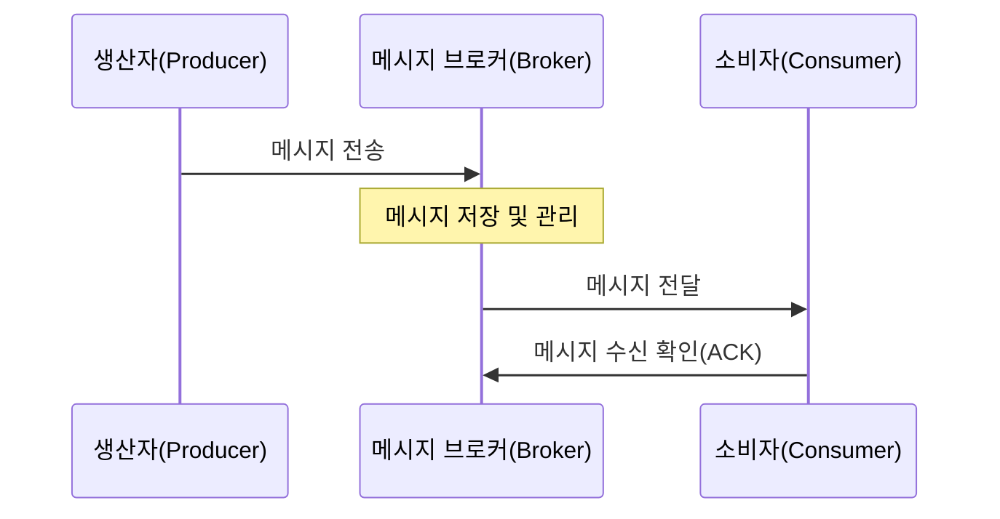
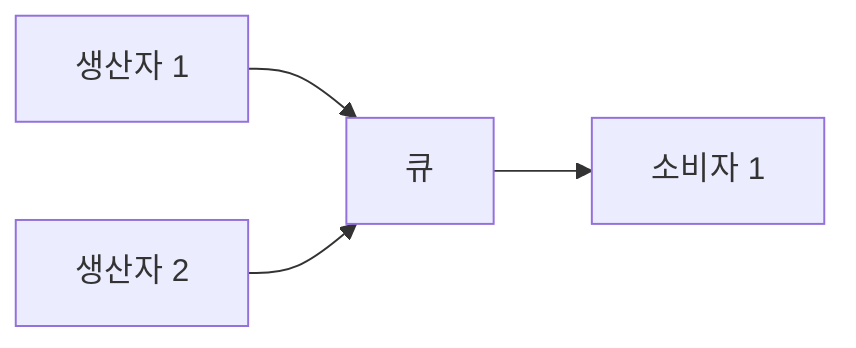
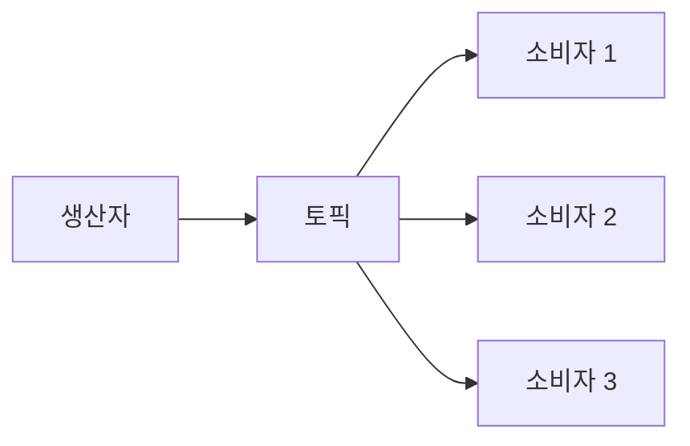

[[메시지(Message)]] 브로커는 애플리케이션, 시스템 또는 서비스 간에 메시지를 전달하는 중간 소프트웨어 컴포넌트입니다. 이는 분산 시스템에서 서로 다른 서비스나 애플리케이션이 효율적으로 통신할 수 있게 해주는 핵심 요소입니다. 메시지 브로커는 비동기 통신 패턴을 지원하여 시스템의 확장성, 유연성 및 안정성을 향상시키는 역할을 합니다.

메시지 브로커를 이해하기 위해서는 먼저 [[비동기(Asynchronous)]]와  [[메시지 기반 아키텍처(Message-Based Architecture)]]의 개념을 이해하는 것이 중요합니다.

## 메시지 브로커의 기본 개념

메시지 브로커는 다음과 같은 핵심 개념을 기반으로 동작합니다:

1. **생산자(Producer)**: 메시지를 생성하여 브로커에 전송하는 애플리케이션
2. **소비자(Consumer)**: 브로커로부터 메시지를 수신하여 처리하는 애플리케이션
3. **메시지(Message)**: 애플리케이션 간에 전달되는 데이터 단위
4. **큐/토픽(Queue/Topic)**: 메시지가 저장되는 논리적 채널
5. **라우팅(Routing)**: 메시지를 적절한 수신자에게 전달하는 과정

## 메시지 브로커의 동작 방식

메시지 브로커의 기본적인 동작 흐름은 다음과 같습니다:



1. 생산자가 메시지를 생성하여 브로커에 전송합니다.
2. 브로커는 메시지를 수신하여 적절한 큐 또는 토픽에 저장합니다.
3. 브로커는 메시지를 관련 소비자에게 전달합니다.
4. 소비자는 메시지를 처리한 후, 처리 완료 신호(ACK)를 브로커에 보냅니다.
5. 브로커는 ACK를 받은 후에 메시지를 큐에서 제거하거나, 처리 완료로 표시합니다.

## 메시지 교환 패턴

메시지 브로커는 다양한 메시지 교환 패턴을 지원합니다:

### 1. 점대점(Point-to-Point) 패턴

큐를 사용하여 메시지를 한 생산자로부터 한 소비자에게 전달합니다. 각 메시지는 한 소비자에 의해서만 처리됩니다.



### 2. 발행-구독(Publish-Subscribe) 패턴

토픽을 사용하여 메시지를 생산자로부터 여러 소비자에게 전달합니다. 각 메시지는 토픽을 구독하는 모든 소비자에게 전달됩니다.



자세한 메시지 패턴에 대한 내용은 메시지 교환 패턴을 참고해주세요.

## 주요 메시지 브로커 솔루션

현재 많이 사용되는 메시지 브로커 솔루션에는 다음과 같은 것들이 있습니다:

### 1. Apache Kafka

대용량 이벤트 스트리밍 처리에 특화된 분산 이벤트 스토어입니다. 높은 처리량과 내구성을 제공합니다.

주요 특징:

- 분산 아키텍처로 고가용성
- 로그 기반 지속성으로 데이터 손실 방지
- 파티셔닝을 통한 확장성
- 스트림 처리 기능

자세한 내용은 [[아파치 카프카(Apache Kafka)]]를 참고해주세요.

### 2. RabbitMQ

AMQP 프로토콜을 구현한 오픈소스 메시지 브로커입니다. 다양한 메시징 패턴과 확장성을 제공합니다.

주요 특징:

- 다양한 교환 타입(direct, fanout, topic, headers)
- 클러스터링 지원
- 플러그인 시스템으로 확장 가능
- 다양한 프로토콜 지원

자세한 내용은 RabbitMQ를 참고해주세요.

### 3. ActiveMQ

Apache에서 개발한 JMS(Java Message Service) 구현체입니다. 다양한 언어와 플랫폼을 지원합니다.

주요 특징:

- JMS 1.1 및 2.0 구현
- 다양한 전송 프로토콜 지원
- 클러스터링 및 네트워크 브로커 지원
- 다양한 저장소 옵션

자세한 내용은 ActiveMQ를 참고해주세요.

### 4. Amazon SQS 및 SNS

AWS에서 제공하는 관리형 메시지 큐 서비스입니다.

SQS(Simple Queue Service)는 점대점 메시징을, SNS(Simple Notification Service)는 발행-구독 메시징을 제공합니다.

자세한 내용은 AWS 메시지 서비스를 참고해주세요.

## 메시지 브로커의 구성 요소

메시지 브로커는 일반적으로 다음과 같은 구성 요소를 포함합니다:

1. **메시지 저장소**: 메시지를 저장하는 공간
2. **라우팅 메커니즘**: 메시지를 적절한 목적지로 전달하는 로직
3. **클라이언트 API**: 생산자와 소비자가 브로커와 통신하기 위한 인터페이스
4. **관리 및 모니터링 도구**: 브로커의 상태와 성능을 관리하고 모니터링하는 도구

## Java에서의 메시지 브로커 사용

Java에서는 JMS(Java Message Service) API를 통해 메시지 브로커와 통신할 수 있습니다.

### JMS 기본 예제

```java
// 메시지 생산자 예제
public void sendMessage() {
    ConnectionFactory connectionFactory = new ActiveMQConnectionFactory("tcp://localhost:61616");
    try (Connection connection = connectionFactory.createConnection()) {
        connection.start();
        Session session = connection.createSession(false, Session.AUTO_ACKNOWLEDGE);
        Destination destination = session.createQueue("example.queue");
        
        MessageProducer producer = session.createProducer(destination);
        TextMessage message = session.createTextMessage("Hello, Message Broker!");
        producer.send(message);
    } catch (JMSException e) {
        // 예외 처리
    }
}

// 메시지 소비자 예제
public void consumeMessage() {
    ConnectionFactory connectionFactory = new ActiveMQConnectionFactory("tcp://localhost:61616");
    try (Connection connection = connectionFactory.createConnection()) {
        connection.start();
        Session session = connection.createSession(false, Session.AUTO_ACKNOWLEDGE);
        Destination destination = session.createQueue("example.queue");
        
        MessageConsumer consumer = session.createConsumer(destination);
        consumer.setMessageListener(message -> {
            if (message instanceof TextMessage) {
                try {
                    String text = ((TextMessage) message).getText();
                    System.out.println("Received: " + text);
                } catch (JMSException e) {
                    // 예외 처리
                }
            }
        });
    } catch (JMSException e) {
        // 예외 처리
    }
}
```

JMS에 대한 자세한 내용은 [[JMS(Java Message Service)]]를 참고해주세요.

## 스프링 프레임워크에서의 메시지 브로커 사용

스프링 프레임워크는 메시지 브로커 통합을 위한 다양한 기능을 제공합니다:

### Spring JMS

스프링의 JMS 지원은 JMS API의 사용을 간소화합니다:

```java
@Service
public class MessageService {
    
    private final JmsTemplate jmsTemplate;
    
    public MessageService(JmsTemplate jmsTemplate) {
        this.jmsTemplate = jmsTemplate;
    }
    
    public void sendMessage(String message) {
        jmsTemplate.convertAndSend("example.queue", message);
    }
    
    @JmsListener(destination = "example.queue")
    public void receiveMessage(String message) {
        System.out.println("Received message: " + message);
    }
}
```

### Spring AMQP

스프링의 AMQP 지원은 RabbitMQ와 같은 AMQP 브로커의 사용을 간소화합니다:

```java
@Service
public class RabbitMessageService {
    
    private final RabbitTemplate rabbitTemplate;
    
    public RabbitMessageService(RabbitTemplate rabbitTemplate) {
        this.rabbitTemplate = rabbitTemplate;
    }
    
    public void sendMessage(String message) {
        rabbitTemplate.convertAndSend("exchange.name", "routing.key", message);
    }
    
    @RabbitListener(queues = "example.queue")
    public void receiveMessage(String message) {
        System.out.println("Received message: " + message);
    }
}
```

### Spring Kafka

스프링의 Kafka 지원은 Apache Kafka의 사용을 간소화합니다:

```java
@Service
public class KafkaMessageService {
    
    private final KafkaTemplate<String, String> kafkaTemplate;
    
    public KafkaMessageService(KafkaTemplate<String, String> kafkaTemplate) {
        this.kafkaTemplate = kafkaTemplate;
    }
    
    public void sendMessage(String message) {
        kafkaTemplate.send("topic.name", message);
    }
    
    @KafkaListener(topics = "topic.name")
    public void receiveMessage(String message) {
        System.out.println("Received message: " + message);
    }
}
```

스프링의 메시지 브로커 통합에 대한 자세한 내용은 스프링 메시징 프레임워크를 참고해주세요.

## 메시지 브로커의 장단점

### 장점

1. **느슨한 결합(Loose Coupling)**: 애플리케이션 간의 직접적인 의존성을 제거하여 각 컴포넌트를 독립적으로 개발, 배포 및 확장할 수 있습니다.
2. **확장성(Scalability)**: 생산자와 소비자를 독립적으로 확장할 수 있어 부하 증가에 유연하게 대응할 수 있습니다.
3. **탄력성(Resilience)**: 메시지 지속성을 통해 일시적인 장애 상황에서도 데이터 손실 없이 시스템을 복구할 수 있습니다.
4. **비동기 처리(Asynchronous Processing)**: 시간이 오래 걸리는 작업을 비동기적으로 처리하여 응답성을 향상시킬 수 있습니다.
5. **부하 분산(Load Balancing)**: 여러 소비자 간에 메시지를 분배하여 부하를 분산시킬 수 있습니다.

### 단점

1. **복잡성 증가**: 시스템 아키텍처가 복잡해지고 관리해야 할 컴포넌트가 증가합니다.
2. **오버헤드**: 메시지의 직렬화/역직렬화, 네트워크 통신 등으로 인한 성능 오버헤드가 발생할 수 있습니다.
3. **일관성 보장의 어려움**: 분산 시스템에서 일관성을 유지하기 위한 추가적인 메커니즘이 필요할 수 있습니다.
4. **디버깅 어려움**: 비동기 메시징으로 인해 문제 발생 시 디버깅이 어려울 수 있습니다.
5. **학습 곡선**: 개발자가 메시지 기반 아키텍처와 관련 패턴을 익히는 데 시간이 필요합니다.

## 메시지 브로커 설계 시 고려사항

메시지 브로커 기반 시스템을 설계할 때 고려해야 할 주요 사항들은 다음과 같습니다:

### 1. 메시지 전달 보장

메시지 브로커는 다양한 수준의 메시지 전달 보장을 제공합니다:

- **At most once**: 메시지가 최대 한 번 전달됩니다. 메시지 손실이 발생할 수 있지만 중복은 없습니다.
- **At least once**: 메시지가 최소 한 번 전달됩니다. 중복 전달이 발생할 수 있지만 손실은 없습니다.
- **Exactly once**: 메시지가 정확히 한 번 전달됩니다. 중복이나 손실이 없습니다.

적절한 전달 보장 수준은 비즈니스 요구사항에 따라 선택해야 합니다.

### 2. 메시지 순서

일부 애플리케이션에서는 메시지 처리 순서가 중요할 수 있습니다. 이런 경우에는 브로커가 메시지 순서를 보장하는지 확인해야 합니다.

### 3. 내구성

메시지 브로커가 다운되더라도 메시지가 손실되지 않도록 내구성을 보장해야 하는 경우가 많습니다. 이를 위해 메시지를 디스크에 저장하거나 복제하는 방식을 고려해야 합니다.

### 4. 성능과 확장성

메시지 처리량, 지연 시간, 저장 용량 등을 고려하여 적절한 브로커를 선택하고 구성해야 합니다.

메시지 브로커 설계에 대한 자세한 내용은 메시지 브로커 설계 패턴을 참고해주세요.

## 실제 사용 사례

메시지 브로커는 다양한 산업 분야에서 활용되고 있습니다:

### 1. 마이크로서비스 아키텍처

서비스 간 비동기 통신을 위해 메시지 브로커를 사용하여 느슨한 결합과 확장성을 확보합니다.

### 2. 이벤트 기반 아키텍처

시스템에서 발생하는 이벤트를 메시지로 발행하고, 관심 있는 서비스들이 이를 구독하여 처리합니다.

### 3. IoT(사물인터넷)

다수의 IoT 장치로부터 수집된 데이터를 처리하기 위해 메시지 브로커를 활용합니다.

### 4. 실시간 분석

대량의 데이터를 실시간으로 수집하고 분석하기 위해 메시지 브로커를 사용합니다.

### 5. 워크플로우 자동화

비즈니스 프로세스의 각 단계 간 메시지 전달을 통해 워크플로우를 자동화합니다.

실제 사례에 대한 자세한 내용은 메시지 브로커 활용 사례를 참고해주세요.

## 모니터링 및 관리

메시지 브로커를 효과적으로 운영하기 위해서는 다음과 같은 모니터링 및 관리 방안을 고려해야 합니다:

1. **메시지 처리량**: 초당 처리되는 메시지 수를 모니터링
2. **큐 깊이**: 각 큐에 대기 중인 메시지 수를 모니터링
3. **지연 시간**: 메시지 생성부터 처리까지의 시간을 측정
4. **오류율**: 실패한 메시지 처리의 비율을 모니터링
5. **자원 사용률**: CPU, 메모리, 디스크 사용량 등을 모니터링

대부분의 메시지 브로커는 자체적인 모니터링 도구를 제공하며, Prometheus, Grafana 등의 도구와 통합하여 모니터링할 수도 있습니다.

메시지 브로커 모니터링에 대한 자세한 내용은 메시지 브로커 모니터링 기법을 참고해주세요.

## 메시지 브로커 트러블슈팅

메시지 브로커 운영 중 발생할 수 있는 일반적인 문제와 해결 방법은 다음과 같습니다:

1. **메시지 백로그**: 소비자보다 생산자가 더 빠르게 메시지를 생성하는 경우, 큐에 메시지가 쌓이게 됩니다. 소비자를 확장하거나 메시지 처리 로직을 최적화하여 해결할 수 있습니다.
    
2. **메모리 부족**: 메시지 브로커가 메모리에 너무 많은 메시지를 보관하는 경우, 메모리 부족 문제가 발생할 수 있습니다. 메모리 설정을 조정하거나 디스크 기반 저장소를 활용하여 해결할 수 있습니다.
    
3. **네트워크 문제**: 네트워크 장애로 인해 메시지 전달이 지연되거나 실패할 수 있습니다. 네트워크 중복성을 확보하고 재시도 메커니즘을 구현하여 해결할 수 있습니다.
    
4. **데드레터 큐**: 처리할 수 없는 메시지를 별도의 큐(데드레터 큐)로 이동시켜 나중에 분석하고 처리할 수 있습니다.
    

메시지 브로커 트러블슈팅에 대한 자세한 내용은 메시지 브로커 문제 해결을 참고해주세요.

## 결론

메시지 브로커는 현대적인 분산 시스템에서 중요한 구성 요소로, 시스템 간의 느슨한 결합, 확장성, 탄력성을 제공합니다. 적절한 메시지 브로커 선택과 설계는 시스템의 성능, 안정성, 확장성에 큰 영향을 미칩니다.

하지만 메시지 브로커를 도입할 때는 추가적인 복잡성, 오버헤드, 학습 곡선 등의 단점도 고려해야 합니다. 비즈니스 요구사항과 시스템 특성에 맞는 메시지 브로커를 선택하고, 적절한 메시징 패턴과 구성을 적용하는 것이 중요합니다.

더 높은 수준의 추상화를 제공하는 [[이벤트 소싱(Event Sourcing)]], CQRS(Command Query Responsibility Segregation) 등의 패턴과 함께 메시지 브로커를 활용하면, 보다 견고하고 확장 가능한 시스템을 구축할 수 있습니다.

## 참고 자료

- Enterprise Integration Patterns - Gregor Hohpe, Bobby Woolf
- Designing Data-Intensive Applications - Martin Kleppmann
- Spring in Action, 6th Edition - Craig Walls
- 스프링 공식 문서(https://docs.spring.io/spring-framework/docs/current/reference/html/integration.html#jms)
- Apache Kafka 공식 문서(https://kafka.apache.org/documentation/)
- RabbitMQ 공식 문서(https://www.rabbitmq.com/documentation.html)