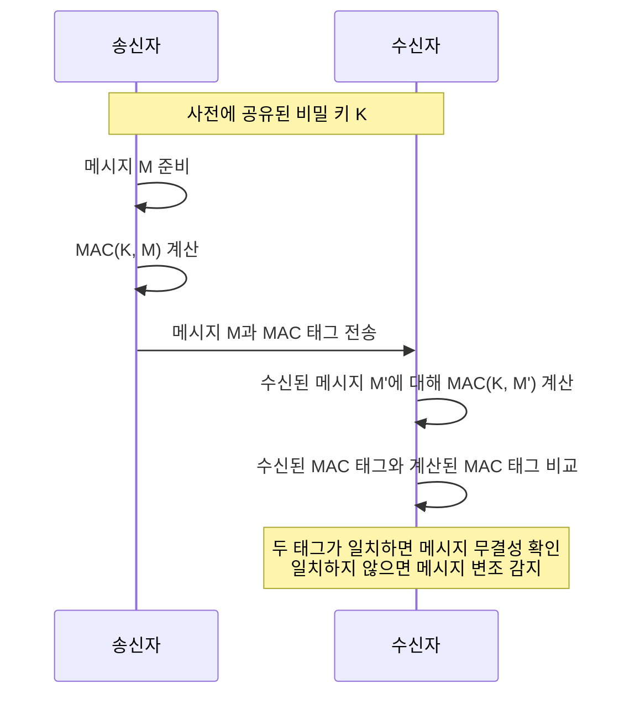

메시지 인증 코드(Message Authentication Code, MAC)는 메시지의 무결성을 검증하고 송신자를 인증하기 위한 암호학적 기술입니다. 비밀 키를 사용하여 메시지에 대한 인증 태그를 생성하며, 수신자는 동일한 키로 메시지의 변조 여부를 확인할 수 있습니다. MAC은 데이터 전송 과정에서 발생할 수 있는 우발적 또는 의도적인 변경을 탐지하는 데 중요한 역할을 합니다.

## MAC의 기본 개념

메시지 인증 코드는 다음과 같은 세 가지 알고리즘으로 구성됩니다:

1. **키 생성 알고리즘**: 송신자와 수신자가 공유하는 비밀 키를 생성합니다.
2. **서명 알고리즘**: 메시지와 비밀 키를 입력으로 받아 MAC 태그를 생성합니다.
3. **검증 알고리즘**: 메시지, MAC 태그, 비밀 키를 입력으로 받아 메시지의 무결성을 검증합니다.

MAC은 [[해시 함수]]와 유사하지만, 비밀 키를 사용한다는 점에서 차이가 있습니다. 일반적인 해시 함수는 누구나 계산할 수 있지만, MAC은 비밀 키를 알고 있는 당사자만 생성하고 검증할 수 있습니다.

## MAC의 작동 원리



1. 송신자와 수신자는 사전에 안전한 방법으로 비밀 키(K)를 공유합니다.
2. 송신자는 메시지(M)와 비밀 키(K)를 MAC 알고리즘에 입력하여 MAC 태그를 생성합니다.
3. 송신자는 원본 메시지와 생성된 MAC 태그를 수신자에게 전송합니다.
4. 수신자는 받은 메시지와 공유된 비밀 키를 사용하여 자신의 MAC 태그를 계산합니다.
5. 수신자는 자신이 계산한 MAC 태그와 송신자로부터 받은 MAC 태그를 비교합니다.
6. 두 태그가 일치한다면, 메시지는 변조되지 않았고 인증된 송신자로부터 온 것임을 확인할 수 있습니다.

## MAC의 주요 특성

### 1. 무결성 보장

MAC은 메시지가 전송 과정에서 변경되지 않았음을 보장합니다. 공격자가 메시지를 수정하면 MAC 태그가 일치하지 않게 됩니다.

### 2. 인증 제공

MAC은 메시지가 인증된 송신자로부터 왔음을 보장합니다. 비밀 키를 알고 있는 사람만이 유효한 MAC 태그를 생성할 수 있기 때문입니다.

### 3. 부인 방지 기능 부재

MAC은 송신자와 수신자 모두 같은 키를 공유하기 때문에, 제3자에게 메시지의 출처를 증명할 수 없습니다. 이는 [[디지털 서명]]과의 주요 차이점입니다.

### 4. 효율성

MAC은 [[공개 키 암호화]] 기반의 인증 방식에 비해 계산이 빠르고 효율적입니다.

## 주요 MAC 알고리즘

### 1. HMAC (Hash-based Message Authentication Code)

가장 널리 사용되는 MAC 알고리즘으로, [[SHA-256]]과 같은 표준 암호화 해시 함수와 비밀 키를 결합하여 사용합니다. HMAC은 해시 함수의 내부 동작을 변경하지 않고도 안전한 MAC을 구현할 수 있습니다.

```java
import javax.crypto.Mac;
import javax.crypto.spec.SecretKeySpec;
import java.nio.charset.StandardCharsets;
import java.util.Base64;

public class HMACExample {
    public static String calculateHMAC(String data, String key) throws Exception {
        Mac hmac = Mac.getInstance("HmacSHA256");
        SecretKeySpec secretKey = new SecretKeySpec(key.getBytes(StandardCharsets.UTF_8), "HmacSHA256");
        hmac.init(secretKey);
        byte[] hmacBytes = hmac.doFinal(data.getBytes(StandardCharsets.UTF_8));
        return Base64.getEncoder().encodeToString(hmacBytes);
    }
}
```

### 2. CMAC (Cipher-based Message Authentication Code)

블록 암호를 기반으로 하는 MAC 알고리즘으로, [[AES]]와 같은 블록 암호를 사용하여 MAC을 생성합니다.

### 3. GMAC (Galois Message Authentication Code)

[[GCM(Galois/Counter Mode)]]의 인증 부분만을 사용하는 MAC 알고리즘입니다. 암호화 없이 인증만 필요한 경우에 효율적입니다.

## MAC의 활용 사례

### 1. 통신 보안

안전한 통신 프로토콜(TLS, SSH 등)에서 데이터 무결성을 보장하기 위해 사용됩니다.

### 2. API 인증

웹 API에서 요청의 출처를 인증하고 내용의 무결성을 검증하기 위해 사용됩니다. [[JWT(JSON Web Token)]]의 일부로도 활용됩니다.

```java
// Spring Security에서 HMAC을 사용한 JWT 설정 예시
@Configuration
public class SecurityConfig {
    @Bean
    public JwtEncoder jwtEncoder() {
        SecretKey key = Keys.hmacShaKeyFor(secretKeyBytes);
        JWKSource<SecurityContext> jwkSource = new ImmutableJWKSet<>(
            new JWKSet(new OctetSequenceKey.Builder(key).build())
        );
        return new NimbusJwtEncoder(jwkSource);
    }
}
```

### 3. 데이터 무결성 검증

저장된 데이터의 무결성을 검증하기 위해 사용됩니다. 예를 들어, 데이터베이스에 저장된 중요 정보가 변경되지 않았는지 확인할 수 있습니다.

### 4. 암호 저장

사용자 비밀번호를 안전하게 저장하기 위한 [[PBKDF2(Password-Based Key Derivation Function 2)]]와 같은 키 유도 함수의 기초로 활용됩니다.

## MAC과 관련 개념의 비교

### MAC vs [[해시 함수]]

- 해시 함수는 키가 없어 누구나 계산할 수 있지만, MAC은 비밀 키가 필요합니다.
- 해시 함수는 데이터 무결성만 제공하지만, MAC은 무결성과 인증을 모두 제공합니다.

### MAC vs [[디지털 서명]]

- MAC은 대칭 키를 사용하지만, 디지털 서명은 비대칭 키를 사용합니다.
- MAC은 송신자와 수신자만 검증할 수 있지만, 디지털 서명은 공개 키로 누구나 검증할 수 있습니다.
- MAC은 부인 방지 기능이 없지만, 디지털 서명은 부인 방지 기능을 제공합니다.

### MAC vs [[AEAD(Authenticated Encryption with Associated Data)]]

- MAC은 데이터 인증만 제공하지만, AEAD는 암호화와 인증을 동시에 제공합니다.
- AEAD는 일반적으로 MAC을 별도로 계산하지 않고 암호화 과정에서 인증 태그를 생성합니다.

## 보안 고려사항

### 1. 키 관리

MAC의 보안은 비밀 키의 안전한 관리에 달려있습니다. 키가 노출되면 공격자가 유효한 MAC 태그를 생성할 수 있게 됩니다.

### 2. 길이 확장 공격

일부 MAC 알고리즘은 길이 확장 공격에 취약할 수 있습니다. HMAC과 같이 이러한 공격에 저항력이 있는 알고리즘을 선택하는 것이 중요합니다.

### 3. 재전송 공격

MAC은 메시지의 신선도(freshness)를 보장하지 않습니다. [[타임스탬프]]나 [[난스(Nonce)]]를 메시지에 포함시켜 재전송 공격을 방지해야 합니다.

## 결론

메시지 인증 코드(MAC)는 데이터 무결성과 송신자 인증을 제공하는 필수적인 암호화 도구입니다. 대칭 키를 사용하는 MAC은 계산 효율성이 높고 구현이 간단하여 다양한 보안 응용 프로그램에서 널리 사용됩니다. 그러나 부인 방지 기능이 필요한 경우에는 디지털 서명과 같은 비대칭 암호화 기술과 함께 사용해야 합니다. 적절한 키 관리와 현대적인 MAC 알고리즘을 선택함으로써 안전한 메시지 인증 시스템을 구축할 수 있습니다.