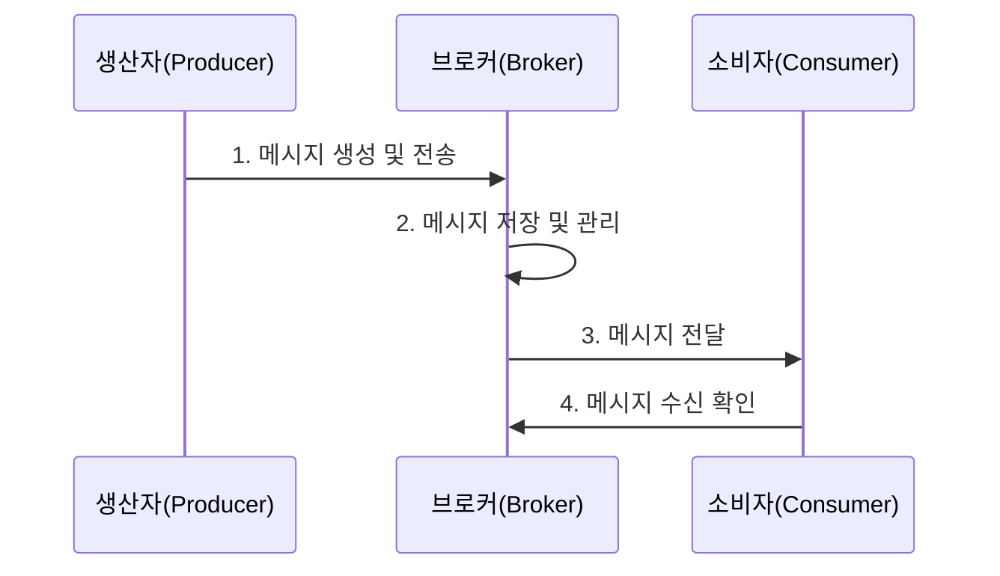
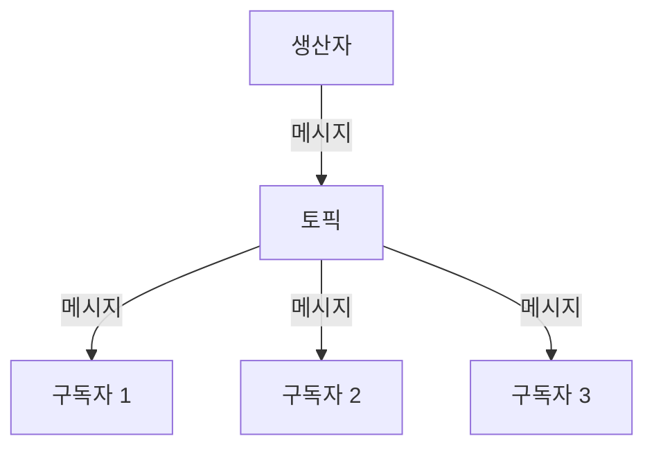

메시지 지향 미들웨어(Message-Oriented Middleware, MOM)는 분산 시스템 간의 메시지 교환을 가능하게 하는 소프트웨어 또는 하드웨어 인프라입니다. 이 미들웨어는 서로 다른 애플리케이션 간에 비동기 통신을 제공하며, 시스템 간의 직접적인 연결 없이도 데이터를 안전하게 교환할 수 있도록 합니다. MOM은 느슨한 결합(Loose Coupling)을 지원하여 분산 시스템 간의 유연성과 확장성을 향상시킵니다.

## MOM의 기본 개념

메시지 지향 미들웨어는 [[분산 시스템(Distributed System)]]의 핵심 구성 요소로, 애플리케이션 간의 통신을 메시지라는 독립적인 데이터 단위를 통해 수행합니다. 이 접근 방식은 시스템 간의 직접적인 의존성을 줄이고 [[비동기 통신 패턴]]을 가능하게 합니다.

## MOM의 주요 구성 요소

1. **[[메시지 브로커(Message Broker)]]**: 메시지의 라우팅, 변환, 저장을 담당하는 중앙 컴포넌트입니다.
2. **메시지 큐(Message Queue)**: 메시지가 저장되고 전달되기 전까지 대기하는 버퍼 공간입니다.
3. **메시지 생산자(Message Producer)**: 메시지를 생성하여 MOM으로 전송하는 애플리케이션 또는 구성 요소입니다.
4. **메시지 소비자(Message Consumer)**: MOM으로부터 메시지를 수신하고 처리하는 애플리케이션 또는 구성 요소입니다.
5. **메시지 채널(Message Channel)**: 메시지가 전송되는 가상의 파이프라인입니다.
6. **메시지(Message)**: 시스템 간에 교환되는 데이터의 기본 단위로, 일반적으로 헤더와 본문으로 구성됩니다.

## MOM의 작동 방식

MOM은 기본적으로 다음과 같은 방식으로 작동합니다:



1. **메시지 생성 및 전송**: 생산자가 메시지를 생성하고 MOM 브로커에 전송합니다.
2. **메시지 저장 및 관리**: 브로커는 메시지를 수신하여 필요한 변환을 수행하고, 적절한 큐나 토픽에 저장합니다.
3. **메시지 전달**: 소비자가 사용 가능한 상태가 되면, 브로커는 저장된 메시지를 소비자에게 전달합니다.
4. **메시지 수신 확인**: 소비자는 메시지 처리 후 브로커에게 수신 확인을 보냅니다(설정에 따라 다름).

## MOM의 통신 모델

MOM은 일반적으로 두 가지 주요 통신 모델을 지원합니다:

### 1. 점대점 모델(Point-to-Point, P2P)


- 하나의 메시지는 정확히 하나의 소비자에 의해서만 처리됩니다.
- 메시지는 큐(Queue)에 저장됩니다.
- 메시지는 소비자가 처리할 때까지 큐에 유지됩니다.
- 여러 소비자가 같은 큐에서 메시지를 수신할 수 있지만, 각 메시지는 한 번만 처리됩니다.

### 2. 게시-구독 모델(Publish-Subscribe, Pub/Sub)



- 하나의 메시지가 여러 구독자에게 전달될 수 있습니다.
- 메시지는 토픽(Topic)에 게시됩니다.
- 토픽을 구독하는 모든 활성 소비자가 메시지의 복사본을 받습니다.
- 메시지가 게시될 때 활성 상태가 아닌 소비자는 메시지를 받지 못할 수 있습니다(지속성 구독을 사용하지 않는 경우).

## MOM의 주요 기능

메시지 지향 미들웨어는 다음과 같은 주요 기능을 제공합니다:

### 1. 메시지 라우팅(Message Routing)

메시지를 적절한 목적지로 전달하는 기능입니다. 메시지 헤더, 내용 또는 비즈니스 규칙에 따라 라우팅 결정이 이루어질 수 있습니다.

자세한 내용은 [[메시지 라우팅 전략]]을 참고해주세요.

### 2. 메시지 변환(Message Transformation)

서로 다른 시스템 간의 메시지 형식 차이를 해결하기 위해 메시지 형식을 변환하는 기능입니다.

### 3. 메시지 지속성(Message Persistence)

시스템 장애 시에도 메시지가 손실되지 않도록 메시지를 디스크에 저장하는 기능입니다.

### 4. 트랜잭션 지원(Transaction Support)

메시지 전송과 수신이 트랜잭션의 일부로 처리될 수 있도록 하는 기능입니다. 이를 통해 모든 작업이 성공적으로 완료되거나 모두 실패하도록 보장합니다.

### 5. 보안(Security)

메시지 암호화, 인증, 권한 부여 등의 보안 기능을 제공합니다.

### 6. 신뢰성 있는 전달(Reliable Delivery)

메시지가 최소한 한 번은 전달되도록 보장하는 기능입니다. 옵션에 따라 정확히 한 번(exactly-once) 전달을 보장하는 메커니즘도 제공할 수 있습니다.

자세한 내용은 [[메시지 전달 보장 수준]]을 참고해주세요.

## MOM의 장점

메시지 지향 미들웨어는 다음과 같은 장점을 제공합니다:

1. **느슨한 결합(Loose Coupling)**: 시스템 간의 직접적인 의존성을 제거하여 유지보수와 확장이 용이합니다.
2. **비동기 통신(Asynchronous Communication)**: 송신자가 수신자의 응답을 기다릴 필요 없이 작업을 계속 진행할 수 있습니다.
3. **부하 균형(Load Balancing)**: 메시지를 여러 소비자에게 분산하여 시스템 부하를 균등하게 분배할 수 있습니다.
4. **확장성(Scalability)**: 시스템 구성 요소를 독립적으로 확장할 수 있습니다.
5. **신뢰성(Reliability)**: 메시지 지속성, 트랜잭션, 확인 메커니즘을 통해 신뢰성 있는 메시지 전달을 보장합니다.
6. **이기종 시스템 통합(Heterogeneous System Integration)**: 서로 다른 플랫폼, 언어, 프로토콜을 사용하는 시스템 간의 통합을 용이하게 합니다.

## MOM의 단점

메시지 지향 미들웨어는 다음과 같은 단점도 있습니다:

1. **복잡성 증가**: 직접적인 통신보다 설계, 구현, 디버깅이 복잡할 수 있습니다.
2. **오버헤드**: 메시지 직렬화, 큐잉, 브로커 처리 등으로 인한 성능 오버헤드가 발생할 수 있습니다.
3. **지연 시간**: 비동기 통신으로 인해 응답 시간이 증가할 수 있습니다.
4. **일관성 관리의 어려움**: 분산 트랜잭션을 관리하고 일관성을 유지하는 것이 어려울 수 있습니다.
5. **운영 복잡성**: 브로커 설치, 구성, 모니터링, 관리에 추가적인 노력이 필요합니다.

## 주요 MOM 구현체

### 1. 메시지 큐 기반 MOM

- **ActiveMQ**: Apache에서 개발한 오픈 소스 메시지 브로커로, JMS, STOMP, AMQP 등 다양한 프로토콜을 지원합니다.
- **RabbitMQ**: Erlang으로 개발된 오픈 소스 메시지 브로커로, AMQP를 기본 프로토콜로 사용합니다.
- **IBM MQ**: 엔터프라이즈급 메시징 솔루션으로, 강력한 보안과 관리 기능을 제공합니다.
- **TIBCO EMS**: 엔터프라이즈 메시징 서비스로, 높은 성능과 신뢰성을 제공합니다.

### 2. 메시지 스트리밍 기반 MOM

- **Apache Kafka**: 높은 처리량과 내구성을 제공하는 분산 스트리밍 플랫폼입니다.
- **AWS Kinesis**: 실시간 데이터 스트리밍을 위한 완전 관리형 서비스입니다.
- **Google Pub/Sub**: 실시간 메시징을 위한 완전 관리형 서비스입니다.

### 3. 클라우드 기반 MOM 서비스

- **Azure Service Bus**: Microsoft의 완전 관리형 엔터프라이즈 통합 메시지 브로커입니다.
- **Amazon SQS/SNS**: AWS의 완전 관리형 메시지 큐 및 알림 서비스입니다.

자세한 비교는 [[메시지 미들웨어 비교 분석]]을 참고해주세요.

## MOM과 다른 미들웨어의 비교

메시지 지향 미들웨어는 다른 유형의 미들웨어와 다음과 같은 차이점이 있습니다:

1. **RPC(Remote Procedure Call) 미들웨어**: 동기식 통신 방식을 사용하며, 직접적인 함수 호출 의미론을 제공합니다. MOM은 비동기식 통신을 사용하고 메시지 교환 방식으로 동작합니다.
    
2. **ORB(Object Request Broker) 미들웨어**: 분산 객체 간의 통신을 지원하며 주로 동기식입니다. MOM보다 강한 결합을 가집니다.
    
3. **웹 서비스 미들웨어**: HTTP 기반의 동기식 통신에 중점을 둡니다. MOM은 전통적으로 전용 프로토콜을 사용하고 비동기 통신에 중점을 둡니다.
    
4. **ESB(Enterprise Service Bus)**: 여러 통합 패턴(메시징, 라우팅, 변환)을 포함하는 보다 포괄적인 미들웨어입니다. MOM은 ESB의 핵심 구성 요소 중 하나입니다.
    

## Java에서의 MOM 활용

Java 환경에서는 JMS(Java Message Service) API를 통해 MOM을 일관되게 활용할 수 있습니다:

```java
// ConnectionFactory 설정 (ActiveMQ 예제)
ConnectionFactory connectionFactory = new ActiveMQConnectionFactory("tcp://localhost:61616");

// 연결 생성 및 시작
Connection connection = connectionFactory.createConnection();
connection.start();

// 세션 생성
Session session = connection.createSession(false, Session.AUTO_ACKNOWLEDGE);

// 목적지 생성 (예: 큐)
Destination destination = session.createQueue("MyQueue");

// 메시지 생산자 생성
MessageProducer producer = session.createProducer(destination);

// 메시지 생성 및 전송
TextMessage message = session.createTextMessage("안녕하세요, MOM!");
producer.send(message);

// 리소스 정리
producer.close();
session.close();
connection.close();
```

다양한 MOM 구현체에 대한 자세한 활용 방법은 [[Java 기반 메시징 미들웨어 프로그래밍]]을 참고해주세요.

## Spring Framework에서의 MOM 활용

Spring Framework는 메시징 미들웨어를 쉽게 활용할 수 있는 여러 추상화 계층을 제공합니다:

### 1. Spring JMS

JMS 기반 MOM에 접근하기 위한 추상화 계층을 제공합니다:

```java
@Service
public class MessageService {
    @Autowired
    private JmsTemplate jmsTemplate;
    
    public void sendMessage(String message) {
        jmsTemplate.convertAndSend("myQueue", message);
    }
    
    @JmsListener(destination = "myQueue")
    public void receiveMessage(String message) {
        System.out.println("수신한 메시지: " + message);
    }
}
```

### 2. Spring AMQP

RabbitMQ와 같은 AMQP 기반 MOM을 위한 추상화 계층을 제공합니다:

```java
@Service
public class MessageService {
    @Autowired
    private RabbitTemplate rabbitTemplate;
    
    public void sendMessage(String message) {
        rabbitTemplate.convertAndSend("myExchange", "myRoutingKey", message);
    }
    
    @RabbitListener(queues = "myQueue")
    public void receiveMessage(String message) {
        System.out.println("수신한 메시지: " + message);
    }
}
```

### 3. Spring for Apache Kafka

Kafka를 위한 추상화 계층을 제공합니다:

```java
@Service
public class MessageService {
    @Autowired
    private KafkaTemplate<String, String> kafkaTemplate;
    
    public void sendMessage(String message) {
        kafkaTemplate.send("myTopic", message);
    }
    
    @KafkaListener(topics = "myTopic")
    public void receiveMessage(String message) {
        System.out.println("수신한 메시지: " + message);
    }
}
```

### 4. Spring Integration

다양한 메시징 패턴과 통합 시나리오를 지원하는 프레임워크를 제공합니다:

```java
@Configuration
@EnableIntegration
public class IntegrationConfig {
    
    @Bean
    public MessageChannel inputChannel() {
        return new DirectChannel();
    }
    
    @Bean
    public IntegrationFlow myFlow() {
        return IntegrationFlows.from("inputChannel")
                .filter(payload -> payload instanceof String)
                .transform(String.class, String::toUpperCase)
                .handle(System.out::println)
                .get();
    }
}
```

Spring과 MOM의 통합에 대한 자세한 내용은 [[Spring 메시징 추상화 계층]]을 참고해주세요.

## MOM 설계 및 구현 고려사항

### 1. 메시지 형식 설계

- **표준화**: JSON, XML, Protocol Buffers와 같은 표준 형식 사용을 고려합니다.
- **버전 관리**: 메시지 형식 변경에 대비한 버전 관리 전략을 마련합니다.
- **스키마 정의**: 명확한 메시지 구조를 위한 스키마를 정의합니다.

### 2. 성능 최적화

- **배치 처리**: 여러 메시지를 배치로 전송하여 네트워크 오버헤드를 줄입니다.
- **압축**: 대용량 메시지는 압축하여 전송합니다.
- **메모리 관리**: 메모리 사용량을 모니터링하고 최적화합니다.

### 3. 오류 처리 전략

- **데드 레터 큐(Dead Letter Queue)**: 처리할 수 없는 메시지를 저장하는 특수 큐를 설정합니다.
- **재시도 메커니즘**: 일시적인 오류에 대한 재시도 로직을 구현합니다.
- **오류 로깅**: 상세한 오류 정보를 로깅하여 문제 해결에 활용합니다.

### 4. 모니터링 및 관리

- **메트릭 수집**: 큐 깊이, 메시지 처리량, 지연 시간 등의 메트릭을 수집합니다.
- **알림 설정**: 문제 상황을 조기에 감지하기 위한 알림을 설정합니다.
- **대시보드**: 시스템 상태를 한눈에 파악할 수 있는 대시보드를 구성합니다.

자세한 설계 가이드라인은 [[메시지 기반 시스템 설계 패턴]]을 참고해주세요.

## MOM 활용 사례

메시지 지향 미들웨어는 다양한 산업과 시나리오에서 활용됩니다:

### 1. 금융 서비스

- 거래 처리 시스템: 주문, 결제, 청산, 결제 메시지를 안전하게 전달합니다.
- 실시간 사기 탐지: 의심스러운 거래를 분석 시스템에 즉시 전달합니다.

### 2. 전자 상거래

- 주문 처리: 주문, 재고, 배송, 결제 시스템 간의 조율을 위해 메시지를 사용합니다.
- 재고 관리: 재고 변동 사항을 실시간으로 전파합니다.

### 3. IoT(사물인터넷)

- 센서 데이터 수집: 수많은 디바이스에서 발생하는 데이터를 수집 및 처리합니다.
- 디바이스 제어: 원격으로 디바이스에 명령을 전송합니다.

### 4. 마이크로서비스 아키텍처

- 서비스 간 통신: 마이크로서비스 간의 비동기 통신 채널로 활용됩니다.
- 이벤트 기반 아키텍처: 시스템 이벤트를 발행하고 구독하는 메커니즘을 제공합니다.

자세한 사례 연구는 [[메시지 지향 미들웨어 활용 사례]]를 참고해주세요.

## MOM의 미래 동향

메시지 지향 미들웨어는 다음과 같은 방향으로 발전하고 있습니다:

1. **클라우드 네이티브 메시징**: 컨테이너화, 마이크로서비스 지원, 서버리스 통합 등 클라우드 환경에 최적화된 메시징 솔루션이 증가하고 있습니다.
    
2. **실시간 스트리밍 처리**: 단순한 메시지 전달을 넘어 실시간 데이터 스트림 처리 기능이 강화되고 있습니다.
    
3. **하이브리드 및 멀티 클라우드 메시징**: 온프레미스와 다양한 클라우드 환경을 연결하는 통합 메시징 솔루션이 중요해지고 있습니다.
    
4. **AI/ML 통합**: 메시지 라우팅, 우선순위 지정, 이상 탐지 등에 인공지능과 기계학습 기술이 적용되고 있습니다.
    
5. **경량화 및 엣지 컴퓨팅**: IoT와 엣지 환경에서 사용하기 위한 경량 메시징 프로토콜과 구현체가 발전하고 있습니다.
    

## 결론

메시지 지향 미들웨어는 분산 시스템의 복잡성을 관리하고 시스템 간의 느슨한 결합을 촉진하는 중요한 도구입니다. 비동기 통신, 신뢰성 있는 메시지 전달, 확장성 등의 이점을 제공하며, 다양한 산업과 시나리오에서 활용되고 있습니다.

현대적인 시스템 아키텍처, 특히 마이크로서비스와 이벤트 기반 아키텍처에서 MOM은 더욱 중요한 역할을 담당하고 있습니다. 클라우드 네이티브 환경의 발전과 함께 MOM도 계속 진화하고 있으며, 보다 유연하고 확장 가능한 통합 솔루션을 제공하고 있습니다.

MOM을 효과적으로 활용하기 위해서는 메시지 형식 설계, 오류 처리, 성능 최적화, 모니터링 등 다양한 측면에서의 세심한 설계와 구현이 필요합니다. 또한 비즈니스 요구사항과 시스템 특성에 맞는 적절한 MOM 구현체를 선택하는 것도 중요합니다.

## 참고 자료

- Enterprise Integration Patterns - Gregor Hohpe, Bobby Woolf
- 메시징 시스템 설계와 구현 - Mark Richards
- Apache ActiveMQ 인 액션 - Bruce Snyder, Dejan Bosanac, Rob Davies
- 카프카: 데이터 플랫폼의 최강자 - 네하 나크헤데, 그웬 샤피라
- 스프링 인 액션 - 크레이그 월즈
- 마이크로서비스 패턴 - 크리스 리처드슨