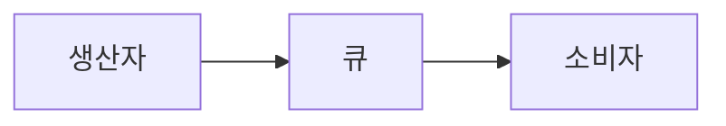
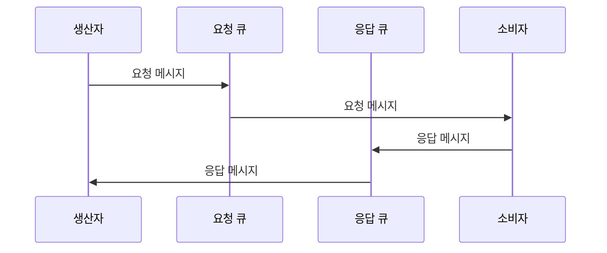
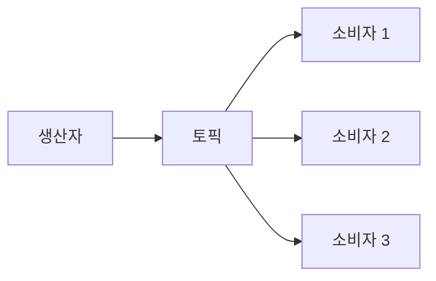

메시지는 분산 시스템에서 애플리케이션 간 데이터를 전달하는 기본 단위입니다. [[메시지 브로커(Message Broker)]]와 같은 중간 계층을 통해 송신자(Producer)가 수신자(Consumer)에게 정보를 전달하기 위해 사용하는 데이터 패킷입니다. 메시지는 현대 소프트웨어 아키텍처, 특히 마이크로서비스 환경에서 시스템 간 통신의 핵심 요소로 작용합니다.

## 메시지의 구성 요소

메시지는 일반적으로 다음과 같은 구성 요소를 포함합니다:

1. **헤더(Header)**: 메시지 처리에 필요한 메타데이터를 포함합니다.
    - 메시지 ID: 메시지의 고유 식별자
    - 타임스탬프: 메시지 생성 시간
    - 우선순위: 메시지 처리 우선순위
    - 메시지 타입: 메시지의 종류를 나타내는 정보
    - 만료 시간: 메시지의 유효 기간
    - 상관관계 ID: 연관된 메시지를 추적하기 위한 식별자
2. **본문(Body/Payload)**: 실제 전달하려는 데이터가 포함됩니다.
    - 텍스트, JSON, XML, 바이너리 데이터 등 다양한 형식으로 표현될 수 있습니다.
3. **속성(Properties)**: 헤더와 본문 외에 추가적인 정보를 담는 영역입니다.
    - 애플리케이션 특화 속성들을 포함할 수 있습니다.
    - 라우팅 정보, 필터링 조건 등을 지정할 수 있습니다.

## 메시지 형식

메시지는 다양한 형식으로 표현될 수 있으며, 가장 일반적인 형식들은 다음과 같습니다:

### 1. 텍스트 기반 메시지

- **JSON**: 가독성이 좋고 대부분의 언어에서 지원하는 경량 데이터 교환 형식입니다.
- **XML**: 구조적인 데이터를 표현하는 마크업 언어로, 다양한 스키마 검증이 가능합니다.
- **YAML**: 사람이 읽기 쉬운 데이터 직렬화 형식으로, 주로 설정 데이터에 사용됩니다.

### 2. 바이너리 메시지

- **Protocol Buffers**: Google에서 개발한 구조화된 데이터 직렬화 방식으로, 메시지 크기가 작고 처리 속도가 빠릅니다.
- **Apache Avro**: 스키마 기반 직렬화 시스템으로, 스키마 변경에 유연하게 대응할 수 있습니다.
- **MessagePack**: JSON과 유사하지만 바이너리 형식으로 변환되어 크기가 작고 처리 속도가 빠릅니다.

메시지 형식 선택은 성능, 호환성, 확장성 등 다양한 요소를 고려해야 합니다. 자세한 내용은 메시지 직렬화 방식 비교를 참고해주세요.

## 메시지 패턴

메시지를 활용한 통신 패턴은 크게 다음과 같이 구분할 수 있습니다:

### 1. 점대점(Point-to-Point) 패턴

- 하나의 생산자가 메시지를 보내면 하나의 소비자만 처리합니다.
- 큐(Queue)를 통해 구현되며, 메시지는 정확히 한 번만 처리됩니다.
- 작업 분배나 명령 전달에 적합합니다.



### 2. 요청-응답(Request-Reply) 패턴

- 생산자가 메시지를 보내고 소비자로부터 응답을 기다립니다.
- 동기 또는 비동기 방식으로 구현될 수 있습니다.
- RPC(원격 프로시저 호출)와 유사한 패턴입니다.



### 3. 발행-구독(Publish-Subscribe) 패턴

- 하나의 생산자가 메시지를 발행하면 여러 소비자가 수신할 수 있습니다.
- 토픽(Topic)을 통해 구현되며, 동일한 메시지를 여러 구독자가 처리합니다.
- 이벤트 알림이나 상태 변화 전파에 적합합니다.



이러한 패턴들은 실제 시스템에서 조합되어 사용되는 경우가 많습니다. 자세한 내용은 메시지 교환 패턴을 참고해주세요.

## 메시지 전송 보장 수준

메시지 시스템은 다양한 수준의 전송 보장을 제공할 수 있습니다:

### 1. At-most-once (최대 한 번)

- 메시지가 전달되지 않을 수 있지만, 중복 전달되지는 않습니다.
- 모든 메시지가 중요하지 않은 경우(예: 로그, 통계 데이터)에 적합합니다.
- 일반적으로 성능이 좋으나 메시지 손실 가능성이 있습니다.

### 2. At-least-once (최소 한 번)

- 메시지가 반드시 전달되지만, 중복 전달될 가능성이 있습니다.
- 수신자가 멱등성(idempotent)을 보장해야 합니다.
- 메시지 손실은 허용할 수 없지만 중복 처리는 가능한 경우에 적합합니다.

### 3. Exactly-once (정확히 한 번)

- 메시지가 정확히 한 번만 전달됩니다.
- 구현이 가장 복잡하고 오버헤드가 큽니다.
- 금융 거래와 같이 중복 처리나 손실이 허용되지 않는 경우에 필요합니다.

전송 보장 수준 선택은 비즈니스 요구사항, 시스템 복잡도, 성능 간의 균형을 고려해야 합니다. 자세한 내용은 메시지 전송 보장 수준과 구현 방법을 참고해주세요.

## Java에서의 메시지 구현

Java에서는 다양한 방법으로 메시지를 구현하고 처리할 수 있습니다:

### 1. [[JMS(Java Message Service)]]

JMS는 Java 애플리케이션 간 메시징을 위한 표준 API입니다:

```java
// 메시지 생성 및 전송 예제
public void sendMessage(String text) throws JMSException {
    Connection connection = connectionFactory.createConnection();
    try {
        Session session = connection.createSession(false, Session.AUTO_ACKNOWLEDGE);
        Destination destination = session.createQueue("example.queue");
        MessageProducer producer = session.createProducer(destination);
        
        TextMessage message = session.createTextMessage(text);
        message.setStringProperty("APPLICATION_ID", "ExampleApp");
        message.setJMSPriority(4);
        message.setJMSExpiration(System.currentTimeMillis() + 3600000); // 1시간 후 만료
        
        producer.send(message);
    } finally {
        connection.close();
    }
}

// 메시지 수신 예제
public void receiveMessage() throws JMSException {
    Connection connection = connectionFactory.createConnection();
    connection.start();
    try {
        Session session = connection.createSession(false, Session.AUTO_ACKNOWLEDGE);
        Destination destination = session.createQueue("example.queue");
        MessageConsumer consumer = session.createConsumer(destination);
        
        consumer.setMessageListener(message -> {
            if (message instanceof TextMessage) {
                try {
                    TextMessage textMessage = (TextMessage) message;
                    String text = textMessage.getText();
                    String appId = textMessage.getStringProperty("APPLICATION_ID");
                    System.out.println("Received message: " + text + " from " + appId);
                } catch (JMSException e) {
                    e.printStackTrace();
                }
            }
        });
    } finally {
        // 연결은 적절한 시점에 닫아야 합니다
    }
}
```

### 2. Spring 메시징 프레임워크

Spring은 다양한 메시징 시스템과의 통합을 위한 추상화 계층을 제공합니다:

```java
@Service
public class MessageService {
    
    private final JmsTemplate jmsTemplate;
    
    public MessageService(JmsTemplate jmsTemplate) {
        this.jmsTemplate = jmsTemplate;
    }
    
    public void sendMessage(OrderMessage orderMessage) {
        jmsTemplate.convertAndSend("order.queue", orderMessage, message -> {
            message.setStringProperty("orderId", orderMessage.getOrderId());
            message.setJMSCorrelationID(UUID.randomUUID().toString());
            return message;
        });
    }
    
    @JmsListener(destination = "order.queue")
    public void receiveMessage(OrderMessage message, @Header("orderId") String orderId) {
        System.out.println("Received order: " + orderId);
        // 메시지 처리 로직
    }
}
```

Spring의 메시징 지원에 대한 자세한 내용은 스프링 메시징 프레임워크를 참고해주세요.

## 메시지 라우팅과 필터링

메시지 브로커는 다양한 라우팅 및 필터링 기능을 제공합니다:

### 1. 직접 라우팅(Direct Routing)

- 라우팅 키를 기반으로 메시지를 전달합니다.
- 정확한 키 매칭이 필요합니다.

### 2. 토픽 기반 라우팅(Topic-based Routing)

- 패턴 매칭을 사용하여 메시지를 필터링합니다.
- 예: "order._.confirmed", "user.created._" 등의 패턴

### 3. 헤더 기반 라우팅(Header-based Routing)

- 메시지 헤더 값을 기준으로 라우팅합니다.
- 다양한 조건을 조합할 수 있습니다.

### 4. 콘텐츠 기반 라우팅(Content-based Routing)

- 메시지 내용을 검사하여 라우팅합니다.
- 복잡한 조건을 적용할 수 있으나 성능 오버헤드가 있습니다.

라우팅 및 필터링에 대한 자세한 내용은 메시지 라우팅 전략을 참고해주세요.

## 메시지 변환과 처리

애플리케이션에서 메시지를 처리할 때는 다음과 같은 변환 및 처리 패턴이 사용됩니다:

### 1. 메시지 변환(Message Transformation)

- 메시지 형식을 변환합니다 (예: XML에서 JSON으로).
- 메시지 스키마를 변경합니다.
- 메시지 내용을 필터링하거나 보강합니다.

### 2. 메시지 집계(Message Aggregation)

- 여러 메시지를 하나로 합칩니다.
- 예: 여러 마이크로서비스의 응답을 하나의 응답으로 결합

### 3. 메시지 분배(Message Splitting)

- 하나의 메시지를 여러 개로 나눕니다.
- 예: 대용량 배치 작업을 여러 작은 작업으로 분할

### 4. 메시지 라우팅(Message Routing)

- 조건에 따라 메시지를 다른 목적지로 전달합니다.

이러한 패턴들은 Enterprise Integration Patterns에 자세히 설명되어 있습니다.

## 메시지 처리 오류 관리

메시지 처리 중 발생할 수 있는 오류를 관리하는 방법은 다음과 같습니다:

### 1. 데드 레터 큐(Dead Letter Queue)

- 처리할 수 없는 메시지를 별도의 큐로 이동시킵니다.
- 나중에 분석하고 재처리할 수 있습니다.

### 2. 재시도 메커니즘(Retry Mechanism)

- 일시적인 오류가 발생한 경우 메시지 처리를 재시도합니다.
- 지수 백오프(exponential backoff) 등의 전략을 적용할 수 있습니다.

### 3. 서킷 브레이커(Circuit Breaker)

- 연속적인 오류가 발생하면 일시적으로 메시지 처리를 중단합니다.
- 시스템 부하를 줄이고 복구 시간을 확보합니다.

오류 관리 전략에 대한 자세한 내용은 메시지 처리 오류 관리 전략을 참고해주세요.

## 메시지 트랜잭션

분산 시스템에서 메시지 처리와 관련된 트랜잭션 관리는 중요한 고려사항입니다:

### 1. 로컬 트랜잭션(Local Transaction)

- 단일 메시징 시스템 내에서의 트랜잭션입니다.
- 메시지 전송과 수신을 원자적으로 처리합니다.

### 2. 분산 트랜잭션(Distributed Transaction)

- 여러 시스템에 걸친 트랜잭션입니다.
- 구현이 복잡하고 성능 오버헤드가 큽니다.
- XA 프로토콜 등을 사용할 수 있습니다.

### 3. 사가 패턴(Saga Pattern)

- 일련의 로컬 트랜잭션으로 분산 트랜잭션을 대체합니다.
- 보상 트랜잭션(compensating transaction)을 통해 실패를 처리합니다.

트랜잭션 관리에 대한 자세한 내용은 메시지 기반 트랜잭션 관리를 참고해주세요.

## 메시지 모니터링 및 추적

효과적인 메시지 시스템 운영을 위해서는 모니터링과 추적이 필수적입니다:

### 1. 메시지 추적(Message Tracing)

- 메시지의 흐름을 추적하여 시스템 간 경로를 시각화합니다.
- 상관관계 ID(correlation ID)를 사용하여 관련 메시지를 연결합니다.

### 2. 성능 모니터링(Performance Monitoring)

- 처리량, 지연 시간, 오류율 등의 지표를 수집하고 분석합니다.
- 병목 현상을 식별하고 성능을 최적화합니다.

### 3. 알림 및 경고(Alerting)

- 비정상적인 패턴이나 오류가 발생할 때 알림을 생성합니다.
- 문제가 심각해지기 전에 조치를 취할 수 있습니다.

모니터링 및 추적에 대한 자세한 내용은 메시지 시스템 모니터링 기법을 참고해주세요.

## 메시지 보안

메시지 시스템에서의 보안은 다음과 같은 측면을 고려해야 합니다:

### 1. 인증 및 권한 부여(Authentication and Authorization)

- 메시지 생성자와 소비자의 신원을 확인합니다.
- 적절한 권한이 있는 사용자만 메시지를 전송하고 수신할 수 있도록 합니다.

### 2. 메시지 암호화(Message Encryption)

- 민감한 데이터를 포함하는 메시지를 암호화합니다.
- 전송 중 암호화(TLS/SSL)와 데이터 암호화를 구분하여 적용합니다.

### 3. 메시지 무결성(Message Integrity)

- 메시지가 전송 중에 변조되지 않았음을 보장합니다.
- 디지털 서명이나 해시 함수를 사용할 수 있습니다.

메시지 보안에 대한 자세한 내용은 메시지 시스템 보안 기법을 참고해주세요.

## 결론

메시지는 분산 시스템에서 애플리케이션 간 통신을 위한 핵심 요소입니다. 메시지의 구조, 형식, 전송 패턴, 보장 수준 등을 적절히 설계하고 구현함으로써 확장 가능하고 견고한 시스템을 구축할 수 있습니다. 메시지 기반 통신은 시스템 간 느슨한 결합을 촉진하고, 비동기 처리를 통해 성능과 확장성을 향상시킵니다.

효과적인 메시지 시스템을 구축하기 위해서는 메시지의 생명주기, 오류 처리, 트랜잭션 관리, 모니터링 등 다양한 측면을 고려해야 합니다. 또한 애플리케이션의 요구사항과 제약 조건에 맞는 메시지 브로커와 패턴을 선택하는 것이 중요합니다.

메시지 기반 아키텍처는 현대적인 소프트웨어 개발, 특히 마이크로서비스 아키텍처와 이벤트 기반 시스템에서 필수적인 요소입니다. 이를 통해 확장 가능하고, 유연하며, 탄력적인 시스템을 구축할 수 있습니다.

## 참고 자료

- Enterprise Integration Patterns - Gregor Hohpe, Bobby Woolf
- Designing Data-Intensive Applications - Martin Kleppmann
- Java Message Service API - Oracle
- 스프링 공식 문서(https://docs.spring.io/spring-framework/docs/current/reference/html/integration.html#jms)
- ActiveMQ, RabbitMQ, Kafka 등 메시지 브로커 공식 문서