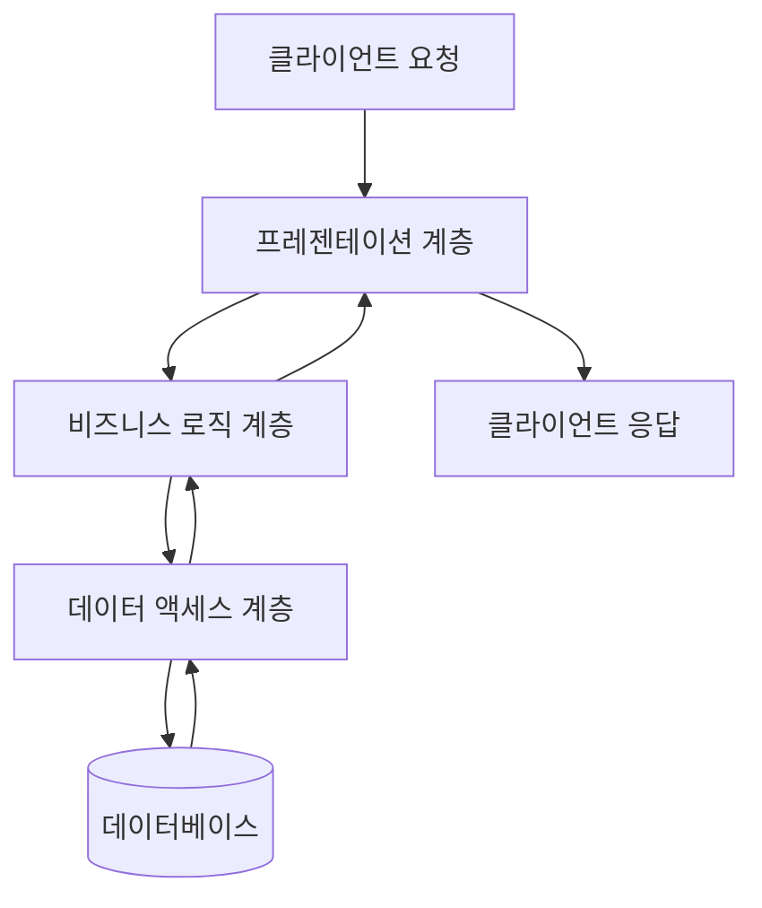

모놀리식 아키텍처는 애플리케이션의 모든 구성요소가 단일 프로그램으로 결합된 소프트웨어 디자인 패턴입니다. 사용자 인터페이스, 비즈니스 로직, 데이터 액세스 계층이 모두 하나의 코드베이스로 통합되어 단일 배포 단위로 구성됩니다. 이러한 구조는 전통적인 소프트웨어 개발 방식으로, 현재까지도 많은 기업과 조직에서 사용되고 있습니다.

## 모놀리식 아키텍처의 구조

모놀리식 애플리케이션은 일반적으로 다음과 같은 계층적 구조를 가집니다:

1. **프레젠테이션 계층**: 사용자 인터페이스와 관련된 코드(웹 페이지, API 엔드포인트 등)
2. **비즈니스 로직 계층**: 애플리케이션의 핵심 기능을 처리하는 코드
3. **데이터 액세스 계층**: 데이터베이스와의 상호작용을 담당하는 코드

이러한 계층들이 모두 하나의 애플리케이션 내에 존재하며, 같은 JVM(Java Virtual Machine) 또는 프로세스 내에서 실행됩니다.

## 모놀리식 아키텍처의 동작 방식

모놀리식 애플리케이션은 다음과 같은 흐름으로 동작합니다:



1. 클라이언트가 요청을 보냅니다.
2. 요청은 프레젠테이션 계층에서 처리됩니다.
3. 필요한 비즈니스 로직이 비즈니스 로직 계층에서 실행됩니다.
4. 데이터 액세스 계층을 통해 데이터베이스와 상호작용합니다.
5. 결과가 역순으로 전달되어 클라이언트에게 응답됩니다.

모든 과정이 단일 애플리케이션 내에서 이루어지므로 계층 간 통신은 일반적으로 메서드 호출을 통해 직접적으로 이루어집니다.

## 모놀리식 아키텍처의 장점

### 1. 개발 단순성

모든 코드가 하나의 프로젝트에 있기 때문에 개발 환경 설정이 간단합니다. 표준 IDE와 빌드 도구를 사용하여 쉽게 전체 애플리케이션을 개발할 수 있습니다.

### 2. 쉬운 디버깅

애플리케이션 내에서 발생하는 문제를 추적하기 쉽습니다. 모든 코드가 하나의 프로세스에서 실행되므로 디버깅 도구를 사용하여 전체 호출 스택을 쉽게 확인할 수 있습니다.

### 3. 성능

계층 간 통신이 네트워크 호출이 아닌 직접적인 메서드 호출로 이루어지므로, 네트워크 지연 없이 빠른 통신이 가능합니다.

### 4. 배포 단순성

하나의 애플리케이션만 배포하면 되므로 배포 프로세스가 상대적으로 간단합니다. WAR 또는 JAR 파일 하나만 생성하여 서버에 배포하면 됩니다.

### 5. 트랜잭션 관리의 용이성

모든 코드가 같은 프로세스 내에서 실행되므로 [[ACID 트랜잭션]] 관리가 용이합니다. 데이터베이스 트랜잭션을 통해 여러 작업의 원자성을 보장할 수 있습니다.

## 모놀리식 아키텍처의 단점

### 1. 확장성 제한

애플리케이션의 특정 부분만 확장하기 어렵습니다. 트래픽이 증가하면 전체 애플리케이션을 확장(스케일 아웃)해야 하므로, 리소스 사용이 비효율적일 수 있습니다.

### 2. 유지보수의 어려움

애플리케이션 규모가 커질수록 코드베이스가 복잡해지고 이해하기 어려워집니다. 이는 [[기술 부채(Technical Debt)]]의 증가로 이어질 수 있습니다.

### 3. 기술 스택의 제한

일반적으로 하나의 기술 스택만 사용해야 하므로, 특정 기능에 더 적합한 다른 언어나 프레임워크를 활용하기 어렵습니다.

### 4. 배포 위험

작은 변경사항이라도 전체 애플리케이션을 다시 배포해야 하므로, 배포 위험이 높아지고 배포 시간이 길어질 수 있습니다.

### 5. 개발 팀 협업의 어려움

여러 개발팀이 동일한 코드베이스에서 작업할 경우 코드 충돌이 발생하기 쉬우며, 이는 개발 속도를 저하시킬 수 있습니다.

## 모놀리식 아키텍처 구현 예시 (Spring Framework)

Spring Framework를 사용한 모놀리식 애플리케이션의 기본 구조를 살펴보겠습니다:

```
src/
├── main/
│   ├── java/
│   │   └── com/
│   │       └── example/
│   │           └── monolith/
│   │               ├── MonolithApplication.java
│   │               ├── controller/  (프레젠테이션 계층)
│   │               │   ├── UserController.java
│   │               │   └── OrderController.java
│   │               ├── service/     (비즈니스 로직 계층)
│   │               │   ├── UserService.java
│   │               │   └── OrderService.java
│   │               ├── repository/  (데이터 액세스 계층)
│   │               │   ├── UserRepository.java
│   │               │   └── OrderRepository.java
│   │               └── model/       (도메인 모델)
│   │                   ├── User.java
│   │                   └── Order.java
│   └── resources/
│       ├── application.properties
│       └── templates/
├── test/
└── pom.xml (또는 build.gradle)
```

비즈니스 로직을 구현하는 서비스 계층의 예시 코드입니다:

```java
@Service
public class OrderService {
    
    private final OrderRepository orderRepository;
    private final UserRepository userRepository;
    
    @Autowired
    public OrderService(OrderRepository orderRepository, UserRepository userRepository) {
        this.orderRepository = orderRepository;
        this.userRepository = userRepository;
    }
    
    @Transactional
    public Order createOrder(OrderDto orderDto) {
        User user = userRepository.findById(orderDto.getUserId())
            .orElseThrow(() -> new UserNotFoundException("User not found"));
        
        Order order = new Order();
        order.setUser(user);
        order.setItems(orderDto.getItems());
        order.setTotalAmount(calculateTotalAmount(orderDto.getItems()));
        order.setStatus(OrderStatus.CREATED);
        
        return orderRepository.save(order);
    }
    
    // 기타 비즈니스 로직 메서드들...
}
```

이 예시에서는 모든 컴포넌트가 하나의 애플리케이션 내에 존재하며, 서비스 계층에서 직접 여러 레포지토리를 주입받아 사용하고 있습니다. 또한 `@Transactional` 어노테이션을 통해 단일 트랜잭션 내에서 여러 데이터베이스 작업을 수행할 수 있습니다.

## 모놀리식 아키텍처의 최적화 전략

모놀리식 아키텍처를 사용할 때 발생할 수 있는 문제점을 완화하기 위한 몇 가지 전략이 있습니다:

### 1. 모듈화

애플리케이션을 논리적으로 독립된 모듈로 분리하여 개발합니다. Java의 경우 Java 9부터 도입된 모듈 시스템이나 Maven/Gradle의 멀티 모듈 프로젝트를 활용할 수 있습니다. 자세한 내용은 [[자바 모듈 시스템]]을 참고해주세요.

### 2. 계층 분리와 인터페이스 활용

계층 간 명확한 경계와 인터페이스를 정의하여 결합도를 낮춥니다. 이는 추후 [[마이크로서비스 아키텍처]]로의 전환을 용이하게 합니다.

### 3. 캐싱 전략

성능 향상을 위해 적절한 캐싱 전략을 도입합니다. Spring Framework의 캐싱 추상화나 Redis와 같은 외부 캐시를 활용할 수 있습니다.

### 4. 비동기 처리 도입

시간이 오래 걸리는 작업은 비동기로 처리하여 응답성을 향상시킵니다. Spring의 `@Async` 어노테이션이나 [[이벤트 기반 아키텍처]]를 활용할 수 있습니다.

### 5. 데이터베이스 최적화

인덱싱, 쿼리 최적화, 데이터베이스 샤딩 등의 기법을 통해 데이터베이스 성능을 향상시킵니다.

## 모놀리식 vs 마이크로서비스

모놀리식 아키텍처와 [[마이크로서비스 아키텍처]]는 각각 장단점이 있으며, 프로젝트의 요구사항과 팀의 상황에 따라 적절한 아키텍처를 선택해야 합니다.

|모놀리식 아키텍처|마이크로서비스 아키텍처|
|---|---|---|
|개발 복잡성|낮음 (초기에)|높음|
|배포|단일 단위로 배포|서비스별 독립 배포|
|확장성|전체 애플리케이션 단위|서비스별 독립 확장|
|기술 다양성|제한적|서비스별 다양한 기술 스택 가능|
|장애 격리|한 부분의 장애가 전체에 영향|서비스별 격리된 장애|
|적합한 프로젝트|작은~중간 규모, 명확한 도메인|대규모, 복잡한 도메인|

두 아키텍처 간의 더 자세한 비교는 [[모놀리식 vs 마이크로서비스 비교]]를 참고해주세요.

## 모놀리식 아키텍처에서 마이크로서비스로의 전환

많은 기업들이 모놀리식 애플리케이션에서 시작하여 필요에 따라 점진적으로 마이크로서비스로 전환합니다. 이러한 전환 과정에서 고려해야 할 몇 가지 패턴과 전략이 있습니다:

1. **스트랭글러 패턴(Strangler Pattern)**: 기존 모놀리식 시스템을 점진적으로 새로운 서비스로 대체하는 방식입니다.
2. **분해 패턴(Decomposition Patterns)**: 비즈니스 능력, 하위 도메인, 트랜잭션 경계 등을 기준으로 모놀리식을 분해합니다.
3. **API 게이트웨이 도입**: 클라이언트와 마이크로서비스 사이에 중개자 역할을 하는 게이트웨이를 도입합니다.

자세한 전환 전략은 [[모놀리식에서 마이크로서비스로의 전환 전략]]을 참고해주세요.

## 언제 모놀리식 아키텍처가 적합한가?

모든 프로젝트에 마이크로서비스가 필요한 것은 아닙니다. 다음과 같은 경우에는 모놀리식 아키텍처가 더 적합할 수 있습니다:

1. **스타트업 초기 단계**: 빠르게 제품을 출시하고 검증해야 하는 경우
2. **작은 팀**: 마이크로서비스의 운영 복잡성을 감당하기 어려운 소규모 팀
3. **단순한 도메인**: 비즈니스 도메인이 복잡하지 않고 명확한 경우
4. **낮은 확장성 요구사항**: 대규모 확장이 필요하지 않은 애플리케이션
5. **빠른 개발 주기**: 복잡한 인프라 설정 없이 빠르게 개발하고 배포해야 하는 경우

## 결론

모놀리식 아키텍처는 단순성과 개발 용이성이라는 장점을 가지고 있어, 많은 프로젝트에서 초기 아키텍처로 선택됩니다. 그러나 애플리케이션이 성장함에 따라 확장성과 유지보수성에 관련된 도전과제가 발생할 수 있습니다.

중요한 것은 프로젝트의 요구사항, 팀의 규모와 경험, 비즈니스 성장 전망 등을 고려하여 적절한 아키텍처를 선택하는 것입니다. 때로는 모놀리식으로 시작하여 필요에 따라 점진적으로 마이크로서비스로 전환하는 하이브리드 접근 방식이 최선의 선택일 수 있습니다.

어떤 아키텍처를 선택하든, 좋은 설계 원칙과 실천 방법을 적용하는 것이 성공적인 애플리케이션 개발의 핵심입니다. 모듈화, 관심사의 분리, 적절한 추상화 등의 원칙은 어떤 아키텍처에서든 중요하며, 이를 통해 더 유지보수하기 쉽고 확장 가능한 시스템을 구축할 수 있습니다.

## 참고 자료

- Building Microservices - Sam Newman
- Clean Architecture - Robert C. Martin
- Spring in Action - Craig Walls
- Domain-Driven Design - Eric Evans
- 마틴 파울러의 블로그 (https://martinfowler.com/articles/microservices.html)