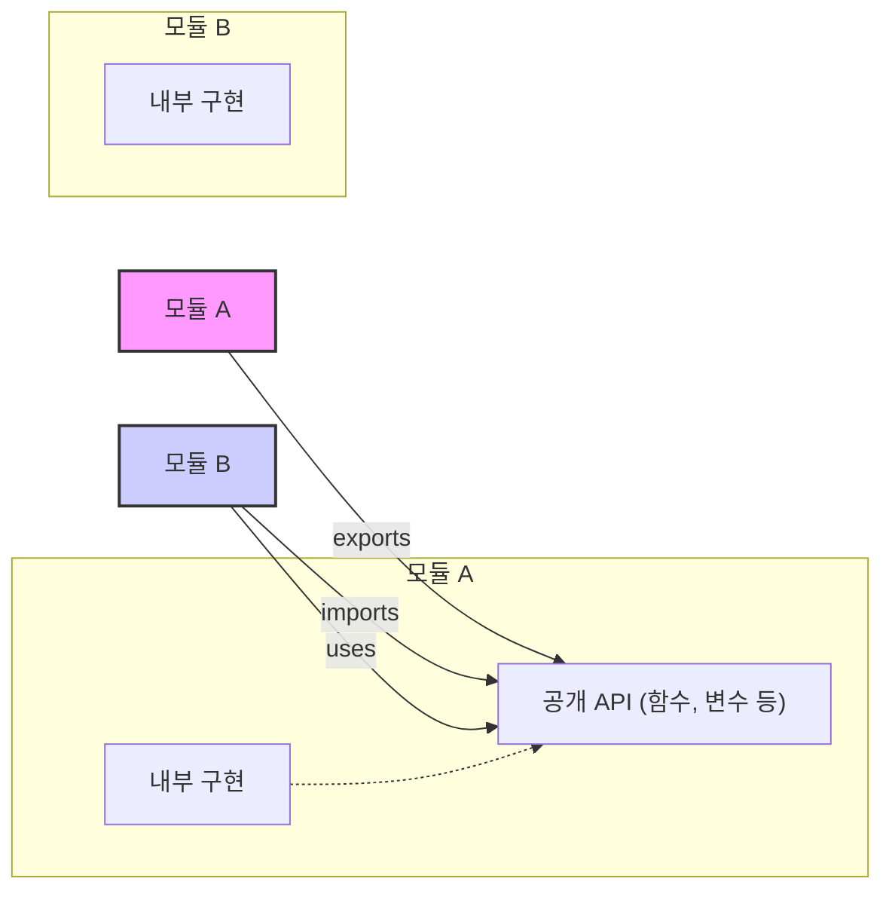

소프트웨어 개발에서 **모듈(Module)**은 특정 기능이나 관련된 데이터의 집합을 하나의 단위로 묶은 **독립적인 소프트웨어 구성 요소**입니다. 마치 레고 블록처럼, 잘 만들어진 모듈들을 조립하여 더 크고 복잡한 시스템을 구축할 수 있습니다. 모듈화는 코드의 **재사용성**을 높이고, **유지보수**를 용이하게 하며, 전체 시스템의 **이해도를 향상**시키는 데 핵심적인 역할을 합니다.

모듈을 이해하기 위해서는 모듈이 제공하는 주요 이점과 기본 구성 원리를 파악하는 것이 중요합니다.

---

## 모듈을 사용하는 이유

모듈은 소프트웨어 공학의 중요한 원칙들을 달성하기 위한 효과적인 수단입니다.

1. **[[캡슐화(Encapsulation)]]**: 모듈은 관련된 데이터와 기능을 하나로 묶고, 내부 구현을 외부로부터 숨깁니다. 이를 통해 모듈 사용자는 내부의 복잡한 로직을 알 필요 없이 정의된 인터페이스만을 통해 모듈을 사용할 수 있습니다. 이는 정보 은닉(Information Hiding) 원칙을 실현합니다.
2. **재사용성 (Reusability)**: 잘 정의된 모듈은 특정 기능이 필요한 다른 시스템이나 애플리케이션의 다른 부분에서 쉽게 가져다 사용할 수 있습니다. 이는 개발 시간과 비용을 절감하는 데 기여합니다.
3. **유지보수성 (Maintainability)**: 시스템이 모듈 단위로 잘 분리되어 있으면, 특정 기능의 수정이나 개선이 필요할 때 해당 모듈에만 집중할 수 있습니다. 이는 변경으로 인한 영향을 최소화하고, 버그 수정 및 기능 추가를 용이하게 합니다.
4. **이름 충돌 방지 (Namespace Management)**: 각 모듈은 독립적인 이름 공간(Namespace)을 가질 수 있어, 서로 다른 모듈 내에 동일한 이름의 변수나 함수가 존재하더라도 충돌 없이 사용할 수 있습니다.
5. **의존성 관리 (Dependency Management)**: 모듈 시스템은 모듈 간의 의존 관계를 명확하게 정의하고 관리할 수 있도록 도와줍니다. 이를 통해 시스템의 전반적인 구조를 파악하고, 특정 모듈의 변경이 다른 모듈에 미치는 영향을 예측하기 쉬워집니다.

---

## 모듈의 기본 구성 요소

모듈은 일반적으로 다음과 같은 요소들을 통해 자신을 정의하고 외부와 상호작용합니다.

- **인터페이스 (Interface) / 공개 API (Public API)**: 모듈이 외부로 기능을 제공하는 통로입니다. `export` 키워드 등을 사용하여 모듈 외부에서 접근 가능한 함수, 클래스, 변수 등을 지정합니다.
- **구현 (Implementation)**: 모듈의 실제 로직이 담긴 부분으로, 인터페이스를 통해 공개되지 않은 내부 코드입니다. 이 부분은 모듈 외부에서 직접 접근할 수 없거나 접근하지 않아야 합니다.
- **의존성 (Dependencies)**: 모듈이 기능을 수행하기 위해 필요한 다른 모듈들을 의미합니다. `import` 또는 `require` 와 같은 키워드를 사용하여 다른 모듈을 가져와 사용합니다.

아래는 모듈 간의 기본적인 상호작용을 나타내는 다이어그램입니다.




위 그림에서 `모듈 A`는 자신의 `공개 API`를 `exports` 하고, `모듈 B`는 이 API를 `imports` 하여 사용합니다. `모듈 A`의 `내부 구현`은 외부에 직접 노출되지 않습니다.

---

## Java에서의 모듈

Java는 모듈화를 지원하기 위한 다양한 메커니즘을 제공해왔습니다.

### 1. 패키지 (Package)

Java에서는 가장 기본적인 모듈화 단위로 패키지(Package)를 사용합니다. 패키지는 관련된 클래스와 인터페이스의 묶음으로, 이름 충돌을 방지하고 코드의 구조를 잡아주는 역할을 합니다. 접근 제어자(public, protected, private, default)를 통해 패키지 외부로의 노출 수준을 제어하며 [[캡슐화(Encapsulation)]]를 지원합니다.

### 2. JAR (Java Archive)

JAR 파일은 여러 개의 패키지와 관련 리소스를 하나로 묶어 배포하기 위한 표준 파일 형식입니다. 라이브러리나 애플리케이션을 JAR 형태로 만들어 다른 프로젝트에서 쉽게 재사용할 수 있습니다. 이는 재사용성 (Reusability)을 높이는 데 기여합니다.

### 3. Java 플랫폼 모듈 시스템 (JPMS)

Java 9부터 도입된 자바 플랫폼 모듈 시스템(JPMS)은 더 강력한 모듈화를 제공합니다. `module-info.java` 파일을 통해 모듈의 이름, 의존하는 다른 모듈(requires), 그리고 외부로 공개할 패키지(exports)를 명시적으로 선언합니다.

**예시: JPMS를 사용한 모듈 정의**

가령, `com.example.greeter.provider` 라는 모듈이 있고, 이 모듈은 `com.example.greeter.api` 패키지를 외부에 공개한다고 가정해봅시다.

```java
// com.example.greeter.provider 모듈의 module-info.java 파일
module com.example.greeter.provider {
    // 이 모듈이 com.example.greeter.api 패키지를 외부로 공개(export)함을 선언합니다.
    exports com.example.greeter.api;
}
```

만약 다른 모듈, 예를 들어 `com.example.app` 이라는 모듈이 `com.example.greeter.provider` 모듈의 기능을 사용하고 싶다면, 다음과 같이 `module-info.java` 파일에 의존성을 선언해야 합니다.

```java
// com.example.app 모듈의 module-info.java 파일
module com.example.app {
    // com.example.greeter.provider 모듈에 의존함을 선언합니다.
    requires com.example.greeter.provider;
}
```

JPMS는 다음과 같은 이점을 제공합니다:

- **강한 캡슐화**: 모듈 내부 패키지 중 `exports` 하지 않은 패키지는 기본적으로 외부에서 접근할 수 없습니다.
- **신뢰성 있는 설정**: 모듈 간의 의존 관계가 명확해져 클래스 경로(Classpath) 문제 (일명 "Classpath Hell")를 줄일 수 있습니다.
- **확장성**: 애플리케이션을 더 작은 단위로 나누어 개발하고 배포할 수 있습니다.

---

## Spring 프레임워크와 모듈

[[스프링 프레임워크(Spring Framework)]] 자체는 매우 모듈화된 구조를 가지고 있습니다. `spring-core`, `spring-beans`, `spring-context`, `spring-webmvc` 등 다양한 기능을 제공하는 여러 모듈(라이브러리)로 구성되어 있습니다. 개발자는 필요한 스프링 모듈만 선택하여 프로젝트의 의존성에 추가할 수 있습니다.

Maven이나 Gradle과 같은 빌드 도구를 사용하여 이러한 의존성을 관리합니다.

**예시: Maven `pom.xml` 파일에서 Spring 모듈 의존성 추가**

XML

```
<dependencies>
    <dependency>
        <groupId>org.springframework.boot</groupId>
        <artifactId>spring-boot-starter-web</artifactId>
    </dependency>

    <dependency>
        <groupId>org.springframework.boot</groupId>
        <artifactId>spring-boot-starter-data-jpa</artifactId>
    </dependency>
</dependencies>
```

스프링 부트(Spring Boot)의 "starter" 의존성은 관련된 여러 모듈들을 편리하게 묶어서 제공하는 역할을 합니다. 예를 들어 `spring-boot-starter-web`은 웹 애플리케이션 개발에 필요한 `spring-webmvc`, `spring-web`, 내장 톰캣 등의 여러 모듈에 대한 의존성을 한 번에 관리해줍니다. 이는 의존성 관리 (Dependency Management)를 매우 효율적으로 만들어줍니다.

애플리케이션 아키텍처 관점에서, 스프링을 사용하여 개발할 때도 비즈니스 도메인이나 기능별로 패키지(Package)를 나누고, 각 패키지 간의 의존성을 느슨하게 유지하여 모듈화의 이점을 살리는 것이 중요합니다. [[계층형 아키텍처(Layered Architecture)]]나 [[헥사고널 아키텍처(Hexagonal Architecture)]] 같은 설계 패턴은 이러한 모듈화를 촉진합니다.

---

## 모듈 설계 시 고려사항

효과적인 모듈 설계를 위해서는 몇 가지 원칙을 따르는 것이 좋습니다.

1. **높은 응집도 (High Cohesion)**: 모듈 내의 요소들은 서로 밀접하게 관련되어 하나의 명확한 목적이나 기능을 수행해야 합니다.
2. **낮은 결합도 (Low Coupling)**: 모듈 간의 의존성은 최소화해야 합니다. 한 모듈의 변경이 다른 모듈에 미치는 영향을 줄여 시스템의 유연성과 유지보수성을 높입니다.
3. **명확한 인터페이스**: 모듈이 외부에 제공하는 인터페이스는 사용하기 쉽고 이해하기 명확해야 합니다.
4. **순환 의존성 회피 (Acyclic Dependencies Principle)**: 모듈 간에 순환적인 의존 관계가 발생하지 않도록 주의해야 합니다. 순환 의존성은 시스템의 복잡도를 높이고, 빌드 및 테스트를 어렵게 만듭니다. 자세한 내용은 순환 의존성 문제와 해결 방안을 참고해주세요.
5. **적절한 크기**: 모듈은 너무 크지도, 너무 작지도 않은 적절한 크기를 유지해야 합니다.

---

## 결론

모듈은 현대 소프트웨어 개발에서 복잡성을 관리하고, 코드의 품질을 향상시키며, 개발 효율성을 높이는 데 필수적인 개념입니다. 명확한 책임과 인터페이스를 가진 독립적인 모듈로 시스템을 구성함으로써, 우리는 더욱 견고하고 유연하며 확장 가능한 애플리케이션을 구축할 수 있습니다. Java의 패키지 시스템부터 JPMS, 그리고 스프링 프레임워크의 라이브러리 구조에 이르기까지 다양한 수준에서 모듈화의 원리가 적용되고 있음을 이해하는 것이 중요합니다.

---

## 참고 자료

- Java Platform, Standard Edition Java Language Updates, Release 9 (Oracle)
- Spring Framework Documentation (공식 스프링 문서)
- Effective Java, 3rd Edition - Joshua Bloch
- Clean Architecture - Robert C. Martin