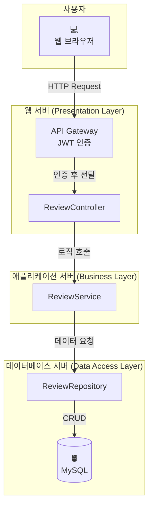
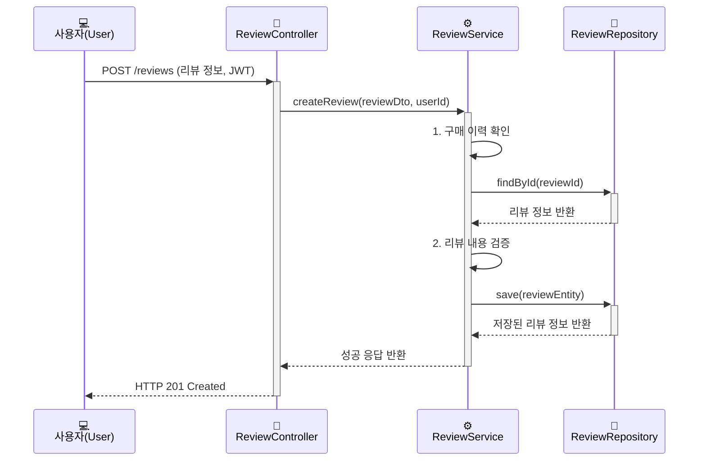

이 문서는 [[개발 계획서 작성 가이드]]에서 설명하는 원칙에 따라 작성된 "쇼핑몰 리뷰 기능 개발" 프로젝트의 구체적인 개발 계획서 예시입니다. 이러한 계획서의 초안을 효율적으로 작성하고 싶다면, [[LLM을 활용한 효과적인 개발 계획서 작성법]] 문서도 함께 참고해 보세요.

## 1. 프로젝트 개요

- **프로젝트명**: 쇼핑몰 리뷰 기능 개발
- **담당팀**: 이커머스 개발팀
- **프로젝트 기간**: 2025년 8월 4일 ~ 2025년 8월 29일 (4주)
- **프로젝트 총괄**: 최기획 PM

## 2. 목표(Goal)와 배경(Context)

- **배경**: 3분기 마케팅팀의 '고객 참여 증진 캠페인'과 연계하여, 구매 고객의 실제 경험을 공유함으로써 잠재 고객의 구매 결정을 돕고 제품의 신뢰도를 높이고자 합니다. 현재 우리 쇼핑몰은 구매 전환율이 정체 상태이며, 고객의 소리(VOC) 분석 결과 제품에 대한 실사용 후기 부족이 주요 원인 중 하나로 지목되었습니다. 팀 내에서는 [[유비쿼터스 언어(Ubiquitous Language)]]에 따라 이 기능을 '상품평'이 아닌 '리뷰'로 통일하여 부르기로 합의했습니다.
- **목표**: 사용자가 작성한 리뷰 기능을 도입하여 제품의 신뢰도를 높이고, 이를 통해 **구매 전환율을 5% 향상**시키는 것을 목표로 합니다.

## 3. 범위(Scope)

### 포함될 기능 (In-Scope)
- 사용자는 구매 완료된 상품에 대해서만 리뷰 작성이 가능합니다.
- 사용자는 텍스트(최대 500자)와 별점(1~5점)으로 리뷰를 작성할 수 있습니다.
- 작성된 리뷰는 운영팀의 검수 후 상품 상세 페이지에 노출됩니다.
- 사용자는 다른 사람의 리뷰에 '도움돼요' 버튼을 누를 수 있습니다. (중복 불가)

### 제외될 기능 (Out-of-Scope)
- 리뷰 작성 시 사진이나 동영상 첨부 기능
- 리뷰에 대한 댓글(대댓글) 기능
- 비회원 리뷰 작성 기능
- 리뷰 작성자에 대한 포인트 또는 쿠폰 지급 기능

## 4. 기존 시스템 제약사항

- **데이터베이스**: `users` 및 `products` 테이블의 스키마 변경은 불가능합니다. `reviews` 테이블은 `user_id`와 `product_id`를 외래 키로 가져야 합니다.
- **API 통신**: 모든 클라이언트-서버 통신은 RESTful API를 통해 이루어져야 하며, 기존 API Gateway의 인증 방식([[JWT(JSON Web Token)]])을 그대로 따라야 합니다.
- **프론트엔드**: 현재 운영 중인 프론트엔드 시스템은 React 17.x 버전과 Redux를 사용하고 있습니다. 새로운 리뷰 관련 UI 컴포넌트는 이 환경과 호환되어야 하며, 기존 디자인 시스템 가이드를 준수해야 합니다.
- **배포**: Jenkins를 사용한 CI/CD 파이프라인을 통해 배포가 이루어지므로, 새로운 모듈 또한 기존 배포 스크립트에 통합되어야 합니다.

## 5. 설계 (Design)

### 5.1. 고수준 설계 (High-Level Design)

리뷰 기능은 기존 쇼핑몰의 **[[모놀리식 아키텍처]]** 내에 새로운 모듈로 추가됩니다. 주요 컴포넌트는 다음과 같습니다.

- **ReviewController**: 리뷰 관련 HTTP 요청을 처리하는 API 엔드포인트. 기존 인증 필터를 통과해야 합니다.
- **ReviewService**: 리뷰 생성, 조회, 수정, 삭제 등 핵심 비즈니스 로직 처리
- **ReviewRepository**: 데이터베이스와 상호작용하여 리뷰 데이터를 관리
- **Database**: 기존에 사용하던 MySQL을 그대로 활용하며, `reviews` 테이블을 신규 추가

### 5.2. 저수준 설계 (Low-Level Design)

저수준 설계는 실제 개발 단계에서 Confluence를 통해 별도 문서로 상세히 작성될 예정입니다. 계획 단계에서는 주요 상호작용에 대한 시퀀스 다이어그램 예시를 포함합니다.

**리뷰 작성 시퀀스 다이어그램 (예시)**

## 6. 작업 분할 (WBS)

| Epic | Story | Task | 담당자 | 예상 소요(일) |
|---|---|---|---|---|
| **리뷰 기능 설계** | **설계 구체화** | 1.1. HLD 리뷰 및 확정 | 전체 | 0.5 |
| | | 1.2. LLD (클래스, API 명세) 작성 | 김개발, 이코딩 | 1.5 |
| **리뷰 기능 개발** | **백엔드 개발** | 2.1. `reviews` 테이블 생성 | 김개발 | 0.5 |
| | | 2.2. 리뷰 CRUD API 개발 (기존 인증 적용) | 김개발 | 3 |
| | | 2.3. '도움돼요' 기능 API 개발 | 김개발 | 1 |
| | **프론트엔드 개발** | 3.1. 리뷰 작성/수정 페이지 UI 개발 (React 17) | 이코딩 | 2 |
| | | 3.2. 상품 상세 페이지 내 리뷰 목록 UI 개발 | 이코딩 | 2 |
| | | 3.3. API 연동 (Redux 상태 관리 포함) | 이코딩 | 2 |
| **테스트 및 배포** | **품질 보증** | 4.1. 단위/통합 테스트 코드 작성 | 김개발, 이코딩 | 2 |
| | | 4.2. QA 및 버그 수정 | 박테스트, 전체 | 3 |
| | | 4.3. Jenkins 배포 스크립트 수정 | 김개발 | 1 |

## 7. 일정 및 마일스톤

- **1주차 (8/4~8/8)**: 설계(HLD, LLD) 완료 및 DB 스키마 확정
    - **마일스톤 1 (8/8)**: 상세 설계 문서 및 API 명세 확정
- **2주차 (8/11~8/15)**: 백엔드 API 개발 및 단위 테스트 완료
    - **마일스톤 2 (8/15)**: 모든 API 기능 구현 및 Postman 테스트 통과
- **3주차 (8/18~8/22)**: 프론트엔드 개발 및 기능 통합
    - **마일스톤 3 (8/22)**: 모든 UI 개발 및 API 연동 완료
- **4주차 (8/25~8/29)**: QA, 버그 수정 및 최종 배포
    - **최종 배포 (8/29)**

## 8. 의존성 및 리스크 분석

| 구분 | 내용 | 리스크 | 완화 전략 |
|---|---|---|---|
| **기술 의존성** | 욕설 필터링을 위해 외부 '클린봇 API' 사용 | API 응답 속도 저하 또는 장애 발생 시 리뷰 기능 전체에 영향 | - [[서킷 브레이커(Circuit Breaker) 패턴]]을 적용하여 장애 전파 방지 - API 타임아웃(3초) 설정 및 장애 시 자체 키워드 필터링으로 임시 대체 |
| **팀/작업 의존성** | LLD(특히 API 명세)가 확정되어야 개발 진행 가능 | 설계 확정 지연 시 전체 일정에 영향 | - 1주차에 설계 리뷰 및 확정을 최우선으로 진행 - API 명세 초안을 빠르게 공유하여 병렬 작업 유도 |
| **인력 리스크** | 프론트엔드 담당자(이코딩)가 1명이라 병가 등 부재 시 일정 지연 | 프론트엔드 개발 중단 | - 백엔드 개발자가 기본적인 UI 유지보수가 가능하도록 코드 리뷰 및 지식 공유 세션 진행 |

## 9. 역할과 책임 (R&R)

- **프로젝트 총괄 (PM)**: 최기획
- **백엔드 개발**: 김개발
- **프론트엔드 개발**: 이코딩
- **QA**: 박테스트

## 10. 커뮤니케이션 계획

- **일일 스크럼**: 매일 오전 10시 (15분간 진행 상황 공유)
- **주간 회의**: 매주 월요일 오후 2시 (주간 목표 리뷰 및 차주 계획 논의)
- **주요 소통 채널**: Slack `#리뷰개발` 채널
- **문서 관리**: Confluence (상세 설계 및 회의록 포함)

이 문서는 프로젝트 진행 상황에 따라 지속적으로 업데이트됩니다.