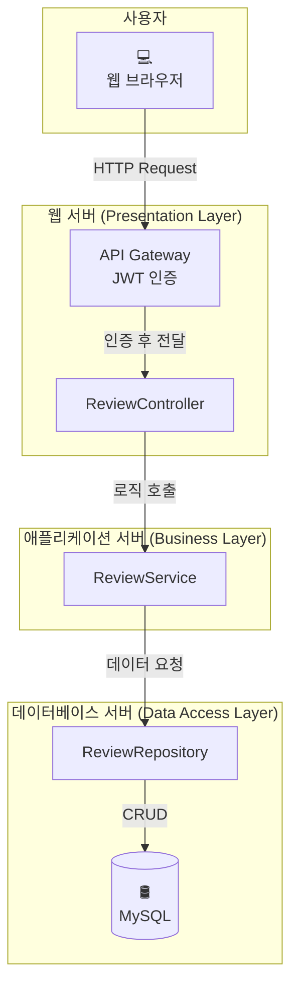
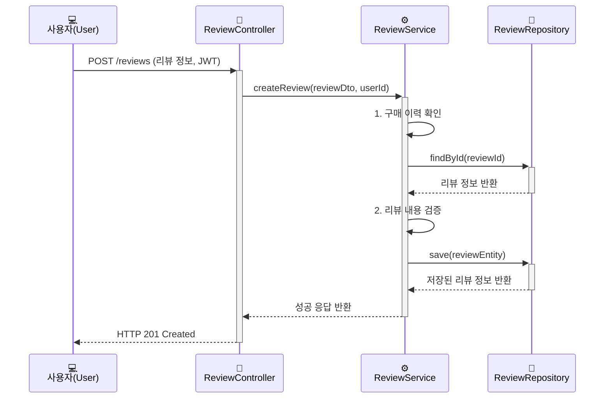
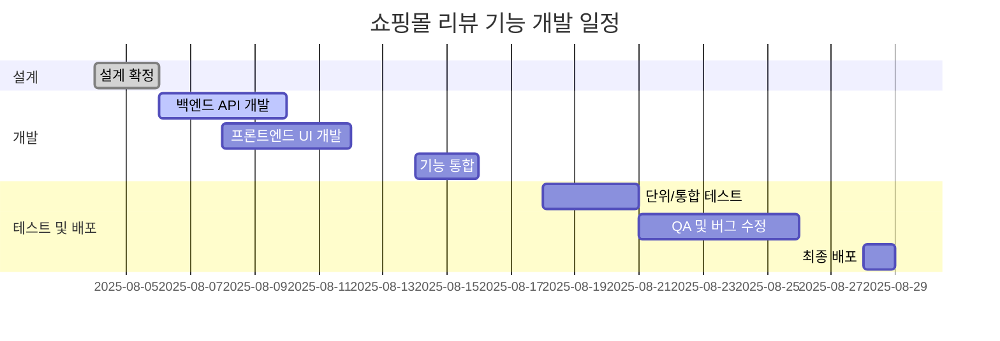

이 문서는 [[개발 계획서 작성 가이드]]에서 설명하는 원칙에 따라 작성된 "쇼핑몰 리뷰 기능 개발" 프로젝트의 구체적인 개발 계획서 예시입니다. 이러한 계획서의 초안을 효율적으로 작성하고 싶다면, [[LLM을 활용한 효과적인 개발 계획서 작성법]] 문서도 함께 참고해 보세요.

### 1. 프로젝트 요약 (Executive Summary)

본 프로젝트는 쇼핑몰의 구매 전환율 향상을 목표로, 사용자가 상품에 대한 리뷰를 작성하고 조회할 수 있는 기능을 개발합니다. 4주간의 개발 기간 동안 기존 시스템의 제약 조건을 준수하며, 백엔드 API와 프론트엔드 UI를 구현하고, 최종적으로 안정적인 기능을 배포하는 것을 목표로 합니다. 주요 리스크로는 외부 API 의존성과 단일 담당자 리스크가 있으며, 이에 대한 완화 전략을 포함합니다.

### 2. 프로젝트 정의 및 사업 타당성

- **배경**: 현재 쇼핑몰은 구매 전환율이 정체 상태이며, 고객의 소리(VOC) 분석 결과 제품에 대한 실사용 후기 부족이 주요 원인 중 하나로 지목되었습니다.
- **사업적 필요성**: 구매 고객의 실제 경험을 공유함으로써 잠재 고객의 구매 결정을 돕고 제품의 신뢰도를 높여, 경쟁사 대비 차별화된 사용자 경험을 제공하고자 합니다.
- **SMART 목표**:
    - **Specific**: 사용자가 상품에 대해 텍스트와 별점으로 리뷰를 작성하고, 이를 다른 사용자가 조회하며 '도움돼요'로 평가하는 기능을 개발한다.
    - **Measurable**: 론칭 후 3개월 이내에 **구매 전환율을 5% 향상**시키고, **리뷰 작성률을 10% 달성**한다.
    - **Achievable**: 4주의 개발 기간과 현재 팀 구성(PM 1, 백엔드 1, 프론트엔드 1, QA 1)으로 달성 가능하다.
    - **Realistic**: 기존 시스템의 아키텍처와 기술 스택을 활용하여 현실적인 통합을 목표로 한다.
    - **Time-based**: 2025년 8월 29일까지 모든 개발, 테스트, 배포를 완료한다.

### 3. 범위 및 요구사항

#### 3.1. 기능적 요구사항
- 사용자는 구매 완료된 상품에 대해서만 리뷰 작성이 가능하다.
- 사용자는 텍스트(최대 500자)와 별점(1~5점)으로 리뷰를 작성할 수 있다.
- 작성된 리뷰는 운영팀의 검수 후 상품 상세 페이지에 노출된다.
- 사용자는 다른 사람의 리뷰에 '도움돼요' 버튼을 누를 수 있다. (중복 불가)

#### 3.2. 비기능적 요구사항
- **성능**: 리뷰 목록 API는 95 percentile 기준 200ms 이내에 응답해야 한다.
- **보안**: 리뷰 작성/수정/삭제는 반드시 인증된 사용자만 가능해야 하며, XSS 공격에 대비해야 한다.
- **신뢰성**: 리뷰 서비스는 99.9%의 가용성을 목표로 한다.

#### 3.3. 제외될 기능 (Out-of-Scope)
- 리뷰 작성 시 사진이나 동영상 첨부 기능
- 리뷰에 대한 댓글(대댓글) 기능
- 비회원 리뷰 작성 기능

### 4. 기존 시스템 제약사항

- **데이터베이스**: `users` 및 `products` 테이블의 스키마 변경은 불가능합니다. `reviews` 테이블은 `user_id`와 `product_id`를 외래 키로 가져야 합니다.
- **API 통신**: 모든 클라이언트-서버 통신은 RESTful API를 통해 이루어져야 하며, 기존 API Gateway의 인증 방식([[JWT(JSON Web Token)]])을 그대로 따라야 합니다.
- **프론트엔드**: 현재 운영 중인 프론트엔드 시스템은 React 17.x 버전과 Redux를 사용하고 있습니다. 새로운 리뷰 관련 UI 컴포넌트는 이 환경과 호환되어야 하며, 기존 디자인 시스템 가이드를 준수해야 합니다.
- **배포**: Jenkins를 사용한 CI/CD 파이프라인을 통해 배포가 이루어지므로, 새로운 모듈 또한 기존 배포 스크립트에 통합되어야 합니다.

### 5. 아키텍처 및 기술 설계

#### 5.1. 고수준 설계 (High-Level Design)

리뷰 기능은 기존 쇼핑몰의 **[[모놀리식 아키텍처]]** 내에 새로운 모듈로 추가됩니다. 주요 컴포넌트는 다음과 같습니다.

#### 5.2. 저수준 설계 (Low-Level Design)

저수준 설계는 실제 개발 단계에서 Confluence를 통해 별도 문서로 상세히 작성될 예정입니다. 계획 단계에서는 주요 상호작용에 대한 시퀀스 다이어그램 예시를 포함합니다.

**리뷰 작성 시퀀스 다이어그램 (예시)**

### 6. 일정 및 마일스톤 (Gantt Chart)

### 7. 리스크 관리 계획

| 리스크 ID | 설명 | 발생 가능성 | 영향도 | 대응 전략 (회피/전가/완화/수용) |
|---|---|---|---|---|
| R-01 | 외부 '클린봇 API' 장애 | 중 | 상 | **완화**: 서킷 브레이커 적용, 타임아웃(3초) 설정, 장애 시 자체 키워드 필터링으로 임시 대체 |
| R-02 | 프론트엔드 담당자(이코딩)의 갑작스러운 퇴사 | 하 | 상 | **완화**: 핵심 로직에 대한 코드 리뷰 및 페어 프로그래밍을 통해 백엔드 개발자와 지식 공유 |
| R-03 | DB 마이그레이션 실패 | 하 | 상 | **회피**: 신규 테이블 추가 방식으로 설계하여 기존 테이블 변경을 최소화. |
| R-04 | 스코프 크립 발생 | 중 | 중 | **완화**: 주간 회의 시 변경 요청 사항을 공식적으로 검토하고, 범위 변경 시 일정/리소스 영향도를 분석하여 보고. |

### 8. 품질 보증 및 테스트 계획

- **코드 리뷰**: 모든 코드는 Pull Request 생성 후 최소 1명 이상의 동료 리뷰어를 통해 검토 및 승인 절차를 거친다.
- **단위 테스트**: 모든 Public 메서드에 대해 JUnit5(백엔드), Jest(프론트엔드)를 사용하여 코드 커버리지 80% 이상을 목표로 한다.
- **통합 테스트**: 주요 API 엔드포인트에 대해 Postman과 Spring Boot Test를 활용하여 전체 비즈니스 시나리오를 검증한다.
- **사용자 인수 테스트(UAT)**: 배포 전, 기획팀과 운영팀이 스테이징 환경에서 요구사항 명세서대로 기능이 동작하는지 최종 확인한다.

### 9. 역할과 책임 (R&R)

- **프로젝트 총괄 (PM)**: 최기획
- **백엔드 개발**: 김개발
- **프론트엔드 개발**: 이코딩
- **QA**: 박테스트

### 10. 커뮤니케이션 계획

- **일일 스크럼**: 매일 오전 10시 (15분간 진행 상황 공유)
- **주간 회의**: 매주 월요일 오후 2시 (주간 목표 리뷰 및 차주 계획 논의)
- **주요 소통 채널**: Slack `#리뷰개발` 채널
- **문서 관리**: Confluence (상세 설계 및 회의록 포함)

이 문서는 프로젝트 진행 상황에 따라 지속적으로 업데이트됩니다.
