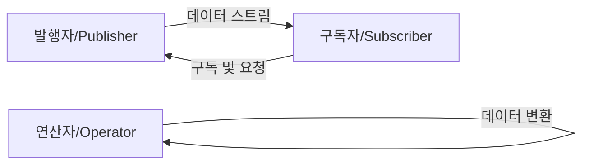
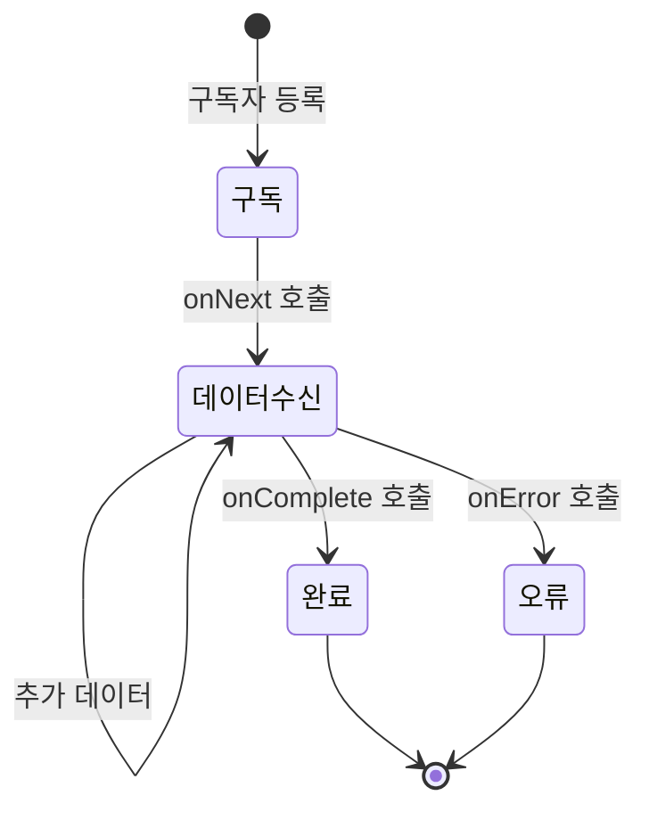

반응형 프로그래밍은 데이터 흐름과 변화의 전파에 중점을 둔 프로그래밍 패러다임입니다. 이 패러다임에서는 데이터 스트림을 기반으로 하며, 데이터가 변경될 때 자동으로 관련된 연산이 실행되는 방식으로 작동합니다. 이러한 접근 방식은 특히 비동기 데이터 처리와 [[이벤트 기반 아키텍처(Event-Driven Architecture)]]에서 매우 유용하게 활용될 수 있습니다.

반응형 프로그래밍의 핵심은 모든 것을 데이터 스트림으로 간주하는 것입니다. 이 패러다임에서는 변수 변경, 사용자 입력, 네트워크 응답, 캐시 알림 등 모든 것이 시간에 따라 발생하는 이벤트, 즉 스트림으로 표현됩니다. 반응형 프로그래밍을 이해하기 위해서는 먼저 [[함수형 프로그래밍(Functional Programming)]]의 개념을 이해하는 것이 도움이 됩니다.

## 반응형 프로그래밍의 기본 원리

반응형 프로그래밍은 다음과 같은 핵심 원리를 기반으로 합니다:

1. **데이터 흐름 중심**: 모든 것을 데이터 스트림으로 간주합니다.
2. **선언적 프로그래밍**: 어떻게(how) 계산할 것인지보다 무엇을(what) 계산할 것인지에 초점을 맞춥니다.
3. **변화의 전파**: 데이터가 변경되면 관련된 모든 계산이 자동으로 업데이트됩니다.
4. **비동기 처리**: 데이터 흐름을 비동기적으로 처리하여 시스템의 응답성을 높입니다.

## 옵저버 패턴과의 관계

반응형 프로그래밍은 [[옵저버 패턴(Observer Pattern)]]을 기반으로 하지만, 더 발전된 형태입니다. 옵저버 패턴에서는 이벤트 소스(주체)가 변경될 때 등록된 옵저버들에게 알림을 보내는 방식으로 작동합니다. 반응형 프로그래밍은 이러한 기본 개념을 확장하여 데이터 스트림을 기반으로 한 더 풍부한 연산과 변환을 제공합니다.

자세한 옵저버 패턴과의 차이점은 [[반응형 프로그래밍과 옵저버 패턴의 차이]]를 참고해주세요.

## 반응형 스트림의 구성 요소

반응형 스트림은 다음과 같은 주요 구성 요소를 가집니다:



1. **발행자(Publisher)**: 데이터 스트림을 생성하고 내보내는 주체입니다.
2. **구독자(Subscriber)**: 데이터 스트림을 소비하는 주체입니다.
3. **구독(Subscription)**: 발행자와 구독자 간의 연결을 나타냅니다.
4. **연산자(Operator)**: 데이터 스트림을 변환하는 함수입니다.
5. **스케줄러(Scheduler)**: 작업이 실행될 스레드를 결정합니다.

## 반응형 프로그래밍의 특징

### 1. 비동기 및 이벤트 기반

반응형 프로그래밍은 본질적으로 비동기적이며 이벤트 기반입니다. 데이터 스트림의 이벤트가 발생할 때 등록된 처리기가 실행됩니다. 이러한 특성은 I/O 작업, 네트워크 요청과 같은 블로킹 작업을 효율적으로 처리할 수 있게 합니다.

### 2. 데이터 흐름 컴포지션

반응형 프로그래밍에서는 복잡한 데이터 변환을 여러 간단한 변환의 조합으로 표현할 수 있습니다. 이는 함수형 프로그래밍의 컴포지션 개념과 유사합니다.

### 3. 백프레셔(Backpressure) 처리

백프레셔는 데이터 생산자가 소비자보다 빠르게 데이터를 생성할 때 발생하는 문제를 해결하기 위한 메커니즘입니다. 반응형 프로그래밍 라이브러리들은 구독자가 처리할 수 있는 양만큼만 데이터를 요청할 수 있는 기능을 제공합니다.

백프레셔에 대한 자세한 내용은 [[백프레셔 처리 전략]]을 참고해주세요.

### 4. 선언적 에러 처리

반응형 프로그래밍에서는 try-catch 블록 대신 오류 스트림을 통해 에러를 처리합니다. 이러한 접근 방식은 비동기 코드에서 에러 처리를 더 명확하고 예측 가능하게 만듭니다.

## 반응형 프로그래밍 구현체

### 1. ReactiveX

[[ReactiveX(Reactive Extensions)]]는 가장 널리 사용되는 반응형 프로그래밍 라이브러리 중 하나입니다. 여러 언어에서 구현체를 제공하며, Java에서는 RxJava로 알려져 있습니다.

RxJava의 기본 개념은 다음과 같습니다:

1. **Observable**: 데이터 스트림을 생성하는 소스입니다.
2. **Observer**: Observable에서 발행한 이벤트를 수신합니다.
3. **Operators**: 데이터 스트림을 변환하는 함수들입니다.
4. **Schedulers**: 작업이 실행될 스레드를 지정합니다.

간단한 RxJava 예제는 다음과 같습니다:

```java
import io.reactivex.Observable;

public class RxJavaExample {
    public static void main(String[] args) {
        Observable<String> observable = Observable.just("Hello", "Reactive", "World");
        
        observable
            .map(s -> s.toUpperCase())
            .filter(s -> s.length() > 5)
            .subscribe(
                s -> System.out.println("Received: " + s),
                error -> System.err.println("Error: " + error),
                () -> System.out.println("Completed")
            );
    }
}
```

### 2. Reactor

[[Reactor]]는 Spring 팀에서 개발한 반응형 라이브러리로, Spring WebFlux의 기반이 됩니다. Reactor는 Reactive Streams 사양을 준수하며, RxJava와 유사한 개념을 제공합니다:

1. **Mono**: 0 또는 1개의 결과를 반환하는 발행자입니다.
2. **Flux**: 0개 이상의 결과를 반환하는 발행자입니다.

간단한 Reactor 예제는 다음과 같습니다:

```java
import reactor.core.publisher.Flux;

public class ReactorExample {
    public static void main(String[] args) {
        Flux<String> flux = Flux.just("Hello", "Reactive", "World");
        
        flux
            .map(String::toUpperCase)
            .filter(s -> s.length() > 5)
            .subscribe(
                s -> System.out.println("Received: " + s),
                error -> System.err.println("Error: " + error),
                () -> System.out.println("Completed")
            );
    }
}
```

### 3. Java Flow API

Java 9부터는 표준 라이브러리에 [[Java Flow API]]가 포함되어 Reactive Streams 사양을 지원합니다. Flow API는 구현체가 아닌 인터페이스만 제공하므로, 실제 사용을 위해서는 RxJava나 Reactor와 같은 구현체가 필요합니다.

## 반응형 프로그래밍의 상태 모델

반응형 프로그래밍에서는 데이터 스트림이 다음과 같은 상태를 가질 수 있습니다:



1. **구독(Subscribed)**: 구독자가 발행자에게 등록된 상태
2. **데이터 수신(Next)**: 구독자가 데이터를 수신하는 상태
3. **완료(Completed)**: 모든 데이터가 성공적으로 처리된 상태
4. **오류(Error)**: 데이터 처리 중 오류가 발생한 상태

## 스프링에서의 반응형 프로그래밍

스프링 5부터는 [[Spring WebFlux]]를 통해 반응형 웹 애플리케이션을 개발할 수 있습니다. WebFlux는 Reactor를 기반으로 하며, 적은 수의 스레드로 많은 동시 연결을 처리할 수 있는 논블로킹 웹 스택을 제공합니다.

### Spring WebFlux 예제

```java
import org.springframework.web.bind.annotation.GetMapping;
import org.springframework.web.bind.annotation.PathVariable;
import org.springframework.web.bind.annotation.RestController;
import reactor.core.publisher.Mono;

@RestController
public class UserController {
    
    private final UserRepository userRepository;
    
    public UserController(UserRepository userRepository) {
        this.userRepository = userRepository;
    }
    
    @GetMapping("/users/{id}")
    public Mono<User> getUser(@PathVariable String id) {
        return userRepository.findById(id);
    }
}
```

Spring WebFlux에 대한 자세한 내용은 [[Spring WebFlux 활용법]]을 참고해주세요.

## 반응형 프로그래밍의 장단점

### 장점

- **높은 응답성**: 비동기 처리를 통해 시스템의 응답성을 높일 수 있습니다.
- **자원 효율성**: 적은 수의 스레드로 많은 작업을 처리할 수 있어 자원을 효율적으로 사용할 수 있습니다.
- **백프레셔 지원**: 데이터 생산자와 소비자 간의 속도 차이를 조절할 수 있습니다.
- **선언적 코드**: 복잡한 비동기 로직을 선언적으로 표현할 수 있어 코드 가독성이 향상됩니다.
- **조합 가능성**: 다양한 연산자를 조합하여 복잡한 데이터 변환을 표현할 수 있습니다.

### 단점

- **학습 곡선**: 반응형 패러다임은 기존의 명령형 프로그래밍과 다르기 때문에 학습하는 데 시간이 필요합니다.
- **디버깅 어려움**: 비동기 코드의 특성상 스택 트레이스가 복잡해져 디버깅이 어려울 수 있습니다.
- **과도한 추상화**: 간단한 작업에도 복잡한 추상화를 사용하게 될 수 있습니다.
- **도입 비용**: 기존 시스템에 반응형 프로그래밍을 도입하는 것은 상당한 비용이 들 수 있습니다.

반응형 프로그래밍의 장단점에 대한 자세한 내용은 [[반응형 프로그래밍 도입 고려사항]]을 참고해주세요.

## 실제 사용 사례

반응형 프로그래밍은 다양한 분야에서 활용됩니다:

1. **웹 애플리케이션**: Spring WebFlux를 통한 고성능 웹 서비스 구현
2. **마이크로서비스**: 서비스 간 비동기 통신 및 이벤트 처리
3. **실시간 데이터 처리**: 실시간 데이터 스트림 처리 및 분석
4. **사용자 인터페이스**: 사용자 인터랙션을 이벤트 스트림으로 처리

## 반응형 프로그래밍 디버깅 기법

반응형 프로그래밍의 디버깅은 일반적인 동기 코드보다 복잡할 수 있습니다. 다음과 같은 방법이 도움이 될 수 있습니다:

1. **디버깅용 연산자 활용**: `log()`, `doOnNext()`, `doOnError()` 등의 사이드 이펙트 연산자를 사용하여 데이터 흐름을 추적합니다.
2. **Reactor Tools**: Reactor의 디버깅 도구를 활용하여 스택 트레이스를 개선합니다.
3. **단위 테스트**: `StepVerifier`와 같은 도구를 사용하여 반응형 코드를 테스트합니다.

자세한 디버깅 기법은 [[반응형 프로그래밍 디버깅 방법]]을 참고해주세요.

## 반응형 시스템과의 관계

반응형 프로그래밍은 [[반응형 시스템(Reactive Systems)]]을 구현하는 데 사용될 수 있는 기술입니다. 반응형 시스템은 반응형 선언문(Reactive Manifesto)에 정의된 네 가지 특성을 갖습니다:

1. **응답성(Responsive)**: 시스템이 적시에 응답합니다.
2. **탄력성(Resilient)**: 시스템이 장애에도 응답성을 유지합니다.
3. **유연성(Elastic)**: 시스템이 부하에 따라 자원을 조절합니다.
4. **메시지 기반(Message-Driven)**: 시스템이 비동기 메시지 전달을 사용합니다.

반응형 프로그래밍은 특히 메시지 기반 통신을 구현하는 데 유용하지만, 반응형 시스템을 구축하기 위해서는 시스템 아키텍처 수준의 추가적인 고려사항이 필요합니다.

## 결론

반응형 프로그래밍은 현대적인 애플리케이션 개발에서 중요한 패러다임이 되었습니다. 특히 비동기 데이터 처리가 필요한 시스템에서 높은 응답성, 탄력성, 자원 효율성을 제공할 수 있습니다. 하지만 반응형 패러다임을 효과적으로 활용하기 위해서는 기본 개념과 원리를 잘 이해하고, 적절한 상황에서 사용하는 것이 중요합니다.

또한 반응형 프로그래밍을 도입할 때는 학습 곡선, 디버깅 어려움, 기존 시스템과의 통합 등을 고려하여 점진적으로 접근하는 것이 좋습니다. 모든 시스템이 반응형 프로그래밍의 이점을 필요로 하는 것은 아니므로, 사용 사례와 요구사항을 신중하게 분석하여 적절한 기술을 선택해야 합니다.

## 참고 자료

- Reactive Programming with RxJava - Tomasz Nurkiewicz & Ben Christensen
- Hands-On Reactive Programming in Spring 5 - Oleh Dokuka & Igor Lozynskyi
- Reactive Streams 사양 (https://www.reactive-streams.org/)
- Spring WebFlux 문서 (https://docs.spring.io/spring-framework/docs/current/reference/html/web-reactive.html)
- ReactiveX 문서 (http://reactivex.io/documentation)
- Reactor 레퍼런스 (https://projectreactor.io/docs/core/release/reference/)