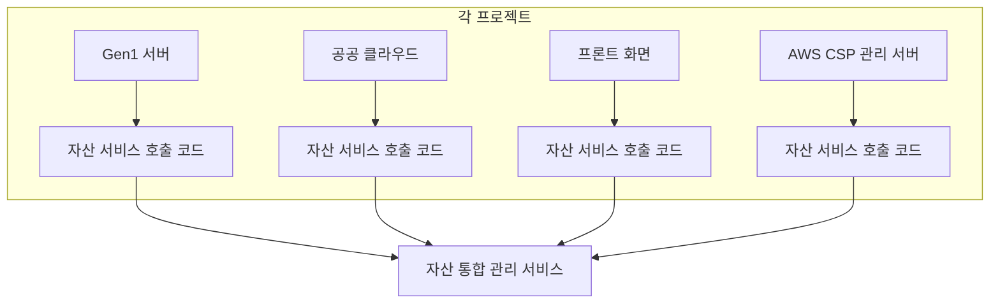
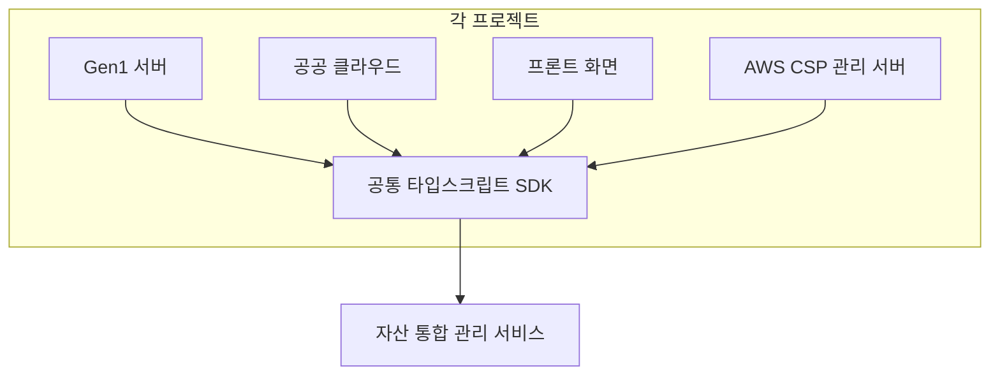

지난 글에서 나는 헥사고널 아키텍처를 이용해 서로 다른 인프라를 통일된 도메인 규칙으로 안전하게 다루도록 개선했던 이야기를 적었다. 그때는 “이제 통합을 시작할 기반을 만들었다”는 뿌듯함이 있었다. 그런데 몇 달이 지나고, 실제로 여러 팀이 같은 서비스를 붙여 쓰기 시작하자 통합의 다음 단계가 눈에 들어왔다.

서비스 쪽 아키텍처는 깔끔해졌는데, 서비스를 호출하는 쪽은 여전히 제각각이었다. 그리고 그 제각각이 조직 전체의 공수로 환산되어 쌓이고 있었다. 이번 글은 그 문제를 마주하고, 타입스크립트 SDK라는 형태로 정리해 나간 회고다.

## 1. 통합을 끝냈다고 착각했던 순간

서비스 내부의 복잡도를 줄이는 작업은 눈에 잘 보인다. 코드를 읽기 쉬워지고, 테스트가 가능해지고, 새 기능을 붙일 때 “어디에 코드를 넣어야 하는지”가 자연스럽게 정해진다. 특히 포트와 어댑터가 자리를 잡으면, 외부 시스템이 바뀌어도 도메인을 지키는 방어선이 생긴다.

하지만 그때 내가 집중했던 건 “서비스 내부”였다. 내부를 정리하면, 외부는 자연스럽게 따라올 거라고 생각했다.

현실은 조금 달랐다.

외부는 따라오지 않았다. 외부는 각자의 사정과 속도로 움직였고, 각 팀의 코드베이스는 서로 다른 실행 환경과 배포 방식, 그리고 서로 다른 우선순위를 가지고 있었다. 결과적으로 “같은 일을 하는 코드”가 여러 곳에서 조금씩 다른 모습으로 자라기 시작했다.

그때부터 나는 통합을 다시 정의해야 했다.

통합은 서비스가 하나로 정리되는 게 끝이 아니었다. 통합은 그 서비스를 사용하는 조직 전체가 같은 규칙을 공유할 때 비로소 완성에 가까워졌다.

## 2. 타입스크립트가 닿는 지점이 너무 많았다

내가 속한 조직에서 타입스크립트는 이미 여러 곳에서 쓰이고 있었다.

- Gen1 계열 서비스의 관리 화면과 서버
- 공공 클라우드 관련 프로젝트
- 프론트 화면들(Gen1, 사용자, 공공, Gen2 사용자/공공, AWS CSP 관리 서버 등)

같은 “타입스크립트”라고 말해도 실행 환경은 다양했다.

- 브라우저에서 돌아가는 화면
- 노드 환경에서 돌아가는 서버
- 배치성 작업을 하는 작은 실행 프로그램

그리고 자산 통합 관리 서비스는 이 다양한 코드베이스에서 공통으로 호출되는 중심 서비스였다. 문제는 호출 방식이 두 갈래로 나뉘어 있었다는 점이다.

- AWS CSP 쪽은 데이터베이스에 직접 접근해서 쿼리로 데이터를 조회하고 있었다.
- Gen1, 공공 클라우드, 프론트 계열은 자산 통합 관리 서비스의 API를 호출해 명령을 보내고 조회하고 있었다.

이 구조가 이상하다는 뜻은 아니다. 어떤 시스템은 정책, 네트워크, 성능, 운영 사정 때문에 데이터베이스에 직접 붙을 수밖에 없다. 어떤 시스템은 반대로, API를 통해서만 접근할 수 있게 통제해야 한다. 문제는 그다음이었다.

API를 호출하는 쪽의 타입스크립트 코드가 각 프로젝트에 중복으로 존재했다. 그리고 중복은 시간이 갈수록 빠르게 늘었다.

## 3. “중복된 호출 코드”가 실제로 만들어낸 비용

처음엔 대수롭지 않았다. 어느 프로젝트나 API를 호출하려면 공통 코드가 필요하다.

- 기본 주소
- 인증 헤더
- 공통 응답 형식
- 오류 처리
- 시간 제한과 재시도

문제는 “공통 코드가 필요하다”가 아니라 “공통 코드가 공통이 아니었다”는 점이었다.

각 프로젝트는 자기 방식으로 호출 코드를 만들었다.

- 어떤 곳은 화면에서 쓰기 편하게 얇은 래퍼만 두었다.
- 어떤 곳은 서버에서 재사용하려고 조금 더 두껍게 감쌌다.
- 어떤 곳은 예외를 던졌고, 어떤 곳은 결과 객체를 돌려줬다.
- 어떤 곳은 오류 코드를 문자열로 분기했고, 어떤 곳은 상태 코드만 보고 처리했다.

이렇게 서로 다른 코드들이 여러 곳에 존재하면, API가 추가되거나 바뀌는 순간 비용이 폭발한다.

### 3.1 작은 변경이 여러 번 반복되는 구조

자산 통합 관리 서비스는 여러 팀이 같이 쓰는 서비스다. 그래서 API는 자주 바뀐다.

- 필드가 하나 추가되거나
- 값의 범위가 바뀌거나
- 새 오류 코드가 생기거나
- 요청 방식이 조금 더 안전한 쪽으로 바뀌거나

이런 변경 자체는 자연스러운 성장이다. 문제는 호출 코드가 여러 곳에 흩어져 있으면, 성장의 비용이 조직 전체에 분산되어 반복된다는 점이다.

API 하나가 바뀌면, 각 프로젝트에서 비슷한 수정이 반복됐다.

- 요청 본문 형식 변경
- 새 헤더 추가
- 오류 코드 분기 추가
- 시간 제한 조정
- 재시도 규칙 조정

문제는 반복 자체가 아니라, 반복이 “잘못된 방식으로 반복”된다는 점이다. 어느 프로젝트는 수정이 누락된다. 어느 프로젝트는 임시로 막는다. 어느 프로젝트는 옛 규칙을 유지한다. 그러다 결국 같은 문제가 여러 형태로 다시 터진다.

### 3.2 품질이 다르게 굳어지는 문제

호출 코드는 보통 “처음엔 빨리” 만든다. 그리고 나중에 손을 보기 어렵다.

서비스 내부는 도메인 규칙을 중심으로 정리해 둔 덕분에 고치기 쉬운데, 호출 코드는 각 프로젝트 안쪽 깊은 곳에 박혀 있었다. 심지어 같은 프로젝트 안에서도 호출 방식이 여러 개가 되기 시작했다.

이게 누적되면, 결국 서비스가 제공하는 안정성과 일관성이 호출 단계에서 사라진다.

- 어떤 화면에서는 오류 메시지가 친절하고
- 어떤 화면에서는 그냥 “실패했습니다”로 끝나고
- 어떤 서버는 재시도를 적절히 하고
- 어떤 서버는 재시도를 과하게 해서 더 큰 부하를 만들고
- 어떤 곳은 요청을 합쳐서 보내고
- 어떤 곳은 같은 요청을 연달아 여러 번 보내고

이쯤 되면 통합은 반쪽짜리가 된다. 중심 서비스는 하나인데, 사용자 경험과 운영 경험은 여러 개로 갈라진다.

### 3.3 한 번에 드러난 중복의 한계

중복이 문제라는 걸 머리로는 알고 있었다. 하지만 몸으로 느낀 건 한 번의 사건이었다.

어느 날 자산 조회가 갑자기 느려졌고, 화면에서는 같은 로딩이 반복됐다. 서버 쪽을 보니 요청량이 평소보다 크게 늘어 있었다. 더 문제였던 건, 늘어난 요청이 “새로운 기능 때문”이 아니라 “같은 요청이 여러 곳에서 제각각 재시도되면서” 생긴 부하였다는 점이다.

서버는 스스로를 보호하기 위해 잠시 기다리라는 신호를 보내고 있었는데, 어떤 프로젝트의 호출 코드는 그 신호를 모르고 그대로 계속 밀어 넣었다. 다른 프로젝트는 재시도 자체가 없어서 즉시 실패했고, 또 다른 프로젝트는 재시도를 너무 공격적으로 해서 실패와 부하를 동시에 늘렸다.

그날 나는 같은 원인을 여러 방식으로 대응하는 구조가 얼마나 위험한지 확실히 알게 됐다. 대응이 다르면, 문제가 터졌을 때 “정답”도 여러 개가 된다. 그리고 “정답이 여러 개”라는 건, 결국 누구도 확실히 책임지기 어렵다는 뜻이었다.

그래서 이후부터는 문제를 해결할 때 항상 한 가지를 더 물었다.

이건 이번 한 번만 막으면 끝나는 문제인가, 아니면 다음에도 반복될 문제인가.

중복된 호출 코드는 명백히 후자였다.

나는 여기서 방향을 바꿨다.

“서비스 내부를 잘 만드는 것”에서 멈추지 않고, “서비스를 호출하는 규칙을 조직 공통으로 만드는 것”까지 해야겠다고 판단했다.

## 4. 해결 방향: 호출을 공통 자산으로 만들기

나는 고민을 길게 하지 않았다. 이미 답은 힌트처럼 내 앞에 있었다.

서비스 내부에서 했던 것처럼, 호출에서도 역할을 분리하면 된다.

- 서비스 내부는 포트와 어댑터로 경계를 만들었다.
- 서비스 외부도 호출을 경계로 만들고, 그 경계를 한 곳에서 관리하면 된다.

그래서 나는 타입스크립트용 공통 라이브러리를 만들기로 했다. 이름은 내부적으로 `adapter-in-ts-sdk`라고 불렀다. “서비스를 호출하는 표준 어댑터”라는 의미를 담고 싶었다.

이 선택에는 목표가 두 가지였다.

1. **조직 전체 공수를 줄인다.** API 변경이 한 번이면, 수정도 한 번으로 끝나야 한다.
2. **호출 품질을 높인다.** 예외 처리, 유효성 검사, 재시도, 스트리밍 같은 고급 기능을 기본값으로 제공한다.

그리고 세 번째 목표가 숨어 있었다.

3. **다른 팀 개발자들이 같이 관리할 수 있게 만든다.** “내가 만든 코드”가 아니라 “조직이 같이 소유하는 코드”가 되어야 한다.

## 5. 타입스크립트 SDK를 설계할 때 지킨 원칙

공통 라이브러리는 잘 만들면 조직을 살리고, 잘못 만들면 조직을 괴롭힌다. 그래서 시작할 때 원칙을 먼저 정했다.

### 5.1 사용법은 단순해야 한다

공통 라이브러리가 아무리 좋은 기능을 가지고 있어도, 사용하기 어렵다면 외면받는다. 특히 프론트 작업이나 운영성 작업은 시간에 쫓길 때가 많다. 그럴 때 개발자는 “지금 바로 쓸 수 있는 것”을 고른다.

그래서 첫 화면은 단순하게 만들었다.

- 최소한의 설정으로 생성
- 자주 쓰는 요청은 짧은 호출로 끝
- 고급 기능은 옵션으로 열 수 있게

### 5.2 실패는 일관된 형태로 돌아와야 한다

호출 코드를 여러 곳에서 쓰면, 실패도 여러 곳에서 처리한다. 이때 실패가 제각각이면, 실패 처리도 제각각이 된다.

그래서 SDK의 핵심 역할 중 하나는 “실패를 표준화”하는 것이었다.

- 네트워크 오류
- 인증 실패
- 권한 부족
- 유효성 실패
- 서버 내부 오류
- 재시도 후 최종 실패

이 모든 케이스를 일관된 오류 형태로 전달하면, 각 프로젝트는 자기 화면과 자기 로그에 맞게 처리할 수 있다. 중요한 건 “분기 기준이 같아지는 것”이다.

### 5.3 실행 환경 차이를 숨기되, 숨기기만 하진 않는다

같은 타입스크립트라도 브라우저와 노드는 다르다. 쿠키 기반 인증이 필요한 곳도 있고, 토큰이 필요한 곳도 있고, 프록시를 타야 하는 곳도 있다.

그래서 SDK는 실행 환경에 맞는 기본 구현을 제공하되, 필요하면 교체할 수 있도록 만들었다.

- 기본 전송 계층은 표준 `fetch`를 중심으로 두고
- 환경에 따라 전송 계층을 바꿀 수 있게 하고
- 인증과 헤더 구성도 외부에서 주입할 수 있게 했다

### 5.4 계약을 먼저 고정하고, 구현은 나중에 확장한다

공통 라이브러리에서 제일 중요한 건 “계약”이다. 함수 이름 하나, 데이터 구조 하나가 여러 프로젝트의 코드를 고정시킨다.

그래서 처음부터 모든 기능을 넣지 않았다. 대신 “공통으로 합의할 수 있는 계약”을 먼저 만들었다.

- 요청과 응답의 타입
- 오류 코드와 메시지 규칙
- 기본 시간 제한과 재시도 정책

이 계약이 굳어지면, 그 위에 기능을 올리는 건 상대적으로 쉽다. 반대로 계약이 흔들리면, 아무리 좋은 기능도 조직 전체를 흔든다.

### 5.5 계약을 문장으로 남겨두기

계약을 고정한다고 해서 타입만 만들어 놓고 끝낼 수는 없었다. 타입은 개발자에게는 친절하지만, 팀은 결국 사람으로 움직인다. 그래서 계약을 문장으로 정리해 두는 작업도 같이 했다.

- 어떤 함수가 어떤 의도를 가지는지
- 어떤 오류가 언제 나는지
- 재시도와 시간 제한의 기본값이 무엇인지
- 스트리밍과 한 번에 받는 방식이 언제 적합한지

그리고 사용 예제를 최소한으로, 하지만 실제로 바로 복사해서 쓸 수 있을 정도로 구체적으로 넣었다. 다른 팀이 공통 SDK를 믿고 의존하려면, 첫 경험이 부드러워야 한다.

예를 들면 이런 형태였다.

```ts
import { createAssetClient } from "@company/asset-sdk";

const client = createAssetClient({
  baseUrl: "https://asset.example.com",
  getToken: async () => process.env.ASSET_TOKEN ?? "",
  timeoutMs: 10_000,
});

const assets = await client.assets.list({ page: 1, size: 50 });
```

여기서 중요한 건 코드 자체가 아니라, “이 정도로 단순해야 한다”는 기준이었다. 호출을 공통으로 만든다는 건, 결국 다른 사람이 첫날부터 쓸 수 있게 만든다는 뜻이었으니까.

## 6. 중복을 정리하기 전과 후

말로 설명하면 가볍게 들리지만, 구조로 보면 차이가 선명하다.

### 6.1 이전: 프로젝트마다 호출 코드가 따로 존재



이 상태에서 API가 바뀌면, 호출 코드도 네 군데에서 바뀐다. 네 군데가 비슷하게 바뀌면 괜찮지만, 현실에서는 조금씩 다르게 바뀐다.

### 6.2 이후: 공통 타입스크립트 SDK를 통해 호출



이후에는 변경이 한 곳에 모인다. 그리고 한 곳에 모인 변경은 품질을 올리기 쉬워진다.

## 7. 예외 코드와 유효성 검사를 한 곳으로 모으다

SDK를 도입하면서 가장 먼저 손댄 건 예외 처리와 유효성 검사였다. 여기가 “각 프로젝트가 조금씩 다른 방식으로 망가지는 지점”이었기 때문이다.

### 7.1 예외 코드 통합이 왜 중요한가

서비스는 오류를 코드로 돌려준다. 그런데 프로젝트마다 그 코드를 해석하는 방식이 다르면, 결국 같은 오류가 다른 사용자 경험을 만든다.

나는 다음과 같은 형태로 오류 처리를 표준화했다.

- 오류는 항상 “종류”가 있다.
- 오류는 항상 “원인”을 설명할 최소 정보가 있다.
- 오류는 항상 “재시도 가능 여부”를 포함한다.
- 오류는 항상 “연결된 요청 정보”를 포함한다.

이렇게 해두면 각 프로젝트는 자기 방식대로 표현할 수 있다.

- 화면은 사용자에게 친절한 문장으로 바꿔서 보여주고
- 서버는 운영 로그에 필요한 정보로 남기고
- 배치는 실패 원인을 모아서 다시 처리하고

핵심은 “어떤 기준으로 분기할지”가 같아지는 것이다.

### 7.2 유효성 검사를 호출 단계에서 하는 이유

유효성 검사는 서버가 하는 게 맞다. 하지만 호출 단계에서 1차 유효성 검사를 하면 이점이 생긴다.

- 불필요한 호출이 줄어든다.
- 서버 부하가 줄어든다.
- 사용자에게 더 빠르게 피드백을 줄 수 있다.
- 같은 오류가 여러 곳에서 다른 메시지로 표현되는 걸 막을 수 있다.

SDK는 “서버의 규칙을 대신한다”가 아니라, “서버가 항상 거절할 요청을 미리 거절한다”는 태도로 유효성 검사를 넣었다.

예를 들어 이런 것들이다.

- 필수 값이 비어 있는 요청
- 페이지 크기가 말이 안 되는 요청
- 날짜 범위가 뒤집힌 요청
- 목록 조회에 필요한 조건이 빠진 요청

이런 단순한 실수는 SDK 단계에서 바로 잡아도 안전하다. 무엇보다 반복되는 실수를 한 곳에서 막을 수 있다.

## 8. 불필요한 호출을 줄이는 작은 장치들

호출 코드를 공통으로 만들면, “불필요한 호출”을 줄이는 장치도 공통으로 넣을 수 있다. 이 장치들은 각 프로젝트에서 만들기엔 번거롭고, 그렇다고 없으면 계속 손해가 나는 것들이다.

나는 SDK에 다음과 같은 장치들을 넣었다.

### 8.1 동일 요청 합치기

프론트 화면에서는 같은 데이터를 여러 컴포넌트가 동시에 필요로 할 때가 많다. 이때 각 컴포넌트가 같은 요청을 동시에 보내면, 서버는 같은 일을 여러 번 한다.

SDK는 짧은 시간 동안 동일한 요청을 합쳐서 한 번만 보내고, 결과를 공유할 수 있도록 만들었다. 화면은 더 부드럽고, 서버는 더 가벼워졌다.

### 8.2 필요할 때만 새로 가져오기

자산 데이터는 모든 순간에 항상 바뀌지는 않는다. 화면이 자주 새로고침되거나, 사용자 행동이 빠르게 반복되면 같은 데이터를 계속 불러오게 된다.

그래서 SDK는 “짧은 유효 시간”을 가진 캐시를 선택적으로 쓸 수 있게 했다.

- 아무 옵션도 주지 않으면 캐시를 쓰지 않는다.
- 화면 단처럼 같은 데이터를 반복 조회하는 곳은 캐시를 켤 수 있다.
- 캐시의 범위와 유효 시간은 호출하는 쪽에서 결정한다.

공통 라이브러리는 “강제”가 아니라 “일관된 선택지”를 제공해야 한다고 생각했다.

### 8.3 요청을 쪼개지 않고 묶기

어떤 화면은 처음엔 단순 조회로 시작하지만, 쓰다 보면 점점 더 많은 정보를 동시에 보여주고 싶어한다. 그러다 보면 작은 API 호출이 늘어나고, 화면이 느려진다.

SDK는 “자주 같이 쓰는 조합”을 하나의 호출로 제공하는 편의 함수를 넣었다. 이건 성능도 중요하지만, 각 프로젝트의 코드가 지나치게 복잡해지는 걸 막는 효과가 더 컸다.

## 9. 재시도와 백프레셔를 클라이언트 수준에서 다루다

올해 내가 가장 크게 느낀 건, “서버만 잘한다고 안정성이 완성되지 않는다”는 사실이다.

여러 프로젝트가 동시에 같은 서비스를 호출하면, 장애의 모양이 바뀐다. 서버가 느려지면, 클라이언트는 더 많이 재시도하고, 그 재시도가 서버를 더 느리게 만든다. 이 악순환은 생각보다 쉽게 생긴다.

그래서 나는 SDK에서 재시도와 백프레셔 전략을 기본으로 다루기로 했다.

### 9.1 재시도는 ‘무조건’이 아니라 ‘규칙’이다

재시도는 편리하지만 위험하다. 잘못된 재시도는 장애를 확대한다.

그래서 SDK의 재시도는 다음 원칙을 따른다.

- 재시도할 만한 실패만 재시도한다.
- 재시도 사이에는 반드시 대기 시간을 둔다.
- 대기 시간은 점점 길어지게 한다.
- 동시에 재시도하는 요청 수를 제한한다.
- 서버가 “기다려 달라”고 말하면 그 시간을 존중한다.

여기서 마지막 항목이 중요했다. 서버는 상황에 따라 `Retry-After` 같은 헤더로 “몇 초 뒤에 다시 시도하라”는 신호를 줄 수 있다. 이 신호를 무시하면, 결국 서버와 클라이언트가 서로를 소모시키는 싸움이 된다.

SDK는 이 신호를 기준으로 요청을 잠시 멈추고, 대기 후 다시 시도하도록 만들었다. 호출하는 쪽에서 따로 구현하지 않아도 기본으로 동작한다.

### 9.2 클라이언트 수준의 백프레셔

백프레셔는 말 그대로 “압력을 되돌려 보내는 것”이다. 서버가 버티기 힘들면, 클라이언트가 속도를 줄여야 한다.

SDK는 다음 방식으로 속도를 조절했다.

- 동시에 보낼 수 있는 요청 수를 제한한다.
- 실패가 늘어나면 자연스럽게 속도를 더 줄인다.
- 대기 시간이 길어지는 동안 새 요청을 쌓아두되, 무한정 쌓지 않는다.
- 일정 수준을 넘으면 빠르게 실패시켜 호출하는 쪽이 판단하게 한다.

이런 장치는 각 프로젝트가 개별적으로 넣기 어렵다. 넣더라도 각자의 방식대로 넣는다. 공통 SDK는 이런 부분에서 특히 가치가 크다.

이 방식을 구현하면서 가장 신경 쓴 건 “기본값”이었다. 공통 SDK는 많은 사람에게 영향을 주기 때문에, 기본값이 과하면 위험하고 기본값이 약하면 의미가 없다. 그래서 처음에는 보수적으로 시작했다.

- 동시 요청 수는 작게 시작하고
- 대기 큐는 짧게 두고
- 큐가 넘치면 조용히 쌓지 않고, 명확한 오류로 알려주고
- 필요하면 프로젝트별로 숫자를 올릴 수 있게 했다

이렇게 해두니 서버가 불안정할 때도 호출이 폭발하지 않았다. 그리고 한 번 불안정해진 서버가 회복할 시간을 벌어주는 효과가 있었다.

### 9.3 한 번의 사건이 남긴 습관

사실 `Retry-After`와 백프레셔를 기본 기능으로 넣은 건, 예쁜 설계 때문이 아니었다. 나는 올해 “잠깐의 느려짐”이 “조직 전체의 문제”로 번지는 과정을 가까이서 봤다.

특정 시간대에 여러 시스템이 자산을 대량으로 동기화했고, 서버는 요청을 줄이기 위해 기다리라는 신호를 보냈다. 하지만 어떤 호출 코드는 그 신호를 몰랐고, 어떤 호출 코드는 알았지만 각자 방식으로 해석했다. 그 결과는 단순했다. 서버는 더 느려지고, 클라이언트는 더 재시도하고, 전체 요청량은 더 늘었다.

이 일을 겪고 나서 나는 재시도를 “기능”이 아니라 “운영 규칙”으로 보게 됐다. 규칙은 한 곳에 있어야 한다. 그게 SDK가 해야 할 일이었다.

## 10. 스트리밍과 “한 번에 받는 방식”을 같이 제공하다

자산 데이터는 상황에 따라 크기가 크게 달라진다. 어떤 요청은 몇 줄이면 끝나지만, 어떤 요청은 수십만 건이 될 수 있다. 이때 “한 번에 받아서 메모리에 올리는 방식”은 쉽게 한계를 만난다.

그래서 SDK에는 두 가지 길을 열어두었다.

- 한 번에 받아서 처리하는 방식
- 스트리밍으로 조금씩 받아서 처리하는 방식

### 10.1 스트리밍이 필요했던 이유

스트리밍은 성능을 위한 기술이기도 하지만, 운영을 위한 기술이기도 하다.

- 대용량 응답에서도 브라우저가 멈추지 않는다.
- 서버에서 오는 데이터를 받는 즉시 처리할 수 있다.
- 중간에 취소할 수 있다.
- 네트워크가 불안정해도 부분적으로 진행 상황을 남길 수 있다.

특히 운영 화면에서 “엑셀로 다운로드” 같은 기능을 구현할 때 체감이 컸다. 이전에는 파일을 만들기 전까지 아무 반응이 없어서 사용자가 계속 새로고침을 누르곤 했다. 스트리밍 방식으로 바꾸고 나서는 사용자가 기다리는 방식이 달라졌다. 진행 중이라는 확신이 생기면, 사용자는 불필요한 행동을 줄인다.

### 10.2 다양한 플랫폼에서 유연하게 쓰이게 하기

어떤 프로젝트는 화면이고, 어떤 프로젝트는 서버다. 어떤 프로젝트는 배치다. 그래서 SDK는 “한 가지 방식만 강요하지 않기”를 중요하게 봤다.

- 화면은 사용하기 쉬운 한 번에 받는 방식을 주로 쓰고
- 서버나 배치는 스트리밍을 선택할 수 있게 하고
- 필요한 팀은 재시도 정책이나 시간 제한을 더 보수적으로 바꿀 수 있게 했다

이렇게 해두면 “공통”을 지키면서도 “각 팀의 현실”을 존중할 수 있다. 공통 라이브러리는 결국 사람이 쓰는 도구다. 사람의 상황을 무시하면 오래가지 못한다.

### 10.3 쓰는 쪽에서 고를 수 있는 형태

한 번에 받는 방식은 화면에서 가장 많이 쓰인다.

```ts
const result = await client.assets.list({ page: 1, size: 100 });
```

스트리밍은 서버나 배치에서 빛을 발한다.

```ts
for await (const asset of client.assets.stream({ filter })) {
  // 한 건씩 처리
}
```

그리고 취소가 필요한 화면을 위해, 요청을 중간에 멈출 수 있는 방법도 같이 열어두었다. 사용자는 기다리다가도 뒤로 가기를 누를 수 있고, 그때 남은 요청은 바로 멈춰야 한다. 이런 기본 동작이 쌓이면, 서비스도 사용자도 덜 지친다.

## 11. 여러 팀이 같이 관리하게 만들기

이 작업에서 코드만큼 어려웠던 건 “소유권”이었다.

공통 SDK를 만들면, 이제부터 여러 팀이 이 코드를 신뢰하고 의존하게 된다. 그 순간부터 이 코드는 개인의 작업물이 아니라 조직의 기반이 된다. 그러면 운영 방식도 달라져야 한다.

나는 다음을 준비했다.

- 변경 이력과 버전 규칙
- 기여 방식과 검토 방식
- 긴급 수정과 배포 방식
- 호환성 깨짐을 최소화하는 원칙

### 11.1 기여를 막지 않는 구조

처음부터 완벽하게 만들 수는 없다. 그리고 공통 SDK는 나 혼자 쓰는 도구가 아니라, 여러 팀이 쓰는 도구다. 결국 다른 팀이 필요한 기능을 추가하고 싶어한다.

그때 “추가해도 된다”는 말만으로는 부족하다. 실제로 추가할 수 있어야 한다.

그래서 나는 코드 구조를 단순하게 두고, 확장 지점을 명확하게 만들었다.

- 새 API가 추가되면 어디에 넣는지
- 공통 오류가 늘어나면 어디에 정의하는지
- 전송 방식이 다르면 어디를 바꾸는지

이 구조가 잡히고 나니, 다른 팀의 기여가 자연스럽게 들어오기 시작했다. 공통 SDK가 “우리의 코드”가 되는 순간이었다.

### 11.2 공통을 지키는 최소한의 규칙

공통을 유지하려면 규칙이 필요하다. 하지만 규칙이 너무 많으면, 기여가 멈춘다.

그래서 규칙은 최소로 두었다.

- 외부로 노출되는 계약은 신중하게 바꾼다.
- 하위 호환이 깨지는 변경은 버전으로 명확히 드러낸다.
- 실패 처리는 반드시 표준 오류 형태로 귀결되게 한다.
- 기본값은 안전한 쪽으로 둔다.

나머지는 팀들이 필요에 따라 선택하게 했다. 공통 SDK는 통제 도구가 아니라, 품질이 좋은 기본값을 제공하는 도구여야 한다고 생각했다.

### 11.3 배포는 코드보다 조심스럽게

공통 SDK는 배포가 곧 조직 전체의 변경이 된다. 그래서 배포 과정은 단순하지만 일관되게 만들었다.

- 버전은 변경의 크기를 드러내는 신호로 사용한다.
- 긴급 수정은 빠르게 배포하되, 기능 추가와 섞지 않는다.
- 변경 이력은 짧고 명확하게 남긴다.
- 배포 후에는 어느 프로젝트가 어떤 버전을 쓰는지 쉽게 확인할 수 있게 한다.

이런 절차는 개발 속도를 늦추는 것처럼 보이지만, 장기적으로는 오히려 빠르게 만든다. 공통 기반은 신뢰가 쌓여야 쓸 수 있고, 신뢰는 배포의 일관성에서 시작한다.

## 12. 결과: 호출 공수는 줄고, 호출 품질은 올라갔다

결과는 단순했다.

이전에는 API가 바뀌면 각 프로젝트가 같은 수정을 반복했다. 이제는 SDK에서 한 번 고치고, 각 프로젝트는 버전만 올리면 된다. 급한 곳은 바로 올리고, 여유가 있는 곳은 다음 배포에 올린다. 중요한 건 “수정이 한 번으로 모인다”는 점이다.

그리고 품질은 자연스럽게 올라갔다.

- 예외 코드와 메시지가 통일되면서 화면의 실패 경험이 정돈되었다.
- 유효성 검사가 들어가면서 의미 없는 호출이 줄었다.
- `Retry-After`를 존중하면서 장애 상황에서 서비스가 더 안정적으로 버텼다.
- 스트리밍 옵션 덕분에 대용량 기능을 더 안전하게 만들 수 있었다.

### 12.1 변화가 체감으로 바뀌는 순간

이 작업의 효과는 코드 줄 수로도 보였지만, 더 크게는 “일의 방식”으로 느껴졌다.

예전에는 API가 바뀌면 관련된 사람들에게 메시지를 보내고, 각 프로젝트에서 같은 내용을 반복해서 수정하고, 리뷰를 기다리고, 배포 일정을 맞추는 과정이 이어졌다. 그 과정에서 한 곳이라도 놓치면 결국 운영에서 다시 만나게 됐다.

SDK 이후에는 일이 단순해졌다.

- SDK에서 수정한다.
- 버전을 올린다.
- 각 프로젝트는 의존성만 갱신한다.

당연히 여기에도 일이 있다. 하지만 일의 종류가 바뀌었다. 예전에는 “같은 수정”을 여러 번 했다면, 지금은 “한 번의 수정”에 더 집중한다. 그래서 품질도 같이 올라갔다. 이게 내가 원했던 변화였다.

무엇보다 좋은 건, 호출 로직을 만드는 시간이 줄어든 대신 “정말 필요한 문제”에 시간을 더 쓸 수 있게 되었다는 점이다. 개발자에게 가장 비싼 자원은 결국 집중력이다. 같은 코드를 여러 번 쓰는 일은 집중력을 가장 빨리 갉아먹는다.

## 13. 마무리: 통합은 기술이 아니라 습관이다

올해 나는 통합을 두 번 배웠다.

첫 번째는 서비스 내부에서의 통합이었다. 복잡한 인프라를 도메인 규칙으로 묶고, 포트와 어댑터로 경계를 만들었다.

두 번째는 조직 내부에서의 통합이었다. 여러 프로젝트에 흩어진 호출 코드를 공통 타입스크립트 SDK로 묶고, 예외와 유효성, 재시도와 백프레셔, 스트리밍까지 한 번에 정리했다.

둘 다 결국 같은 결론으로 이어진다.

통합은 거창한 설계도가 아니라, “중복을 보자마자 공통으로 만들려는 습관”에 가깝다. 그리고 그 습관을 가능하게 하는 건 기술이 아니라, 경계를 세우는 태도와 협업 방식이다.

내년에는 이 SDK를 더 단단하게 만들고 싶다.

- 문서와 예제를 더 친절하게 정리하고
- 변화에 더 강한 계약을 만들고
- 서비스와 클라이언트가 서로를 지치게 하지 않도록 기본값을 더 다듬고
- 다른 팀이 더 쉽게 기여할 수 있게 길을 넓히고

올해의 나는 통합의 기반을 만들었다. 이제는 그 기반이 조직 전체의 속도와 품질로 이어지도록 계속 손을 봐야 한다. 그게 내가 느낀 "통합의 다음 단계"였다.
