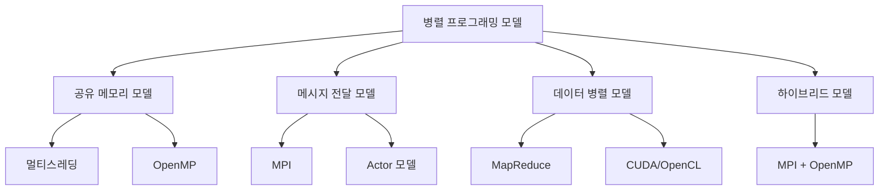

병렬 프로그래밍(Parallel Programming)은 여러 계산을 동시에 수행하여 문제를 더 빠르게 해결하는 컴퓨팅 방식입니다. 이 접근법은 작업을 여러 개의 작은 부분으로 분할하고, 이들을 병렬로 처리하여 전체 실행 시간을 단축시킵니다. 현대의 다중 코어 프로세서와 분산 시스템의 등장으로 병렬 프로그래밍은 소프트웨어 개발의 핵심 요소가 되었습니다.

## 병렬 프로그래밍과 순차 프로그래밍의 차이

병렬 프로그래밍을 이해하기 위해서는 먼저 순차 프로그래밍(Sequential Programming)과의 차이점을 알아야 합니다.

순차 프로그래밍은 한 번에 하나의 작업만 처리하는 전통적인 방식으로, 프로그램의 실행 흐름이 순차적이고 예측 가능합니다. 반면, 병렬 프로그래밍은 여러 작업을 동시에 실행하여 성능을 향상시키지만, 동기화와 통신 문제를 해결해야 합니다.

## 병렬성의 유형

병렬 프로그래밍에는 여러 가지 수준의 병렬성이 존재합니다.

### 1. 비트 수준 병렬성(Bit-level Parallelism)

데이터 폭을 늘려 한 번에 더 많은 비트를 처리하는 방식입니다. 예를 들어, 8비트 프로세서에서 32비트 프로세서로 발전하면서 한 번의 연산으로 처리할 수 있는 데이터의 양이 증가했습니다.

### 2. 명령어 수준 병렬성(Instruction-level Parallelism)

CPU가 여러 명령어를 동시에 실행하는 능력을 의미합니다. 파이프라이닝, 슈퍼스칼라 아키텍처, 분기 예측 등의 기술이 이에 해당합니다.

### 3. 데이터 병렬성(Data Parallelism)

동일한 연산을 여러 데이터 요소에 동시에 적용하는 방식입니다. SIMD(Single Instruction, Multiple Data) 모델이 이를 구현합니다.

### 4. 작업 병렬성(Task Parallelism)

서로 다른 작업을 동시에 실행하는 방식입니다. 멀티스레딩이 대표적인 예로, 각 스레드가 독립적인 작업을 수행합니다.

자세한 내용은 병렬성의 유형과 특징을 참고해주세요.

## 병렬 프로그래밍 모델

병렬 프로그래밍을 구현하기 위한 다양한 모델이 존재합니다.



### 1. 공유 메모리 모델

여러 스레드가 동일한 주소 공간을 공유하며 통신합니다. Java의 멀티스레딩과 OpenMP가 이 모델을 따릅니다.

### 2. 메시지 전달 모델

프로세스들이 메시지를 교환하여 통신합니다. MPI(Message Passing Interface)와 Akka의 Actor 모델이 대표적입니다.

### 3. 데이터 병렬 모델

데이터를 분할하여 각 처리 단위에 할당합니다. MapReduce, CUDA, OpenCL 등이 이 모델을 구현합니다.

### 4. 하이브리드 모델

여러 모델을 결합하여 사용합니다. 분산 시스템에서 노드 간에는 메시지 전달을, 노드 내에서는 공유 메모리 모델을 사용하는 경우가 많습니다.

자세한 내용은 병렬 프로그래밍 모델의 이해를 참고해주세요.

## 병렬 프로그래밍의 과제

병렬 프로그래밍은 많은 이점을 제공하지만, 동시에 여러 과제가 있습니다.

### 1. 동기화 문제

여러 스레드나 프로세스가 동시에 공유 자원에 접근할 때 발생하는 [[경쟁 상태(Race Condition)]]와 교착 상태(Deadlock)를 해결해야 합니다.

### 2. 부하 균형(Load Balancing)

작업을 처리 단위에 균등하게 분배하여 일부만 과도하게 사용되는 상황을 방지해야 합니다.

### 3. 통신 오버헤드

병렬 단위 간의 통신은 오버헤드를 발생시키므로, 통신량을 최소화하는 설계가 필요합니다.

### 4. 확장성(Scalability)

프로세서 수가 증가함에 따라 성능이 선형적으로 향상되지 않는 암달의 법칙(Amdahl's Law)을 고려해야 합니다.

### 5. 디버깅의 어려움

비결정적 실행으로 인해 병렬 프로그램의 디버깅은 순차 프로그램보다 훨씬 복잡합니다.

자세한 내용은 병렬 프로그래밍의 도전과 해결책을 참고해주세요.

## Java에서의 병렬 프로그래밍 구현

Java는 병렬 프로그래밍을 위한 다양한 API를 제공합니다.

### 1. Thread와 Runnable

기본적인 멀티스레딩을 구현할 수 있지만, 저수준의 제어가 필요합니다.

```java
// Runnable 인터페이스 구현
public class ParallelTask implements Runnable {
    @Override
    public void run() {
        // 병렬로 실행할 작업
        System.out.println("스레드 ID: " + Thread.currentThread().getId() + "에서 실행 중");
    }
    
    public static void main(String[] args) {
        // 여러 스레드 생성 및 시작
        for (int i = 0; i < 5; i++) {
            Thread thread = new Thread(new ParallelTask());
            thread.start();
        }
    }
}
```

### 2. ExecutorService와 스레드 풀

스레드 생성과 관리의 오버헤드를 줄이기 위한 고수준의 API입니다.

```java
import java.util.concurrent.ExecutorService;
import java.util.concurrent.Executors;

public class ThreadPoolExample {
    public static void main(String[] args) {
        // 고정 크기 스레드 풀 생성
        ExecutorService executor = Executors.newFixedThreadPool(4);
        
        // 작업 제출
        for (int i = 0; i < 10; i++) {
            final int taskId = i;
            executor.submit(() -> {
                System.out.println("작업 " + taskId + " 실행 중, 스레드: " + 
                                  Thread.currentThread().getName());
            });
        }
        
        // 작업 완료 후 스레드 풀 종료
        executor.shutdown();
    }
}
```

### 3. Fork/Join 프레임워크

분할 정복 알고리즘을 병렬로 실행하기 위한 프레임워크입니다.

```java
import java.util.concurrent.ForkJoinPool;
import java.util.concurrent.RecursiveTask;

public class ParallelSum extends RecursiveTask<Long> {
    private final long[] numbers;
    private final int start;
    private final int end;
    private static final int THRESHOLD = 10_000;
    
    public ParallelSum(long[] numbers, int start, int end) {
        this.numbers = numbers;
        this.start = start;
        this.end = end;
    }
    
    @Override
    protected Long compute() {
        // 작업이 충분히 작으면 순차적으로 처리
        if (end - start <= THRESHOLD) {
            long sum = 0;
            for (int i = start; i < end; i++) {
                sum += numbers[i];
            }
            return sum;
        }
        
        // 작업을 두 개로 분할
        int middle = (start + end) / 2;
        ParallelSum left = new ParallelSum(numbers, start, middle);
        ParallelSum right = new ParallelSum(numbers, middle, end);
        
        // 오른쪽 작업을 포크(비동기 실행)
        right.fork();
        
        // 왼쪽 작업을 현재 스레드에서 실행하고 결과 얻기
        long leftResult = left.compute();
        // 오른쪽 작업의 결과를 기다림
        long rightResult = right.join();
        
        // 결과 합산
        return leftResult + rightResult;
    }
    
    public static void main(String[] args) {
        // 테스트용 배열 생성
        long[] numbers = new long[100_000_000];
        for (int i = 0; i < numbers.length; i++) {
            numbers[i] = i;
        }
        
        // Fork/Join 풀 생성 및 작업 실행
        ForkJoinPool pool = new ForkJoinPool();
        ParallelSum task = new ParallelSum(numbers, 0, numbers.length);
        long result = pool.invoke(task);
        
        System.out.println("합계: " + result);
    }
}
```

### 4. Stream API의 병렬 처리

Java 8부터 도입된 Stream API는 데이터 병렬 처리를 간단하게 구현할 수 있습니다.

```java
import java.util.Arrays;

public class ParallelStreamExample {
    public static void main(String[] args) {
        // 큰 배열 생성
        int[] numbers = new int[10_000_000];
        Arrays.fill(numbers, 1);
        
        // 순차 스트림으로 합계 계산
        long start = System.currentTimeMillis();
        int sum1 = Arrays.stream(numbers).sum();
        long end = System.currentTimeMillis();
        System.out.println("순차 스트림 시간: " + (end - start) + "ms");
        
        // 병렬 스트림으로 합계 계산
        start = System.currentTimeMillis();
        int sum2 = Arrays.stream(numbers).parallel().sum();
        end = System.currentTimeMillis();
        System.out.println("병렬 스트림 시간: " + (end - start) + "ms");
    }
}
```

자세한 Java 병렬 프로그래밍 기법은 Java 병렬 프로그래밍 기법을 참고해주세요.

## 스프링 프레임워크에서의 병렬 처리

스프링 프레임워크는 병렬 처리를 위한 다양한 기능을 제공합니다.

### 1. @Async 어노테이션

비동기적으로 메서드를 실행할 수 있게 합니다.

```java
import org.springframework.scheduling.annotation.Async;
import org.springframework.scheduling.annotation.EnableAsync;
import org.springframework.stereotype.Service;
import java.util.concurrent.CompletableFuture;

@Service
@EnableAsync
public class AsyncService {
    
    @Async
    public CompletableFuture<String> processTasks(String task) throws InterruptedException {
        System.out.println("작업 처리 시작: " + task + ", 스레드: " + 
                          Thread.currentThread().getName());
        // 시간이 걸리는 작업 시뮬레이션
        Thread.sleep(2000);
        System.out.println("작업 처리 완료: " + task);
        return CompletableFuture.completedFuture("처리 결과: " + task);
    }
}
```

### 2. TaskExecutor 설정

스프링에서 사용할 스레드 풀을 구성합니다.

```java
import org.springframework.context.annotation.Bean;
import org.springframework.context.annotation.Configuration;
import org.springframework.scheduling.annotation.EnableAsync;
import org.springframework.scheduling.concurrent.ThreadPoolTaskExecutor;

import java.util.concurrent.Executor;

@Configuration
@EnableAsync
public class AsyncConfig {
    
    @Bean(name = "taskExecutor")
    public Executor taskExecutor() {
        ThreadPoolTaskExecutor executor = new ThreadPoolTaskExecutor();
        executor.setCorePoolSize(4);
        executor.setMaxPoolSize(10);
        executor.setQueueCapacity(100);
        executor.setThreadNamePrefix("Async-");
        executor.initialize();
        return executor;
    }
}
```

### 3. WebFlux와 리액티브 프로그래밍

스프링 5부터 도입된 WebFlux는 비동기, 논블로킹 웹 애플리케이션을 개발할 수 있게 합니다.

```java
import org.springframework.web.bind.annotation.GetMapping;
import org.springframework.web.bind.annotation.PathVariable;
import org.springframework.web.bind.annotation.RestController;
import reactor.core.publisher.Flux;
import reactor.core.publisher.Mono;
import reactor.core.scheduler.Schedulers;

@RestController
public class ReactiveController {
    
    @GetMapping("/parallel/{count}")
    public Flux<String> parallelProcessing(@PathVariable int count) {
        return Flux.range(1, count)
                .parallel()
                .runOn(Schedulers.parallel())
                .map(i -> "처리 항목 " + i + ", 스레드: " + Thread.currentThread().getName())
                .sequential();
    }
    
    @GetMapping("/async/{id}")
    public Mono<String> asyncProcessing(@PathVariable String id) {
        return Mono.fromCallable(() -> {
            // 시간이 걸리는 작업 시뮬레이션
            Thread.sleep(1000);
            return "ID " + id + " 처리 완료, 스레드: " + Thread.currentThread().getName();
        }).subscribeOn(Schedulers.boundedElastic());
    }
}
```

스프링의 병렬 처리에 대한 자세한 내용은 스프링 프레임워크 병렬 처리를 참고해주세요.

## 병렬 프로그래밍 모범 사례

효과적인 병렬 프로그래밍을 위한 모범 사례를 소개합니다.

### 1. 독립적인 작업 식별

서로 독립적으로 실행할 수 있는 작업을 식별하여 병렬화합니다. 작업 간 의존성이 높으면 병렬화의 이점이 감소합니다.

### 2. 적절한 세분화(Granularity)

작업의 크기를 적절히 조절합니다. 너무 작으면 스레드 관리 오버헤드가 증가하고, 너무 크면 부하 불균형이 발생할 수 있습니다.

### 3. 자원 경쟁 최소화

공유 자원에 대한 경쟁을 최소화하는 설계를 채택합니다. 가능하면 스레드 로컬 변수를 사용하고, 불변 객체를 활용합니다.

### 4. 확장성 고려

프로세서 수가 증가해도 성능이 향상될 수 있도록 설계합니다. 암달의 법칙(Amdahl's Law)에 따라 병렬화할 수 없는 부분이 전체 성능의 제한 요소가 됩니다.

### 5. 테스트와 벤치마킹

병렬 코드를 철저히 테스트하고 성능을 측정합니다. 항상 순차 버전과 병렬 버전을 비교하여 병렬화의 이점을 확인합니다.

자세한 모범 사례는 병렬 프로그래밍 모범 사례와 패턴을 참고해주세요.

## 실제 사용 사례

병렬 프로그래밍은 다양한 분야에서 활용됩니다.

### 1. 대규모 데이터 처리

데이터베이스 쿼리, 로그 분석, 빅데이터 처리 등에서 병렬 처리를 통해 성능을 크게 향상시킬 수 있습니다.

### 2. 이미지 및 비디오 처리

이미지 필터링, 비디오 인코딩/디코딩, 컴퓨터 비전 알고리즘 등은 본질적으로 병렬화가 가능합니다.

### 3. 과학 및 공학 시뮬레이션

물리 시뮬레이션, 유체 역학, 기상 예측 등의 계산 집약적인 작업에 병렬 프로그래밍이 필수적입니다.

### 4. 웹 서버

동시에 많은 클라이언트 요청을 처리하기 위해 병렬 처리 기법을 활용합니다.

### 5. 인공지능 및 기계학습

신경망 학습, 유전 알고리즘, 강화 학습 등에서 병렬 처리를 통해 학습 시간을 단축시킵니다.

자세한 사용 사례는 병렬 프로그래밍 실제 적용 사례를 참고해주세요.

## 결론

병렬 프로그래밍은 현대 컴퓨팅 환경에서 성능을 최대화하기 위한 필수적인 기술입니다. 다중 코어 프로세서와 분산 시스템의 발전으로 병렬 처리의 중요성은 계속 증가하고 있습니다.

효과적인 병렬 프로그래밍을 위해서는 병렬성의 유형, 프로그래밍 모델, 동기화 기법, 부하 균형 등 다양한 개념을 이해하고 적용해야 합니다. 또한 테스트와 성능 측정을 통해 병렬화의 이점을 검증하는 과정이 필요합니다.

Java와 스프링 프레임워크는 병렬 프로그래밍을 위한 풍부한 API와 도구를 제공하므로, 이를 활용하여 효율적인 병렬 애플리케이션을 개발할 수 있습니다.

궁극적으로 병렬 프로그래밍은 현대 소프트웨어 개발자가 갖추어야 할 핵심 역량 중 하나이며, 이를 통해 사용자에게 더 빠르고 반응성이 좋은 애플리케이션을 제공할 수 있습니다.

## 참고 자료

- Java Concurrency in Practice - Brian Goetz
- Pattern-Oriented Software Architecture: Patterns for Concurrent and Networked Objects - Douglas Schmidt
- 스프링 공식 문서(https://docs.spring.io/spring-framework/docs/current/reference/html/integration.html#scheduling)
- Introduction to Parallel Computing - Ananth Grama, Anshul Gupta, George Karypis, Vipin Kumar