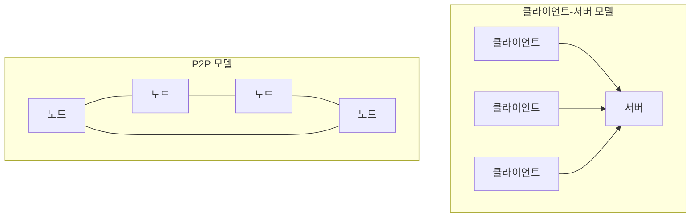

분산 시스템은 네트워크로 연결된 여러 독립적인 컴퓨터들이 하나의 시스템처럼 동작하는 컴퓨팅 환경입니다. 사용자 관점에서는 단일 시스템처럼 보이지만, 실제로는 여러 노드가 협력하여 작업을 처리합니다. 이러한 분산 시스템은 오늘날 대규모 웹 서비스, 클라우드 컴퓨팅, 빅데이터 처리 등 다양한 영역에서 필수적인 요소가 되었습니다.

분산 시스템의 기본 개념을 이해하기 위해서는 먼저 단일 시스템 아키텍처와의 차이점을 이해하는 것이 중요합니다.

## 분산 시스템의 주요 특성

분산 시스템은 다음과 같은 주요 특성을 가집니다:

1. **자원 공유**: 하드웨어, 소프트웨어, 데이터 등의 자원을 여러 노드에서 공유합니다.
2. **확장성**: 노드를 추가하여 시스템 용량을 쉽게 확장할 수 있습니다.
3. **병렬성**: 여러 프로세서가 동시에 작업을 수행할 수 있습니다.
4. **투명성**: 시스템의 복잡성을 사용자로부터 숨기고 단일 시스템처럼 보이게 합니다.
5. **내결함성**: 일부 구성 요소가 실패해도 시스템이 계속 작동합니다.

## 분산 시스템의 도전 과제

분산 시스템은 많은 장점이 있지만, 다음과 같은 중요한 도전 과제도 있습니다:

### 1. 통신 지연

네트워크를 통한 통신은 지연이 발생하며, 이는 시스템 성능에 큰 영향을 미칩니다. 지연 시간은 예측하기 어렵고 변동성이 크기 때문에 설계 시 고려해야 할 중요한 요소입니다.

### 2. 부분 실패

분산 시스템에서는 일부 노드나 네트워크 연결이 실패할 수 있으며, 이러한 부분 실패를 감지하고 처리하는 것이 어렵습니다. 자세한 내용은 부분 실패 처리 전략을 참고해주세요.

### 3. 동시성 문제

여러 노드가 동시에 동일한 데이터에 접근할 때 [[경쟁 상태(Race Condition)]]가 발생할 수 있습니다. 이를 해결하기 위한 동기화 메커니즘이 필요합니다.

### 4. 일관성 유지

데이터가 여러 노드에 복제되어 있을 때, 이를 일관되게 유지하는 것은 어려운 문제입니다. [[CAP 이론]]에 따르면, 일관성(Consistency), 가용성(Availability), 분할 내성(Partition tolerance) 세 가지를 동시에 완벽하게 만족시킬 수 없습니다.

## 분산 시스템 모델

분산 시스템을 설계하고 이해하기 위한 여러 모델이 있습니다:

### 1. 물리적 모델

분산 시스템의 물리적 구성을 나타냅니다. 클라이언트-서버, P2P(Peer-to-Peer), 하이브리드 등이 있습니다.



### 2. 아키텍처 모델

시스템의 구성 요소와 그 관계를 보여줍니다. 대표적으로 마이크로서비스 아키텍처, 이벤트 기반 아키텍처 등이 있습니다.

### 3. 상호작용 모델

구성 요소 간 통신 방식을 정의합니다. 동기식/비동기식 통신, 메시지 패싱, 원격 프로시저 호출(RPC) 등이 있습니다.

분산 시스템 모델에 대한 자세한 내용은 분산 시스템 아키텍처 패턴을 참고해주세요.

## 분산 시스템의 통신

분산 시스템에서 노드 간 통신은 핵심적인 요소입니다. 주요 통신 메커니즘으로는:

### 1. 원격 프로시저 호출 (RPC)

원격 시스템의 프로시저를 마치 로컬 프로시저처럼 호출할 수 있게 합니다. gRPC, Thrift 등이 대표적인 구현체입니다.

### 2. 메시지 큐

비동기 통신을 위한 메시지 큐 시스템을 사용합니다. Apache Kafka, RabbitMQ 등이 널리 사용됩니다.

### 3. REST API

HTTP 프로토콜을 사용하여 자원 기반의 인터페이스를 제공합니다. 웹 서비스에서 가장 흔히 사용되는 통신 방식입니다.

### 4. 웹소켓

양방향 실시간 통신을 지원하는 프로토콜입니다. 채팅 애플리케이션이나 실시간 대시보드 등에 적합합니다.

분산 시스템의 통신에 대한 자세한 내용은 분산 시스템 통신 프로토콜을 참고해주세요.

## 시간과 동기화

분산 시스템에서 시간은 중요한 개념입니다. 서로 다른 노드의 시계는 완벽하게 일치하지 않으므로, 이벤트의 순서를 결정하는 것이 어렵습니다.

### 논리적 시계 (Logical Clocks)

물리적 시간 대신 이벤트의 상대적 순서를 추적합니다. 대표적으로 람포트 타임스탬프(Lamport Timestamps)와 벡터 클럭(Vector Clocks)이 있습니다.

### 물리적 시계 동기화

NTP(Network Time Protocol)와 같은 프로토콜을 사용하여 노드 간 시계를 동기화합니다. 그러나 완벽한 동기화는 불가능하며, 항상 약간의 편차가 존재합니다.

## 일관성과 복제

분산 시스템에서 데이터를 여러 노드에 복제하면 가용성과 성능이 향상되지만, 일관성을 유지하는 것이 중요한 과제가 됩니다.

### 일관성 모델

데이터 일관성에 대한 다양한 보장 수준을 정의합니다:

1. **강한 일관성(Strong Consistency)**: 모든 노드가 항상 최신 데이터를 볼 수 있습니다.
2. **약한 일관성(Weak Consistency)**: 일정 시간이 지나면 모든 노드가 동일한 데이터를 보게 됩니다.
3. **최종 일관성(Eventual Consistency)**: 업데이트가 시스템에 전파되는 데 시간이 걸리지만, 궁극적으로는 모든 노드가 동일한 데이터를 갖게 됩니다.

### 복제 전략

1. **동기식 복제**: 모든 복제본이 업데이트될 때까지 작업이 완료되지 않습니다.
2. **비동기식 복제**: 주 복제본이 업데이트된 후 작업이 완료되고, 다른 복제본은 나중에 업데이트됩니다.

일관성과 복제에 대한 자세한 내용은 분산 데이터 일관성 모델을 참고해주세요.

## 내결함성 (Fault Tolerance)

분산 시스템은 일부 구성 요소가 실패해도 계속 작동할 수 있어야 합니다. 이를 위한 여러 기술이 있습니다:

### 1. 복제 (Replication)

데이터와 서비스를 여러 노드에 복제하여 일부 노드가 실패해도 시스템이 계속 작동할 수 있게 합니다.

### 2. 파티셔닝 (Partitioning)

데이터나 작업을 여러 노드에 분산시켜 단일 노드의 부하를 줄이고, 실패 영향 범위를 제한합니다.

### 3. 합의 알고리즘 (Consensus Algorithms)

Paxos, Raft 등의 알고리즘을 사용하여 분산된 노드 간에 합의를 이룹니다.

### 4. 서킷 브레이커 (Circuit Breaker)

반복적인 실패가 감지되면 서비스 호출을 중단하여 연쇄 실패를 방지합니다.

내결함성에 대한 자세한 내용은 분산 시스템 장애 처리를 참고해주세요.

## 실제 사용 사례

분산 시스템은 다양한 영역에서 활용되고 있습니다:

1. **웹 스케일 애플리케이션**: Google, Amazon, Netflix 등의 대규모 서비스
2. **클라우드 컴퓨팅**: AWS, Azure, Google Cloud Platform
3. **빅데이터 처리**: Hadoop, Spark
4. **블록체인**: Bitcoin, Ethereum
5. **IoT(사물인터넷)**: 센서 네트워크, 스마트 시티

## 스프링 프레임워크에서의 분산 시스템 개발

스프링 프레임워크는 분산 시스템 개발을 위한 다양한 프로젝트와 도구를 제공합니다:

### Spring Cloud

분산 시스템 패턴을 구현한 라이브러리 모음으로, 다음과 같은 기능을 제공합니다:

1. **서비스 디스커버리**: Eureka를 통한 서비스 등록 및 발견
2. **로드 밸런싱**: Ribbon을 사용한 클라이언트 측 로드 밸런싱
3. **서킷 브레이커**: Hystrix를 통한 장애 격리
4. **분산 추적**: Sleuth와 Zipkin을 이용한 요청 추적
5. **구성 관리**: Spring Cloud Config를 통한 중앙화된 구성 관리

간단한 서비스 디스커버리 설정 예시:

```java
@SpringBootApplication
@EnableEurekaServer
public class ServiceRegistryApplication {
    public static void main(String[] args) {
        SpringApplication.run(ServiceRegistryApplication.class, args);
    }
}
```

서비스 클라이언트 설정:

```java
@SpringBootApplication
@EnableDiscoveryClient
public class ServiceClientApplication {
    public static void main(String[] args) {
        SpringApplication.run(ServiceClientApplication.class, args);
    }
}
```

스프링 클라우드의 자세한 활용법은 스프링 클라우드 활용 가이드를 참고해주세요.

## 분산 시스템 디버깅 기법

분산 시스템의 디버깅은 단일 시스템보다 훨씬 복잡합니다. 다음과 같은 방법을 활용할 수 있습니다:

1. **분산 추적(Distributed Tracing)**: 여러 서비스에 걸친 요청 흐름을 추적합니다. Jaeger, Zipkin 등의 도구를 사용합니다.
2. **로그 집계(Log Aggregation)**: 여러 노드의 로그를 중앙 저장소에 모아 분석합니다. ELK 스택(Elasticsearch, Logstash, Kibana)이 널리 사용됩니다.
3. **메트릭 모니터링**: 시스템 성능과 상태를 모니터링합니다. Prometheus, Grafana 등의 도구를 활용합니다.
4. **분산 스냅샷(Distributed Snapshots)**: 챈디-람포트 알고리즘(Chandy-Lamport Algorithm)을 사용하여 분산 시스템의 전역 상태를 캡처합니다.

자세한 디버깅 기법은 분산 시스템 모니터링 및 디버깅을 참고해주세요.

## 분산 시스템의 장단점

### 장점

- **확장성**: 필요에 따라 노드를 추가하여 시스템 용량을 쉽게 확장할 수 있습니다.
- **성능**: 작업을 여러 노드에 분산시켜 병렬 처리함으로써 성능을 향상시킬 수 있습니다.
- **가용성**: 중복성을 통해 일부 구성 요소가 실패해도 시스템이 계속 작동할 수 있습니다.
- **지리적 분산**: 여러 지역에 노드를 배치하여 지연 시간을 줄이고 재해 복구 능력을 향상시킬 수 있습니다.

### 단점

- **복잡성**: 분산 시스템은 설계, 구현, 관리가 복잡합니다.
- **일관성 문제**: 데이터 일관성을 유지하는 것이 어렵습니다.
- **네트워크 의존성**: 네트워크 장애가 시스템 기능에 영향을 미칠 수 있습니다.
- **디버깅 어려움**: 문제를 진단하고 해결하는 것이 어렵습니다.
- **보안 과제**: 다양한 노드와 통신 채널로 인해 보안 위험이 증가합니다.

## 결론

분산 시스템은 현대 대규모 애플리케이션의 핵심 요소로, 확장성, 성능, 가용성 등 많은 이점을 제공합니다. 그러나 설계와 구현에 있어 일관성, 통신 지연, 부분 실패 등 고유한 도전 과제가 있습니다.

효과적인 분산 시스템을 구축하기 위해서는 다양한 아키텍처 패턴, 통신 프로토콜, 일관성 모델, 내결함성 기법에 대한 이해가 필요합니다. 또한 Spring Cloud와 같은 프레임워크를 활용하면 분산 시스템 개발의 복잡성을 줄일 수 있습니다.

앞으로의 추세는 마이크로서비스, 서버리스 아키텍처, 엣지 컴퓨팅 등 더욱 분산된 형태로 발전할 것으로 예상됩니다. 따라서 분산 시스템의 원리와 패턴을 이해하는 것은 현대 소프트웨어 개발자에게 필수적인 역량이 되고 있습니다.

## 참고 자료

- Distributed Systems: Principles and Paradigms - Andrew S. Tanenbaum
- Designing Data-Intensive Applications - Martin Kleppmann
- 스프링 클라우드 공식 문서 (https://spring.io/projects/spring-cloud)
- 분산 시스템의 패턴들 (http://microservices.io/patterns/index.html)