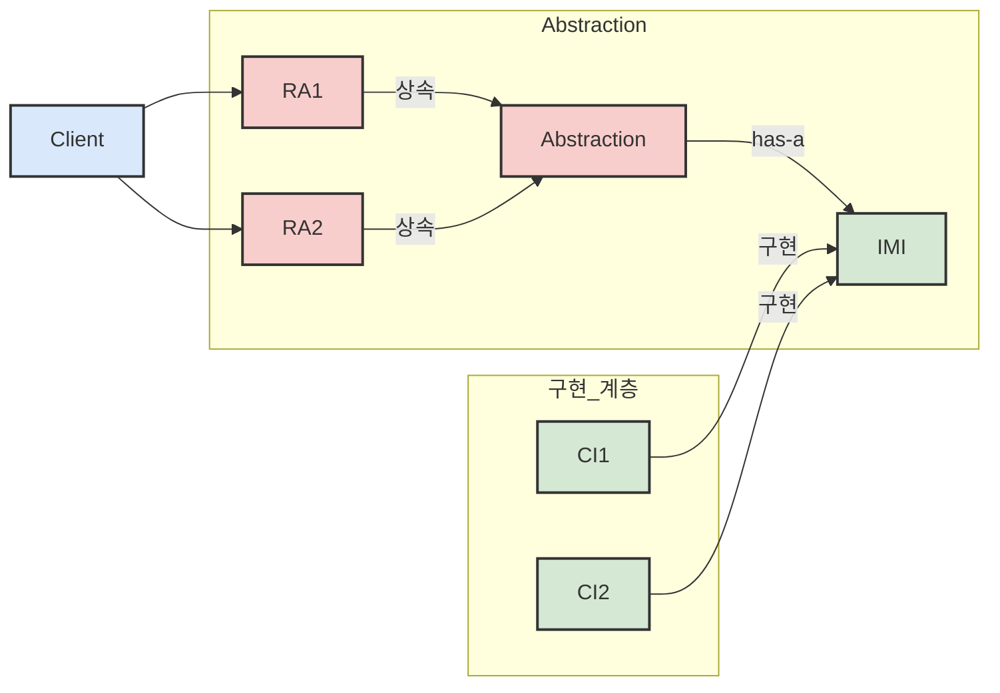
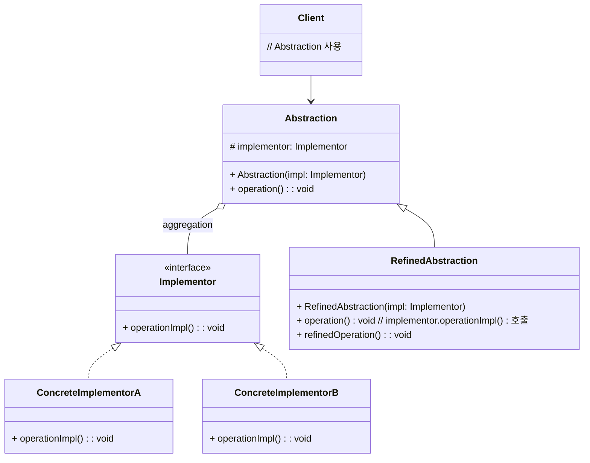

소프트웨어를 개발하다 보면, 하나의 큰 기능 덩어리가 여러 기준으로 변화하고 확장되어야 하는 경우를 마주하게 됩니다. 예를 들어, '도형'이라는 개념은 '종류'(원, 사각형, 삼각형 등)에 따라 달라질 수 있고, 동시에 '그리는 방식'(색상 채우기, 테두리만 그리기, 3D로 그리기 등)에 따라서도 달라질 수 있습니다. 이런 상황에서 단순 [[상속 (Inheritance)]]만 사용하면 클래스 계층이 걷잡을 수 없이 복잡해지는 '클래스 폭발' 현상이 발생할 수 있습니다. (예: 빨간원, 파란원, 빨간사각형, 파란사각형...)

브리지 패턴은 바로 이러한 문제를 해결하기 위해 등장했습니다. 마치 강 양쪽의 독립된 지역을 '다리(Bridge)'로 연결하되, 각 지역은 서로에게 큰 영향을 주지 않고 발전할 수 있도록 하는 것처럼 말이죠.

## 브리지 패턴이란 무엇인가요?

**브리지 패턴 (Bridge Pattern)** 은 **기능의 추상화(Abstraction) 부분과 구현(Implementation) 부분을 분리하여, 각각 독립적으로 변화하고 확장할 수 있도록 연결하는 패턴**입니다. 여기서 '추상화'는 클라이언트가 사용하는 상위 레벨의 인터페이스를, '구현'은 이 인터페이스의 실제 동작을 담당하는 하위 레벨의 세부 사항을 의미합니다.

이 패턴의 핵심은 상속 대신 [[합성 (Composition)]]을 사용하여 추상화 부분과 구현 부분을 연결한다는 점입니다. 이를 통해 두 계층이 서로에게 느슨하게 결합(Loose Coupling)되어 유연성이 극대화됩니다.




클라이언트는 기능 계층의 객체를 사용하며, 이 객체는 내부적으로 구현 계층의 객체에게 실제 작업을 위임합니다.

## 왜 브리지 패턴을 사용할까요?

브리지 패턴은 다음과 같은 상황에서 특히 유용합니다:

1. **기능과 구현의 독립적인 확장**: 앞서 언급한 도형 예시처럼, 기능의 종류(원, 사각형)와 구현 방식(벡터 그리기, 래스터 그리기)이 각각 독립적으로 늘어날 가능성이 있을 때 유용합니다. 브리지 패턴을 사용하면 (도형 종류 N개 + 그리는 방식 M개)의 클래스만 필요하게 되어, (N * M)개의 클래스가 필요한 상속 방식보다 훨씬 관리하기 쉽습니다.
2. **런타임에 구현 변경**: 추상화 객체가 사용할 구현 객체를 런타임에 선택하거나 변경해야 할 필요가 있을 때 유용합니다.
3. **구현 세부사항으로부터 클라이언트 보호**: 클라이언트는 추상화 인터페이스에만 의존하므로, 구현 방식이 변경되더라도 클라이언트 코드는 영향을 받지 않습니다.
4. **상속으로 인한 복잡성 회피**: 상속은 강력하지만, 잘못 사용하면 매우 경직된 설계를 초래할 수 있습니다. 브리지 패턴은 합성을 통해 이러한 문제를 피하고 유연성을 높입니다.

## 브리지 패턴의 구조

브리지 패턴을 구성하는 주요 참여자는 다음과 같습니다:

- **Abstraction (추상화)**: 클라이언트가 사용하는 기능의 추셔상 인터페이스를 정의합니다. `Implementor` 인터페이스 타입의 참조를 유지하며, 이 참조를 통해 실제 구현 객체에 작업을 위임합니다.
- **RefinedAbstraction (구체적 추상화)**: `Abstraction`을 상속받아 특정 기능을 구체화합니다. 여전히 실제 작업은 `Implementor`에게 위임합니다.
- **Implementor (구현자)**: 구현 클래스를 위한 인터페이스를 정의합니다. 이 인터페이스는 `Abstraction`의 인터페이스와는 완전히 다를 수 있으며, 주로 원시적인 연산들을 정의합니다.
- **ConcreteImplementor (구체적 구현자)**: `Implementor` 인터페이스를 실제로 구현합니다. 구체적인 플랫폼이나 API에 종속적인 코드가 여기에 위치합니다.




## 브리지 패턴 예시 (Java 코드)

리모컨(Abstraction)과 TV(Implementor)를 예로 들어보겠습니다. 리모컨의 종류(일반 리모컨, 스마트 리모컨)와 TV 제조사(SamsungTV, LgTV)가 독립적으로 확장될 수 있습니다.

Java

```java
// Implementor: TV 인터페이스
interface TV {
    void on();
    void off();
    void tuneChannel(int channel);
}

// ConcreteImplementor: 실제 TV 구현
class SamsungTV implements TV {
    @Override
    public void on() { System.out.println("Samsung TV is ON"); }
    @Override
    public void off() { System.out.println("Samsung TV is OFF"); }
    @Override
    public void tuneChannel(int channel) { System.out.println("Samsung TV tuned to channel " + channel); }
}

class LgTV implements TV {
    @Override
    public void on() { System.out.println("LG TV is ON"); }
    @Override
    public void off() { System.out.println("LG TV is OFF"); }
    @Override
    public void tuneChannel(int channel) { System.out.println("LG TV tuned to channel " + channel); }
}

// Abstraction: 리모컨 추상 클래스
abstract class RemoteControl {
    protected TV tv; // Implementor 참조

    public RemoteControl(TV tv) {
        this.tv = tv;
    }

    public abstract void powerOn();
    public abstract void powerOff();
    public abstract void setChannel(int channel);
}

// RefinedAbstraction: 구체적인 리모컨
class BasicRemote extends RemoteControl {
    public BasicRemote(TV tv) {
        super(tv);
    }

    @Override
    public void powerOn() {
        System.out.print("BasicRemote: ");
        tv.on();
    }

    @Override
    public void powerOff() {
        System.out.print("BasicRemote: ");
        tv.off();
    }

    @Override
    public void setChannel(int channel) {
        System.out.print("BasicRemote: ");
        tv.tuneChannel(channel);
    }
}

class SmartRemote extends RemoteControl {
    public SmartRemote(TV tv) {
        super(tv);
    }

    @Override
    public void powerOn() {
        System.out.print("SmartRemote: ");
        tv.on();
    }

    @Override
    public void powerOff() {
        System.out.print("SmartRemote: ");
        tv.off();
    }

    @Override
    public void setChannel(int channel) {
        System.out.print("SmartRemote: ");
        tv.tuneChannel(channel);
    }

    public void showNetflix() {
        System.out.println("SmartRemote: Showing Netflix on " + tv.getClass().getSimpleName());
    }
}

// Client
public class Main {
    public static void main(String[] args) {
        TV samsungTv = new SamsungTV();
        TV lgTv = new LgTV();

        RemoteControl basicRemoteWithSamsung = new BasicRemote(samsungTv);
        basicRemoteWithSamsung.powerOn();
        basicRemoteWithSamsung.setChannel(5);
        basicRemoteWithSamsung.powerOff();

        System.out.println("\n-----------------\n");

        SmartRemote smartRemoteWithLg = new SmartRemote(lgTv);
        smartRemoteWithLg.powerOn();
        smartRemoteWithLg.setChannel(10);
        smartRemoteWithLg.showNetflix();
        smartRemoteWithLg.powerOff();

        System.out.println("\n-----------------\n");
        // 동일한 SmartRemote로 SamsungTV 제어
        SmartRemote smartRemoteWithSamsung = new SmartRemote(samsungTv);
        smartRemoteWithSamsung.powerOn();
        smartRemoteWithSamsung.showNetflix();
        smartRemoteWithSamsung.powerOff();
    }
}
```

위 예시에서 `RemoteControl` 계층(Abstraction)과 `TV` 계층(Implementor)은 독립적으로 확장될 수 있습니다. 새로운 종류의 리모컨이나 새로운 TV 제조사가 추가되더라도 서로에게 영향을 주지 않고 쉽게 확장 가능합니다.

## 브리지 패턴의 장점

- **추상화와 구현의 완전한 분리**: 두 계층이 서로 독립적으로 변경되고 확장될 수 있어 유연성이 크게 향상됩니다.
- **확장성 향상**: 새로운 `Abstraction`이나 `Implementor`를 기존 코드 수정 없이 추가하기 용이합니다.
- **런타임 구현 선택**: 클라이언트는 런타임에 구체적인 `Implementor` 객체를 `Abstraction` 객체에 제공함으로써 구현을 동적으로 선택할 수 있습니다.
- **클라이언트 코드 보호**: 구현 세부사항이 변경되어도 클라이언트 코드는 `Abstraction` 인터페이스에만 의존하므로 영향을 받지 않습니다.
- **상속의 단점 극복**: "클래스 폭발" 문제를 방지하고, 합성을 통해 더 유연한 관계를 설정합니다.

## 브리지 패턴의 단점

- **설계 복잡도 증가**: 패턴을 적용하면 시스템에 포함되는 클래스와 객체의 수가 늘어나므로, 전체적인 설계가 다소 복잡해 보일 수 있습니다.
- **과잉 설계 가능성**: 기능과 구현이 실제로 독립적으로 변화할 필요가 없는 단순한 경우에 브리지 패턴을 적용하면 불필요한 복잡성만 더할 수 있습니다.
- **어떤 것을 추상화로, 어떤 것을 구현으로 나눌지 결정의 어려움**: 시스템의 어떤 부분을 `Abstraction`으로 보고 어떤 부분을 `Implementor`로 분리할지 결정하는 것이 디자인의 핵심이며, 경험이 필요할 수 있습니다.

## 어댑터 패턴과의 차이점 (간략히)

브리지 패턴은 [[어댑터 패턴 (Adapter Pattern)]]과 혼동될 수 있지만, 그 의도와 적용 시점이 다릅니다.

- **어댑터 패턴**: 이미 존재하는, 호환되지 않는 인터페이스들을 연결하는 데 중점을 둡니다. 주로 시스템 개발 _후_에 통합 문제가 발생했을 때 사용됩니다.
- **브리지 패턴**: 추상화와 구현을 처음부터 분리하여 각각 독립적으로 발전할 수 있도록 설계합니다. 주로 시스템 개발 _전_이나 _초기 단계_에서 고려됩니다.

더 자세한 비교는 [[어댑터 패턴과 브리지 패턴 비교]] 문서를 참고해주세요.

## 실생활 및 프레임워크 예시

- **JDBC (Java Database Connectivity)**: JDBC API는 브리지 패턴의 좋은 예로 볼 수 있습니다. `java.sql.Driver` 인터페이스나 `DriverManager` 클래스가 `Abstraction` 역할을 하고, 각 데이터베이스 벤더가 제공하는 JDBC 드라이버가 `ConcreteImplementor` 역할을 합니다. 개발자는 DB 종류에 상관없이 일관된 JDBC API를 사용하고, 실제 DB와의 통신은 해당 DB 드라이버가 담당합니다.
- **GUI 프레임워크**: 운영체제별로 윈도우를 그리거나 이벤트를 처리하는 방식이 다를 수 있습니다. GUI 프레임워크는 추상적인 윈도우 컴포넌트(`Abstraction`)를 제공하고, 실제 운영체제에 맞는 렌더링 및 이벤트 처리(`Implementor`)를 분리하여 다양한 플랫폼을 지원할 수 있습니다.

## 결론

브리지 패턴은 시스템의 두 가지 독립적인 변화 축을 우아하게 분리하여 유연성과 확장성을 극대화하는 강력한 설계 도구입니다. 상속으로 인해 시스템이 경직되거나 복잡해질 우려가 있을 때, 브리지 패턴은 훌륭한 대안이 될 수 있습니다.

물론 모든 상황에 브리지 패턴이 필요한 것은 아닙니다. 시스템의 변화 가능성을 신중히 고려하고, 패턴 적용으로 얻는 이점과 복잡성 증가를 저울질하여 현명하게 사용하는 것이 중요합니다.

다음번에는 또 다른 흥미로운 디자인 패턴으로 찾아뵙겠습니다. 읽어주셔서 감사합니다!