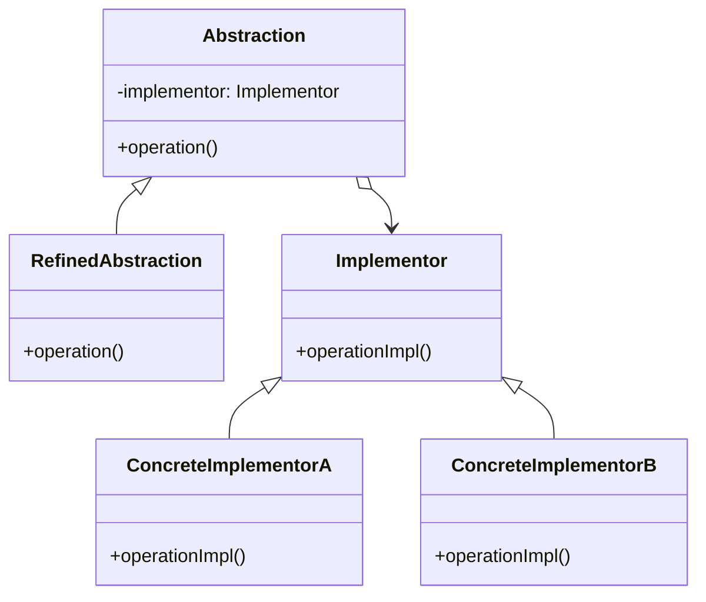

브리지 패턴은 추상화와 구현을 분리하여 둘을 독립적으로 변형할 수 있게 하는 구조적 디자인 패턴입니다. 이 패턴은 추상화된 부분과 이에 대한 구현 부분을 두 개의 별도 클래스 계층구조로 나누어 설계합니다.

## 브리지 패턴의 목적

브리지 패턴의 주요 목적은 다음과 같습니다:

1. 추상화와 구현을 분리하여 각각 독립적으로 변형이 가능하도록 함
2. 클래스 계층구조의 폭발적 증가 문제 해결
3. 런타임에 구현 교체 가능
4. 코드의 결합도를 낮추고 유연성 증가

## 브리지 패턴의 구조

브리지 패턴은 다음과 같은 주요 구성 요소로 이루어집니다:

1. **Abstraction(추상화)**: 기능에 대한 높은 수준의 제어 논리를 정의하며, 구현 객체에 대한 참조를 유지
2. **Refined Abstraction(정제된 추상화)**: Abstraction을 확장하여 더 상세한 기능 제공
3. **Implementor(구현자)**: 구현 클래스에 대한 인터페이스 정의
4. **Concrete Implementor(구체적 구현자)**: Implementor 인터페이스의 실제 구현 제공



## 브리지 패턴이 해결하는 문제

### 클래스 계층구조 폭발 문제

상속을 통한 클래스 확장은 새로운 기능이나 변형이 추가될 때마다 클래스의 수가 기하급수적으로 증가하는 문제가 있습니다. 예를 들어, 여러 형태의 도형(원, 사각형)과 여러 색상(빨강, 파랑, 녹색)을 조합하려면 형태와 색상의 모든 조합에 대한 클래스가 필요하게 됩니다.

브리지 패턴은 이를 두 개의 독립적인 계층(형태와 색상)으로 분리하여 해결하며, 필요한 클래스의 수를 크게 줄입니다.

### 단일 상속의 한계 극복

Java와 같은 언어는 다중 상속을 지원하지 않습니다. 브리지 패턴은 상속 대신 합성(composition)을 사용함으로써 이러한 제약을 극복하고, 더 유연한 디자인을 가능하게 합니다.

## 자바에서의 브리지 패턴 구현

다음은 브리지 패턴을 사용하여 도형과 색상을 분리한 예시입니다:

```java
// Implementor 인터페이스
public interface Color {
    void applyColor();
}

// Concrete Implementor 클래스
public class RedColor implements Color {
    @Override
    public void applyColor() {
        System.out.println("빨간색을 적용합니다.");
    }
}

public class BlueColor implements Color {
    @Override
    public void applyColor() {
        System.out.println("파란색을 적용합니다.");
    }
}

// Abstraction 클래스
public abstract class Shape {
    protected Color color;
    
    protected Shape(Color color) {
        this.color = color;
    }
    
    public abstract void draw();
}

// Refined Abstraction 클래스
public class Circle extends Shape {
    private double radius;
    
    public Circle(double radius, Color color) {
        super(color);
        this.radius = radius;
    }
    
    @Override
    public void draw() {
        System.out.print("반지름 " + radius + "인 원을 그립니다. ");
        color.applyColor();
    }
}

public class Rectangle extends Shape {
    private double width;
    private double height;
    
    public Rectangle(double width, double height, Color color) {
        super(color);
        this.width = width;
        this.height = height;
    }
    
    @Override
    public void draw() {
        System.out.print("너비 " + width + ", 높이 " + height + "인 사각형을 그립니다. ");
        color.applyColor();
    }
}

// 클라이언트 코드
public class Client {
    public static void main(String[] args) {
        Color red = new RedColor();
        Color blue = new BlueColor();
        
        Shape redCircle = new Circle(5.0, red);
        Shape blueRectangle = new Rectangle(4.0, 6.0, blue);
        
        redCircle.draw();
        blueRectangle.draw();
    }
}
```

이 예시에서는 도형(Shape)과 색상(Color)을 별도의 클래스 계층으로 분리했습니다. 새로운 도형이나 색상을 추가할 때 기존 코드를 수정하지 않고 확장할 수 있습니다.

## 스프링 프레임워크에서의 브리지 패턴

스프링 프레임워크는 내부적으로 브리지 패턴의 원리를 활용하고 있습니다. 대표적인 예로 JDBC API가 있습니다.

### JDBC와 브리지 패턴

JDBC API는 데이터베이스 접근을 위한 인터페이스를 제공하며, 각 데이터베이스 벤더는 이 인터페이스의 구현체를 제공합니다.

```java
// 스프링에서 JDBC를 사용하는 예시
@Service
public class UserService {
    
    private final JdbcTemplate jdbcTemplate;
    
    public UserService(DataSource dataSource) {
        this.jdbcTemplate = new JdbcTemplate(dataSource);
    }
    
    public User findUserById(long id) {
        return jdbcTemplate.queryForObject(
            "SELECT * FROM users WHERE id = ?",
            new Object[]{id},
            (rs, rowNum) -> new User(
                rs.getLong("id"),
                rs.getString("username"),
                rs.getString("email")
            )
        );
    }
}
```

이 예시에서 `JdbcTemplate`은 추상화 역할을, `DataSource`는 구현체 역할을 합니다. 다양한 데이터베이스(MySQL, PostgreSQL, Oracle 등)에 대한 구현체를 교체하더라도 서비스 코드는 변경할 필요가 없습니다.

## 브리지 패턴의 실제 활용 사례

브리지 패턴은 다양한 실제 상황에서 유용하게 활용됩니다:

### 1. 크로스 플랫폼 애플리케이션

다양한 운영체제나 디바이스에서 동작해야 하는 애플리케이션에서 플랫폼별 기능 구현을 분리할 때 브리지 패턴이 활용됩니다.

### 2. 다양한 데이터베이스 지원

애플리케이션이 여러 종류의 데이터베이스를 지원해야 할 때, 데이터 접근 로직과 데이터베이스별 구현을 분리하는 데 브리지 패턴이 사용됩니다.

### 3. 그래픽 사용자 인터페이스(GUI)

다양한 렌더링 엔진을 지원하는 GUI 시스템에서 위젯의 추상화와 플랫폼별 렌더링 구현을 분리하는 데 브리지 패턴을 활용할 수 있습니다.

### 4. 디바이스 드라이버

하드웨어 디바이스와 상호작용하는 소프트웨어에서 디바이스별 구현을 분리할 때 브리지 패턴이 사용됩니다.

## 브리지 패턴의 장단점

### 장점

1. **[[단일 책임 원칙(Single Responsibility Principle)]]**: 추상화와 구현을 분리하여 각 클래스가 하나의 책임만 갖도록 합니다.
2. **[[개방-폐쇄 원칙 (Open-Closed Principle)]]**: 기존 코드를 수정하지 않고 새로운 추상화나 구현을 독립적으로 확장할 수 있습니다.
3. **런타임 교체**: 구현체를 런타임에 교체할 수 있어 유연성이 향상됩니다.
4. **계층 분리**: 클래스 계층구조의 폭발적 증가를 방지합니다.
5. **세부 구현 은닉**: 클라이언트 코드로부터 구현 세부사항을 숨깁니다.

### 단점

1. **복잡성 증가**: 패턴 적용으로 인해 클래스 수가 증가하고 코드가 복잡해질 수 있습니다.
2. **디자인 초기 비용**: 시스템을 올바르게 분할하고 추상화하는 데 초기 설계 노력이 필요합니다.
3. **인터페이스 변경의 영향**: 구현자 인터페이스가 변경되면 추상화 계층까지 영향을 받을 수 있습니다.
4. **성능 오버헤드**: 추가적인 간접 호출로 인한 경미한 성능 오버헤드가 발생할 수 있습니다.

## 브리지 패턴 vs 다른 패턴

### 브리지 vs [[어댑터 패턴(Adapter Pattern)]]

- **브리지 패턴**: 설계 시점에 적용되며, 추상화와 구현을 분리하기 위해 사용됩니다.
- **어댑터 패턴**: 이미 존재하는 객체들을 호환되게 만들기 위해 사용됩니다.

### 브리지 vs 전략

- **브리지 패턴**: 추상화와 구현을 분리하는 구조적 패턴입니다.
- **전략 패턴**: 알고리즘을 교체 가능하게 만드는 행동 패턴입니다.

### 브리지 vs 추상 팩토리

- **브리지 패턴**: 추상화와 구현 간의 연결에 중점을 둡니다.
- **추상 팩토리 패턴**: 관련된 객체 집합을 생성하는 데 중점을 둡니다.

## 브리지 패턴 적용 시 고려사항

브리지 패턴을 적용할 때 다음 사항들을 고려해야 합니다:

1. **적절한 추상화 수준**: 추상화 계층을 어느 수준까지 세분화할지 결정해야 합니다. 너무 복잡한 추상화는 이해하기 어려워질 수 있습니다.
    
2. **계층 간 의존성 최소화**: 추상화와 구현 간의 의존성을 최소화하여 계층 간 분리를 유지해야 합니다.
    
3. **인터페이스 안정성**: 구현자 인터페이스는 가능한 안정적으로 유지해야 합니다. 인터페이스 변경은 모든 구현체에 영향을 미칩니다.
    
4. **동적 구성**: 필요한 경우 런타임에 구현체를 교체할 수 있도록 설계해야 합니다.
    

## 브리지 패턴을 사용하기 좋은 상황

다음과 같은 상황에서 브리지 패턴 적용을 고려해 볼 수 있습니다:

1. 여러 플랫폼이나 시스템에서 동작해야 하는 애플리케이션 개발 시
2. 추상화와 구현이 각각 독립적으로 확장되어야 할 때
3. 구현 세부사항을 클라이언트로부터 완전히 숨기고 싶을 때
4. 여러 변형 요소가 조합되어 클래스 계층이 복잡해질 가능성이 있을 때
5. 런타임에 구현체를 변경해야 할 필요가 있을 때

## 결론

브리지 패턴은 추상화와 구현을 분리하여 시스템을 더 유연하고 확장 가능하게 만드는 강력한 디자인 패턴입니다. 다양한 플랫폼 지원, 여러 데이터베이스 연동, 그리고 다양한 렌더링 엔진 처리 등 여러 변형이 필요한 상황에서 특히 유용합니다.

이 패턴을 적용하면 클래스 계층구조의 폭발적 증가를 방지하고, 코드의 유연성과 재사용성을 높일 수 있습니다. 하지만 초기 설계 시 더 많은 노력이 필요하고 코드의 복잡성이 증가할 수 있으므로, 실제 요구사항과 시스템의 복잡성을 고려하여 적절하게 적용해야 합니다.

브리지 패턴은 시스템 설계 초기 단계에서 적용하는 것이 가장 효과적이며, 복잡한 시스템을 보다 관리하기 쉬운 형태로 구조화하는 데 큰 도움이 됩니다.

## 참고 자료

- Design Patterns: Elements of Reusable Object-Oriented Software - Erich Gamma, Richard Helm, Ralph Johnson, John Vlissides
- Head First Design Patterns - Elisabeth Freeman, Eric Freeman, Bert Bates, Kathy Sierra
- Spring Framework Documentation - https://docs.spring.io/spring-framework/docs/current/reference/html/
- Effective Java - Joshua Bloch