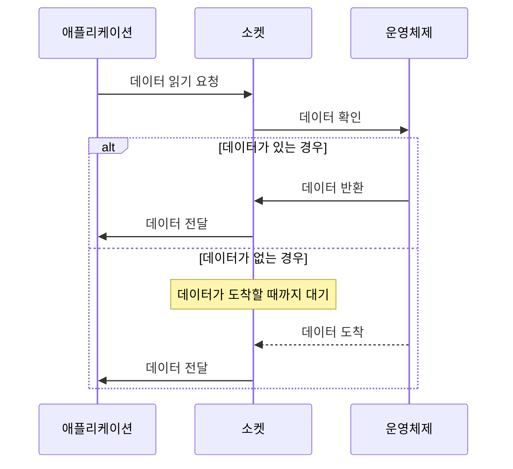

# 블로킹 소켓(Blocking Socket)

블로킹 소켓은 네트워크 통신에서 가장 기본적인 형태의 소켓으로, I/O 작업을 요청하면 해당 작업이 완료될 때까지 스레드가 차단(블로킹)되는 특성을 가지고 있습니다. 이러한 방식은 구현이 단순하고 직관적이지만, 동시에 많은 연결을 처리해야 하는 서버 애플리케이션에서는 한계가 있습니다. 블로킹 소켓을 이해하기 위해서는 [[논블로킹 소켓(Nonblocking Socket)]]과의 차이점을 이해하는 것이 중요합니다.

## 블로킹 소켓의 작동 원리

블로킹 소켓은 다음과 같은 절차로 동작합니다:



1. **소켓 생성**: 소켓을 생성하면 기본적으로 블로킹 모드로 설정됩니다.
2. **I/O 요청**: 애플리케이션이 소켓에 읽기/쓰기 요청을 합니다.
3. **블로킹**: 작업이 즉시 완료될 수 없는 경우(예: 읽을 데이터가 없음), 스레드는 해당 작업이 완료될 때까지 블로킹됩니다.
4. **작업 완료**: 작업이 완료되면(예: 데이터 도착), 스레드는 작업 결과와 함께 실행을 계속합니다.

## 블로킹 소켓의 주요 특징

1. **단순성**: 직관적이고 이해하기 쉬운 프로그래밍 모델을 제공합니다.
2. **동기적 처리**: 요청한 작업이 완료될 때까지 기다리므로 코드의 흐름이 순차적입니다.
3. **스레드 차단**: I/O 작업 중에는 스레드가 차단되어 다른 작업을 수행할 수 없습니다.
4. **멀티스레딩 필요**: 여러 클라이언트를 동시에 처리하려면 클라이언트 연결마다 별도의 스레드가 필요합니다.

## Java에서의 블로킹 소켓 구현

Java에서는 전통적인 `java.net` 패키지의 `Socket`과 `ServerSocket` 클래스를 통해 블로킹 소켓 프로그래밍을 지원합니다.

### 간단한 블로킹 서버 예제

```java
import java.io.*;
import java.net.*;

public class BlockingServer {
    public static void main(String[] args) throws IOException {
        // 서버 소켓 생성
        ServerSocket serverSocket = new ServerSocket(8080);
        System.out.println("서버가 시작되었습니다. 포트: 8080");
        
        while (true) {
            // 클라이언트 연결 대기 (블로킹)
            Socket clientSocket = serverSocket.accept();
            System.out.println("클라이언트 연결됨: " + clientSocket.getInetAddress());
            
            // 클라이언트 처리를 위한 새 스레드 생성
            new Thread(() -> handleClient(clientSocket)).start();
        }
    }
    
    private static void handleClient(Socket clientSocket) {
        try (
            BufferedReader in = new BufferedReader(
                new InputStreamReader(clientSocket.getInputStream()));
            PrintWriter out = new PrintWriter(
                clientSocket.getOutputStream(), true)
        ) {
            String line;
            // 데이터 읽기 (블로킹)
            while ((line = in.readLine()) != null) {
                System.out.println("클라이언트로부터 수신: " + line);
                out.println("에코: " + line);
            }
        } catch (IOException e) {
            System.out.println("클라이언트 처리 중 오류 발생: " + e.getMessage());
        } finally {
            try {
                clientSocket.close();
                System.out.println("클라이언트 연결 종료");
            } catch (IOException e) {
                e.printStackTrace();
            }
        }
    }
}
```

이 예제는 멀티스레드를 사용하여 여러 클라이언트를 처리하는 기본적인 에코 서버를 구현한 것입니다. 기본 소켓 통신에 대한 자세한 내용은 Java 소켓 프로그래밍 기초를 참고해주세요.

## 블로킹 모델의 성능 제한 요소

블로킹 소켓을 사용한 서버는 다음과 같은 이유로 성능에 제한이 있습니다:

1. **스레드 오버헤드**: 각 연결마다 별도의 스레드가 필요하므로, 많은 연결을 처리하는 경우 스레드 생성 및 컨텍스트 스위칭 오버헤드가 증가합니다.
2. **메모리 사용량**: 각 스레드는 스택 메모리를 소비하므로, 많은 수의 스레드는 상당한 메모리를 필요로 합니다.
3. **확장성 한계**: 운영체제나 JVM에서 생성할 수 있는 스레드 수에는 제한이 있습니다.
4. **리소스 낭비**: I/O 대기 중인 스레드는 CPU를 사용하지 않지만, 다른 작업을 수행하지 못하고 대기하게 됩니다.

## 스레드 풀을 이용한 블로킹 소켓 성능 개선

블로킹 소켓의 스레드 오버헤드 문제를 완화하기 위해 스레드 풀을 사용할 수 있습니다.

```java
import java.io.*;
import java.net.*;
import java.util.concurrent.*;

public class ThreadPoolBlockingServer {
    public static void main(String[] args) throws IOException {
        // 스레드 풀 생성
        ExecutorService executor = Executors.newFixedThreadPool(100);
        
        // 서버 소켓 생성
        ServerSocket serverSocket = new ServerSocket(8080);
        System.out.println("서버가 시작되었습니다. 포트: 8080");
        
        try {
            while (true) {
                // 클라이언트 연결 대기 (블로킹)
                Socket clientSocket = serverSocket.accept();
                System.out.println("클라이언트 연결됨: " + clientSocket.getInetAddress());
                
                // 클라이언트 처리 작업을 스레드 풀에 제출
                executor.submit(() -> handleClient(clientSocket));
            }
        } finally {
            serverSocket.close();
            executor.shutdown();
        }
    }
    
    private static void handleClient(Socket clientSocket) {
        // 클라이언트 처리 로직 (앞 예제와 동일)
        // ...
    }
}
```

스레드 풀을 사용하면 스레드 생성 오버헤드를 줄이고 동시 연결 수를 제한할 수 있지만, 여전히 블로킹 I/O의 근본적인 제한은 남아있습니다. 스레드 풀에 대한 자세한 내용은 스레드 풀 활용법을 참고해주세요.

## 블로킹 소켓과 논블로킹 소켓의 비교

다음은 블로킹 소켓과 논블로킹 소켓의 주요 차이점입니다:

|특성|블로킹 소켓|논블로킹 소켓|
|---|---|---|
|I/O 작업 시 스레드 상태|대기(블로킹)|계속 실행|
|동시 연결 처리|연결당 스레드 필요|단일 스레드로 여러 연결 처리 가능|
|구현 복잡성|단순함|상대적으로 복잡함|
|확장성|제한적|높음|
|메모리 효율성|낮음 (스레드당 스택 메모리 필요)|높음|
|코드 구조|순차적, 명확함|이벤트 기반, 비선형적|
|적합한 사용 사례|연결 수가 적은 애플리케이션|대규모 동시 연결이 필요한 애플리케이션|

자세한 비교 분석은 블로킹과 논블로킹의 비교를 참고해주세요.

## 블로킹 소켓의 장단점

### 장점

- **단순성**: 구현이 쉽고 코드 흐름이 직관적입니다.
- **디버깅 용이성**: 순차적인 코드 실행으로 디버깅이 쉽습니다.
- **안정성**: 오랜 기간 검증된 기술로 성숙하고 안정적입니다.
- **리소스 효율성(적은 연결 수)**: 적은 수의 연결만 처리하는 경우 효율적일 수 있습니다.

### 단점

- **확장성 제한**: 동시 연결 수가 증가하면 성능이 급격히 저하됩니다.
- **리소스 소비**: 많은 스레드는 메모리와 CPU 자원을 많이 소비합니다.
- **스레드 관리 복잡성**: 대규모 시스템에서는 스레드 관리가 어려워집니다.
- **성능 한계**: 높은 부하 상황에서 논블로킹 모델보다 성능이 떨어집니다.

## 실제 사용 사례

블로킹 소켓은 다음과 같은 상황에서 주로 사용됩니다:

1. **단순한 클라이언트 애플리케이션**: 단일 연결만 필요한 클라이언트 프로그램.
2. **소규모 서버 애플리케이션**: 동시 연결 수가 적은 서버.
3. **프로토타입 및 학습 환경**: 빠른 개발이 필요한 환경.
4. **기존 레거시 시스템**: 이미 블로킹 모델로 구축된 시스템.

## 스프링 프레임워크에서의 블로킹 소켓 활용

스프링 프레임워크는 전통적인 서블릿 기반 웹 애플리케이션에서 블로킹 I/O 모델을 사용합니다. 스프링 MVC는 이러한 블로킹 모델을 기반으로 합니다.

### RestTemplate을 이용한 블로킹 HTTP 클라이언트 예제

```java
import org.springframework.boot.SpringApplication;
import org.springframework.boot.autoconfigure.SpringBootApplication;
import org.springframework.context.annotation.Bean;
import org.springframework.web.bind.annotation.GetMapping;
import org.springframework.web.bind.annotation.RestController;
import org.springframework.web.client.RestTemplate;

@SpringBootApplication
public class BlockingApplication {

    public static void main(String[] args) {
        SpringApplication.run(BlockingApplication.class, args);
    }
    
    @Bean
    public RestTemplate restTemplate() {
        return new RestTemplate();
    }
    
    @RestController
    public class ExampleController {
        private final RestTemplate restTemplate;
        
        public ExampleController(RestTemplate restTemplate) {
            this.restTemplate = restTemplate;
        }
        
        @GetMapping("/example")
        public String example() {
            // 블로킹 호출 - 응답이 올 때까지 스레드 차단
            String response = restTemplate.getForObject(
                "https://api.example.com/data", 
                String.class
            );
            return "응답: " + response;
        }
    }
}
```

이 예제는 스프링 RestTemplate을 사용한 블로킹 HTTP 클라이언트를 보여줍니다. 자세한 내용은 스프링 RestTemplate 활용법을 참고해주세요.

## 블로킹 소켓 성능 최적화 방법

블로킹 소켓 기반 애플리케이션의 성능을 최적화하는 방법은 다음과 같습니다:

1. **효율적인 스레드 풀 관리**: 적절한 스레드 풀 크기 설정과 모니터링.
2. **연결 풀링**: 데이터베이스 연결과 같은 자원에 대한 풀링 적용.
3. **타임아웃 설정**: 적절한 타임아웃으로 블로킹 시간 제한.
4. **버퍼 크기 최적화**: 효율적인 데이터 전송을 위한 버퍼 크기 조정.
5. **비즈니스 로직 최적화**: I/O 작업에 의존하지 않는 로직 개선.

성능 최적화에 대한 자세한 내용은 블로킹 I/O 성능 최적화를 참고해주세요.

## 블로킹 소켓 디버깅 기법

블로킹 소켓 애플리케이션을 디버깅하는 방법은 다음과 같습니다:

1. **스레드 덤프 분석**: 스레드 상태를 덤프하여 블로킹 지점 확인.
2. **프로파일링**: CPU와 메모리 사용량 프로파일링.
3. **로깅**: 주요 작업의 시작과 종료 시간 로깅.
4. **네트워크 모니터링**: 네트워크 트래픽 분석.

자세한 디버깅 기법은 블로킹 소켓 디버깅 기법을 참고해주세요.

## 논블로킹 소켓으로의 마이그레이션

블로킹 모델에서 논블로킹 모델로 마이그레이션하는 것은 대규모 시스템에서 성능 개선을 위한 중요한 고려사항입니다. 마이그레이션 전략에는 다음이 포함됩니다:

1. **점진적 도입**: 시스템의 일부분부터 논블로킹 모델 적용.
2. **하이브리드 접근법**: 블로킹과 논블로킹 모델을 함께 사용.
3. **성능 벤치마킹**: 마이그레이션 전후 성능 측정 및 비교.
4. **코드 리팩토링**: 비동기 패턴에 맞게 코드 구조 변경.

마이그레이션에 대한 자세한 내용은 블로킹에서 논블로킹으로의 마이그레이션을 참고해주세요.

## 결론

블로킹 소켓은 구현이 단순하고 직관적이어서 소규모 애플리케이션이나 클라이언트 측 프로그래밍에 적합합니다. 하지만 대규모 동시 연결을 처리해야 하는 서버 애플리케이션에서는 확장성과 리소스 효율성 측면에서 한계가 있습니다.

현대적인 고성능 네트워크 애플리케이션 개발에서는 논블로킹 I/O 모델이 더 선호되지만, 상황에 따라 블로킹 모델이 더 적합할 수 있습니다. 두 모델의 특성을 이해하고 애플리케이션 요구사항에 맞게 적절한 모델을 선택하는 것이 중요합니다.

## 참고 자료

- Java Network Programming, 4th Edition - Elliotte Rusty Harold
- Effective Java, 3rd Edition - Joshua Bloch
- 스프링 공식 문서(https://docs.spring.io/spring-framework/docs/current/reference/html/web.html)
- Java SE 문서(https://docs.oracle.com/javase/8/docs/api/java/net/Socket.html)