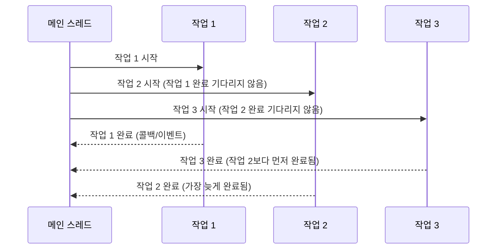

비동기(Asynchronous)는 프로그래밍에서 코드의 실행이 순차적으로 진행되지 않고, 작업이 완료되기를 기다리지 않고 다음 작업을 계속 진행하는 방식을 의미합니다. 이 방식에서는 작업이 완료되면 콜백, 이벤트, 약속(Promise) 등의 메커니즘을 통해 결과를 처리합니다. 비동기 프로그래밍은 특히 I/O 작업, 네트워크 통신, 사용자 인터페이스 등 대기 시간이 발생하는 상황에서 효율성을 높이는 데 중요한 역할을 합니다. 비동기 방식을 이해하기 위해서는 [[동기(Synchronous)]]와의 차이점을 알아보는 것이 중요합니다.

## 비동기와 동기의 차이

자세한 내용은 [[동기와 비동기의 차이]]를 참고해주세요.

## 비동기 처리의 특징

비동기 처리는 다음과 같은 핵심 특징을 가집니다:

1. **비순차적 실행**: 코드가 작성된 순서와 상관없이 실행될 수 있으며, 작업 완료를 기다리지 않고 다음 작업을 진행합니다.
2. **논블로킹(Non-blocking)**: 작업이 완료될 때까지 프로그램이 차단되지 않습니다.
3. **이벤트 기반**: 작업 완료 시 이벤트나 콜백을 통해 결과를 처리합니다.
4. **병렬 처리 가능**: 여러 작업을 동시에 진행할 수 있어 전체 처리 시간이 단축됩니다.
5. **복잡한 흐름 제어**: 코드의 실행 흐름이 복잡해질 수 있어 관리가 어려울 수 있습니다.

## 비동기 처리의 동작 방식

비동기 처리의 기본적인 흐름을 시각화하면 다음과 같습니다:



위 다이어그램에서 볼 수 있듯이, 작업들이 병렬적으로 시작되고 완료되는 시점은 예측할 수 없습니다. 이는 비동기 방식의 특성을 잘 보여줍니다.

## Java에서의 비동기 처리 구현

Java에서는 여러 방법으로 비동기 처리를 구현할 수 있습니다:

### 1. Thread 사용

가장 기본적인 방법으로, 별도의 스레드를 생성하여 작업을 수행합니다:

```java
public class AsynchronousExample {
    public static void main(String[] args) {
        System.out.println("메인 스레드 시작");
        
        // 작업 1을 별도 스레드에서 비동기적으로 실행
        new Thread(() -> {
            performTask1();
        }).start();
        
        // 작업 2를 별도 스레드에서 비동기적으로 실행
        new Thread(() -> {
            performTask2();
        }).start();
        
        // 작업 3을 별도 스레드에서 비동기적으로 실행
        new Thread(() -> {
            performTask3();
        }).start();
        
        System.out.println("메인 스레드 계속 진행");
        
        // 메인 스레드에서 다른 작업 수행 가능
        for (int i = 0; i < 5; i++) {
            System.out.println("메인 스레드 작업 중: " + i);
            try {
                Thread.sleep(200);
            } catch (InterruptedException e) {
                e.printStackTrace();
            }
        }
        
        System.out.println("메인 스레드 종료");
    }
    
    private static void performTask1() {
        try {
            Thread.sleep(2000); // 작업 시간을 시뮬레이션
        } catch (InterruptedException e) {
            e.printStackTrace();
        }
        System.out.println("작업 1 완료");
    }
    
    private static void performTask2() {
        try {
            Thread.sleep(3000); // 작업 시간을 시뮬레이션
        } catch (InterruptedException e) {
            e.printStackTrace();
        }
        System.out.println("작업 2 완료");
    }
    
    private static void performTask3() {
        try {
            Thread.sleep(1000); // 작업 시간을 시뮬레이션
        } catch (InterruptedException e) {
            e.printStackTrace();
        }
        System.out.println("작업 3 완료");
    }
}
```

### 2. ExecutorService 사용

스레드 풀을 활용하여 비동기 작업을 관리합니다:

```java
import java.util.concurrent.ExecutorService;
import java.util.concurrent.Executors;

public class ExecutorServiceExample {
    public static void main(String[] args) {
        ExecutorService executor = Executors.newFixedThreadPool(3);
        
        executor.submit(() -> performTask1());
        executor.submit(() -> performTask2());
        executor.submit(() -> performTask3());
        
        System.out.println("모든 작업이 제출되었습니다");
        
        // 스레드 풀 종료 (새 작업은 더 이상 받지 않음)
        executor.shutdown();
        
        System.out.println("메인 스레드는 계속 실행됩니다");
    }
    
    // performTask1, performTask2, performTask3 메서드는 위와 동일
}
```

### 3. CompletableFuture 사용

Java 8부터 도입된 CompletableFuture는 비동기 프로그래밍을 위한 강력한 API를 제공합니다:

```java
import java.util.concurrent.CompletableFuture;

public class CompletableFutureExample {
    public static void main(String[] args) {
        // 비동기적으로 작업 실행
        CompletableFuture<Void> future1 = CompletableFuture.runAsync(() -> performTask1());
        CompletableFuture<Void> future2 = CompletableFuture.runAsync(() -> performTask2());
        CompletableFuture<Void> future3 = CompletableFuture.runAsync(() -> performTask3());
        
        System.out.println("모든 작업이 시작되었습니다");
        
        // 세 작업이 모두 완료되면 실행할 콜백 등록
        CompletableFuture.allOf(future1, future2, future3)
            .thenRun(() -> System.out.println("모든 작업이 완료되었습니다"));
        
        System.out.println("메인 스레드는 계속 실행됩니다");
        
        // 메인 스레드가 바로 종료되지 않도록 대기
        try {
            Thread.sleep(4000);
        } catch (InterruptedException e) {
            e.printStackTrace();
        }
    }
    
    // performTask1, performTask2, performTask3 메서드는 위와 동일
}
```

CompletableFuture에 대한 자세한 내용은 [[CompletableFuture]]을 참고해주세요.

## 비동기 처리의 주요 패턴

### 1. 콜백 패턴

작업이 완료되면 미리 등록한 콜백 함수가 호출됩니다:

```java
public void processAsync(Data data, Callback callback) {
    new Thread(() -> {
        try {
            Result result = process(data);
            callback.onSuccess(result);
        } catch (Exception e) {
            callback.onError(e);
        }
    }).start();
}

// 사용 예
processAsync(data, new Callback() {
    @Override
    public void onSuccess(Result result) {
        System.out.println("처리 성공: " + result);
    }
    
    @Override
    public void onError(Exception e) {
        System.out.println("처리 실패: " + e.getMessage());
    }
});
```

### 2. Future 패턴

작업의 결과를 나중에 가져올 수 있는 Future 객체를 반환합니다:

```java
public Future<Result> processAsync(Data data) {
    return executor.submit(() -> process(data));
}

// 사용 예
Future<Result> future = processAsync(data);
// 다른 작업 수행...
try {
    Result result = future.get(); // 결과가 준비될 때까지 블로킹
    // 결과 처리
} catch (Exception e) {
    // 예외 처리
}
```

### 3. CompletableFuture 패턴

콜백과 Future의 장점을 결합한 현대적인 패턴입니다:

```java
public CompletableFuture<Result> processAsync(Data data) {
    return CompletableFuture.supplyAsync(() -> process(data));
}

// 사용 예
processAsync(data)
    .thenAccept(result -> System.out.println("처리 성공: " + result))
    .exceptionally(e -> {
        System.out.println("처리 실패: " + e.getMessage());
        return null;
    });
```

### 4. 발행-구독(Pub-Sub) 패턴

이벤트 발생 시 모든 구독자에게 알림을 보내는 패턴입니다:

```java
// 간단한 이벤트 버스 구현
public class EventBus {
    private Map<String, List<Consumer<Object>>> subscribers = new HashMap<>();
    
    public void subscribe(String eventType, Consumer<Object> handler) {
        subscribers.computeIfAbsent(eventType, k -> new ArrayList<>()).add(handler);
    }
    
    public void publish(String eventType, Object event) {
        if (subscribers.containsKey(eventType)) {
            subscribers.get(eventType).forEach(handler -> 
                CompletableFuture.runAsync(() -> handler.accept(event))
            );
        }
    }
}
```

비동기 패턴에 대한 자세한 내용은 비동기식 설계 패턴을 참고해주세요.

## 비동기 처리의 장단점

### 장점

1. **응답성 향상**: 긴 작업이 다른 작업의 실행을 차단하지 않아 애플리케이션의 응답성이 향상됩니다.
2. **처리량 증가**: 여러 작업을 병렬로 처리할 수 있어 전체 처리량이 증가합니다.
3. **자원 활용 최적화**: I/O 대기 시간 동안 CPU를 다른 작업에 활용할 수 있습니다.
4. **확장성**: 작업을 비동기적으로 처리함으로써 애플리케이션의 확장성이 향상됩니다.
5. **사용자 경험 개선**: 특히 UI 애플리케이션에서 사용자 인터페이스가 응답적으로 유지됩니다.

### 단점

1. **복잡성 증가**: 코드의 흐름이 복잡해지고 디버깅이 어려워질 수 있습니다.
2. **콜백 지옥**: 중첩된 콜백으로 인해 코드가 읽기 어려워질 수 있습니다.
3. **오류 처리의 복잡성**: 비동기 작업에서의 예외 처리가 더 복잡합니다.
4. **레이스 컨디션**: 여러 작업이 동시에 실행될 때 [[경쟁 상태(Race Condition)]]가 발생할 수 있습니다.
5. **디버깅 어려움**: 실행 순서가 예측하기 어렵고 재현하기 어려운 버그가 발생할 수 있습니다.

## 비동기 처리가 적합한 상황

비동기 처리는 다음과 같은 상황에서 특히 유용합니다:

1. **I/O 바운드 작업**: 파일 읽기/쓰기, 네트워크 통신 등 대기 시간이 긴 작업
2. **사용자 인터페이스**: UI의 응답성을 유지해야 하는 애플리케이션
3. **병렬 처리 요구**: 독립적인 여러 작업을 동시에 처리해야 하는 경우
4. **높은 처리량 요구**: 많은 수의 요청을 동시에 처리해야 하는 서버
5. **이벤트 기반 시스템**: 이벤트 발생 시 처리하는 시스템

## 스프링 프레임워크에서의 비동기 처리

스프링 프레임워크는 다양한 비동기 처리 기능을 제공합니다:

### 1. @Async 어노테이션

메서드를 비동기적으로 실행할 수 있게 해주는 어노테이션입니다:

```java
@Service
public class EmailService {
    
    @Async
    public CompletableFuture<Boolean> sendEmailAsync(String to, String subject) {
        // 시간이 오래 걸리는 이메일 전송 로직
        try {
            Thread.sleep(3000); // 전송 시간을 시뮬레이션
        } catch (InterruptedException e) {
            Thread.currentThread().interrupt();
            return CompletableFuture.completedFuture(false);
        }
        
        // 이메일 전송 로직...
        
        return CompletableFuture.completedFuture(true);
    }
}
```

@Async를 사용하기 위해서는 설정 클래스에 @EnableAsync 어노테이션을 추가해야 합니다:

```java
@Configuration
@EnableAsync
public class AsyncConfig {
    
    @Bean
    public Executor taskExecutor() {
        ThreadPoolTaskExecutor executor = new ThreadPoolTaskExecutor();
        executor.setCorePoolSize(5);
        executor.setMaxPoolSize(10);
        executor.setQueueCapacity(25);
        executor.setThreadNamePrefix("Async-");
        executor.initialize();
        return executor;
    }
}
```

### 2. 스프링 WebFlux

리액티브 프로그래밍 모델을 지원하는 스프링의 웹 프레임워크입니다:

```java
@RestController
@RequestMapping("/api")
public class ReactiveController {
    
    @Autowired
    private ReactiveUserService userService;
    
    @GetMapping("/users/{id}")
    public Mono<User> getUser(@PathVariable String id) {
        return userService.findById(id);
    }
    
    @GetMapping("/users")
    public Flux<User> getAllUsers() {
        return userService.findAll();
    }
}
```

WebFlux에 대한 자세한 내용은 스프링 WebFlux 활용법을 참고해주세요.

### 3. 비동기 REST 컨트롤러

스프링 MVC에서도 Callable, DeferredResult, CompletableFuture 등을 사용하여 비동기 처리가 가능합니다:

```java
@RestController
@RequestMapping("/api")
public class AsyncController {
    
    @Autowired
    private UserService userService;
    
    @GetMapping("/users/{id}/async1")
    public Callable<User> getUserAsync1(@PathVariable Long id) {
        return () -> userService.findById(id);
    }
    
    @GetMapping("/users/{id}/async2")
    public CompletableFuture<User> getUserAsync2(@PathVariable Long id) {
        return CompletableFuture.supplyAsync(() -> userService.findById(id));
    }
    
    @GetMapping("/users/{id}/async3")
    public DeferredResult<User> getUserAsync3(@PathVariable Long id) {
        DeferredResult<User> result = new DeferredResult<>();
        new Thread(() -> {
            try {
                User user = userService.findById(id);
                result.setResult(user);
            } catch (Exception e) {
                result.setErrorResult(e);
            }
        }).start();
        return result;
    }
}
```

스프링의 비동기 처리에 대한 자세한 내용은 스프링 비동기 처리를 참고해주세요.

## 비동기 처리의 최적화

비동기 처리의 효율성을 높이기 위한 몇 가지 최적화 기법은 다음과 같습니다:

### 1. 적절한 스레드 풀 크기 설정

애플리케이션의 특성과 하드웨어 자원에 맞게 스레드 풀의 크기를 설정합니다:

```java
int corePoolSize = Runtime.getRuntime().availableProcessors();
ThreadPoolExecutor executor = new ThreadPoolExecutor(
    corePoolSize,                 // 코어 스레드 수
    corePoolSize * 2,             // 최대 스레드 수
    60L, TimeUnit.SECONDS,        // 유휴 스레드 대기 시간
    new LinkedBlockingQueue<>(100) // 작업 큐
);
```

### 2. 작업 분할(Task Splitting)

큰 작업을 작은 작업으로 분할하여 병렬 처리합니다:

```java
List<CompletableFuture<Integer>> futures = new ArrayList<>();
for (int i = 0; i < data.size(); i += BATCH_SIZE) {
    int end = Math.min(i + BATCH_SIZE, data.size());
    List<Data> batch = data.subList(i, end);
    
    futures.add(CompletableFuture.supplyAsync(() -> processBatch(batch)));
}

CompletableFuture.allOf(futures.toArray(new CompletableFuture[0]))
    .thenAccept(v -> System.out.println("모든 배치 처리 완료"));
```

### 3. 비차단 I/O 활용

가능한 경우 논블로킹 I/O API를 사용합니다:

```java
AsynchronousFileChannel channel = AsynchronousFileChannel.open(
    Paths.get("file.txt"), StandardOpenOption.READ
);

ByteBuffer buffer = ByteBuffer.allocate(1024);
channel.read(buffer, 0, buffer, new CompletionHandler<Integer, ByteBuffer>() {
    @Override
    public void completed(Integer result, ByteBuffer attachment) {
        // 읽기 완료 처리
        attachment.flip();
        // 버퍼 데이터 처리...
    }
    
    @Override
    public void failed(Throwable exc, ByteBuffer attachment) {
        // 오류 처리
    }
});
```

비동기 처리 최적화에 대한 자세한 내용은 비동기 프로그래밍 최적화 기법을 참고해주세요.

## 동기와 비동기의 결합

현대적인 애플리케이션에서는 동기와 비동기 방식을 상황에 맞게 조합하여 사용하는 것이 일반적입니다:

```java
@Service
public class OrderService {
    
    @Autowired
    private InventoryService inventoryService;
    
    @Autowired
    private PaymentService paymentService;
    
    @Autowired
    private NotificationService notificationService;
    
    @Transactional
    public OrderResult processOrder(Order order) {
        // 1. 동기적으로 재고 확인 (즉시 결과 필요)
        boolean isAvailable = inventoryService.checkAvailability(order);
        if (!isAvailable) {
            return OrderResult.outOfStock();
        }
        
        // 2. 동기적으로 결제 처리 (트랜잭션 내에서 수행 필요)
        PaymentResult payment = paymentService.processPayment(order);
        if (!payment.isSuccessful()) {
            return OrderResult.paymentFailed(payment.getErrorMessage());
        }
        
        // 3. 주문 데이터 저장 (트랜잭션 내에서 수행 필요)
        Order savedOrder = orderRepository.save(order);
        
        // 4. 비동기적으로 이메일 알림 전송 (즉시 결과가 필요하지 않음)
        notificationService.sendOrderConfirmationAsync(savedOrder);
        
        return OrderResult.success(savedOrder);
    }
}
```

이처럼 즉시 결과가 필요하거나 트랜잭션 내에서 수행해야 하는 작업은 동기적으로, 즉시 결과가 필요하지 않은 작업은 비동기적으로 처리할 수 있습니다.

## 비동기 프로그래밍의 모범 사례

### 1. 예외 처리 철저히

비동기 작업에서 발생한 예외가 무시되지 않도록 적절히 처리합니다:

```java
CompletableFuture.supplyAsync(() -> {
    // 비동기 작업
    if (somethingWrong) {
        throw new RuntimeException("오류 발생");
    }
    return result;
})
.exceptionally(ex -> {
    // 예외 처리
    logger.error("비동기 작업 실패: " + ex.getMessage(), ex);
    return fallbackResult;
})
.thenAccept(result -> {
    // 결과 처리
});
```

### 2. 타임아웃 설정

비동기 작업이 무한정 실행되지 않도록 타임아웃을 설정합니다:

```java
CompletableFuture<Result> future = service.processAsync(data);
try {
    Result result = future.get(5, TimeUnit.SECONDS);
    // 결과 처리
} catch (TimeoutException e) {
    // 타임아웃 처리
    future.cancel(true); // 작업 취소 시도
}
```

### 3. 적절한 스레드 풀 사용

작업 특성에 맞는 스레드 풀을 사용합니다:

```java
// I/O 바운드 작업용 스레드 풀 (많은 스레드)
ExecutorService ioExecutor = Executors.newFixedThreadPool(100);

// CPU 바운드 작업용 스레드 풀 (코어 수에 맞춤)
ExecutorService cpuExecutor = Executors.newFixedThreadPool(
    Runtime.getRuntime().availableProcessors()
);
```

### 4. 비동기 체인 단순화

복잡한 비동기 체인은 가독성이 떨어지므로, 적절히 분리하여 단순화합니다:

```java
// 복잡한 비동기 체인을 메서드로 분리
private CompletableFuture<Result> processDataAsync(Data data) {
    return validateAsync(data)
        .thenCompose(this::transformAsync)
        .thenCompose(this::saveAsync);
}

// 사용 예
processDataAsync(data)
    .thenAccept(this::sendNotification)
    .exceptionally(this::handleError);
```

비동기 프로그래밍 모범 사례에 대한 자세한 내용은 비동기 프로그래밍 모범 사례를 참고해주세요.

## 실제 사용 사례

비동기 처리는 다양한 상황에서 활용됩니다:

1. **웹 애플리케이션**: 사용자 요청을 비동기적으로 처리하여 처리량과 응답성 향상
2. **대용량 데이터 처리**: 데이터를 분할하여 병렬 처리
3. **외부 서비스 호출**: 여러 외부 API를 동시에 호출하여 전체 대기 시간 감소
4. **실시간 애플리케이션**: 채팅, 알림 등 실시간 데이터 처리
5. **백그라운드 작업**: 이메일 전송, 보고서 생성 등의 백그라운드 작업

## 비동기 프로그래밍의 미래 동향

비동기 프로그래밍은 계속 발전하고 있으며, 주요 동향은 다음과 같습니다:

1. **리액티브 프로그래밍**: Reactor, RxJava 등 리액티브 라이브러리의 발전
2. **가상 스레드**: Java 21에서 도입된 가상 스레드(Virtual Thread)를 통한 경량 동시성 지원
3. **함수형 접근 방식**: 함수형 프로그래밍 패러다임과의 통합을 통한 비동기 코드 단순화
4. **선언적 비동기 처리**: 비동기 로직을 보다 선언적으로 표현하는 도구의 발전
- **코루틴**: 다른 언어에서 영감을 받은 경량 비동기 프로그래밍 모델의 도입 가능성. 자세한 내용은 [[코루틴 (Coroutines)]]을 참고해주세요.

가상 스레드에 대한 자세한 내용은 Java 가상 스레드 활용법을 참고해주세요.

## 결론

비동기 프로그래밍은 현대 애플리케이션 개발에서 필수적인 패러다임으로, 특히 높은 처리량과 응답성이 요구되는 상황에서 큰 이점을 제공합니다. 비동기 처리를 통해 I/O 대기 시간을 효율적으로 활용하고, 여러 작업을 병렬로 처리할 수 있어 전체 성능이 향상됩니다.

그러나 비동기 프로그래밍은 코드 복잡성 증가, 디버깅 어려움, 오류 처리 복잡성 등의 도전 과제도 함께 가져옵니다. 따라서 적절한 상황에서 비동기 패턴을 선택하고, 모범 사례를 따르며, 상황에 맞게 동기와 비동기 방식을 조합하는 것이 중요합니다.

비동기 프로그래밍을 마스터하면 높은 확장성과 효율성을 갖춘 애플리케이션을 개발할 수 있으며, 사용자 경험을 크게 향상시킬 수 있습니다. 현대 소프트웨어 개발자에게 비동기 프로그래밍은 필수적인 기술 중 하나이며, Java와 Spring 프레임워크는 이를 위한 다양한 도구와 API를 제공하고 있습니다.

## 참고 자료

- Java Concurrency in Practice - Brian Goetz
- Reactive Programming with RxJava - Tomasz Nurkiewicz, Ben Christensen
- Spring in Action - Craig Walls
- Modern Java in Action - Raoul-Gabriel Urma, Mario Fusco, Alan Mycroft
- 스프링 공식 문서(https://docs.spring.io/spring-framework/docs/current/reference/html/web-reactive.html)
- CompletableFuture API 문서(https://docs.oracle.com/javase/8/docs/api/java/util/concurrent/CompletableFuture.html)
- Project Loom: http://cr.openjdk.java.net/~rpressler/loom/Loom-Proposal.html