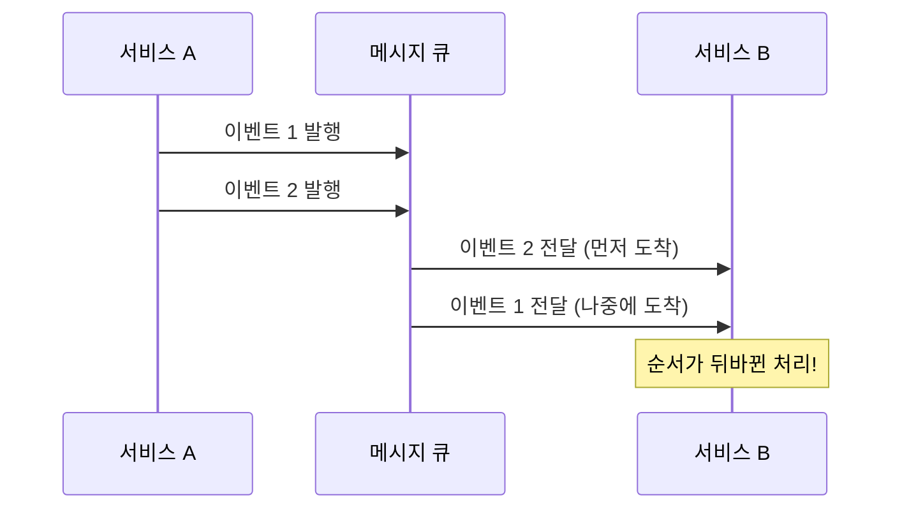

비동기 처리는 현대 소프트웨어 개발에서 성능, 확장성, 사용자 경험을 향상시키는 핵심 기술입니다. 많은 경우에 [[이벤트 기반 아키텍처(Event-Driven Architecture)]]가 비동기 처리를 구현하는 좋은 방법이지만, 모든 상황에 적합한 것은 아닙니다. 이 글에서는 비동기 처리가 필요하지만 이벤트 기반 아키텍처가 적합하지 않은 경우와 그 대안에 대해 살펴보겠습니다.

## 비동기 처리와 이벤트 기반 아키텍처란?

먼저 두 개념을 간략히 살펴보겠습니다:

- [[비동기(Asynchronous)]]: 작업을 요청한 후 결과를 기다리지 않고 다른 작업을 수행할 수 있는 방식입니다. 응답성을 높이고 자원을 효율적으로 사용할 수 있습니다.
    
- **이벤트 기반 아키텍처(Event-Driven Architecture)**: 시스템 구성 요소 간의 통신이 이벤트의 생성, 감지, 소비를 통해 이루어지는 소프트웨어 설계 패턴입니다. 느슨한 결합(loose coupling)을 촉진하고 확장성을 제공합니다.
    

자세한 내용은 비동기 처리 기본 개념과 이벤트 기반 아키텍처 소개를 참고해주세요.

## 이벤트 기반 아키텍처가 적합하지 않은 경우

### 1. 강력한 순서 보장이 필요한 경우

이벤트 기반 시스템에서는 이벤트의 발생 순서와 처리 순서가 항상 일치하지 않을 수 있습니다. 특히 분산 시스템에서는 네트워크 지연, 시스템 로드 등 다양한 이유로 이벤트 순서가 뒤바뀔 수 있습니다.



**적합하지 않은 예시**: 금융 거래에서 입금과 출금의 순서가 중요한 경우, 단순 이벤트 기반 아키텍처는 위험할 수 있습니다.

**대안**: 동기식 처리 또는 [[순서 보장 메시징 패턴]]을 사용하거나, 이벤트에 시퀀스 번호를 부여하고 수신측에서 재정렬하는 방법을 적용할 수 있습니다.

```java
@Service
public class OrderedTransactionService {
    
    private final Lock lock = new ReentrantLock();
    private final Map<String, Queue<Transaction>> pendingTransactions = new ConcurrentHashMap<>();
    
    public void processTransaction(Transaction transaction) {
        String accountId = transaction.getAccountId();
        lock.lock();
        try {
            Queue<Transaction> accountQueue = pendingTransactions.computeIfAbsent(
                accountId, k -> new PriorityQueue<>(Comparator.comparing(Transaction::getSequenceNumber))
            );
            accountQueue.add(transaction);
            processQueuedTransactions(accountId, accountQueue);
        } finally {
            lock.unlock();
        }
    }
    
    private void processQueuedTransactions(String accountId, Queue<Transaction> queue) {
        Long expectedSequence = getLastProcessedSequence(accountId) + 1;
        
        while (!queue.isEmpty() && queue.peek().getSequenceNumber().equals(expectedSequence)) {
            Transaction tx = queue.poll();
            executeTransaction(tx);
            expectedSequence++;
        }
    }
    
    // 실제 트랜잭션 실행 및 시퀀스 관리 메서드
    private void executeTransaction(Transaction tx) {
        // 트랜잭션 실행 로직
    }
    
    private Long getLastProcessedSequence(String accountId) {
        // 마지막으로 처리된 시퀀스 번호 조회
        return 0L; // 예시 값
    }
}
```

### 2. 즉각적인 응답이 필요한 경우

이벤트 기반 아키텍처는 본질적으로 "화재 후 망각(fire-and-forget)" 패턴을 따르기 때문에, 이벤트의 처리 결과를 즉시 알기 어렵습니다.

**적합하지 않은 예시**: 사용자가 실시간으로 처리 결과를 확인해야 하는 웹 애플리케이션의 경우입니다.

**대안**: 요청-응답 패턴을 사용하거나, 비동기 요청-응답 패턴을 구현할 수 있습니다. 자바에서는 CompletableFuture나 스프링의 @Async를 활용할 수 있습니다.

```java
@Service
public class UserProfileService {
    
    @Async
    public CompletableFuture<ProfileUpdateResult> updateUserProfile(ProfileUpdateRequest request) {
        // 프로필 업데이트 로직 (시간이 오래 걸릴 수 있음)
        ProfileUpdateResult result = performUpdate(request);
        return CompletableFuture.completedFuture(result);
    }
    
    private ProfileUpdateResult performUpdate(ProfileUpdateRequest request) {
        // 실제 업데이트 로직
        return new ProfileUpdateResult(true, "프로필이 성공적으로 업데이트되었습니다.");
    }
}
```

이 방식의 사용 방법에 대한 자세한 내용은 [[CompletableFuture]]을 참고해주세요.

### 3. 메모리 내 처리가 더 효율적인 경우

이벤트 기반 아키텍처, 특히 메시지 브로커를 사용하는 경우에는 네트워크 통신, 직렬화/역직렬화, 큐 관리 등의 오버헤드가 발생합니다.

**적합하지 않은 예시**: 대량의 작은 작업을 빠르게 처리해야 하는 고성능 애플리케이션이나 실시간 데이터 처리 시스템에서는 이러한 오버헤드가 성능 병목이 될 수 있습니다.

**대안**: 스레드 풀이나 워크 스틸링(Work Stealing) 알고리즘을 활용한 메모리 내 비동기 처리 방식을 사용할 수 있습니다.

```java
@Configuration
public class ThreadPoolConfig {
    
    @Bean
    public Executor applicationTaskExecutor() {
        ThreadPoolTaskExecutor executor = new ThreadPoolTaskExecutor();
        executor.setCorePoolSize(Runtime.getRuntime().availableProcessors());
        executor.setMaxPoolSize(Runtime.getRuntime().availableProcessors() * 2);
        executor.setQueueCapacity(500);
        executor.setThreadNamePrefix("app-task-");
        executor.setRejectedExecutionHandler(new ThreadPoolExecutor.CallerRunsPolicy());
        executor.initialize();
        return executor;
    }
}
```

```java
@Service
public class DataProcessingService {
    
    private final Executor executor;
    
    public DataProcessingService(Executor executor) {
        this.executor = executor;
    }
    
    public void processDataBatch(List<DataItem> items) {
        items.forEach(item -> executor.execute(() -> processItem(item)));
    }
    
    private void processItem(DataItem item) {
        // 데이터 처리 로직
    }
}
```

### 4. 트랜잭션 일관성이 중요한 경우

이벤트 기반 시스템에서는 분산 트랜잭션을 구현하기가 어렵습니다. 여러 서비스에 걸쳐 원자성을 보장해야 하는 경우, 단순 이벤트 모델로는 충분하지 않을 수 있습니다.

**적합하지 않은 예시**: 결제 시스템에서 계좌 차감, 송금, 기록 저장이 모두 성공하거나 모두 실패해야 하는 경우입니다.

**대안**: 사가 패턴(Saga Pattern)이나 보상 트랜잭션(Compensating Transaction)을 구현하거나, 중요한 작업은 단일 트랜잭션 경계 내에서 처리할 수 있습니다.

```java
@Service
@Transactional
public class PaymentService {
    
    private final AccountRepository accountRepository;
    private final TransactionRepository transactionRepository;
    
    public PaymentService(AccountRepository accountRepository, 
                          TransactionRepository transactionRepository) {
        this.accountRepository = accountRepository;
        this.transactionRepository = transactionRepository;
    }
    
    public PaymentResult processPayment(PaymentRequest request) {
        // 모든 작업이 하나의 트랜잭션으로 처리됨
        Account senderAccount = accountRepository.findByIdWithLock(request.getSenderId());
        Account receiverAccount = accountRepository.findByIdWithLock(request.getReceiverId());
        
        if (senderAccount.getBalance() < request.getAmount()) {
            throw new InsufficientBalanceException("잔액이 부족합니다.");
        }
        
        senderAccount.debit(request.getAmount());
        receiverAccount.credit(request.getAmount());
        
        accountRepository.save(senderAccount);
        accountRepository.save(receiverAccount);
        
        Transaction transaction = new Transaction(senderAccount, receiverAccount, request.getAmount());
        transactionRepository.save(transaction);
        
        return new PaymentResult(transaction.getId(), true, "결제가 성공적으로 처리되었습니다.");
    }
}
```

### 5. 시스템 복잡도가 중요한 고려사항인 경우

이벤트 기반 아키텍처는 시스템 복잡도를 증가시킬 수 있습니다. 이벤트의 추적, 디버깅, 테스트, 모니터링이 더 어려워질 수 있으며, 인프라 관리 부담도 증가합니다.

**적합하지 않은 예시**: 소규모 팀이 관리하는 단순한 애플리케이션이나, 운영 리소스가 제한된 프로젝트입니다.

**대안**: 간단한 비동기 처리 패턴을 사용하거나, 스프링의 @Async 같은 프레임워크 수준의 비동기 지원 기능을 활용할 수 있습니다.

```java
@Configuration
@EnableAsync
public class AsyncConfig {
    
    @Bean
    public Executor taskExecutor() {
        ThreadPoolTaskExecutor executor = new ThreadPoolTaskExecutor();
        executor.setCorePoolSize(2);
        executor.setMaxPoolSize(5);
        executor.setQueueCapacity(10);
        executor.setThreadNamePrefix("my-async-");
        executor.initialize();
        return executor;
    }
}
```

```java
@Service
public class EmailService {
    
    private final Logger logger = LoggerFactory.getLogger(EmailService.class);
    
    @Async
    public void sendEmail(String to, String subject, String content) {
        try {
            // 이메일 전송 로직
            logger.info("이메일 전송 완료: {}", to);
        } catch (Exception e) {
            logger.error("이메일 전송 실패: {}", e.getMessage(), e);
        }
    }
}
```

### 6. 리소스 제약이 있는 환경

이벤트 기반 아키텍처는 메시지 브로커, 이벤트 로그 등의 추가 인프라가 필요합니다. 이로 인해 메모리, 디스크, 네트워크 대역폭 등의 리소스 소비가 증가합니다.

**적합하지 않은 예시**: 임베디드 시스템, 모바일 애플리케이션, 리소스가 제한된 클라우드 환경에서는 이러한 오버헤드가 문제가 될 수 있습니다.

**대안**: 경량 비동기 패턴을 사용하거나, 운영체제 수준의 비동기 I/O를 활용할 수 있습니다.

## 대안적 접근 방식

비동기 처리가 필요하지만 이벤트 기반 아키텍처가 적합하지 않은 경우, 다음과 같은 대안을 고려할 수 있습니다:

### 1. CompletableFuture 활용

Java 8부터 도입된 CompletableFuture는 비동기 작업을 간결하게 표현하고 조합할 수 있는 방법을 제공합니다.

```java
@Service
public class ProductService {
    
    private final InventoryService inventoryService;
    private final PricingService pricingService;
    private final ReviewService reviewService;
    
    public CompletableFuture<ProductDetails> getProductDetails(Long productId) {
        CompletableFuture<InventoryInfo> inventoryFuture = 
            CompletableFuture.supplyAsync(() -> inventoryService.getInventory(productId));
            
        CompletableFuture<PriceInfo> priceFuture = 
            CompletableFuture.supplyAsync(() -> pricingService.getPrice(productId));
            
        CompletableFuture<List<Review>> reviewsFuture = 
            CompletableFuture.supplyAsync(() -> reviewService.getReviews(productId));
            
        return CompletableFuture.allOf(inventoryFuture, priceFuture, reviewsFuture)
            .thenApply(v -> new ProductDetails(
                productId,
                inventoryFuture.join(),
                priceFuture.join(),
                reviewsFuture.join()
            ));
    }
}
```

자세한 내용은 [[CompletableFuture]]을 참고해주세요.

### 2. 스프링의 비동기 지원 기능

스프링 프레임워크는 @Async 어노테이션을 통해 간단하게 비동기 처리를 구현할 수 있도록 지원합니다.

```java
@Service
public class ReportService {
    
    private final ReportRepository reportRepository;
    
    @Async
    public CompletableFuture<Report> generateReport(ReportRequest request) {
        Report report = new Report();
        // 시간이 오래 걸리는 보고서 생성 로직
        reportRepository.save(report);
        return CompletableFuture.completedFuture(report);
    }
}
```

스프링의 비동기 지원에 대한 자세한 내용은 스프링 비동기 처리 기법을 참고해주세요.

### 3. 자바 가상 스레드(Virtual Threads)

Java 21부터 도입된 가상 스레드는 적은 오버헤드로 많은 수의 동시 작업을 처리할 수 있게 합니다.

```java
@Service
public class BatchProcessingService {
    
    public void processBatch(List<Task> tasks) {
        try (var executor = Executors.newVirtualThreadPerTaskExecutor()) {
            tasks.forEach(task -> 
                executor.submit(() -> {
                    // 작업 처리 로직
                    processTask(task);
                })
            );
        }
    }
    
    private void processTask(Task task) {
        // 개별 작업 처리 로직
    }
}
```

자세한 내용은 자바 가상 스레드 활용법을 참고해주세요.

## 결론

비동기 처리는 현대 소프트웨어 개발에서 필수적인 요소이지만, 이벤트 기반 아키텍처가 항상 최선의 선택은 아닙니다. 업무의 성격, 성능 요구사항, 트랜잭션 일관성 요구사항, 시스템 복잡도, 리소스 제약 등을 고려하여 적절한 비동기 처리 방식을 선택해야 합니다.

특히 강력한 순서 보장이 필요하거나, 즉각적인 응답이 필요하거나, 트랜잭션 일관성이 중요한 경우에는 이벤트 기반 아키텍처보다 다른 비동기 처리 방법이 더 적합할 수 있습니다. 이런 경우에는 Java의 CompletableFuture, 스프링의 @Async, 자바 가상 스레드 등의 기술을 활용하는 것이 좋습니다.

적절한 상황에서 적절한 도구를 선택하는 것이 성공적인 시스템 설계의 핵심입니다. 비동기 처리 방식을 선택할 때는 항상 요구사항과 제약사항을 명확히 이해하고, 그에 맞는 접근 방식을 선택하는 것이 중요합니다.

## 참고 자료

- Effective Java, 3rd Edition - Joshua Bloch
- Java Concurrency in Practice - Brian Goetz
- Enterprise Integration Patterns - Gregor Hohpe, Bobby Woolf
- 스프링 공식 문서(https://docs.spring.io/spring-framework/docs/current/reference/html/integration.html#scheduling)
- Patterns of Enterprise Application Architecture - Martin Fowler