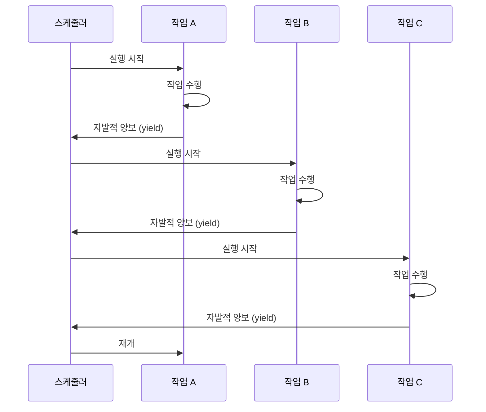

비선점형 멀티태스킹(Non-preemptive Multitasking)은 현재 실행 중인 작업이 스스로 제어권을 양보할 때까지 계속 실행되는 멀티태스킹 방식입니다. 이는 운영체제나 스케줄러가 강제로 작업을 중단시키는 선점형 멀티태스킹(Preemptive Multitasking)과는 대조적인 방식으로, 협력적 멀티태스킹(Cooperative Multitasking)이라고도 불립니다.

비선점형 멀티태스킹은 작업 간의 협력을 기반으로 하며, 각 작업이 적절한 시점에 제어권을 양보함으로써 다른 작업들이 실행될 수 있는 기회를 제공합니다. 현대 프로그래밍에서는 [[코루틴(Coroutine)]]과 같은 비동기 프로그래밍 모델에서 이 개념이 중요하게 활용됩니다.

## 비선점형 멀티태스킹의 기본 원리

비선점형 멀티태스킹에서는 각 작업이 실행 중에 스스로 다른 작업에게 제어권을 넘겨주는 방식으로 동작합니다. 이는 작업이 자발적으로 협력한다는 의미에서 "협력적(Cooperative)" 멀티태스킹이라고도 합니다.



위 다이어그램에서 볼 수 있듯이, 각 작업은 외부의 강제적인 중단 없이 스스로 적절한 시점에 제어권을 양보합니다.

## 선점형과 비선점형 멀티태스킹의 차이

### 선점형 멀티태스킹의 특징

선점형 멀티태스킹에서는 운영체제의 스케줄러가 강제로 작업을 중단시킬 수 있습니다:

1. **시간 할당량(Time Slice)**: 각 작업에 정해진 시간이 할당됩니다.
2. **강제 중단**: 시간이 다 되면 운영체제가 강제로 작업을 중단시킵니다.
3. **우선순위 기반**: 높은 우선순위의 작업이 낮은 우선순위의 작업을 선점할 수 있습니다.

### 비선점형 멀티태스킹의 특징

반면 비선점형 멀티태스킹에서는 다음과 같은 특징을 보입니다:

1. **자발적 양보**: 작업이 스스로 제어권을 양보해야 합니다.
2. **협력적 실행**: 모든 작업이 공정하게 실행되려면 서로 협력해야 합니다.
3. **예측 가능한 실행**: 작업이 언제 중단될지를 스스로 결정할 수 있습니다.

## 비선점형 멀티태스킹의 장점

### 1. 낮은 오버헤드

비선점형 멀티태스킹은 선점형에 비해 오버헤드가 적습니다:

```java
public class CooperativeTask {
    private volatile boolean shouldYield = false;
    
    public void executeTask() {
        while (!isCompleted()) {
            // 작업 수행
            performWork();
            
            // 적절한 시점에 양보
            if (shouldYield()) {
                yield(); // 자발적 양보
            }
        }
    }
    
    private void yield() {
        // 다른 작업에게 제어권 양보
        Thread.yield();
    }
    
    private boolean shouldYield() {
        // 양보 조건 확인 (예: 일정 시간 경과, 작업량 달성 등)
        return System.currentTimeMillis() % 100 == 0;
    }
}
```

### 2. 데이터 일관성

작업이 스스로 중단 시점을 결정할 수 있어 데이터의 일관성을 유지하기 쉽습니다:

```java
public class BankAccount {
    private double balance;
    private final Object lock = new Object();
    
    public void transfer(double amount, BankAccount target) {
        synchronized (lock) {
            // 원자적 작업 수행
            this.balance -= amount;
            target.deposit(amount);
            
            // 안전한 지점에서 양보
            yield();
        }
    }
    
    public void deposit(double amount) {
        synchronized (lock) {
            this.balance += amount;
        }
    }
}
```

### 3. 컨텍스트 스위칭 비용 감소

비선점형 멀티태스킹에서는 컨텍스트 스위칭이 함수 호출 수준에서 발생하므로 비용이 매우 낮습니다.

## 비선점형 멀티태스킹의 단점

### 1. 무한 루프 위험

협력하지 않는 작업이 있으면 시스템 전체가 블로킹될 수 있습니다:

```java
public class ProblematicTask {
    public void badTask() {
        // 문제가 되는 코드: 양보하지 않는 무한 루프
        while (true) {
            // 계속 실행됨 - 다른 작업들이 실행될 기회가 없음
            performCalculation();
            // yield() 호출이 없음!
        }
    }
    
    public void goodTask() {
        // 올바른 코드: 적절한 양보
        while (!isCompleted()) {
            performCalculation();
            
            // 정기적으로 양보
            if (shouldYield()) {
                yield();
            }
        }
    }
}
```

### 2. 공정성 문제

일부 작업이 너무 오래 실행되어 다른 작업들이 기아 상태(Starvation)에 빠질 수 있습니다.

### 3. 응답성 문제

하나의 작업이 오래 실행되면 전체 시스템의 응답성이 떨어질 수 있습니다.

## Java에서의 비선점형 멀티태스킹 구현

### 1. Thread.yield() 활용

Java에서는 `Thread.yield()` 메서드를 사용하여 비선점형 멀티태스킹을 구현할 수 있습니다:

```java
public class CooperativeTaskRunner {
    private final List<Runnable> tasks = new ArrayList<>();
    private volatile boolean running = true;
    
    public void addTask(Runnable task) {
        tasks.add(task);
    }
    
    public void runTasks() {
        while (running) {
            for (Runnable task : tasks) {
                // 각 작업을 실행
                task.run();
                
                // 다른 작업에게 기회 제공
                Thread.yield();
                
                if (!running) break;
            }
        }
    }
    
    public void stop() {
        running = false;
    }
}

// 사용 예시
public class CooperativeExample {
    public static void main(String[] args) {
        CooperativeTaskRunner runner = new CooperativeTaskRunner();
        
        // 협력적인 작업들 추가
        runner.addTask(() -> {
            for (int i = 0; i < 5; i++) {
                System.out.println("작업 1: " + i);
                Thread.yield(); // 자발적 양보
            }
        });
        
        runner.addTask(() -> {
            for (int i = 0; i < 5; i++) {
                System.out.println("작업 2: " + i);
                Thread.yield(); // 자발적 양보
            }
        });
        
        runner.runTasks();
    }
}
```

### 2. CompletableFuture와 협력적 실행

CompletableFuture를 사용하여 비선점형 방식으로 작업을 연결할 수 있습니다:

```java
public class CooperativeFutureExample {
    
    public CompletableFuture<String> processDataCooperatively(String data) {
        return CompletableFuture
            .supplyAsync(() -> {
                // 1단계: 데이터 검증
                validateData(data);
                return data;
            })
            .thenApply(validData -> {
                // 2단계: 데이터 변환 (자발적으로 다음 단계로 넘어감)
                return transformData(validData);
            })
            .thenApply(transformedData -> {
                // 3단계: 결과 생성
                return generateResult(transformedData);
            });
    }
    
    private void validateData(String data) {
        if (data == null || data.isEmpty()) {
            throw new IllegalArgumentException("유효하지 않은 데이터");
        }
    }
    
    private String transformData(String data) {
        // 데이터 변환 로직
        return data.toUpperCase();
    }
    
    private String generateResult(String data) {
        // 결과 생성 로직
        return "처리 완료: " + data;
    }
}
```

## 스프링에서의 비선점형 멀티태스킹

스프링 프레임워크에서는 비동기 처리를 통해 비선점형 멀티태스킹을 구현할 수 있습니다:

```java
@Service
public class CooperativeService {
    
    @Async
    public CompletableFuture<String> processCooperatively(String input) {
        return CompletableFuture.supplyAsync(() -> {
            // 1단계 처리
            String step1 = processStep1(input);
            
            // 자발적 양보 지점
            Thread.yield();
            
            // 2단계 처리
            String step2 = processStep2(step1);
            
            // 자발적 양보 지점
            Thread.yield();
            
            // 3단계 처리
            return processStep3(step2);
        });
    }
    
    private String processStep1(String input) {
        // 첫 번째 단계 처리 로직
        return "Step1: " + input;
    }
    
    private String processStep2(String input) {
        // 두 번째 단계 처리 로직
        return "Step2: " + input;
    }
    
    private String processStep3(String input) {
        // 세 번째 단계 처리 로직
        return "Step3: " + input;
    }
}
```

스프링의 비동기 처리에 대한 자세한 내용은 [[Spring Async]]를 참고해주세요.

## 현대적 활용: 코루틴과 비선점형 멀티태스킹

현대 프로그래밍에서 비선점형 멀티태스킹의 가장 대표적인 예는 코루틴입니다. 코루틴은 함수가 실행 중에 자발적으로 중단되었다가 나중에 재개될 수 있는 기능을 제공합니다:

```java
// Kotlin 스타일의 코루틴을 Java로 표현한 의사 코드
public class CoroutineExample {
    
    public void demonstrateCooperativeExecution() {
        // 여러 코루틴이 협력적으로 실행
        
        // 코루틴 1: 데이터 처리
        startCoroutine(() -> {
            processData();
            yield(); // 자발적 양보
            validateData();
            yield(); // 자발적 양보
            saveData();
        });
        
        // 코루틴 2: 로그 처리
        startCoroutine(() -> {
            writeLog();
            yield(); // 자발적 양보
            compressLog();
            yield(); // 자발적 양보
            archiveLog();
        });
        
        // 코루틴 3: 네트워크 통신
        startCoroutine(() -> {
            sendRequest();
            yield(); // 자발적 양보
            receiveResponse();
            yield(); // 자발적 양보
            processResponse();
        });
    }
}
```

코루틴에 대한 자세한 내용은 [[코루틴(Coroutine)]]을 참고해주세요.

## 비선점형 멀티태스킹의 모범 사례

### 1. 적절한 양보 지점 설정

작업을 너무 작은 단위로 나누지도, 너무 큰 단위로 두지도 말고 적절한 지점에서 양보해야 합니다:

```java
public class OptimalYieldingTask {
    private static final int YIELD_INTERVAL = 1000; // 1000회 작업마다 양보
    
    public void processLargeDataset(List<Data> dataset) {
        for (int i = 0; i < dataset.size(); i++) {
            // 데이터 처리
            processData(dataset.get(i));
            
            // 일정 간격마다 양보
            if (i % YIELD_INTERVAL == 0) {
                Thread.yield();
            }
        }
    }
}
```

### 2. 시간 기반 양보

일정 시간마다 양보하는 방식도 효과적입니다:

```java
public class TimeBasedYieldingTask {
    private static final long YIELD_INTERVAL_MS = 10; // 10ms마다 양보
    
    public void processWithTimeBasedYielding() {
        long lastYieldTime = System.currentTimeMillis();
        
        while (!isCompleted()) {
            performWork();
            
            // 시간 기반 양보
            if (System.currentTimeMillis() - lastYieldTime > YIELD_INTERVAL_MS) {
                Thread.yield();
                lastYieldTime = System.currentTimeMillis();
            }
        }
    }
}
```

### 3. 조건부 양보

특정 조건에서만 양보하는 방식입니다:

```java
public class ConditionalYieldingTask {
    
    public void processWithConditionalYielding(Queue<Task> taskQueue) {
        while (!taskQueue.isEmpty()) {
            Task task = taskQueue.poll();
            processTask(task);
            
            // 큐에 대기 중인 작업이 많으면 양보
            if (taskQueue.size() > 10) {
                Thread.yield();
            }
            
            // CPU 사용률이 높으면 양보
            if (getCpuUsage() > 80) {
                Thread.yield();
            }
        }
    }
    
    private double getCpuUsage() {
        // CPU 사용률 측정 로직
        return 0.0; // 실제 구현 필요
    }
}
```

## 비선점형 멀티태스킹의 활용 분야

### 1. 게임 개발

게임에서는 프레임 단위로 작업을 나누어 협력적으로 실행하는 경우가 많습니다:

```java
public class GameLoop {
    private static final long FRAME_TIME_MS = 16; // 60 FPS
    
    public void runGameLoop() {
        while (gameIsRunning()) {
            long frameStart = System.currentTimeMillis();
            
            // 입력 처리
            processInput();
            
            // 게임 로직 업데이트
            updateGameLogic();
            
            // 렌더링
            render();
            
            // 남은 시간만큼 양보
            long frameEnd = System.currentTimeMillis();
            long frameTime = frameEnd - frameStart;
            
            if (frameTime < FRAME_TIME_MS) {
                try {
                    Thread.sleep(FRAME_TIME_MS - frameTime);
                } catch (InterruptedException e) {
                    Thread.currentThread().interrupt();
                }
            }
        }
    }
}
```

### 2. 이벤트 기반 시스템

이벤트 처리 시스템에서도 비선점형 멀티태스킹이 유용합니다:

```java
public class EventProcessor {
    private final Queue<Event> eventQueue = new ConcurrentLinkedQueue<>();
    private volatile boolean running = true;
    
    public void processEvents() {
        while (running) {
            Event event = eventQueue.poll();
            
            if (event != null) {
                handleEvent(event);
                
                // 이벤트 처리 후 양보
                Thread.yield();
            } else {
                // 이벤트가 없으면 잠시 대기
                try {
                    Thread.sleep(1);
                } catch (InterruptedException e) {
                    Thread.currentThread().interrupt();
                    break;
                }
            }
        }
    }
    
    private void handleEvent(Event event) {
        // 이벤트 처리 로직
        System.out.println("이벤트 처리: " + event.getType());
    }
}
```

### 3. 실시간 시스템

실시간 시스템에서는 예측 가능한 실행이 중요하므로 비선점형 멀티태스킹이 적합할 수 있습니다:

```java
public class RealTimeTaskScheduler {
    private final List<ScheduledTask> tasks = new ArrayList<>();
    
    static class ScheduledTask {
        private final Runnable task;
        private final long period;
        private long lastExecution;
        
        public ScheduledTask(Runnable task, long period) {
            this.task = task;
            this.period = period;
            this.lastExecution = System.currentTimeMillis();
        }
        
        public boolean shouldRun() {
            return System.currentTimeMillis() - lastExecution >= period;
        }
        
        public void run() {
            task.run();
            lastExecution = System.currentTimeMillis();
        }
    }
    
    public void runScheduler() {
        while (true) {
            for (ScheduledTask task : tasks) {
                if (task.shouldRun()) {
                    task.run();
                    
                    // 다른 작업에게 기회 제공
                    Thread.yield();
                }
            }
            
            // 짧은 휴식
            try {
                Thread.sleep(1);
            } catch (InterruptedException e) {
                Thread.currentThread().interrupt();
                break;
            }
        }
    }
}
```

## 비선점형 멀티태스킹 디버깅

비선점형 멀티태스킹 시스템을 디버깅할 때는 다음과 같은 점들을 주의해야 합니다:

### 1. 무한 루프 탐지

양보하지 않는 작업을 탐지하는 모니터링 시스템:

```java
public class TaskMonitor {
    private final Map<String, Long> taskStartTimes = new ConcurrentHashMap<>();
    private static final long MAX_EXECUTION_TIME = 5000; // 5초
    
    public void taskStarted(String taskId) {
        taskStartTimes.put(taskId, System.currentTimeMillis());
    }
    
    public void taskYielded(String taskId) {
        taskStartTimes.remove(taskId);
    }
    
    public void checkForStuckTasks() {
        long currentTime = System.currentTimeMillis();
        
        taskStartTimes.entrySet().removeIf(entry -> {
            if (currentTime - entry.getValue() > MAX_EXECUTION_TIME) {
                System.err.println("작업이 너무 오래 실행됨: " + entry.getKey());
                return true;
            }
            return false;
        });
    }
}
```

### 2. 성능 분석

각 작업의 실행 시간과 양보 패턴을 분석:

```java
public class PerformanceAnalyzer {
    private final Map<String, List<Long>> executionTimes = new HashMap<>();
    
    public void recordExecutionTime(String taskName, long executionTime) {
        executionTimes.computeIfAbsent(taskName, k -> new ArrayList<>())
                     .add(executionTime);
    }
    
    public void printStatistics() {
        for (Map.Entry<String, List<Long>> entry : executionTimes.entrySet()) {
            String taskName = entry.getKey();
            List<Long> times = entry.getValue();
            
            double average = times.stream().mapToLong(Long::longValue).average().orElse(0.0);
            long max = times.stream().mapToLong(Long::longValue).max().orElse(0L);
            long min = times.stream().mapToLong(Long::longValue).min().orElse(0L);
            
            System.out.printf("작업 %s: 평균 %f ms, 최대 %d ms, 최소 %d ms%n", 
                            taskName, average, max, min);
        }
    }
}
```

## 결론

비선점형 멀티태스킹은 작업들이 협력적으로 실행되는 멀티태스킹 방식으로, 낮은 오버헤드와 예측 가능한 실행 흐름이라는 장점을 제공합니다. 하지만 모든 작업이 적절히 협력해야 한다는 요구사항과 무한 루프나 공정성 문제 등의 단점도 존재합니다.

현대 프로그래밍에서는 코루틴, 비동기 프로그래밍, 이벤트 기반 시스템 등에서 비선점형 멀티태스킹의 개념이 중요하게 활용되고 있습니다. 특히 높은 성능과 예측 가능한 동작이 요구되는 상황에서는 비선점형 멀티태스킹이 매우 유용한 접근 방법이 될 수 있습니다.

성공적인 비선점형 멀티태스킹 구현을 위해서는 적절한 양보 지점 설정, 작업 모니터링, 성능 분석 등의 모범 사례를 따르고, [[동시성(Concurrency)]], [[스레드(Thread)]], [[비동기(Asynchronous)]] 등의 관련 개념들을 함께 이해하는 것이 중요합니다.

## 참고 자료

- Operating System Concepts - Abraham Silberschatz, Peter Galvin, Greg Gagne
- Java Concurrency in Practice - Brian Goetz
- Modern Operating Systems - Andrew S. Tanenbaum
- Effective Java - Joshua Bloch
- 스프링 프레임워크 공식 문서(https://docs.spring.io/spring-framework/docs/current/reference/html/)
