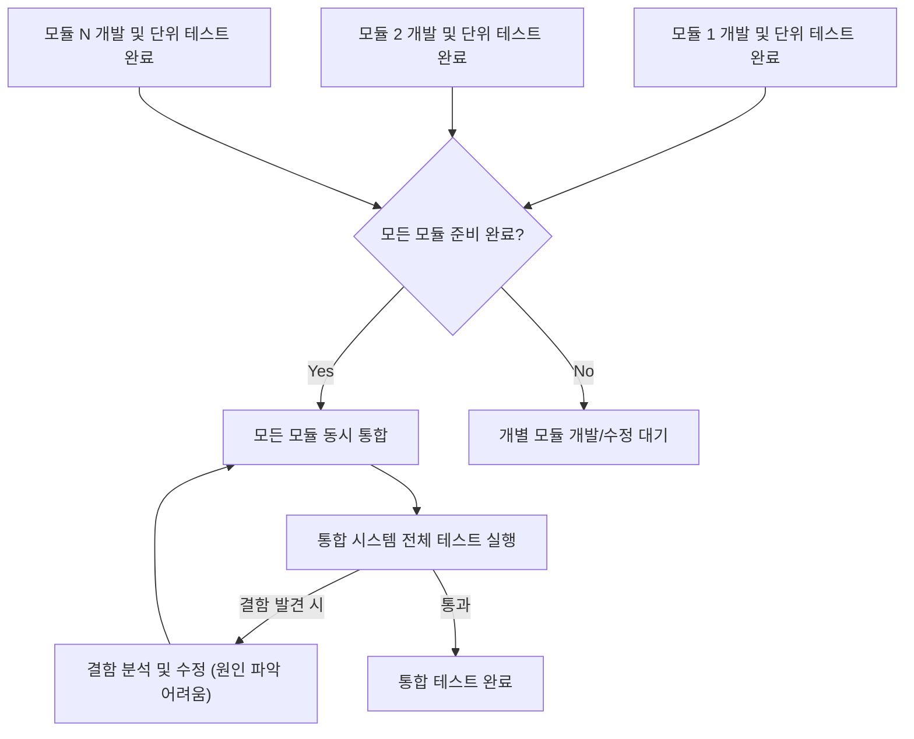

소프트웨어 개발 프로젝트에서 여러 [[모듈(Module)]]들이 잘 어우러져 동작하는지 확인하는 과정은 매우 중요합니다. 이러한 확인 작업을 [[통합 테스트]]라고 부르는데요, 다양한 통합 테스트 전략 중에서도 오늘은 '빅뱅(Big Bang)'이라는 이름만큼이나 독특한 접근 방식인 **빅뱅 통합 테스트**에 대해 자세히 알아보겠습니다.

마치 우주가 한 점에서 폭발하여 시작되었다는 빅뱅 이론처럼, 이 테스트 방식은 개발된 모든 소프트웨어 모듈을 한꺼번에 통합하여 시스템 전체를 테스트하는 전략입니다. 이름에서 알 수 있듯이, 모든 구성 요소를 한 번에 "꽝!"하고 합쳐서 확인하는 방식이라고 생각하시면 쉽습니다.

## 빅뱅 통합 테스트란 무엇인가요?

빅뱅 통합 테스트는 [[소프트웨어 테스트 생명주기(STLC)]]의 한 단계로, 개별적으로 개발되고 [[단위 테스트(Unit Test)]]가 완료된 모든 모듈 또는 컴포넌트들을 한 번에 통합하여 전체 시스템으로서 상호작용을 검증하는 방법입니다. 이는 [[점진적 통합 테스트]]와는 대비되는 접근 방식으로, 모든 모듈이 개발 완료될 때까지 기다렸다가 한꺼번에 통합을 진행합니다.

이 방식은 모든 것이 준비되었을 때 한 번에 시스템을 조립하고 테스트하기 때문에, 마치 모든 재료를 한 번에 냄비에 넣고 끓여보는 요리와 비슷하다고 비유할 수 있습니다.

## 빅뱅 통합 테스트의 핵심 특징

- **동시 통합**: 가장 큰 특징은 모든 모듈을 한 번에 통합한다는 점입니다.
- **단일 단계 통합**: 통합 과정이 여러 단계로 나뉘지 않고, 단 한 번의 큰 통합 작업으로 이루어집니다.
- **후기 테스트 집중**: 개별 모듈 개발이 거의 완료된 시점에서 통합 및 테스트가 진행됩니다.

## 언제 빅뱅 통합 테스트를 고려할 수 있을까요?

빅뱅 통합 테스트는 모든 상황에 적합한 만능 전략은 아닙니다. 다음과 같은 경우에 고려해 볼 수 있습니다:

1. **소규모 시스템**: 프로젝트의 크기가 작고 모듈 수가 적을 때 상대적으로 관리가 용이합니다.
2. **모든 모듈 동시 개발 완료**: 모든 모듈이 거의 동시에 개발 완료될 것으로 예상될 때 적합합니다. 만약 특정 모듈 개발이 크게 지연되면 전체 통합 일정도 영향을 받습니다.
3. **시스템이 잘 정의되고 안정적일 때**: 모듈 간의 [[인터페이스(Interface)]]가 명확하고, 각 모듈의 안정성이 높다고 판단될 때 효과적일 수 있습니다.

그러나 현대의 복잡하고 대규모인 시스템에는 단점이 더 부각될 수 있어 신중한 선택이 필요합니다.

## 빅뱅 통합 테스트의 장점과 단점

모든 테스트 전략과 마찬가지로 빅뱅 통합 테스트도 장단점을 가지고 있습니다. 자세한 내용은 아래 링크된 노트를 참고해주세요.

- [[빅뱅 통합 테스트의 장점]]
- [[빅뱅 통합 테스트의 단점]]

단점을 요약하자면, 가장 큰 어려움은 결함 발생 시 원인이 되는 모듈을 찾아내기 어렵다는 점([[결함 국지화 (Defect Localization)]]의 어려움)과 통합 시점에 너무 많은 이슈가 한꺼번에 발견될 위험이 있다는 것입니다.

## 빅뱅 통합 테스트 수행 과정

빅뱅 통합 테스트의 수행 과정은 비교적 단순합니다.

1. **모듈 준비**: 테스트 대상이 되는 모든 개별 모듈의 개발 및 단위 테스트를 완료합니다.
2. **빅뱅 통합**: 준비된 모든 모듈을 한 번에 결합하여 전체 시스템을 구성합니다.
3. **테스트 실행**: 통합된 시스템 전체를 대상으로 테스트 케이스를 실행하여 기능 및 비기능적 요구사항을 검증합니다.
4. **결함 분석 및 수정**: 테스트 과정에서 발견된 결함의 원인을 분석하고 수정합니다. 이 단계에서 결함의 근본 원인을 찾는 것이 어려울 수 있습니다.
5. **재테스트**: 수정된 부분을 포함하여 시스템을 다시 테스트합니다. 모든 주요 결함이 해결될 때까지 이 과정을 반복합니다.

## 점진적 통합 테스트와의 비교

빅뱅 통합 테스트와는 대조적으로, [[점진적 통합 테스트]]는 모듈을 하나씩 또는 작은 그룹으로 점진적으로 통합하며 테스트하는 방식입니다. 둘 사이의 자세한 비교는 [[빅뱅 통합 테스트와 점진적 통합 테스트 비교]] 문서를 참고해주세요.

점진적 통합 테스트에는 대표적으로 다음과 같은 방법들이 있습니다:

- [[하향식 통합 테스트]]
- [[상향식 통합 테스트]]
- [[샌드위치 통합 테스트]] (혼합형 통합 테스트)

이러한 점진적 방식은 결함 발견 시 원인 추적이 용이하고, 시스템을 단계적으로 구축하며 안정성을 확보할 수 있다는 장점이 있습니다.

## 빅뱅 통합 테스트 적용 시 주요 고려사항

- **인터페이스 정의의 중요성**: 모든 모듈이 마지막에 한꺼번에 통합되므로, 각 모듈 간의 [[인터페이스 명세]]가 사전에 매우 명확하게 정의되고 공유되어야 합니다. 인터페이스 불일치는 통합 실패의 주요 원인이 됩니다.
- **리스크 관리**: 통합 시점에 수많은 오류가 동시에 발생할 가능성이 있으며, 이는 프로젝트 일정에 큰 부담을 줄 수 있습니다. 이러한 리스크를 사전에 인지하고 대비해야 합니다.
- **테스트 환경 구축**: 전체 시스템을 한 번에 테스트해야 하므로, 모든 모듈과 그 의존성을 포함하는 완전한 테스트 환경을 미리 준비해야 합니다.
- **결함 추적의 어려움 대비**: [[결함 관리]] 전략 수립 시, 빅뱅 방식으로 인해 결함 원인 파악이 어려울 수 있음을 고려해야 합니다. 상세한 로깅이나 디버깅 도구 활용 계획이 필요할 수 있습니다.

## 결론: 빅뱅 통합 테스트, 언제 어떻게 활용할 것인가?

빅뱅 통합 테스트는 모든 모듈이 준비될 때까지 기다렸다가 한 번에 시스템을 구성하고 테스트하는 단순명료한 접근 방식입니다. 소규모 프로젝트나 모든 구성 요소가 동시에 준비되는 특수한 상황에서는 유용할 수 있지만, 현대의 복잡한 대규모 소프트웨어 개발에서는 몇 가지 큰 단점(특히 [[결함 국지화 (Defect Localization)]]의 어려움과 후반부에 집중되는 리스크)으로 인해 주류 [[테스트 전략]]으로 사용되기에는 한계가 있습니다.

대부분의 경우, [[점진적 통합 테스트]] 방식이 결함을 조기에 발견하고 시스템을 보다 안정적으로 구축하는 데 효과적입니다. 그럼에도 불구하고 빅뱅 통합 테스트의 개념을 이해하는 것은 다양한 [[통합 테스트]] 전략을 비교하고 프로젝트 특성에 맞는 최적의 방법을 선택하는 데 도움이 될 것입니다.

궁극적으로 성공적인 통합 테스트는 단순히 특정 방법을 따르는 것을 넘어, 프로젝트의 규모, 복잡성, 팀의 역량, 사용 가능한 자원 등 다양한 요소를 종합적으로 고려하여 결정되어야 합니다.

## 참고 자료

- ISTQB Syllabus (International Software Testing Qualifications Board)
- Pressman, R. S., & Maxim, B. R. (2019). _Software Engineering: A Practitioner's Approach_. McGraw-Hill Education.
- Gehazi, G., & Myers, G. J. (2011). _The Art of Software Testing_. John Wiley & Sons.
- (추가적으로 참고한 구체적인 블로그나 아티클 링크)