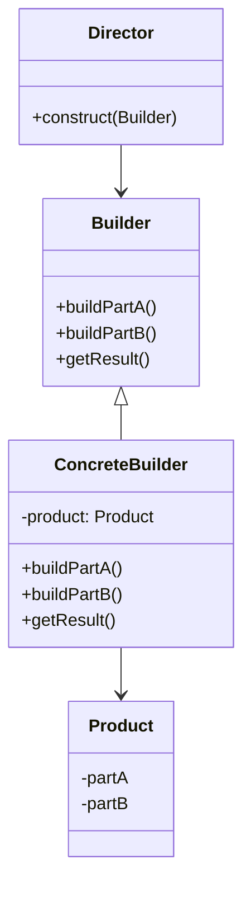

빌더 패턴은 복잡한 객체의 생성 과정과 표현 방법을 분리하여 다양한 구성의 인스턴스를 만드는 생성 디자인 패턴입니다. 이 패턴은 특히 선택적 매개변수가 많은 복잡한 객체를 생성할 때 유용하며, [[생성 패턴(Creational Pattern)]]중 하나로 분류됩니다.

## 빌더 패턴이 해결하는 문제

객체 생성 시 다음과 같은 문제가 있을 때 빌더 패턴이 효과적인 해결책이 될 수 있습니다:

1. **생성자 매개변수가 많을 때**: 매개변수가 많으면 코드 가독성이 떨어지고 매개변수 순서를 기억하기 어려워집니다.
2. **선택적 매개변수가 많을 때**: 일부 매개변수만 설정하고 나머지는 기본값을 사용하고 싶을 때 [[점층적 생성자 패턴(Telescoping Constructor Pattern)]]을 사용하면 많은 생성자 오버로딩이 필요합니다.
3. **불변 객체를 만들 때**: 객체 생성 후 상태를 변경할 수 없는 불변 객체를 만들 때 유용합니다.
4. **객체 생성 과정이 복잡할 때**: 객체 생성에 여러 단계가 필요하거나 특정 규칙이 있을 때 적합합니다.

## 빌더 패턴의 구조

빌더 패턴은 다음과 같은 구성 요소로 이루어집니다:



1. **제품(Product)**: 생성될 복잡한 객체
2. **빌더(Builder)**: 제품의 각 부분을 생성하는 추상 인터페이스
3. **구체적인 빌더(Concrete Builder)**: Builder 인터페이스를 구현하여 실제 제품을 생성
4. **디렉터(Director)**: 빌더를 사용하여 객체를 생성하는 클래스 (선택적)

## Java에서의 빌더 패턴 구현

Java에서는 주로 내부 정적 클래스를 사용하여 빌더 패턴을 구현합니다. 다음은 빌더 패턴을 사용한 `User` 클래스의 예시입니다:

```java
public class User {
    // 필수 속성
    private final String firstName;
    private final String lastName;
    
    // 선택적 속성
    private final int age;
    private final String phone;
    private final String address;
    
    private User(UserBuilder builder) {
        this.firstName = builder.firstName;
        this.lastName = builder.lastName;
        this.age = builder.age;
        this.phone = builder.phone;
        this.address = builder.address;
    }
    
    // Getter 메서드들
    public String getFirstName() {
        return firstName;
    }
    
    public String getLastName() {
        return lastName;
    }
    
    public int getAge() {
        return age;
    }
    
    public String getPhone() {
        return phone;
    }
    
    public String getAddress() {
        return address;
    }
    
    @Override
    public String toString() {
        return "User: " + this.firstName + " " + this.lastName + ", " + 
               this.age + " years old, Phone: " + this.phone + ", Address: " + this.address;
    }
    
    // 빌더 클래스
    public static class UserBuilder {
        // 필수 매개변수
        private final String firstName;
        private final String lastName;
        
        // 선택적 매개변수 - 기본값으로 초기화
        private int age = 0;
        private String phone = "";
        private String address = "";
        
        public UserBuilder(String firstName, String lastName) {
            this.firstName = firstName;
            this.lastName = lastName;
        }
        
        public UserBuilder age(int age) {
            this.age = age;
            return this;
        }
        
        public UserBuilder phone(String phone) {
            this.phone = phone;
            return this;
        }
        
        public UserBuilder address(String address) {
            this.address = address;
            return this;
        }
        
        public User build() {
            return new User(this);
        }
    }
}
```

사용 예시:

```java
User user = new User.UserBuilder("홍", "길동")
                .age(30)
                .phone("010-1234-5678")
                .address("서울시 강남구")
                .build();
```

## 빌더 패턴의 장단점

### 장점

1. **가독성 향상**: 어떤 매개변수가 어떤 값으로 설정되는지 명확하게 알 수 있습니다.
2. **유연성**: 필요한 매개변수만 선택적으로 설정할 수 있습니다.
3. **불변성 지원**: 객체를 불변(immutable)으로 만들 수 있습니다.
4. **매개변수 검증**: `build()` 메서드에서 매개변수 유효성을 검사할 수 있습니다.
5. **메서드 체이닝**: 메서드를 연속해서 호출하는 [[메서드 체이닝(Method Chaining)]]을 통해 가독성 있는 코드를 작성할 수 있습니다.

### 단점

1. **코드량 증가**: 빌더 클래스를 별도로 작성해야 하므로 코드량이 증가합니다.
2. **복잡성**: 단순한 객체에는 과도한 설계가 될 수 있습니다.
3. **변경 비용**: 클래스에 새 필드가 추가될 때마다 빌더도 업데이트해야 합니다.

## Lombok을 활용한 빌더 패턴

[[Lombok]]은 Java 라이브러리로, 어노테이션을 통해 보일러플레이트 코드를 줄여줍니다. `@Builder` 어노테이션을 사용하면 빌더 패턴을 쉽게 구현할 수 있습니다:

```java
import lombok.Builder;
import lombok.Getter;

@Getter
@Builder
public class User {
    private final String firstName;
    private final String lastName;
    private final int age;
    private final String phone;
    private final String address;
}
```

사용 예시:

```java
User user = User.builder()
            .firstName("홍")
            .lastName("길동")
            .age(30)
            .phone("010-1234-5678")
            .address("서울시 강남구")
            .build();
```

Lombok에 대한 자세한 내용은 [[Lombok 활용법]]을 참고해주세요.

## 스프링 프레임워크에서의 빌더 패턴

스프링 프레임워크에서는 다양한 곳에서 빌더 패턴을 활용합니다:

### 1. RestTemplate의 UriComponentsBuilder

```java
UriComponents uriComponents = UriComponentsBuilder.newInstance()
    .scheme("https")
    .host("api.example.com")
    .path("/users/{id}")
    .queryParam("format", "json")
    .encode()
    .buildAndExpand(42)
    .toUri();
```

### 2. WebClient의 빌더

```java
WebClient webClient = WebClient.builder()
    .baseUrl("https://api.example.com")
    .defaultHeader(HttpHeaders.CONTENT_TYPE, MediaType.APPLICATION_JSON_VALUE)
    .defaultCookie("key", "value")
    .filter(ExchangeFilterFunction.ofRequestProcessor(/* ... */))
    .build();
```

### 3. MockMvcBuilders (테스트)

```java
MockMvc mockMvc = MockMvcBuilders.webAppContextSetup(webApplicationContext)
    .apply(springSecurity())
    .build();
```

이러한 예시들에서 볼 수 있듯이, 스프링은 복잡한 객체 구성을 위해 빌더 패턴을 적극적으로 활용합니다. 스프링의 빌더 패턴 활용에 대한 더 자세한 내용은 [[스프링에서의 빌더 패턴 활용]]을 참고해주세요.

## 빌더 패턴의 변형

### 1. 점층적 빌더(Telescoping Builder)

계층적 구조로 서로 다른 타입의 빌더를 구성하는 방법입니다. 각 빌더는 특정 타입의 속성만 설정할 수 있습니다.

### 2. 유창한 인터페이스(Fluent Interface)

빌더 패턴의 메서드 체이닝은 [[유창한 인터페이스(Fluent Interface)]]의 한 예입니다. 이 패턴은 메서드 체이닝을 통해 자연스러운 언어처럼 API를 사용할 수 있게 합니다.

### 3. 추상 팩토리와의 결합

[[추상 팩토리 패턴(Abstract Factory Pattern)]]과 빌더 패턴을 결합하여 복잡한 객체 생성 시스템을 구축할 수 있습니다.

## 실전 사례: 복잡한 객체 생성

웹 애플리케이션에서 여러 설정이 필요한 HTTP 클라이언트를 생성하는 예시를 살펴보겠습니다:

```java
public class HttpClient {
    private final String baseUrl;
    private final int timeout;
    private final boolean followRedirects;
    private final Map<String, String> headers;
    private final String proxyHost;
    private final int proxyPort;
    private final String authentication;
    
    // 생략된 생성자, getter 등
    
    public static class Builder {
        // 필수 매개변수
        private final String baseUrl;
        
        // 선택적 매개변수 - 기본값 설정
        private int timeout = 30000;
        private boolean followRedirects = true;
        private Map<String, String> headers = new HashMap<>();
        private String proxyHost = null;
        private int proxyPort = -1;
        private String authentication = null;
        
        public Builder(String baseUrl) {
            this.baseUrl = baseUrl;
        }
        
        public Builder timeout(int timeout) {
            this.timeout = timeout;
            return this;
        }
        
        public Builder followRedirects(boolean followRedirects) {
            this.followRedirects = followRedirects;
            return this;
        }
        
        public Builder header(String name, String value) {
            this.headers.put(name, value);
            return this;
        }
        
        public Builder proxy(String host, int port) {
            this.proxyHost = host;
            this.proxyPort = port;
            return this;
        }
        
        public Builder basicAuth(String username, String password) {
            this.authentication = "Basic " + Base64.getEncoder()
                    .encodeToString((username + ":" + password).getBytes());
            return this;
        }
        
        public HttpClient build() {
            // 유효성 검사
            if (timeout <= 0) {
                throw new IllegalStateException("Timeout must be positive");
            }
            if (proxyHost != null && proxyPort <= 0) {
                throw new IllegalStateException("Proxy port must be positive");
            }
            
            return new HttpClient(this);
        }
    }
    
    private HttpClient(Builder builder) {
        this.baseUrl = builder.baseUrl;
        this.timeout = builder.timeout;
        this.followRedirects = builder.followRedirects;
        this.headers = Collections.unmodifiableMap(new HashMap<>(builder.headers));
        this.proxyHost = builder.proxyHost;
        this.proxyPort = builder.proxyPort;
        this.authentication = builder.authentication;
    }
}
```

사용 예시:

```java
HttpClient client = new HttpClient.Builder("https://api.example.com")
    .timeout(5000)
    .followRedirects(false)
    .header("Accept", "application/json")
    .header("User-Agent", "MyApp/1.0")
    .basicAuth("username", "password")
    .build();
```

빌더 패턴을 사용하면 위와 같이 복잡한 객체도 읽기 쉽고 유지보수하기 쉬운 방식으로 생성할 수 있습니다.

## 빌더 패턴과 다른 생성 패턴의 비교

자세한 내용은 [[생성 패턴 비교]]를 참고해주세요.

## 결론

빌더 패턴은 복잡한 객체를 단계별로 생성할 수 있게 해주는 강력한 디자인 패턴입니다. 특히 많은 매개변수를 가진 객체를 생성할 때 가독성과 유지보수성을 크게 향상시킵니다. Java와 스프링 프레임워크에서 널리 사용되며, 적절한 상황에서 활용하면 코드의 품질을 높일 수 있습니다.

빌더 패턴은 코드의 양이 다소 증가하지만, 객체 생성의 복잡성을 숨기고 클라이언트 코드를 더 깔끔하게 만드는 이점이 있습니다. 또한 Lombok과 같은 도구를 활용하면 보일러플레이트 코드를 줄이면서도 빌더 패턴의 장점을 활용할 수 있습니다.

모든 상황에 빌더 패턴이 적합한 것은 아니므로, 객체의 복잡성과 요구사항을 고려하여 적절한 생성 패턴을 선택하는 것이 중요합니다.

## 참고 자료

- Effective Java, 3rd Edition - Joshua Bloch
- Design Patterns: Elements of Reusable Object-Oriented Software - Gang of Four
- Clean Code - Robert C. Martin
- 스프링 프레임워크 공식 문서(https://docs.spring.io/spring-framework/docs/current/reference/html/)