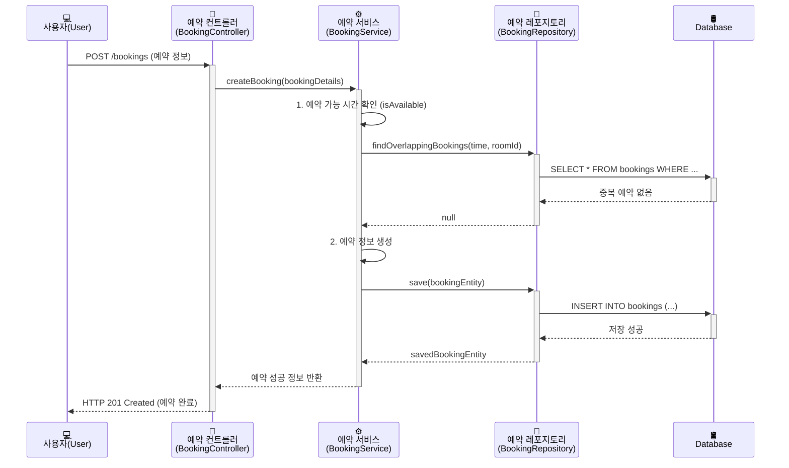

[[아키텍처 설계(Architecture Design)]]를 통해 시스템의 전체적인 청사진을 그렸다면, 이제는 그 청사진을 바탕으로 실제 각 방의 내부를 어떻게 꾸밀지, 가구는 어떻게 배치하고 전기 배선은 어떻게 연결할지를 결정할 시간입니다. 이 과정이 바로 **상세 설계(Low-Level Design, LLD)**입니다.

상세 설계는 고수준 설계에서 정의된 각 컴포넌트와 모듈의 **내부 동작 방식과 세부 구현 계획**을 구체화하는 단계입니다. 개발자가 코드를 작성하기 직전에 보는 **가장 구체적인 설계도**라고 할 수 있습니다.

---

## 🔬 상세 설계란 무엇인가요?

**상세 설계(LLD)**는 고수준 설계에서 정의된 아키텍처 컴포넌트 하나하나를 가져와, 그 내부를 어떻게 구현할 것인지 상세하게 기술하는 과정입니다. "회의실을 예약한다"는 고수준의 기능을 "어떤 클래스와 함수가, 어떤 순서로, 어떤 데이터를 주고받으며 처리할 것인가"의 수준으로 구체화하는 것이죠.

이 단계의 주된 목표는 개발팀이 이 설계도만 보고도 **명확하고 일관된 방식으로 코드를 작성할 수 있도록** 하는 것입니다. 개발자 개개인의 해석에 따른 구현 방식의 차이를 최소화하고, 시스템의 효율성과 유지보수성을 높이는 데 핵심적인 역할을 합니다.

### 상세 설계의 핵심 초점

- **How it works**: 특정 기능이 '어떻게' 동작하는가?
- **Class and Method**: 어떤 클래스, 함수, 모듈이 필요한가?
- **Data Structures**: 어떤 자료구조와 데이터 타입을 사용할 것인가?
- **Algorithm**: 특정 문제를 해결하기 위한 구체적인 알고리즘은 무엇인가?
- **API Specification**: 모듈 간, 혹은 외부와 통신할 API의 상세 명세는 어떻게 되는가?

---

## 🛠️ 상세 설계의 핵심 구성 요소

상세 설계 단계에서는 다음과 같은 구체적인 산출물들이 만들어집니다.

1. **클래스 다이어그램 (Class Diagrams)**: 시스템을 구성하는 클래스들과 그들의 속성(attributes), 행동(methods), 그리고 클래스들 간의 관계(상속, 연관, 의존 등)를 시각적으로 표현합니다.
2. **시퀀스 다이어그램 (Sequence Diagrams)**: 특정 기능을 수행할 때, 객체들이 어떤 순서로 메시지(메서드 호출)를 주고받는지 시간의 흐름에 따라 보여줍니다. 객체 간의 상호작용을 이해하는 데 매우 유용합니다.
3. **API 명세 (API Specifications)**: 함수나 API 엔드포인트의 구체적인 명세를 정의합니다.
    - **Request**: 요청 URL, HTTP 메서드, 헤더, 파라미터, 요청 본문(body) 구조
    - **Response**: 응답 상태 코드, 성공/실패 시의 응답 본문 구조
4. **데이터 모델 (Data Model)**: 데이터베이스 테이블의 각 필드명, 데이터 타입, 제약 조건(Not Null, Primary Key 등)을 상세하게 정의합니다.
5. **의사 코드 (Pseudo-code)**: 복잡한 알고리즘이나 비즈니스 로직을 실제 코드를 작성하기 전에, 자연어에 가까운 형태로 논리적 흐름을 작성합니다.

---

## 🎨 시각화 예시: "회의실 예약" 시퀀스 다이어그램

[[아키텍처 설계(고수준 설계)]]에서 정의한 '회의실 예약 시스템'의 "사용자가 회의실을 예약하는" 기능에 대한 상세 설계를 시퀀스 다이어그램으로 표현해 보겠습니다.

이 다이어그램은 단순한 "예약" 기능을 위해 `Controller`, `Service`, `Repository` 객체가 어떻게 협력하는지, 데이터베이스와는 어떤 상호작용을 하는지를 명확하게 보여줍니다. 개발자는 이 다이어그램을 보고 각 클래스에 어떤 메서드가 필요한지, 호출 순서는 어떻게 되어야 하는지를 파악하여 코드를 작성할 수 있습니다.

---

## ✨ 마치며

상세 설계는 아키텍처라는 큰 그림을 현실의 코드로 옮기기 위한 **최종 번역본**입니다. 이 단계가 충실할수록 코드의 품질은 높아지고, 버그는 줄어들며, 팀원 간의 협업은 원활해집니다.

탄탄한 고수준 설계 위에 꼼꼼한 상세 설계가 더해졌을 때, 비로소 견고하고 신뢰성 높은 소프트웨어가 탄생할 수 있습니다.

---

### 📚 참고 자료 (References)

1. **GeeksforGeeks - Low Level Design (LLD)**: 저수준 설계의 개념과 중요성을 설명합니다. [https://www.geeksforgeeks.org/low-level-design-lld-in-system-design/](https://www.geeksforgeeks.org/low-level-design-lld-in-system-design/)
2. **Baeldung - High-Level vs. Low-Level Design in Software Engineering**: 고수준 설계와 저수준 설계의 차이점을 실제 예시와 함께 비교합니다. [https://www.baeldung.com/cs/hld-vs-lld](https://www.google.com/search?q=https.com/baeldung.com/cs/hld-vs-lld)
3. **IBM - UML sequence diagrams**: 시퀀스 다이어그램의 개념과 구성 요소에 대해 설명합니다. [https://www.ibm.com/docs/en/rational-rhapsody/8.1.3?topic=uml-sequence-diagrams](https://www.google.com/search?q=https://www.ibm.com/docs/en/rational-rhapsody/8.1.3%3Ftopic%3Duml-sequence-diagrams)
4. **TECHVIO - What is Low-Level Design?**: 저수준 설계의 목적과 산출물에 대해 설명하는 글입니다. [https://www.techvio.in/what-is-low-level-design](https://www.google.com/search?q=https://www.techvio.in/what-is-low-level-design)