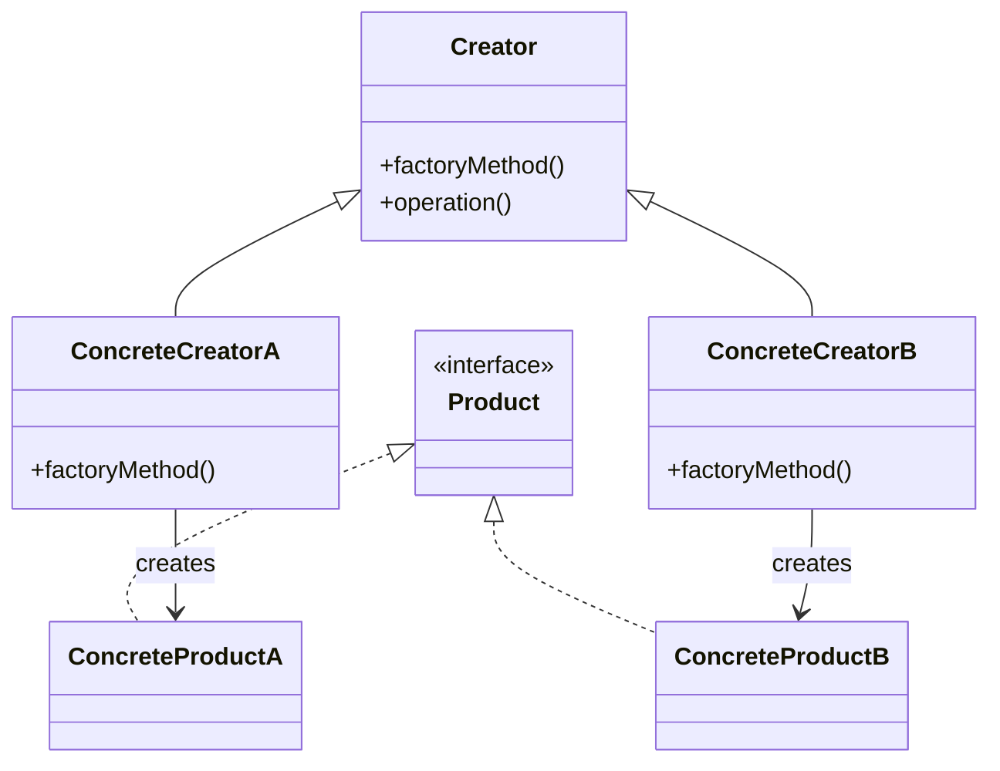
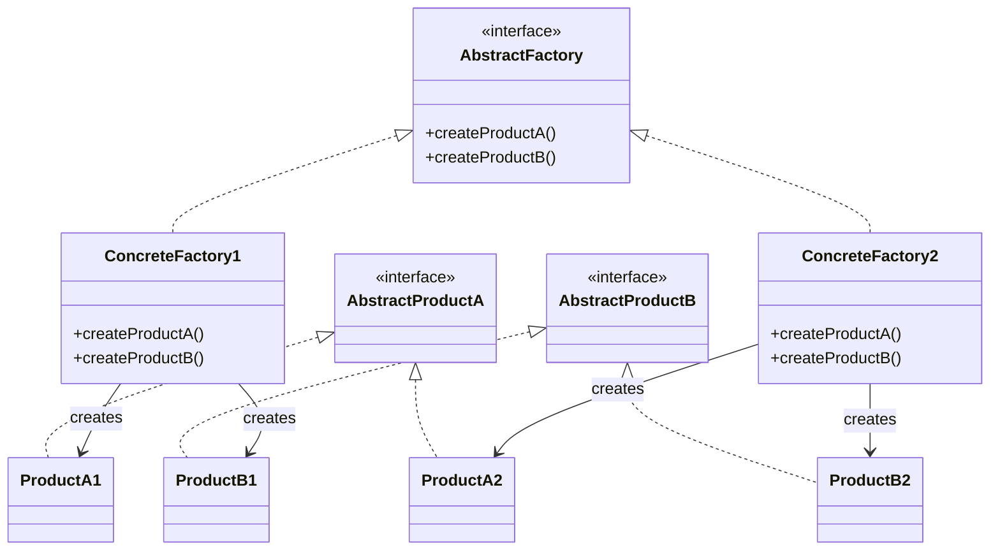

생성 패턴은 객체 생성 메커니즘을 다루는 디자인 패턴으로, 객체가 생성되는 방식을 제어하고 캡슐화하여 시스템의 [[소프트웨어 설계의 유연성(Flexibility)|유연성]]을 높이는 것을 목표로 합니다. 이러한 패턴들은 객체 생성 로직을 분리함으로써 코드의 결합도를 낮추고 재사용성을 높입니다.

생성 패턴은 "무엇이 생성되는가", "누가 이것을 생성하는가", "어떻게 생성되는가", "언제 생성되는가"와 같은 객체 생성에 관한 핵심 질문에 답합니다. 이를 통해 시스템이 어떤 구체 클래스를 사용하는지에 대한 정보를 캡슐화하고, 이들 클래스의 인스턴스가 어떻게 생성되고 결합되는지를 숨깁니다.

## 주요 생성 패턴

### 1. [[싱글톤 패턴(Singleton Pattern)]]

싱글톤 패턴은 클래스의 인스턴스가 오직 하나만 생성되도록 보장하고, 이에 대한 전역적인 접근점을 제공하는 패턴입니다.

#### 구현 방법

```java
public class Singleton {
    // 정적 필드에 인스턴스를 저장
    private static Singleton instance;
    
    // 생성자를 private으로 선언하여 외부에서 인스턴스 생성 방지
    private Singleton() {}
    
    // 인스턴스에 접근할 수 있는 정적 메소드 제공
    public static Singleton getInstance() {
        if (instance == null) {
            instance = new Singleton();
        }
        return instance;
    }
    
    // 싱글톤 클래스의 비즈니스 로직
    public void businessMethod() {
        // 실제 비즈니스 로직
    }
}
```
#### 사용 사례

- 데이터베이스 연결 관리
- 로깅 시스템
- 설정 관리
- 캐시 관리
- 스레드 풀

자세한 싱글톤 패턴의 구현 방법과 고려사항은 [[싱글톤 패턴(Singleton Pattern)]]을 참고해주세요.

### 2. [[팩토리 메소드 패턴(Factory Method Pattern)]]

팩토리 메소드 패턴은 객체 생성을 서브클래스에 위임하여 객체 생성의 유연성을 높이는 패턴입니다. 이 패턴은 객체 생성 로직을 캡슐화하고, 클라이언트 코드와 생성되는 객체의 구현을 분리합니다.



#### 구현 예시

```java
// 제품 인터페이스
public interface Product {
    void operation();
}

// 구체적인 제품 클래스들
public class ConcreteProductA implements Product {
    @Override
    public void operation() {
        System.out.println("ConcreteProductA 작업 수행");
    }
}

public class ConcreteProductB implements Product {
    @Override
    public void operation() {
        System.out.println("ConcreteProductB 작업 수행");
    }
}

// 생성자 추상 클래스
public abstract class Creator {
    // 팩토리 메소드
    public abstract Product factoryMethod();
    
    // 제품을 사용하는 메소드
    public void operation() {
        // 팩토리 메소드를 호출하여 제품 객체 생성
        Product product = factoryMethod();
        // 생성된 객체 사용
        product.operation();
    }
}

// 구체적인 생성자 클래스들
public class ConcreteCreatorA extends Creator {
    @Override
    public Product factoryMethod() {
        return new ConcreteProductA();
    }
}

public class ConcreteCreatorB extends Creator {
    @Override
    public Product factoryMethod() {
        return new ConcreteProductB();
    }
}
```

#### 사용 사례

- UI 컴포넌트 생성
- 다양한 데이터베이스 커넥터 생성
- 플러그인 아키텍처
- 로깅 시스템에서 다양한 로거 생성

자세한 팩토리 메소드 패턴의 활용 방법은 [[팩토리 메소드 패턴 활용법]]을 참고해주세요.

### 3. [[추상 팩토리 패턴(Abstract Factory Pattern)]]

추상 팩토리 패턴은 관련된 객체의 집합을 생성하기 위한 인터페이스를 제공하는 패턴입니다. 이 패턴은 구체적인 클래스를 지정하지 않고도 관련 객체들의 패밀리를 생성할 수 있게 합니다.



#### 구현 예시

```java
// 추상 제품 인터페이스들
public interface Button {
    void render();
    void onClick();
}

public interface Checkbox {
    void render();
    void onCheck();
}

// 구체적인 제품 클래스들 - 윈도우 스타일
public class WindowsButton implements Button {
    @Override
    public void render() {
        System.out.println("Windows 스타일 버튼을 렌더링합니다.");
    }
    
    @Override
    public void onClick() {
        System.out.println("Windows 버튼 클릭 동작을 수행합니다.");
    }
}

public class WindowsCheckbox implements Checkbox {
    @Override
    public void render() {
        System.out.println("Windows 스타일 체크박스를 렌더링합니다.");
    }
    
    @Override
    public void onCheck() {
        System.out.println("Windows 체크박스 체크 동작을 수행합니다.");
    }
}

// 구체적인 제품 클래스들 - 맥 스타일
public class MacButton implements Button {
    @Override
    public void render() {
        System.out.println("Mac 스타일 버튼을 렌더링합니다.");
    }
    
    @Override
    public void onClick() {
        System.out.println("Mac 버튼 클릭 동작을 수행합니다.");
    }
}

public class MacCheckbox implements Checkbox {
    @Override
    public void render() {
        System.out.println("Mac 스타일 체크박스를 렌더링합니다.");
    }
    
    @Override
    public void onCheck() {
        System.out.println("Mac 체크박스 체크 동작을 수행합니다.");
    }
}

// 추상 팩토리 인터페이스
public interface GUIFactory {
    Button createButton();
    Checkbox createCheckbox();
}

// 구체적인 팩토리 클래스들
public class WindowsFactory implements GUIFactory {
    @Override
    public Button createButton() {
        return new WindowsButton();
    }
    
    @Override
    public Checkbox createCheckbox() {
        return new WindowsCheckbox();
    }
}

public class MacFactory implements GUIFactory {
    @Override
    public Button createButton() {
        return new MacButton();
    }
    
    @Override
    public Checkbox createCheckbox() {
        return new MacCheckbox();
    }
}

// 클라이언트 코드
public class Application {
    private Button button;
    private Checkbox checkbox;
    
    public Application(GUIFactory factory) {
        button = factory.createButton();
        checkbox = factory.createCheckbox();
    }
    
    public void render() {
        button.render();
        checkbox.render();
    }
}

// 사용 예시
public class Demo {
    public static void main(String[] args) {
        // 운영체제에 따라 적절한 팩토리 선택
        GUIFactory factory;
        String osName = System.getProperty("os.name").toLowerCase();
        
        if (osName.contains("windows")) {
            factory = new WindowsFactory();
        } else {
            factory = new MacFactory();
        }
        
        Application app = new Application(factory);
        app.render();
    }
}
```

#### 사용 사례

- 크로스 플랫폼 UI 라이브러리
- 데이터베이스 추상화 레이어
- 다양한 테마나 스킨을 가진 애플리케이션
- 테스트 환경과 프로덕션 환경 간의 전환

자세한 추상 팩토리 패턴의 구현 방법과 활용 사례는 [[추상 팩토리 패턴 활용법]]을 참고해주세요.

### 4. [[빌더 패턴(Builder Pattern)]]

빌더 패턴은 복잡한 객체의 생성 과정과 표현 방법을 분리하여 같은 생성 과정에서 서로 다른 표현을 생성할 수 있게 하는 패턴입니다. 이 패턴은 특히 많은 선택적 매개변수를 가진 객체를 생성할 때 유용합니다.

#### 구현 예시

```java
public class Computer {
    // 필수 속성
    private final String cpu;
    private final String ram;
    
    // 선택적 속성
    private final String storage;
    private final String graphicsCard;
    private final String monitor;
    private final String keyboard;
    private final String mouse;
    
    private Computer(Builder builder) {
        this.cpu = builder.cpu;
        this.ram = builder.ram;
        this.storage = builder.storage;
        this.graphicsCard = builder.graphicsCard;
        this.monitor = builder.monitor;
        this.keyboard = builder.keyboard;
        this.mouse = builder.mouse;
    }
    
    // 빌더 클래스
    public static class Builder {
        // 필수 매개변수
        private final String cpu;
        private final String ram;
        
        // 선택적 매개변수 - 기본값으로 초기화
        private String storage = "256GB SSD";
        private String graphicsCard = "내장 그래픽";
        private String monitor = "모니터 없음";
        private String keyboard = "키보드 없음";
        private String mouse = "마우스 없음";
        
        // 필수 매개변수를 가진 생성자
        public Builder(String cpu, String ram) {
            this.cpu = cpu;
            this.ram = ram;
        }
        
        // 선택적 매개변수를 설정하는 메소드들
        public Builder storage(String storage) {
            this.storage = storage;
            return this;
        }
        
        public Builder graphicsCard(String graphicsCard) {
            this.graphicsCard = graphicsCard;
            return this;
        }
        
        public Builder monitor(String monitor) {
            this.monitor = monitor;
            return this;
        }
        
        public Builder keyboard(String keyboard) {
            this.keyboard = keyboard;
            return this;
        }
        
        public Builder mouse(String mouse) {
            this.mouse = mouse;
            return this;
        }
        
        // 최종 객체를 생성하는 메소드
        public Computer build() {
            return new Computer(this);
        }
    }
    
    // 컴퓨터 정보를 출력하는 메소드
    public void printSpecs() {
        System.out.println("CPU: " + cpu);
        System.out.println("RAM: " + ram);
        System.out.println("Storage: " + storage);
        System.out.println("Graphics Card: " + graphicsCard);
        System.out.println("Monitor: " + monitor);
        System.out.println("Keyboard: " + keyboard);
        System.out.println("Mouse: " + mouse);
    }
}

// 사용 예시
public class BuilderDemo {
    public static void main(String[] args) {
        Computer gamingPC = new Computer.Builder("i9-11900K", "32GB DDR4")
            .storage("2TB NVMe SSD")
            .graphicsCard("RTX 3080")
            .monitor("27인치 4K 모니터")
            .keyboard("기계식 키보드")
            .mouse("게이밍 마우스")
            .build();
        
        Computer officePC = new Computer.Builder("i5-11600", "16GB DDR4")
            .storage("512GB SSD")
            .monitor("24인치 Full HD 모니터")
            .keyboard("멤브레인 키보드")
            .mouse("일반 마우스")
            .build();
        
        System.out.println("=== 게이밍 PC 사양 ===");
        gamingPC.printSpecs();
        
        System.out.println("\n=== 사무용 PC 사양 ===");
        officePC.printSpecs();
    }
}
```

#### 사용 사례

- 복잡한 객체 생성(예: 문서, 메일 메시지)
- 많은 선택적 매개변수를 가진 객체 생성
- 불변 객체 생성
- 객체 생성 과정의 단계적 구성

자세한 빌더 패턴의 구현 방법과 활용 사례는 [[빌더 패턴 구현 방법]]을 참고해주세요.

### 5. [[프로토타입 패턴(Prototype Pattern)]]

프로토타입 패턴은 기존 객체를 복제하여 새로운 객체를 생성하는 패턴입니다. 이 패턴은 객체 생성 비용이 크거나, 비슷한 객체가 이미 존재할 때 유용합니다.

#### 구현 예시

```java
// 프로토타입 인터페이스
public interface Prototype extends Cloneable {
    Prototype clone();
}

// 구체적인 프로토타입 구현
public class Document implements Prototype {
    private String title;
    private String content;
    private List<String> authors = new ArrayList<>();
    private Map<String, String> metadata = new HashMap<>();
    
    public Document(String title, String content) {
        this.title = title;
        this.content = content;
    }
    
    public void addAuthor(String author) {
        authors.add(author);
    }
    
    public void addMetadata(String key, String value) {
        metadata.put(key, value);
    }
    
    @Override
    public Document clone() {
        try {
            Document clone = (Document) super.clone();
            // 깊은 복사 수행
            clone.authors = new ArrayList<>(this.authors);
            clone.metadata = new HashMap<>(this.metadata);
            return clone;
        } catch (CloneNotSupportedException e) {
            // 이 예외는 Cloneable을 구현했기 때문에 발생하지 않음
            return null;
        }
    }
    
    // Getter 및 Setter 메소드들
    public String getTitle() {
        return title;
    }
    
    public void setTitle(String title) {
        this.title = title;
    }
    
    public String getContent() {
        return content;
    }
    
    public void setContent(String content) {
        this.content = content;
    }
    
    public List<String> getAuthors() {
        return authors;
    }
    
    public Map<String, String> getMetadata() {
        return metadata;
    }
    
    @Override
    public String toString() {
        return "Document{" +
                "title='" + title + '\'' +
                ", content='" + content + '\'' +
                ", authors=" + authors +
                ", metadata=" + metadata +
                '}';
    }
}

// 사용 예시
public class PrototypeDemo {
    public static void main(String[] args) {
        // 원본 문서 생성 및 설정
        Document original = new Document("디자인 패턴", "디자인 패턴은 소프트웨어 설계에서...");
        original.addAuthor("에릭 감마");
        original.addAuthor("리처드 헬름");
        original.addMetadata("year", "1994");
        original.addMetadata("publisher", "Addison-Wesley");
        
        System.out.println("원본 문서: " + original);
        
        // 문서 복제
        Document copy = original.clone();
        copy.setTitle("GoF 디자인 패턴");
        copy.addAuthor("존 블리식스");
        copy.addMetadata("language", "Korean");
        
        System.out.println("복사본 문서: " + copy);
        System.out.println("원본 문서: " + original);
    }
}
```

#### 사용 사례

- 복잡한 객체 생성 비용 절감
- 유사한 객체들의 생성
- 데이터베이스 쿼리 결과와 같은 큰 객체의 복제
- 객체의 상태를 저장하고 복원해야 하는 경우
- 객체 생성 과정이 복잡한 경우

자세한 프로토타입 패턴의 구현 방법과 활용 사례는 [[프로토타입 패턴 활용법]]을 참고해주세요.

## 생성 패턴의 비교

각 생성 패턴은 서로 다른 문제를 해결하기 위해 설계되었으며, 상황에 따라 적절한 패턴을 선택하는 것이 중요합니다.

|패턴|주요 목적|적합한 상황|
|---|---|---|
|싱글톤|클래스의 인스턴스가 하나만 존재하도록 보장|공유 리소스 접근, 설정 관리, 로깅 등|
|팩토리 메소드|객체 생성을 서브클래스에 위임|생성할 객체의 정확한 유형을 미리 알 수 없을 때|
|추상 팩토리|관련된 객체들의 집합 생성|제품군이 다양하고 클라이언트가 구체적인 클래스에 독립적이어야 할 때|
|빌더|복잡한 객체의 생성 과정 분리|많은 선택적 매개변수나 구성 요소를 가진 객체 생성 시|
|프로토타입|기존 객체를 복제하여 새 객체 생성|객체 생성 비용이 크거나 비슷한 객체가 이미 존재할 때|

## 스프링 프레임워크에서의 생성 패턴

스프링 프레임워크는 여러 생성 패턴을 내부적으로 활용하고 있습니다.

### 싱글톤 패턴

스프링의 기본 빈 스코프는 싱글톤으로, 컨테이너당 하나의 인스턴스만 생성됩니다.

```java
@Service
public class UserService {
    // 이 서비스는 기본적으로 싱글톤으로 관리됩니다
}
```

### 팩토리 메소드 패턴

스프링의 BeanFactory와 FactoryBean은 팩토리 메소드 패턴의 구현입니다.

```java
@Configuration
public class DatabaseConfig {
    @Bean
    public DataSource dataSource() {
        // 팩토리 메소드 패턴을 사용하여 DataSource 객체 생성
        BasicDataSource dataSource = new BasicDataSource();
        dataSource.setDriverClassName("com.mysql.cj.jdbc.Driver");
        dataSource.setUrl("jdbc:mysql://localhost:3306/mydb");
        dataSource.setUsername("username");
        dataSource.setPassword("password");
        return dataSource;
    }
}
```

### 추상 팩토리 패턴

스프링의 다양한 트랜잭션 관리자(PlatformTransactionManager의 구현체들)는 추상 팩토리 패턴의 예입니다.

```java
@Configuration
public class TransactionConfig {
    @Bean
    public PlatformTransactionManager transactionManager(DataSource dataSource) {
        // 데이터베이스 유형에 따라 적절한 트랜잭션 관리자 선택
        return new DataSourceTransactionManager(dataSource);
    }
}
```

## 생성 패턴 적용 시 고려사항

생성 패턴을 적용할 때 고려해야 할 사항들:

1. **문제 정의**: 해결하려는 객체 생성 문제가 무엇인지 명확히 정의합니다.
2. **패턴 선택**: 문제에 가장 적합한 생성 패턴을 선택합니다.
3. **복잡성 평가**: 패턴 적용으로 인한 복잡성 증가가 이점을 상쇄하지 않는지 평가합니다.
4. **확장성**: 미래의 요구사항 변화에 대응할 수 있는 유연한 설계를 고려합니다.
5. **결합도**: 객체 간의 결합도를 낮추는 방향으로 설계합니다.
6. **테스트 용이성**: 패턴 적용 후에도 코드가 테스트하기 쉬운지 확인합니다.

## 결론

생성 패턴은 객체 생성 과정의 유연성과 재사용성을 높이는 강력한 도구입니다. 각 패턴은 특정 상황에서의 객체 생성 문제를 해결하기 위해 설계되었으며, 적절히 활용할 경우 코드의 품질을 크게 향상시킬 수 있습니다.

하지만 패턴을 적용하는 것 자체가 목적이 되어서는 안 됩니다. 항상 문제를 먼저 정의하고, 그 문제를 해결하기 위한 도구로서 패턴을 선택해야 합니다. 또한, 패턴을 적용할 때는 코드의 복잡성과 가독성, 유지보수성 등을 종합적으로 고려해야 합니다.

생성 패턴을 효과적으로 활용하기 위해서는 각 패턴의 장단점과 적용 상황을 잘 이해하고, 실제 프로젝트에서 적용해보며 경험을 쌓는 것이 중요합니다.

## 참고 자료

- Design Patterns: Elements of Reusable Object-Oriented Software - Erich Gamma, Richard Helm, Ralph Johnson, John Vlissides
- Effective Java, 3rd Edition - Joshua Bloch
- Head First Design Patterns - Eric Freeman, Elisabeth Robson
- Spring Framework Documentation(https://docs.spring.io/spring-framework/docs/current/reference/html/)