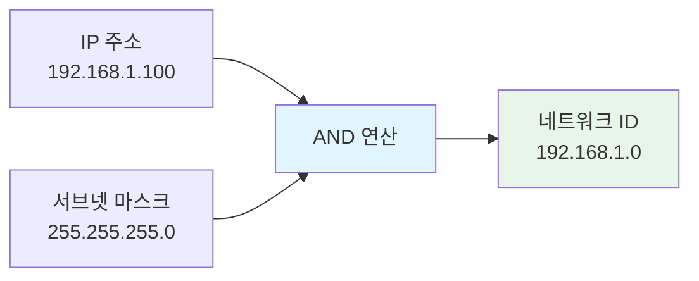

서브넷 마스크(Subnet Mask)는 [[IP 주소]]에서 네트워크 ID와 호스트 ID를 구분하는 32비트(IPv4) 또는 128비트(IPv6)의 비트마스크입니다. 서브넷 마스크를 사용하여 IP 주소의 어느 부분이 네트워크를 식별하고 어느 부분이 호스트를 식별하는지 결정할 수 있습니다.

서브넷 마스크는 네트워크 설계와 관리의 핵심 요소로, 같은 네트워크에 속한 장치를 식별하고, [[라우팅(Routing)]]을 효율적으로 수행하며, 네트워크를 논리적으로 분할하는 데 사용됩니다. 서브넷 마스크를 이해하기 위해서는 [[IP 주소]], [[Network]], [[Router]], [[CIDR(Classless Inter-Domain Routing)]] 등의 개념을 함께 이해하는 것이 중요합니다.

## 서브넷 마스크의 등장 배경

초기 IPv4 주소 체계는 클래스 기반 주소 할당(Classful Addressing)을 사용했습니다. 하지만 다음과 같은 문제들이 발생했습니다:

1. **주소 낭비**: 클래스 A, B, C는 고정된 크기로 할당되어 작은 네트워크에는 너무 크고, 큰 네트워크에는 부족했습니다.
2. **유연성 부족**: 네트워크 크기에 맞게 주소를 할당할 수 없었습니다.
3. **라우팅 테이블 증가**: 많은 작은 네트워크가 생기면서 라우팅 테이블이 비대해졌습니다.
4. **관리 어려움**: 네트워크 구조 변경 시 주소 재할당이 어려웠습니다.

서브넷 마스크와 [[CIDR(Classless Inter-Domain Routing)]]는 이러한 문제들을 해결하기 위해 등장했습니다. 서브넷 마스크를 사용하면 네트워크를 필요한 크기로 유연하게 분할할 수 있게 됩니다.

## 서브넷 마스크의 구조

서브넷 마스크는 IP 주소와 동일한 형식으로 표현되며, 연속된 1 비트와 0 비트로 구성됩니다.

### 비트 구조

서브넷 마스크의 비트는 다음과 같은 의미를 가집니다:

- **1 비트**: 네트워크 ID 부분을 나타냅니다
- **0 비트**: 호스트 ID 부분을 나타냅니다

**예시**:
```
IP 주소:       192.168.1.100  (11000000.10101000.00000001.01100100)
서브넷 마스크: 255.255.255.0  (11111111.11111111.11111111.00000000)
                              └──────── 네트워크 ────────┘└─ 호스트 ─┘
```

### 표현 방법

서브넷 마스크는 두 가지 방법으로 표현할 수 있습니다:

#### 1. 점으로 구분된 십진수 표기법 (Dotted Decimal Notation)

가장 일반적인 표현 방법입니다.

**예시**:
- `255.255.255.0`
- `255.255.0.0`
- `255.0.0.0`
- `255.255.255.252`

#### 2. CIDR 표기법 (CIDR Notation)

슬래시(/) 뒤에 네트워크 비트 수를 표기하는 방법입니다.

**예시**:
- `/24` = `255.255.255.0` (24개의 네트워크 비트)
- `/16` = `255.255.0.0` (16개의 네트워크 비트)
- `/8` = `255.0.0.0` (8개의 네트워크 비트)
- `/30` = `255.255.255.252` (30개의 네트워크 비트)

**CIDR 표기법의 장점**:
- 간결하고 읽기 쉽습니다
- 네트워크 크기를 바로 알 수 있습니다
- 현대 네트워크에서 표준으로 사용됩니다

## 네트워크 ID 계산

네트워크 ID는 IP 주소와 서브넷 마스크를 AND 연산하여 계산합니다.

### AND 연산 과정



**이진수 계산 예시**:

```
IP 주소:       192.168.1.100
이진수:        11000000.10101000.00000001.01100100

서브넷 마스크: 255.255.255.0
이진수:        11111111.11111111.11111111.00000000

AND 연산:
  11000000.10101000.00000001.01100100
& 11111111.11111111.11111111.00000000
─────────────────────────────────────
  11000000.10101000.00000001.00000000

결과 (네트워크 ID): 192.168.1.0
```

### 호스트 ID 계산

호스트 ID는 IP 주소에서 네트워크 ID를 제외한 부분입니다.

**계산 방법**:
- 호스트 ID = IP 주소 AND (NOT 서브넷 마스크)

**예시**:
```
IP 주소:       192.168.1.100
네트워크 ID:   192.168.1.0
호스트 ID:     0.0.0.100 (또는 단순히 100)
```

## 일반적인 서브넷 마스크

### 클래스 기반 서브넷 마스크

| 클래스 | 서브넷 마스크 | CIDR | 네트워크 비트 | 호스트 비트 | 사용 가능한 호스트 수 |
|--------|--------------|------|--------------|------------|---------------------|
| A | 255.0.0.0 | /8 | 8 | 24 | 16,777,214 |
| B | 255.255.0.0 | /16 | 16 | 16 | 65,534 |
| C | 255.255.255.0 | /24 | 24 | 8 | 254 |

### 일반적으로 사용되는 서브넷 마스크

| 서브넷 마스크 | CIDR | 사용 가능한 호스트 | 용도 |
|--------------|------|------------------|------|
| 255.255.255.252 | /30 | 2 | 점대점 링크 |
| 255.255.255.248 | /29 | 6 | 소규모 네트워크 |
| 255.255.255.240 | /28 | 14 | 작은 서브넷 |
| 255.255.255.224 | /27 | 30 | 중소규모 서브넷 |
| 255.255.255.192 | /26 | 62 | 중규모 서브넷 |
| 255.255.255.128 | /25 | 126 | 대규모 서브넷 |
| 255.255.255.0 | /24 | 254 | 일반적인 LAN |
| 255.255.0.0 | /16 | 65,534 | 대규모 네트워크 |

**참고**: 사용 가능한 호스트 수에서 2를 뺀 이유는 네트워크 주소와 브로드캐스트 주소를 제외하기 때문입니다.

## 서브넷 마스크 계산 예시

### 예시 1: /24 서브넷

```
IP 주소: 192.168.1.100
서브넷 마스크: 255.255.255.0 (/24)

네트워크 ID: 192.168.1.0
호스트 ID: 100
사용 가능한 IP 범위: 192.168.1.1 ~ 192.168.1.254
브로드캐스트 주소: 192.168.1.255
```

### 예시 2: /16 서브넷

```
IP 주소: 172.16.5.10
서브넷 마스크: 255.255.0.0 (/16)

네트워크 ID: 172.16.0.0
호스트 ID: 5.10
사용 가능한 IP 범위: 172.16.0.1 ~ 172.16.255.254
브로드캐스트 주소: 172.16.255.255
```

### 예시 3: /30 서브넷 (점대점 링크)

```
IP 주소: 10.0.0.1
서브넷 마스크: 255.255.255.252 (/30)

네트워크 ID: 10.0.0.0
호스트 ID: 1
사용 가능한 IP 범위: 10.0.0.1 ~ 10.0.0.2
브로드캐스트 주소: 10.0.0.3
```

## Java에서 서브넷 마스크 다루기

Java에서는 서브넷 마스크를 직접 다루는 표준 클래스가 없지만, `InetAddress`와 비트 연산을 사용하여 구현할 수 있습니다:

```java
import java.net.InetAddress;
import java.net.UnknownHostException;

public class SubnetMaskExample {
    
    /**
     * IP 주소와 서브넷 마스크로 네트워크 ID를 계산합니다.
     */
    public static InetAddress getNetworkAddress(String ip, String subnetMask) 
            throws UnknownHostException {
        InetAddress ipAddress = InetAddress.getByName(ip);
        InetAddress mask = InetAddress.getByName(subnetMask);
        
        byte[] ipBytes = ipAddress.getAddress();
        byte[] maskBytes = mask.getAddress();
        byte[] networkBytes = new byte[4];
        
        for (int i = 0; i < 4; i++) {
            networkBytes[i] = (byte) (ipBytes[i] & maskBytes[i]);
        }
        
        return InetAddress.getByAddress(networkBytes);
    }
    
    /**
     * CIDR 표기법을 서브넷 마스크로 변환합니다.
     */
    public static String cidrToSubnetMask(int cidr) {
        int mask = 0xffffffff << (32 - cidr);
        return String.format("%d.%d.%d.%d",
            (mask >>> 24) & 0xff,
            (mask >>> 16) & 0xff,
            (mask >>> 8) & 0xff,
            mask & 0xff);
    }
    
    /**
     * 서브넷 마스크를 CIDR 표기법으로 변환합니다.
     */
    public static int subnetMaskToCidr(String subnetMask) 
            throws UnknownHostException {
        InetAddress mask = InetAddress.getByName(subnetMask);
        byte[] maskBytes = mask.getAddress();
        
        int cidr = 0;
        for (byte b : maskBytes) {
            int unsignedByte = b & 0xff;
            cidr += Integer.bitCount(unsignedByte);
        }
        
        return cidr;
    }
    
    /**
     * 두 IP 주소가 같은 서브넷에 속하는지 확인합니다.
     */
    public static boolean isSameSubnet(String ip1, String ip2, String subnetMask) 
            throws UnknownHostException {
        InetAddress network1 = getNetworkAddress(ip1, subnetMask);
        InetAddress network2 = getNetworkAddress(ip2, subnetMask);
        return network1.equals(network2);
    }
    
    /**
     * 서브넷의 사용 가능한 호스트 수를 계산합니다.
     */
    public static long getAvailableHosts(int cidr) {
        int hostBits = 32 - cidr;
        return (long) Math.pow(2, hostBits) - 2; // 네트워크 주소와 브로드캐스트 주소 제외
    }
    
    public static void main(String[] args) throws UnknownHostException {
        // 네트워크 ID 계산
        InetAddress network = getNetworkAddress("192.168.1.100", "255.255.255.0");
        System.out.println("네트워크 ID: " + network.getHostAddress());
        
        // CIDR 변환
        System.out.println("/24 서브넷 마스크: " + cidrToSubnetMask(24));
        System.out.println("255.255.255.0의 CIDR: /" + subnetMaskToCidr("255.255.255.0"));
        
        // 같은 서브넷 확인
        boolean same = isSameSubnet("192.168.1.100", "192.168.1.200", "255.255.255.0");
        System.out.println("같은 서브넷: " + same);
        
        // 사용 가능한 호스트 수
        System.out.println("/24 서브넷의 사용 가능한 호스트 수: " + getAvailableHosts(24));
    }
}
```

## 서브넷팅 (Subnetting)

서브넷팅은 큰 네트워크를 여러 개의 작은 서브넷으로 나누는 과정입니다. 서브넷 마스크를 사용하여 네트워크를 분할할 수 있습니다.

### 서브넷팅 예시

**원본 네트워크**: 192.168.1.0/24 (254개의 호스트)

이를 4개의 서브넷으로 나누는 경우:

```
서브넷 1: 192.168.1.0/26   (62개 호스트)
서브넷 2: 192.168.1.64/26  (62개 호스트)
서브넷 3: 192.168.1.128/26 (62개 호스트)
서브넷 4: 192.168.1.192/26 (62개 호스트)
```

**서브넷 마스크 변경**:
- 원본: 255.255.255.0 (/24)
- 서브넷: 255.255.255.192 (/26)

서브넷팅에 대한 자세한 내용은 [[서브넷팅]] 문서를 참고해주세요. 서브넷의 개념과 활용에 대해서는 [[서브넷(Subnet)]] 문서를 참고해주세요.

## 서브넷 마스크와 라우팅

서브넷 마스크는 [[Router]]의 라우팅 테이블에서 중요한 역할을 합니다:

### 라우팅 테이블 예시

```
목적지 네트워크      서브넷 마스크        다음 홉          인터페이스
192.168.1.0         255.255.255.0      직접 연결        eth0
10.0.0.0            255.0.0.0         192.168.1.1      eth0
0.0.0.0             0.0.0.0           192.168.1.254    eth0
```

라우터는 패킷의 목적지 IP 주소와 라우팅 테이블의 각 항목을 서브넷 마스크와 함께 비교하여 최적의 경로를 결정합니다.

## 서브넷 마스크 선택 시 고려사항

### 1. 필요한 호스트 수

서브넷에 연결될 장치의 수를 고려하여 적절한 서브넷 마스크를 선택해야 합니다.

**계산 공식**:
- 사용 가능한 호스트 수 = 2^(호스트 비트 수) - 2

### 2. 확장성

향후 네트워크 확장을 고려하여 여유를 두고 서브넷 마스크를 선택하는 것이 좋습니다.

### 3. 라우팅 효율성

너무 많은 작은 서브넷을 만들면 라우팅 테이블이 커지고 관리가 어려워집니다.

### 4. 보안

중요한 시스템은 별도의 서브넷으로 분리하여 보안을 강화할 수 있습니다.

## 서브넷 마스크와 보안

서브넷 마스크는 네트워크 보안 정책을 구현하는 데도 사용됩니다:

### 방화벽 규칙

특정 서브넷에서만 접근을 허용하거나 차단할 수 있습니다:

```java
// 특정 서브넷에서만 접근 허용
if (isSameSubnet(clientIP, "192.168.1.0", "255.255.255.0")) {
    // 접근 허용
} else {
    // 접근 차단
}
```

### 네트워크 격리

중요한 시스템을 별도 서브넷으로 격리하여 보안을 강화합니다.

## 실제 활용 사례

1. **기업 네트워크**: 부서별로 서브넷을 구성하여 트래픽을 분리합니다.
2. **클라우드 환경**: 가상 네트워크에서 서브넷을 사용하여 리소스를 분리합니다.
3. **데이터 센터**: 서버를 기능별로 서브넷으로 나누어 관리합니다.
4. **VPN**: 원격 사용자를 별도 서브넷에 배치하여 관리합니다.

## 결론

서브넷 마스크는 네트워크 설계와 관리의 핵심 요소로, IP 주소에서 네트워크 ID와 호스트 ID를 구분하는 역할을 합니다. 서브넷 마스크를 올바르게 이해하고 사용하면 네트워크를 효율적으로 설계하고 관리할 수 있습니다.

서브넷 마스크를 선택할 때는 필요한 호스트 수, 확장성, 라우팅 효율성, 보안 등을 종합적으로 고려해야 하며, [[IP 주소]], [[Network]], [[Router]], [[CIDR(Classless Inter-Domain Routing)]], [[서브넷(Subnet)]], [[서브넷팅]] 등의 관련 개념들을 함께 이해하는 것이 중요합니다.

또한 현대적인 네트워크에서는 CIDR 표기법(/24, /16 등)을 사용하는 것이 일반적이므로, 두 가지 표현 방법을 모두 이해하고 사용할 수 있어야 합니다.

## 참고 자료

- RFC 950 - Internet Standard Subnetting Procedure
- RFC 4632 - Classless Inter-domain Routing (CIDR)
- Computer Networks, 5th Edition - Andrew S. Tanenbaum
- CCNA Routing and Switching Study Guide - Todd Lammle

