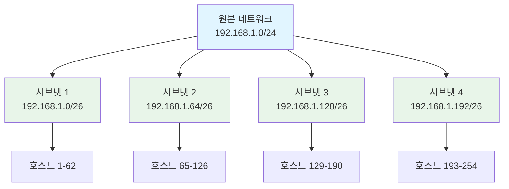
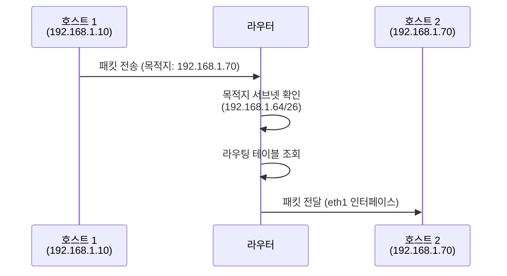

서브넷(Subnet)은 하나의 큰 네트워크를 논리적으로 분할한 작은 네트워크 단위입니다. 서브넷은 [[서브넷 마스크(Subnet Mask)]]를 사용하여 생성되며, 네트워크 관리, 보안, 성능 최적화 등을 위해 사용됩니다.

서브넷은 현대 네트워크 설계의 핵심 개념으로, 네트워크를 효율적으로 관리하고 트래픽을 분리하며 보안을 강화하는 데 필수적입니다. 서브넷을 이해하기 위해서는 [[IP 주소]], [[서브넷 마스크(Subnet Mask)]], [[CIDR(Classless Inter-Domain Routing)]], [[서브넷팅]], [[Network]] 등의 개념을 함께 이해하는 것이 중요합니다.

## 서브넷의 등장 배경

초기 네트워크는 단일 브로드캐스트 도메인으로 구성되어 있었습니다. 하지만 네트워크가 확장되면서 다음과 같은 문제들이 발생했습니다:

1. **브로드캐스트 스톰**: 단일 네트워크에서 브로드캐스트 트래픽이 과도하게 증가하여 성능 저하가 발생했습니다.
2. **보안 문제**: 모든 장치가 같은 네트워크에 있으면 보안 정책 적용이 어려웠습니다.
3. **관리 어려움**: 대규모 네트워크에서 장치를 논리적으로 그룹화할 방법이 필요했습니다.
4. **트래픽 분리**: 부서나 기능별로 트래픽을 분리하여 네트워크 효율성을 향상시킬 필요가 있었습니다.
5. **주소 공간 효율성**: 큰 네트워크를 작은 단위로 나누어 주소를 효율적으로 사용할 수 있게 해야 했습니다.

서브넷은 이러한 문제들을 해결하기 위해 등장했습니다. [[서브넷팅]]을 통해 큰 네트워크를 여러 개의 서브넷으로 나누면, 각 서브넷은 독립적인 브로드캐스트 도메인이 되어 네트워크 효율성과 보안이 향상됩니다.

## 서브넷의 개념

### 서브넷의 정의

서브넷은 원본 네트워크의 일부를 차지하는 논리적 네트워크 단위입니다. 각 서브넷은 고유한 네트워크 주소를 가지며, 서브넷 내의 모든 장치는 동일한 네트워크 ID를 공유합니다.

### 서브넷과 네트워크의 관계



### 서브넷의 구성 요소

각 서브넷은 다음과 같은 구성 요소를 가집니다:

1. **네트워크 주소**: 서브넷의 시작 주소 (호스트 ID가 모두 0)
2. **브로드캐스트 주소**: 서브넷의 끝 주소 (호스트 ID가 모두 1)
3. **사용 가능한 호스트 주소**: 네트워크 주소와 브로드캐스트 주소를 제외한 모든 주소
4. **서브넷 마스크**: 네트워크 ID와 호스트 ID를 구분하는 마스크

## 서브넷의 구조

### 서브넷 주소 범위 계산

서브넷의 주소 범위는 CIDR 표기법과 서브넷 마스크를 사용하여 계산할 수 있습니다.

**예시**: `192.168.1.0/26` 서브넷

```
네트워크 주소:     192.168.1.0
서브넷 마스크:     255.255.255.192 (/26)
첫 번째 호스트:    192.168.1.1
마지막 호스트:     192.168.1.62
브로드캐스트 주소: 192.168.1.63
사용 가능한 호스트: 62개
```

### 서브넷 크기와 호스트 수

서브넷의 크기는 서브넷 마스크의 호스트 비트 수에 의해 결정됩니다:

**공식**: 사용 가능한 호스트 수 = 2^(호스트 비트 수) - 2

| CIDR | 서브넷 마스크 | 호스트 비트 | 사용 가능한 호스트 | 용도 |
|------|--------------|------------|------------------|------|
| /30 | 255.255.255.252 | 2 | 2 | 점대점 링크 |
| /29 | 255.255.255.248 | 3 | 6 | 매우 작은 네트워크 |
| /28 | 255.255.255.240 | 4 | 14 | 작은 서브넷 |
| /27 | 255.255.255.224 | 5 | 30 | 중소규모 서브넷 |
| /26 | 255.255.255.192 | 6 | 62 | 중규모 서브넷 |
| /25 | 255.255.255.128 | 7 | 126 | 대규모 서브넷 |
| /24 | 255.255.255.0 | 8 | 254 | 일반적인 LAN |

## 서브넷과 서브넷팅

서브넷은 [[서브넷팅]] 과정을 통해 생성됩니다. 서브넷팅은 큰 네트워크를 여러 개의 작은 서브넷으로 나누는 과정이며, 서브넷은 그 결과물입니다.

### 서브넷팅 예시

**원본 네트워크**: `192.168.1.0/24` (254개 호스트)

이를 4개의 서브넷으로 나누는 경우:

```
서브넷 1: 192.168.1.0/26
  - 네트워크 주소: 192.168.1.0
  - 호스트 범위: 192.168.1.1 ~ 192.168.1.62
  - 브로드캐스트: 192.168.1.63
  - 사용 가능한 호스트: 62개

서브넷 2: 192.168.1.64/26
  - 네트워크 주소: 192.168.1.64
  - 호스트 범위: 192.168.1.65 ~ 192.168.1.126
  - 브로드캐스트: 192.168.1.127
  - 사용 가능한 호스트: 62개

서브넷 3: 192.168.1.128/26
  - 네트워크 주소: 192.168.1.128
  - 호스트 범위: 192.168.1.129 ~ 192.168.1.190
  - 브로드캐스트: 192.168.1.191
  - 사용 가능한 호스트: 62개

서브넷 4: 192.168.1.192/26
  - 네트워크 주소: 192.168.1.192
  - 호스트 범위: 192.168.1.193 ~ 192.168.1.254
  - 브로드캐스트: 192.168.1.255
  - 사용 가능한 호스트: 62개
```

자세한 서브넷팅 방법은 [[서브넷팅]] 문서를 참고해주세요.

## 서브넷의 특징

### 1. 독립적인 브로드캐스트 도메인

각 서브넷은 독립적인 브로드캐스트 도메인입니다. 한 서브넷에서 발생한 브로드캐스트 트래픽은 [[Router]]를 통해 다른 서브넷으로 전달되지 않습니다.

### 2. 논리적 네트워크 분리

서브넷은 물리적 위치와 관계없이 논리적으로 네트워크를 분리합니다. 같은 서브넷에 속한 장치는 동일한 네트워크 ID를 가지며, 다른 서브넷과 통신하려면 라우터를 거쳐야 합니다.

### 3. 보안 경계

서브넷은 보안 경계 역할을 합니다. 방화벽 규칙을 서브넷 단위로 적용하여 트래픽을 제어할 수 있습니다.

### 4. 관리 단위

서브넷은 네트워크 관리의 기본 단위입니다. 각 서브넷에 대해 독립적인 정책과 설정을 적용할 수 있습니다.

## 서브넷과 라우팅

서브넷 간 통신은 [[Router]]를 통해 이루어집니다. 라우터는 서브넷 간 패킷을 전달하는 역할을 하며, 라우팅 테이블에 각 서브넷의 정보를 저장합니다.

### 라우팅 테이블 예시

```
목적지 네트워크      서브넷 마스크        다음 홉          인터페이스
192.168.1.0/26      255.255.255.192    직접 연결        eth0
192.168.1.64/26     255.255.255.192   직접 연결        eth1
192.168.1.128/26    255.255.255.192   직접 연결        eth2
192.168.1.192/26    255.255.255.192   직접 연결        eth3
```

### 서브넷 간 통신 과정



## 서브넷 설계 원칙

### 1. 필요한 호스트 수 고려

서브넷을 설계할 때는 현재 필요한 호스트 수뿐만 아니라 향후 확장 가능성을 고려해야 합니다.

**예시**:
- 현재 30개 호스트가 필요한 경우: `/26` (62개 호스트) 또는 `/27` (30개 호스트)
- 향후 확장 가능성을 고려하면 `/26`이 더 적합합니다.

### 2. 서브넷 수와 크기의 균형

너무 많은 작은 서브넷을 만들면 라우팅 테이블이 커지고 관리가 어려워집니다. 반대로 너무 적은 큰 서브넷을 만들면 브로드캐스트 도메인이 커져 성능이 저하될 수 있습니다.

### 3. 주소 범위 겹침 방지

서브넷의 주소 범위가 겹치지 않도록 주의해야 합니다. 겹치는 주소 범위는 라우팅 오류를 발생시킬 수 있습니다.

### 4. 기능별 분리

기능이나 부서별로 서브넷을 분리하면 관리와 보안이 용이합니다.

**예시**:
- 관리 서브넷: 192.168.1.0/26
- 개발 서브넷: 192.168.1.64/26
- 프로덕션 서브넷: 192.168.1.128/26
- DMZ 서브넷: 192.168.1.192/26

## Java에서 서브넷 다루기

Java에서는 서브넷 정보를 계산하고 관리할 수 있습니다:

```java
import java.net.InetAddress;
import java.net.UnknownHostException;

public class SubnetExample {
    
    /**
     * 서브넷의 네트워크 주소를 계산합니다.
     */
    public static InetAddress getNetworkAddress(String ip, int cidr) 
            throws UnknownHostException {
        InetAddress ipAddress = InetAddress.getByName(ip);
        byte[] ipBytes = ipAddress.getAddress();
        byte[] maskBytes = createSubnetMask(cidr);
        byte[] networkBytes = new byte[4];
        
        for (int i = 0; i < 4; i++) {
            networkBytes[i] = (byte) (ipBytes[i] & maskBytes[i]);
        }
        
        return InetAddress.getByAddress(networkBytes);
    }
    
    /**
     * 서브넷의 브로드캐스트 주소를 계산합니다.
     */
    public static InetAddress getBroadcastAddress(String ip, int cidr) 
            throws UnknownHostException {
        InetAddress networkAddress = getNetworkAddress(ip, cidr);
        byte[] networkBytes = networkAddress.getAddress();
        byte[] maskBytes = createSubnetMask(cidr);
        byte[] broadcastBytes = new byte[4];
        
        for (int i = 0; i < 4; i++) {
            broadcastBytes[i] = (byte) ((networkBytes[i] & maskBytes[i]) | 
                                        (~maskBytes[i] & 0xff));
        }
        
        return InetAddress.getByAddress(broadcastBytes);
    }
    
    /**
     * 서브넷 마스크를 생성합니다.
     */
    private static byte[] createSubnetMask(int cidr) {
        byte[] mask = new byte[4];
        int maskInt = 0xffffffff << (32 - cidr);
        
        mask[0] = (byte) ((maskInt >>> 24) & 0xff);
        mask[1] = (byte) ((maskInt >>> 16) & 0xff);
        mask[2] = (byte) ((maskInt >>> 8) & 0xff);
        mask[3] = (byte) (maskInt & 0xff);
        
        return mask;
    }
    
    /**
     * IP 주소가 서브넷에 속하는지 확인합니다.
     */
    public static boolean isInSubnet(String ip, String subnetCidr) 
            throws UnknownHostException {
        String[] parts = subnetCidr.split("/");
        InetAddress ipAddress = InetAddress.getByName(ip);
        InetAddress subnetNetwork = getNetworkAddress(parts[0], 
                                                      Integer.parseInt(parts[1]));
        int cidr = Integer.parseInt(parts[1]);
        
        InetAddress ipNetwork = getNetworkAddress(ip, cidr);
        
        return ipNetwork.equals(subnetNetwork);
    }
    
    /**
     * 서브넷의 사용 가능한 호스트 수를 계산합니다.
     */
    public static long getAvailableHosts(int cidr) {
        int hostBits = 32 - cidr;
        return (long) Math.pow(2, hostBits) - 2;
    }
    
    /**
     * 서브넷 정보를 출력합니다.
     */
    public static void printSubnetInfo(String subnetCidr) 
            throws UnknownHostException {
        String[] parts = subnetCidr.split("/");
        String ip = parts[0];
        int cidr = Integer.parseInt(parts[1]);
        
        InetAddress network = getNetworkAddress(ip, cidr);
        InetAddress broadcast = getBroadcastAddress(ip, cidr);
        long hosts = getAvailableHosts(cidr);
        
        System.out.println("서브넷 정보: " + subnetCidr);
        System.out.println("네트워크 주소: " + network.getHostAddress());
        System.out.println("브로드캐스트 주소: " + broadcast.getHostAddress());
        System.out.println("사용 가능한 호스트 수: " + hosts);
        
        // 첫 번째와 마지막 호스트 주소 계산
        byte[] networkBytes = network.getAddress();
        byte[] broadcastBytes = broadcast.getAddress();
        
        networkBytes[3] = (byte) ((networkBytes[3] & 0xff) + 1);
        broadcastBytes[3] = (byte) ((broadcastBytes[3] & 0xff) - 1);
        
        InetAddress firstHost = InetAddress.getByAddress(networkBytes);
        InetAddress lastHost = InetAddress.getByAddress(broadcastBytes);
        
        System.out.println("첫 번째 호스트: " + firstHost.getHostAddress());
        System.out.println("마지막 호스트: " + lastHost.getHostAddress());
    }
    
    public static void main(String[] args) throws UnknownHostException {
        // 서브넷 정보 출력
        printSubnetInfo("192.168.1.0/26");
        
        System.out.println();
        
        // IP 주소가 서브넷에 속하는지 확인
        boolean inSubnet = isInSubnet("192.168.1.50", "192.168.1.0/26");
        System.out.println("192.168.1.50이 192.168.1.0/26에 속하는가: " + inSubnet);
        
        boolean notInSubnet = isInSubnet("192.168.1.100", "192.168.1.0/26");
        System.out.println("192.168.1.100이 192.168.1.0/26에 속하는가: " + notInSubnet);
    }
}
```

## 스프링에서 서브넷 활용

스프링 시큐리티에서는 서브넷 기반 접근 제어를 구현할 수 있습니다:

```java
import org.springframework.security.config.annotation.web.builders.HttpSecurity;
import org.springframework.security.config.annotation.web.configuration.EnableWebSecurity;
import org.springframework.security.config.annotation.web.configuration.WebSecurityConfigurerAdapter;

@EnableWebSecurity
public class SecurityConfig extends WebSecurityConfigurerAdapter {
    
    @Override
    protected void configure(HttpSecurity http) throws Exception {
        http.authorizeRequests()
            // 관리 서브넷에서만 접근 허용
            .antMatchers("/admin/**")
            .hasIpAddress("192.168.1.0/26") // 관리 서브넷
            
            // 개발 서브넷에서만 접근 허용
            .antMatchers("/dev/**")
            .hasIpAddress("192.168.1.64/26") // 개발 서브넷
            
            // 프로덕션 서브넷에서만 접근 허용
            .antMatchers("/api/**")
            .hasIpAddress("192.168.1.128/26") // 프로덕션 서브넷
            
            .anyRequest().permitAll();
    }
}
```

## 서브넷의 활용 사례

### 1. 기업 네트워크

부서별로 서브넷을 구성하여 트래픽을 분리하고 관리합니다:

```
- 경영진 서브넷: 192.168.1.0/26
- 개발팀 서브넷: 192.168.1.64/26
- 영업팀 서브넷: 192.168.1.128/26
- 게스트 서브넷: 192.168.1.192/26
```

### 2. 클라우드 환경

가상 네트워크에서 서브넷을 사용하여 리소스를 논리적으로 분리합니다:

- 퍼블릭 서브넷: 인터넷에 직접 접근 가능한 리소스
- 프라이빗 서브넷: 인터넷에 직접 노출되지 않는 리소스
- 데이터베이스 서브넷: 데이터베이스 서버 전용 서브넷

### 3. 데이터 센터

서버를 기능별로 서브넷으로 나누어 관리합니다:

- 웹 서버 서브넷
- 애플리케이션 서버 서브넷
- 데이터베이스 서브넷
- 스토리지 서브넷

### 4. 보안 구역 분리

중요한 시스템을 별도 서브넷으로 격리하여 보안을 강화합니다:

- DMZ 서브넷: 외부에 노출되는 서버
- 내부 서브넷: 내부 시스템만 접근 가능
- 관리 서브넷: 네트워크 관리 장비 전용

## 서브넷 관리 시 주의사항

1. **주소 범위 충돌**: 서브넷의 주소 범위가 겹치지 않도록 주의해야 합니다.

2. **라우팅 설정**: 서브넷 간 통신을 위해 라우터 설정이 올바르게 되어 있어야 합니다.

3. **DHCP 설정**: 각 서브넷에 대해 적절한 DHCP 범위를 설정해야 합니다.

4. **방화벽 규칙**: 서브넷 간 트래픽을 제어하기 위한 방화벽 규칙을 올바르게 설정해야 합니다.

5. **확장성 고려**: 향후 네트워크 확장을 고려하여 서브넷 크기를 결정해야 합니다.

6. **문서화**: 서브넷 구조와 용도를 명확히 문서화하여 관리가 용이하도록 해야 합니다.

## 서브넷과 관련 개념

### 서브넷 vs 네트워크

- **네트워크**: 원본 IP 주소 블록 전체
- **서브넷**: 네트워크를 논리적으로 분할한 작은 단위

### 서브넷 vs VLAN

- **서브넷**: 네트워크 계층(3계층)에서의 논리적 분리
- **VLAN**: 데이터 링크 계층(2계층)에서의 논리적 분리

서브넷과 VLAN은 서로 다른 계층에서 동작하지만, 함께 사용하여 네트워크를 더욱 세밀하게 제어할 수 있습니다.

## 결론

서브넷은 네트워크를 효율적으로 관리하고 보안을 강화하며 성능을 최적화하는 핵심 개념입니다. 서브넷을 올바르게 이해하고 설계하면 네트워크의 확장성, 보안성, 관리 용이성을 크게 향상시킬 수 있습니다.

서브넷을 설계할 때는 필요한 호스트 수, 확장성, 보안 요구사항 등을 종합적으로 고려해야 하며, [[IP 주소]], [[서브넷 마스크(Subnet Mask)]], [[CIDR(Classless Inter-Domain Routing)]], [[서브넷팅]], [[라우팅(Routing)]], [[Router]] 등의 관련 개념들을 함께 이해하는 것이 중요합니다.

또한 현대적인 애플리케이션 개발에서는 스프링 시큐리티와 같은 프레임워크를 활용하여 서브넷 기반의 접근 제어를 구현할 수 있습니다.

## 참고 자료

- RFC 950 - Internet Standard Subnetting Procedure
- RFC 4632 - Classless Inter-domain Routing (CIDR)
- Computer Networks, 5th Edition - Andrew S. Tanenbaum
- CCNA Routing and Switching Study Guide - Todd Lammle

