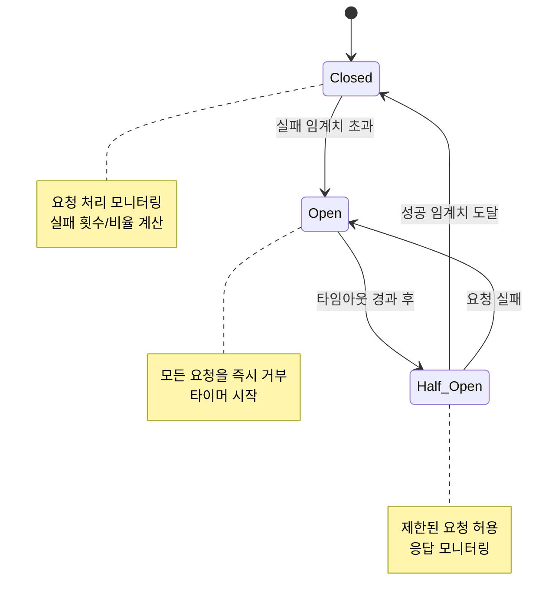

서킷 브레이커(Circuit Breaker) 패턴은 [[분산 시스템]]에서 장애 전파를 방지하고 시스템의 [[회복력]]을 높이기 위한 디자인 패턴입니다. 이 패턴은 전기 회로의 차단기에서 이름을 따왔으며, 전기 시스템에서 과부하가 발생했을 때 회로를 차단하는 것과 유사한 방식으로 동작합니다.

## 서킷 브레이커 패턴의 필요성

마이크로서비스 아키텍처와 같은 분산 환경에서는 서비스 간 호출이 빈번하게 발생합니다.

1. 한 서비스의 장애가 다른 서비스로 전파될 수 있습니다. 
2. 응답하지 않는 서비스를 계속 호출하면 자원이 낭비됩니다.
3. 장애 상황에서 시스템 전체의 성능이 급격히 저하될 수 있습니다.

서킷 브레이커 패턴은 이러한 문제를 효과적으로 해결할 수 있는 방법을 제공합니다.

## 서킷 브레이커의 상태

서킷 브레이커는 기본적으로 세 가지 상태를 가집니다:

1. **Closed (닫힘)**: 정상 상태로, 모든 요청이 대상 서비스로 전달됩니다.
2. **Open (열림)**: 차단 상태로, 모든 요청이 즉시 실패하며 대상 서비스로 전달되지 않습니다.
3. **Half-Open (반열림)**: 일부 요청만 대상 서비스로 전달하여 서비스의 회복 여부를 확인하는 상태입니다.

## 서킷 브레이커의 동작 흐름



1. **Closed 상태**:
    - 모든 요청이 정상적으로 처리됩니다.
    - 각 요청의 성공/실패를 모니터링합니다.
    - 실패율이 설정된 임계값을 초과하면 Open 상태로 전환됩니다.
2. **Open 상태**:
    - 모든 요청이 즉시 실패하고 오류를 반환합니다.
    - 설정된 타임아웃 기간이 경과하면 Half-Open 상태로 전환됩니다.
3. **Half-Open 상태**:
    - 제한된 수의 요청만 대상 서비스로 전달됩니다.
    - 이 요청들이 성공하면 시스템이 회복된 것으로 판단하고 Closed 상태로 전환됩니다.
    - 요청이 계속 실패하면 다시 Open 상태로 돌아갑니다.

## 서킷 브레이커 구현 시 고려사항

1. **실패 임계값 설정**: 너무 낮으면 불필요한 차단이 발생하고, 너무 높으면 장애 전파를 막지 못할 수 있습니다.
2. **타임아웃 설정**: Open 상태에서 Half-Open 상태로 전환되는 시간을 적절히 설정해야 합니다.
3. **실패 유형 정의**: 어떤 종류의 오류를 실패로 간주할지 명확히 정의해야 합니다.
4. **[[폴백 메커니즘]]**: 서킷이 열렸을 때 대체 응답이나 기능을 제공하는 전략이 필요합니다.
5. **모니터링과 알림**: 서킷 브레이커의 상태 변화를 모니터링하고 적절한, 알림을 설정하는 것이 중요합니다.

## 자바/스프링에서의 서킷 브레이커 구현

스프링 환경에서는 Resilience4j, Spring Cloud Circuit Breaker와 같은 라이브러리를 활용하여 서킷 브레이커 패턴을 구현할 수 있습니다.

### Resilience4j 예제

```java
// 서킷 브레이커 설정
CircuitBreakerConfig circuitBreakerConfig = CircuitBreakerConfig.custom()
    .failureRateThreshold(50)    // 50% 실패율을 초과하면 Open 상태로 전환
    .waitDurationInOpenState(Duration.ofMillis(1000))    // Open 상태 유지 시간
    .permittedNumberOfCallsInHalfOpenState(2)    // Half-Open 상태에서 허용할 요청 수
    .slidingWindowSize(10)    // 실패율 계산에 사용할 최근 요청 수
    .build();

// 서킷 브레이커 생성
CircuitBreakerRegistry registry = CircuitBreakerRegistry.of(circuitBreakerConfig);
CircuitBreaker circuitBreaker = registry.circuitBreaker("userService");

// 함수 호출에 서킷 브레이커 적용
Supplier<User> decoratedSupplier = CircuitBreaker
    .decorateSupplier(circuitBreaker, () -> userService.getUser(userId));

// 폴백 메커니즘 추가
User user = Try.ofSupplier(decoratedSupplier)
    .recover(e -> new User("기본 사용자"))    // 서킷이 열렸을 때 기본 응답 제공
    .get();
```

### Spring Cloud Circuit Breaker 예제

```java
@Service
public class UserService {
    
    private final RestTemplate restTemplate;
    private final CircuitBreakerFactory circuitBreakerFactory;
    
    public UserService(RestTemplate restTemplate, CircuitBreakerFactory circuitBreakerFactory) {
        this.restTemplate = restTemplate;
        this.circuitBreakerFactory = circuitBreakerFactory;
    }
    
    public User getUserById(Long id) {
        return circuitBreakerFactory.create("userService")
            .run(() -> restTemplate.getForObject("/users/" + id, User.class),
                 throwable -> getDefaultUser());    // 폴백 함수
    }
    
    private User getDefaultUser() {
        return new User(0L, "기본 사용자", "default@example.com");
    }
}
```

## 서킷 브레이커 패턴의 장점

1. **시스템 안정성 향상**: 장애 전파를 방지하여 전체 시스템의 안정성을 높입니다.
2. **빠른 실패 처리**: 이미 실패가 예상되는 요청을 빠르게 차단하여 리소스를 절약합니다.
3. **복구 시간 단축**: 대상 서비스의 부분적 복구를 허용하여 전체 시스템의 복구 시간을 단축합니다.
4. **사용자 경험 개선**: 장애 상황에서도 폴백 메커니즘을 통해 최소한의 서비스를 제공할 수 있습니다.

## 서킷 브레이커 패턴의 한계와 주의사항

1. **설정의 어려움**: 적절한 임계값과 타임아웃을 설정하는 것은 경험과 시스템에 대한 이해가 필요합니다.
2. **오버헤드**: 추가적인 모니터링과 상태 관리로 인한 약간의 성능 오버헤드가 발생할 수 있습니다.
3. **분산 시스템 복잡성**: 분산 환경에서 서킷 브레이커를 관리하고 모니터링하는 것은 추가적인 복잡성을 도입합니다.
4. **[[테스트 어려움]]**: 장애 상황을 시뮬레이션하고 서킷 브레이커의 동작을 검증하는 테스트는 구현이 까다롭습니다.

## 서킷 브레이커와 함께 사용되는 패턴들

서킷 브레이커는 다음과 같은 패턴들과 함께 사용되어 더 강력한 [[시스템 회복력]]을 구현할 수 있습니다:

1. **[[타임아웃 패턴]]**: 요청에 대한 최대 대기 시간을 설정하여 느린 응답으로 인한 자원 고갈을 방지합니다.
2. **[[재시도 패턴]]**: 일시적인 오류에 대해 자동으로 재시도하는 메커니즘을 제공합니다.
3. **[[벌크헤드 패턴]]**: 시스템 자원을 격리하여 한 부분의 장애가 전체 시스템에 영향을 미치지 않도록 합니다.
4. **[[풀링 패턴]]**: 연결과 자원을 효율적으로 관리하여 부하를 분산시킵니다.

## 결론

서킷 브레이커 패턴은 현대적인 분산 시스템에서 장애 전파를 방지하고 시스템의 회복력을 높이는 필수적인 패턴입니다. 이 패턴을 통해 일부 서비스의 장애가 전체 시스템으로 확산되는 것을 방지하고, 장애 상황에서 더 빠르게 복구될 수 있도록 합니다. 특히 마이크로서비스 아키텍처와 같은 복잡한 분산 환경에서는 서킷 브레이커 패턴의 적용이 시스템의 안정성과 가용성을 크게 향상시킬 수 있습니다.

적절한 설정과 함께 다른 [[회복력 패턴]]들과 조합하여 사용할 때 서킷 브레이커 패턴은 더욱 효과적으로 작동하며, 시스템 운영 중 발생할 수 있는 다양한 장애 상황에 대응할 수 있는 견고한 기반을 제공합니다.