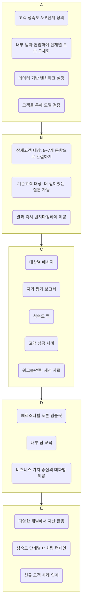

# GTM 전략의 숨겨진 보석, 성숙도 프레임워크

안녕하세요. 오늘은 많은 기업이 제품의 기능 자체를 판매하는 데 급급하다가 놓치고 있는 숨겨진 보석, '성숙도 프레임워크(Maturity Framework)'에 대해 소개하고자 합니다.

고객 성공 및 전문 서비스 팀과 긴밀하게 협력하여 설계된 성숙도 프레임워크는 [[GTM(Go-to-Market) 전략]]에서 가장 강력한 자산 중 하나가 될 수 있습니다. 이를 통해 고객과의 대화 수준을 높이고, 전사 메시지를 통일하며, 제품 판매에서 비즈니스 가치 판매로 전환하는 놀라운 변화를 경험할 수 있습니다.

이 글에서는 성숙도 프레임워크의 개념과 효과, 그리고 실제 성공 사례를 통해 어떻게 우리 비즈니스에 적용할 수 있을지 알아보겠습니다.

---

## 성숙도 모델이란 무엇인가요?

성숙도 모델(Maturity Model)은 특정 영역에서 조직의 역량이나 성장이 어떤 단계를 거쳐 발전하는지를 구조적으로 정리한 프레임워크입니다. B2B 기술 분야에서 마케팅 성숙도, 디지털 전환, 비즈니스 프로세스 최적화 등 다양한 주제에 적용될 수 있습니다.

각 단계는 정교함이나 가치 실현 수준을 나타내며, 기업은 이를 통해 다음을 달성할 수 있습니다.

- **최고 수준(Best-in-Class)으로 가는 경로 이해**: 현재 위치에서 최고 수준의 역량을 갖추기까지의 과정을 명확히 파악합니다.
- **현재 상태 벤치마킹**: 경쟁사 또는 업계 평균과 비교하여 현재 우리의 수준을 객관적으로 진단합니다.
- **격차 및 기회 파악**: 목표 달성을 위해 무엇이 부족하고 어떤 기회가 있는지 식별합니다.
- **미래 상태 정의**: 이상적인 미래 모습을 구체적으로 그리고, 그에 도달하기 위한 로드맵을 수립합니다.

보통 성숙도 모델은 고객이 스스로 자신의 위치를 진단할 수 있는 평가 도구나 스코어카드와 함께 제공됩니다. 이는 마케팅 및 영업팀에게 고위 의사 결정권자와의 대화를 시작하게 하는 강력한 콘텐츠가 됩니다.

## 왜 성숙도 모델이 강력한 마케팅 자산이 될까요?

성숙도 모델은 단순한 진단 도구를 넘어, GTM 전략에 통합될 때 다음과 같은 강력한 힘을 발휘합니다.

1. **경영진 참여 유도**: 기술적인 논의를 넘어 장기적인 전략과 성과에 관심이 많은 CMO, CIO 등 비즈니스 리더와의 대화의 문을 엽니다.
2. **전략적 방향성 통일**: 성공적인 제품 도입을 위한 비전을 제시함으로써 마케팅, 영업, 고객 성공, 제품 팀 모두가 고객의 성장에 대한 공동의 목표를 갖게 합니다. 이는 경쟁사와 차별화되는 지점이 되기도 합니다.
3. **가치 기반 판매 활성화**: 영업팀이 제품의 기능이 아닌, 비즈니스 '영향'과 '성과'에 대해 이야기하도록 만듭니다.

캠페인, 분기별 비즈니스 리뷰(QBR), 경영진 워크숍 등에서 활용되는 성숙도 모델은 단순한 아이디어 제안을 넘어 실질적인 수익으로 이어지는 대화의 다리가 되어줍니다.

## 성숙도 모델 활용 성공 사례

실제 기업들이 성숙도 모델을 어떻게 활용하여 성장을 이끌었는지 4가지 사례를 통해 살펴보겠습니다.

1. **BEA Systems**: 비즈니스 프로세스 최적화 성숙도 모델을 통해 기술 중심의 논의를 전략적 대화로 전환했습니다. 재무 분야 구매 결정권자들을 협상 테이블로 이끌어내며 C-Suite와의 관계를 구축하고 더 많은 유효 리드를 확보했습니다.
2. **MeridianLink**: '디지털 진행 모델'을 통해 은행 및 금융 기관 고객의 디지털 전환 여정을 안내했습니다. "이 기능을 구매하시겠습니까?"가 아닌 "시장에서 어떻게 승리하시겠습니까?"라는 질문을 던지며 경영진의 참여를 높이고 다중 제품 채택을 가속화했습니다.
3. **Marketo**: 고객 성공 팀과 협력하여 고객의 실제 기능 사용 데이터를 기반으로 성숙도 모델을 구축했습니다. 이를 통해 고객 유지율과 상향 판매(upsell)를 높이는 핵심 동력으로 삼았습니다.
4. **GTM Partners**: B2B 기업이 GTM 운영의 강점과 확장성을 평가할 수 있는 'MOVE 성숙도 평가' 모델을 만들었습니다. 시장, 운영, 속도, 확장(MOVE) 네 가지 차원에서 기업의 GTM 단계를 진단하고 성장 단계를 안내합니다.

## 나만의 성숙도 모델 캠페인 구축 방법

성숙도 모델을 구축하는 것은 쉽지 않지만, 그 보상은 매우 큽니다. 피상적인 요약이 아닌, 통찰력 있고 매력적인 결과물을 만들기 위한 구축 과정은 다음과 같습니다.

## 결론

성공적인 성숙도 모델은 단순히 문서(PDF) 안에만 머무르지 않습니다. 영업 미팅, 분기별 비즈니스 리뷰(QBR), 이사회, 그리고 전략 기획 세션에서 살아 숨 쉬며 고객의 전체 라이프사이클에 걸쳐 가치를 제공하는 중심축이 됩니다.

만약 여러분의 회사가 시장에서의 위상을 높이고, 단순한 제품 마케팅을 넘어 업계의 대화를 주도하고자 한다면, 성숙도 모델은 아직 발견하지 못한 가장 강력한 성장 동력이 될 것입니다.