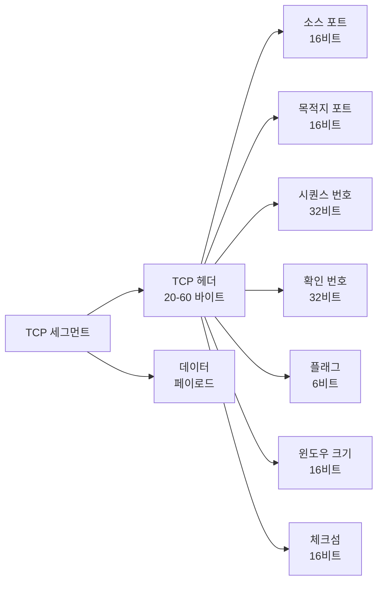
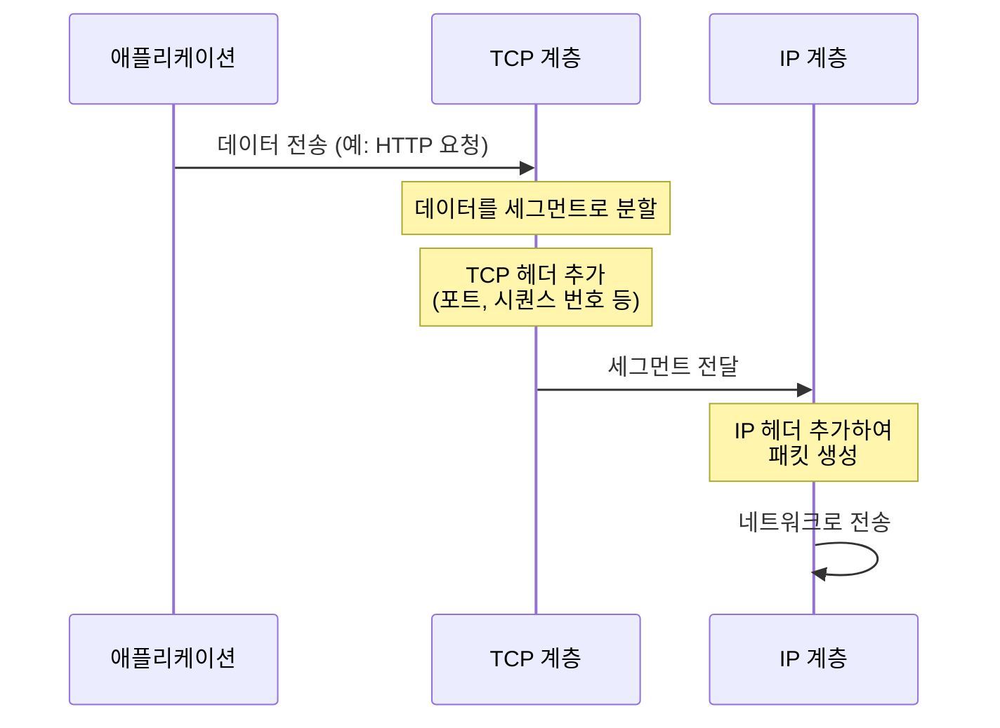
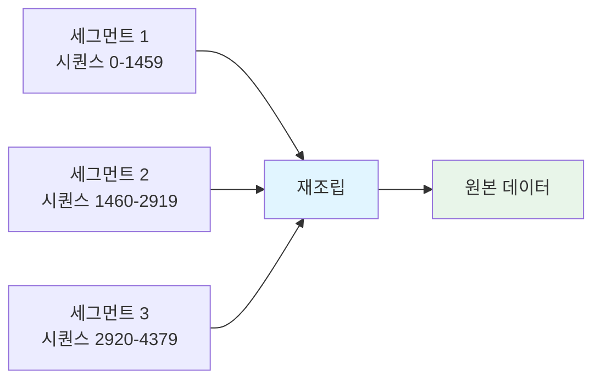
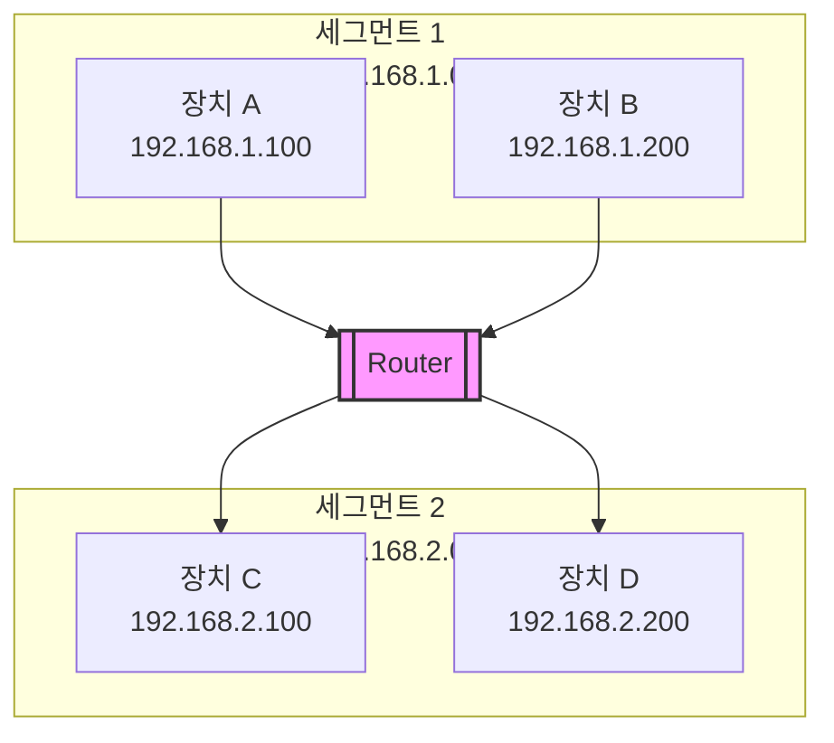
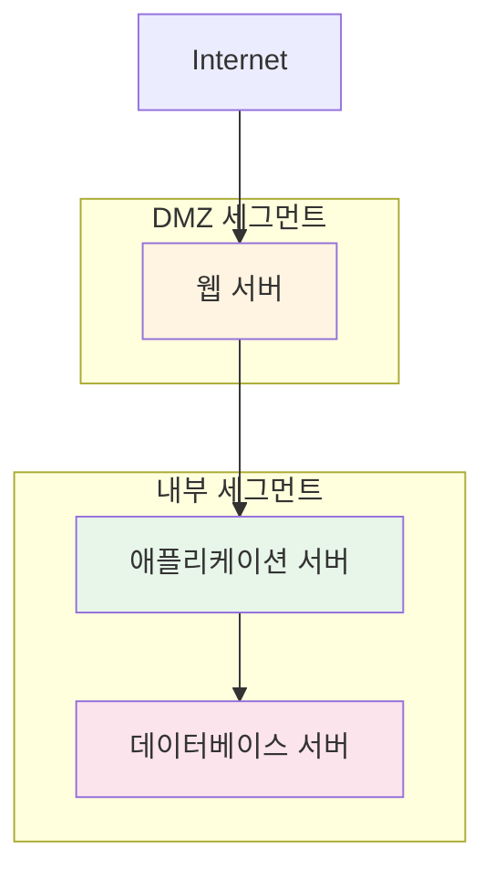

세그먼트(Segment)는 네트워크 통신에서 사용되는 용어로, 맥락에 따라 두 가지 주요 의미를 가집니다:

1. **전송 계층 세그먼트**: [[OSI 모델]]의 전송 계층(4계층)에서 사용되는 데이터 단위로, [[TCP]] 프로토콜이 상위 계층의 데이터를 분할하여 생성하는 단위입니다.
2. **네트워크 세그먼트**: 물리적 또는 논리적으로 구분된 네트워크의 일부분을 의미합니다.

세그먼트를 이해하기 위해서는 [[OSI 모델]], [[TCP]], [[Network]], [[Router]] 등의 개념을 함께 이해하는 것이 중요합니다.

## 전송 계층 세그먼트 (Transport Layer Segment)

전송 계층 세그먼트는 [[OSI 모델]]의 전송 계층에서 사용되는 데이터 단위입니다. [[TCP]] 프로토콜은 상위 계층에서 받은 데이터를 세그먼트로 분할하여 전송합니다.

### 세그먼트의 등장 배경

애플리케이션에서 생성된 데이터는 그대로 네트워크를 통해 전송할 수 없습니다. 다음과 같은 이유로 데이터를 세그먼트로 분할해야 합니다:

1. **MTU 제한**: 네트워크 인터페이스마다 한 번에 전송할 수 있는 최대 크기(MTU, Maximum Transmission Unit)가 제한되어 있습니다.
2. **효율적인 전송**: 큰 데이터를 작은 단위로 나누어 전송하면 네트워크 자원을 효율적으로 사용할 수 있습니다.
3. **오류 제어**: 작은 단위로 나누면 오류 발생 시 일부만 재전송하면 되므로 효율적입니다.
4. **멀티플렉싱**: 여러 애플리케이션의 데이터를 구분하여 전송할 수 있습니다.

### TCP 세그먼트 구조

TCP 세그먼트는 헤더와 데이터로 구성됩니다:



**TCP 헤더 주요 필드**:

- **소스 포트 (Source Port)**: 송신 애플리케이션의 포트 번호
- **목적지 포트 (Destination Port)**: 수신 애플리케이션의 포트 번호
- **시퀀스 번호 (Sequence Number)**: 세그먼트의 순서를 나타내는 번호
- **확인 번호 (Acknowledgment Number)**: 다음에 기대하는 시퀀스 번호
- **플래그 (Flags)**: SYN, ACK, FIN, RST 등의 제어 플래그
- **윈도우 크기 (Window Size)**: 수신 가능한 데이터 크기
- **체크섬 (Checksum)**: 오류 검출을 위한 값

### 세그먼트 생성 과정

애플리케이션 데이터가 세그먼트로 변환되는 과정은 다음과 같습니다:



### 세그먼트 크기

TCP 세그먼트의 크기는 다음과 같이 결정됩니다:

- **최대 세그먼트 크기 (MSS, Maximum Segment Size)**: TCP 헤더를 제외한 데이터의 최대 크기
- **일반적인 MSS**: 1460 바이트 (이더넷 MTU 1500 바이트 - IP 헤더 20 바이트 - TCP 헤더 20 바이트)
- **전체 세그먼트 크기**: MSS + TCP 헤더 (20-60 바이트)

### Java에서 세그먼트 처리

Java의 TCP 소켓은 세그먼트를 자동으로 처리합니다:

```java
import java.net.Socket;
import java.io.*;

public class SegmentExample {
    public static void main(String[] args) throws IOException {
        Socket socket = new Socket("www.example.com", 80);
        
        // 출력 스트림에 데이터를 쓰면 TCP가 자동으로 세그먼트로 분할
        PrintWriter out = new PrintWriter(
            socket.getOutputStream(), true
        );
        
        // 큰 데이터를 전송해도 TCP가 자동으로 세그먼트로 분할
        String largeData = "A".repeat(10000); // 10KB 데이터
        out.println(largeData);
        
        // TCP는 이 데이터를 여러 세그먼트로 나누어 전송
        // 수신 측에서는 자동으로 재조립
        
        socket.close();
    }
}
```

### 세그먼트 재조립

수신 측에서는 여러 세그먼트를 받아 원래 데이터로 재조립합니다:



**재조립 과정**:
1. 수신된 세그먼트는 시퀀스 번호를 기준으로 정렬됩니다.
2. 누락된 세그먼트가 있으면 재전송을 요청합니다.
3. 모든 세그먼트가 도착하면 순서대로 재조립합니다.
4. 재조립된 데이터를 상위 계층에 전달합니다.

## 네트워크 세그먼트 (Network Segment)

네트워크 세그먼트는 물리적 또는 논리적으로 구분된 네트워크의 일부분을 의미합니다. 같은 세그먼트에 속한 장치들은 브로드캐스트 도메인을 공유합니다.

### 네트워크 세그먼트의 등장 배경

초기 네트워크는 단일 세그먼트로 구성되어 있었습니다. 하지만 네트워크가 확장되면서 다음과 같은 문제들이 발생했습니다:

1. **브로드캐스트 스톰**: 단일 세그먼트에서 브로드캐스트 트래픽이 과도하게 증가했습니다.
2. **충돌 도메인**: 같은 세그먼트의 모든 장치가 충돌 도메인을 공유했습니다.
3. **보안 문제**: 모든 장치가 같은 네트워크에 있어 보안 정책 적용이 어려웠습니다.
4. **성능 저하**: 트래픽이 증가하면서 전체 네트워크 성능이 저하되었습니다.

네트워크를 세그먼트로 나누면 이러한 문제들을 해결할 수 있습니다.

### 네트워크 세그먼트의 종류

#### 1. 물리적 세그먼트

물리적으로 분리된 네트워크 구간입니다. [[Router]]나 브리지로 연결됩니다.

**특징**:
- 물리적 케이블로 구분됩니다
- 다른 충돌 도메인에 속합니다
- [[Router]]를 통해 다른 세그먼트와 통신합니다

**예시**: 
- 건물의 각 층을 다른 세그먼트로 구성
- 사무실의 각 부서를 다른 세그먼트로 구성

#### 2. 논리적 세그먼트 (VLAN)

VLAN(Virtual LAN)을 사용하여 논리적으로 구분된 네트워크입니다.

**특징**:
- 물리적 위치와 무관하게 논리적으로 그룹화됩니다
- 스위치에서 VLAN 설정으로 구분됩니다
- 같은 물리적 네트워크에 있더라도 다른 세그먼트로 분리됩니다

**예시**:
- 같은 스위치에 연결된 장치들을 VLAN으로 구분
- 부서별로 VLAN을 구성하여 논리적으로 분리

### 세그먼트 간 통신

서로 다른 네트워크 세그먼트에 속한 장치들은 [[Router]]를 통해 통신합니다:



**통신 과정**:
1. 장치 A가 장치 C로 데이터를 전송하려고 합니다.
2. 장치 A는 목적지 IP 주소를 확인하고, 다른 세그먼트임을 인식합니다.
3. 기본 게이트웨이([[Router]])로 데이터를 전송합니다.
4. 라우터는 라우팅 테이블을 확인하여 세그먼트 2로 전달합니다.
5. 장치 C가 데이터를 수신합니다.

### 브리지와 세그먼트

브리지(Bridge)는 두 개의 네트워크 세그먼트를 연결하는 장비입니다:

**브리지의 역할**:
- 충돌 도메인을 분리합니다
- 브로드캐스트는 전달합니다
- MAC 주소를 기반으로 프레임을 필터링합니다

**브리지 vs 라우터**:
- **브리지**: 데이터 링크 계층(2계층)에서 동작, 같은 네트워크 내 세그먼트 연결
- **라우터**: 네트워크 계층(3계층)에서 동작, 서로 다른 네트워크 연결

## 세그먼트와 관련 개념

### 세그먼트와 패킷

- **세그먼트**: 전송 계층의 데이터 단위 (TCP 세그먼트)
- **패킷**: 네트워크 계층의 데이터 단위 (IP 패킷)

세그먼트는 패킷으로 캡슐화되어 전송됩니다:

```
TCP 세그먼트
  ↓ + IP 헤더
IP 패킷
  ↓ + 이더넷 헤더
이더넷 프레임
```

### 세그먼트와 프레임

- **세그먼트**: 전송 계층의 데이터 단위
- **프레임**: 데이터 링크 계층의 데이터 단위

프레임은 물리적 네트워크에서 실제로 전송되는 단위입니다.

## Java에서 네트워크 세그먼트 확인

Java에서는 네트워크 인터페이스 정보를 확인할 수 있습니다:

```java
import java.net.*;
import java.util.Enumeration;

public class NetworkSegmentExample {
    public static void main(String[] args) throws SocketException {
        Enumeration<NetworkInterface> interfaces = 
            NetworkInterface.getNetworkInterfaces();
        
        while (interfaces.hasMoreElements()) {
            NetworkInterface networkInterface = interfaces.nextElement();
            
            System.out.println("인터페이스: " + networkInterface.getName());
            System.out.println("표시 이름: " + networkInterface.getDisplayName());
            
            // 인터페이스에 연결된 주소 확인
            Enumeration<InetAddress> addresses = 
                networkInterface.getInetAddresses();
            
            while (addresses.hasMoreElements()) {
                InetAddress address = addresses.nextElement();
                System.out.println("  IP 주소: " + address.getHostAddress());
                
                // 서브넷 마스크를 통해 네트워크 세그먼트 확인
                if (address instanceof Inet4Address) {
                    // IPv4 주소의 네트워크 세그먼트 정보
                    System.out.println("  네트워크: " + 
                        getNetworkSegment(address));
                }
            }
            System.out.println();
        }
    }
    
    private static String getNetworkSegment(InetAddress address) {
        // 실제 구현에서는 서브넷 마스크 정보가 필요합니다
        // 여기서는 간단한 예시만 제공합니다
        String ip = address.getHostAddress();
        String[] parts = ip.split("\\.");
        return parts[0] + "." + parts[1] + "." + parts[2] + ".0/24";
    }
}
```

## 스프링에서 세그먼트 활용

스프링 애플리케이션에서는 네트워크 세그먼트를 고려한 설정이 필요할 수 있습니다:

### 네트워크 세그먼트별 설정

```java
import org.springframework.context.annotation.Configuration;
import org.springframework.core.env.Environment;

@Configuration
public class NetworkSegmentConfig {
    
    private final Environment environment;
    
    public NetworkSegmentConfig(Environment environment) {
        this.environment = environment;
    }
    
    @Bean
    public String networkSegment() {
        // 환경 변수나 설정 파일에서 네트워크 세그먼트 정보 읽기
        return environment.getProperty("network.segment", "default");
    }
}
```

### 세그먼트 기반 라우팅

```java
import org.springframework.cloud.gateway.route.RouteLocator;
import org.springframework.cloud.gateway.route.builder.RouteLocatorBuilder;
import org.springframework.context.annotation.Bean;
import org.springframework.context.annotation.Configuration;

@Configuration
public class SegmentBasedRouting {
    
    @Bean
    public RouteLocator segmentRoutes(RouteLocatorBuilder builder) {
        return builder.routes()
            // 내부 세그먼트로의 라우팅
            .route("internal-segment", r -> r
                .path("/internal/**")
                .uri("lb://internal-service"))
            // 외부 세그먼트로의 라우팅
            .route("external-segment", r -> r
                .path("/external/**")
                .uri("lb://external-service"))
            .build();
    }
}
```

## 세그먼트와 보안

네트워크 세그먼트는 보안 정책을 적용하는 데 중요한 역할을 합니다:

### 세그먼트별 보안 정책

1. **방화벽 규칙**: 세그먼트별로 다른 방화벽 규칙을 적용할 수 있습니다.
2. **접근 제어**: 특정 세그먼트에만 접근을 허용하거나 차단할 수 있습니다.
3. **트래픽 모니터링**: 세그먼트별로 트래픽을 모니터링하여 이상 징후를 감지합니다.

### 세그먼트 격리

중요한 시스템은 별도의 세그먼트로 격리하여 보안을 강화합니다:



## 실제 활용 사례

1. **기업 네트워크**: 부서별로 네트워크 세그먼트를 구성하여 트래픽을 분리합니다.
2. **클라우드 환경**: 가상 네트워크를 사용하여 논리적 세그먼트를 구성합니다.
3. **데이터 센터**: 서버를 기능별로 세그먼트로 나누어 관리합니다.
4. **보안 강화**: 중요한 시스템을 별도 세그먼트로 격리합니다.

## 결론

세그먼트는 네트워크 통신에서 중요한 개념으로, 전송 계층의 데이터 단위와 네트워크의 논리적/물리적 구분을 모두 의미합니다. 

**전송 계층 세그먼트**는 [[TCP]] 프로토콜이 데이터를 효율적으로 전송하기 위해 사용하는 단위이며, [[OSI 모델]]의 전송 계층에서 중요한 역할을 합니다.

**네트워크 세그먼트**는 네트워크를 논리적 또는 물리적으로 구분하여 관리하고, 브로드캐스트 도메인을 분리하여 성능과 보안을 향상시키는 데 사용됩니다.

세그먼트를 이해하기 위해서는 [[OSI 모델]], [[TCP]], [[Network]], [[Router]], [[IP 주소]] 등의 관련 개념들을 함께 이해하는 것이 중요합니다.

## 참고 자료

- Computer Networks, 5th Edition - Andrew S. Tanenbaum
- TCP/IP Illustrated, Volume 1 - W. Richard Stevens
- CCNA Routing and Switching Study Guide - Todd Lammle
- 스프링 클라우드 게이트웨이 공식 문서

