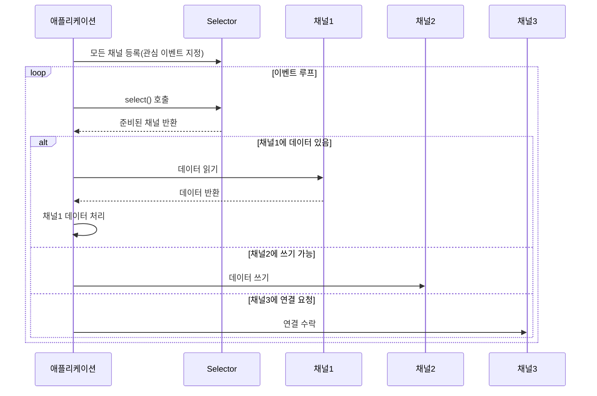
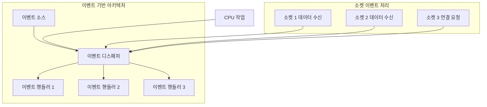

소켓에 데이터가 수신되면 CPU가 현재 수행 중인 다른 작업을 중단하지 않고 해당 이벤트를 처리하는 방식은 현대적인 서버 애플리케이션에서 매우 중요한 패턴입니다. 이러한 방식은 CPU 리소스를 효율적으로 활용하고 시스템의 전체적인 처리량을 향상시킵니다. 이것을 구현하기 위한 주요 접근 방법들을 살펴보겠습니다.

## I/O 멀티플렉싱 모델

[[IO 멀티플렉싱(IO Multiplexing)]]은 단일 스레드에서 여러 소켓 연결을 동시에 모니터링하는 기술입니다. 소켓에 데이터가 도착할 때까지 블로킹하지 않고, 여러 소켓의 상태를 지속적으로 확인하다가 준비된 소켓만 처리합니다.



Java에서는 NIO 패키지의 Selector를 사용하여 이를 구현할 수 있습니다:

```java
import java.nio.channels.*;
import java.nio.*;
import java.net.*;
import java.util.*;

public class NIOServer {
    public static void main(String[] args) throws IOException {
        // 셀렉터 생성
        Selector selector = Selector.open();
        
        // 서버 소켓 채널 생성 및 논블로킹 모드 설정
        ServerSocketChannel serverChannel = ServerSocketChannel.open();
        serverChannel.configureBlocking(false);
        serverChannel.socket().bind(new InetSocketAddress(8080));
        
        // 서버 채널을 셀렉터에 등록 (연결 수락 이벤트)
        serverChannel.register(selector, SelectionKey.OP_ACCEPT);
        
        while (true) {
            // 이벤트 발생 대기 (블로킹되지만 여러 채널을 동시에 모니터링)
            selector.select();
            
            // 준비된 채널 처리
            Set<SelectionKey> selectedKeys = selector.selectedKeys();
            Iterator<SelectionKey> iter = selectedKeys.iterator();
            
            while (iter.hasNext()) {
                SelectionKey key = iter.next();
                
                if (key.isAcceptable()) {
                    // 연결 수락 처리
                    handleAccept(key, selector);
                } else if (key.isReadable()) {
                    // 데이터 읽기 처리
                    handleRead(key);
                } else if (key.isWritable()) {
                    // 데이터 쓰기 처리
                    handleWrite(key);
                }
                
                iter.remove();
            }
            
            // 여기서 다른 작업 수행 가능 (CPU를 효율적으로 활용)
            doOtherTasks();
        }
    }
    
    // 연결 수락 처리
    private static void handleAccept(SelectionKey key, Selector selector) throws IOException {
        // 구현 내용...
    }
    
    // 데이터 읽기 처리
    private static void handleRead(SelectionKey key) throws IOException {
        // 구현 내용...
    }
    
    // 데이터 쓰기 처리
    private static void handleWrite(SelectionKey key) throws IOException {
        // 구현 내용...
    }
    
    // 다른 작업 수행
    private static void doOtherTasks() {
        // CPU를 사용하는 다른 작업 처리
    }
}
```

이 방식은 [[이벤트 루프(Event Loop)]] 패턴의 기본 형태로, 단일 스레드로 여러 소켓을 효율적으로 관리할 수 있습니다.

## 비동기 I/O 모델

Java 7부터 도입된 NIO.2(AsynchronousChannel)는 진정한 비동기 I/O를 제공합니다. 이 모델에서는 I/O 작업을 OS에 위임하고, 작업이 완료되면 콜백이나 Future를 통해 결과를 받습니다.

```java
import java.nio.ByteBuffer;
import java.nio.channels.*;
import java.net.*;
import java.util.concurrent.*;

public class AsyncIOServer {
    public static void main(String[] args) throws IOException {
        AsynchronousServerSocketChannel server = AsynchronousServerSocketChannel.open()
            .bind(new InetSocketAddress(8080));
        
        server.accept(null, new CompletionHandler<AsynchronousSocketChannel, Void>() {
            @Override
            public void completed(AsynchronousSocketChannel client, Void attachment) {
                // 다음 연결을 위해 다시 accept 호출
                server.accept(null, this);
                
                ByteBuffer buffer = ByteBuffer.allocate(1024);
                
                // 비동기적으로 데이터 읽기
                client.read(buffer, buffer, new CompletionHandler<Integer, ByteBuffer>() {
                    @Override
                    public void completed(Integer result, ByteBuffer attachment) {
                        // 데이터 처리
                        if (result > 0) {
                            attachment.flip();
                            // 데이터 처리 로직
                            // ...
                            
                            // 데이터 처리 완료 후 다시 읽기 시작
                            attachment.clear();
                            client.read(attachment, attachment, this);
                        }
                    }
                    
                    @Override
                    public void failed(Throwable exc, ByteBuffer attachment) {
                        // 오류 처리
                    }
                });
            }
            
            @Override
            public void failed(Throwable exc, Void attachment) {
                // 오류 처리
            }
        });
        
        // 다른 작업 수행 (메인 스레드는 블로킹되지 않음)
        while (true) {
            // CPU 작업 수행
            doOtherTasks();
            
            // 약간의 딜레이 (CPU 과부하 방지)
            try {
                Thread.sleep(100);
            } catch (InterruptedException e) {
                e.printStackTrace();
            }
        }
    }
    
    private static void doOtherTasks() {
        // CPU를 사용하는 다른 작업 처리
    }
}
```

이 방식은, 소켓에 데이터가 도착했을 때 OS가 애플리케이션에 알려주고 애플리케이션은 별도의 스레드 풀에서 해당 이벤트를 처리하는 Proactor 패턴의 구현입니다.

## 리액티브 프로그래밍 프레임워크 활용

현대적인 애플리케이션에서는 Netty, Vert.x, Spring WebFlux와 같은 리액티브 프레임워크를 활용하여 비동기 I/O를 더 쉽게 구현할 수 있습니다.

### Netty 예제

```java
import io.netty.bootstrap.ServerBootstrap;
import io.netty.channel.*;
import io.netty.channel.nio.*;
import io.netty.channel.socket.SocketChannel;
import io.netty.channel.socket.nio.NioServerSocketChannel;

public class NettyServer {
    public static void main(String[] args) throws Exception {
        // 이벤트 루프 그룹 생성
        EventLoopGroup bossGroup = new NioEventLoopGroup(1);
        EventLoopGroup workerGroup = new NioEventLoopGroup();
        
        try {
            ServerBootstrap b = new ServerBootstrap();
            b.group(bossGroup, workerGroup)
             .channel(NioServerSocketChannel.class)
             .childHandler(new ChannelInitializer<SocketChannel>() {
                 @Override
                 protected void initChannel(SocketChannel ch) throws Exception {
                     ch.pipeline().addLast(new ChannelInboundHandlerAdapter() {
                         @Override
                         public void channelRead(ChannelHandlerContext ctx, Object msg) {
                             // 데이터 수신 시 처리
                             // ...
                             
                             // 처리 완료 후 자원 해제
                             ReferenceCountUtil.release(msg);
                         }
                         
                         @Override
                         public void exceptionCaught(ChannelHandlerContext ctx, Throwable cause) {
                             // 예외 처리
                             cause.printStackTrace();
                             ctx.close();
                         }
                     });
                 }
             });
            
            // 서버 시작
            ChannelFuture f = b.bind(8080).sync();
            
            // 서버 소켓이 닫힐 때까지 대기
            f.channel().closeFuture().sync();
        } finally {
            // 이벤트 루프 그룹 종료
            bossGroup.shutdownGracefully();
            workerGroup.shutdownGracefully();
        }
    }
}
```

Netty는 내부적으로 이벤트 루프를 사용하여 논블로킹 I/O를 처리하고, 채널 파이프라인을 통해 데이터 처리 로직을 구성할 수 있습니다. 자세한 내용은 Netty 기반 서버 개발을 참고해주세요.

### Spring WebFlux 예제

```java
import org.springframework.boot.SpringApplication;
import org.springframework.boot.autoconfigure.SpringBootApplication;
import org.springframework.context.annotation.Bean;
import org.springframework.web.reactive.function.server.*;
import reactor.core.publisher.Mono;

@SpringBootApplication
public class ReactiveApplication {

    public static void main(String[] args) {
        SpringApplication.run(ReactiveApplication.class, args);
    }

    @Bean
    public RouterFunction<ServerResponse> routerFunction() {
        return RouterFunctions.route()
            .GET("/hello", request -> ServerResponse.ok().body(Mono.just("Hello Reactive World"), String.class))
            .build();
    }
    
    // CPU를 사용하는 다른 작업을 별도 스레드에서 수행할 수 있음
}
```

Spring WebFlux는 Project Reactor를 기반으로 한 리액티브 프로그래밍 모델을 제공하며, 내부적으로 Netty 서버를 사용합니다. 자세한 내용은 스프링 WebFlux 활용법을 참고해주세요.

## [[이벤트 기반 아키텍처(Event-Driven Architecture)]]의 주요 패턴

소켓 데이터 수신에 반응하는 이벤트 기반 아키텍처는 다음과 같은 패턴을 사용합니다:



1. **반응자(Reactor) 패턴**: 이벤트 루프가 이벤트 발생을 감지하고 적절한 핸들러로 디스패치하는 패턴입니다.
2. **관찰자(Observer) 패턴**: 이벤트 소스(Subject)가 변경될 때 관찰자(Observer)에게 알리는 패턴입니다.
3. **발행-구독(Pub-Sub) 패턴**: 이벤트 발행자와 구독자 간의 느슨한 결합을 제공하는 패턴입니다.

## 고려사항

이벤트 기반 소켓 처리를 구현할 때 다음 사항을 고려해야 합니다:

1. **블로킹 작업 관리**: CPU 집약적인 작업이나 블로킹 작업은 별도의 스레드 풀로 위임하여 이벤트 루프가 차단되지 않도록 해야 합니다.
2. **오류 처리**: 비동기 환경에서의 오류 처리는 동기 코드보다 복잡할 수 있으므로, 적절한 오류 처리 전략이 필요합니다.
3. **백프레셔(Backpressure)**: 데이터 생산 속도가 소비 속도보다 빠를 경우 시스템 과부하를 방지하기 위한 백프레셔(Backpressure) 메커니즘이 필요합니다.
4. **디버깅 복잡성**: 비동기 코드는 디버깅이 어려울 수 있으므로, 적절한 로깅과 모니터링이 중요합니다.

## 결론

소켓에 데이터가 수신될 때 CPU가 다른 작업을 중단하지 않고 효율적으로 처리하기 위해서는 논블로킹 I/O와 이벤트 기반 프로그래밍 모델을 활용해야 합니다. Java NIO의 Selector, NIO.2의 AsynchronousChannel, 또는 Netty, Vert.x, Spring WebFlux와 같은 고수준 프레임워크를 사용하여 이를 구현할 수 있습니다.

현대적인 서버 애플리케이션에서는 이러한 비동기 프로그래밍 모델이 확장성과 리소스 효율성 측면에서 큰 이점을 제공합니다. 특히 대규모 동시 연결을 처리해야 하는 시스템에서는 이벤트 기반 아키텍처가 필수적입니다.

## 참고 자료

- Java NIO Programming - Ron Hitchens
- Netty in Action - Norman Maurer
- Reactive Programming with RxJava - Tomasz Nurkiewicz & Ben Christensen
- 스프링 공식 문서(https://docs.spring.io/spring-framework/docs/current/reference/html/web-reactive.html)