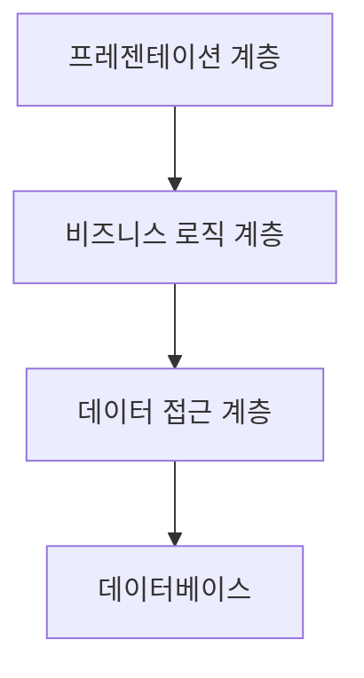

소프트웨어 설계의 유연성은 변화하는 요구사항과 환경에 적응할 수 있는 시스템의 능력을 의미합니다. 유연한 설계는 미래의 변경사항을 수용하고 확장할 수 있도록 소프트웨어를 구조화하는 방법입니다. 현대 소프트웨어 개발에서 유연성은 단순한 선택사항이 아닌 필수 요소로 자리잡았습니다.

소프트웨어 유연성의 중요성을 이해하기 위해서는 먼저 [[소프트웨어 엔트로피(Software Entropy)]]와 변화의 불가피성을 인식하는 것이 중요합니다.

## 유연한 설계의 핵심 원칙

유연한 소프트웨어 설계를 위한 핵심 원칙들은 다음과 같습니다:

### 1. 단일 책임 원칙(SRP)

클래스나 모듈은 변경할 이유가 하나만 있어야 합니다. 즉, 각 클래스는 단 하나의 책임만 가져야 합니다. 이는 [[SOLID 원칙]]의 첫 번째 원칙입니다.

```java
// 단일 책임 원칙을 위반한 예
public class UserService {
    public User getUser(Long id) { /* ... */ }
    public void saveUser(User user) { /* ... */ }
    public void sendEmail(User user, String message) { /* ... */ }
    public void generateReport(User user) { /* ... */ }
}

// 단일 책임 원칙을 준수한 예
public class UserService {
    public User getUser(Long id) { /* ... */ }
    public void saveUser(User user) { /* ... */ }
}

public class EmailService {
    public void sendEmail(User user, String message) { /* ... */ }
}

public class ReportService {
    public void generateReport(User user) { /* ... */ }
}
```

### 2. 개방-폐쇄 원칙(OCP)

소프트웨어 엔티티(클래스, 모듈, 함수 등)는 확장에는 열려 있으나 수정에는 닫혀 있어야 합니다. 이는 기존 코드를 변경하지 않고도 기능을 확장할 수 있어야 함을 의미합니다.

### 3. 의존성 역전 원칙(DIP)

고수준 모듈은 저수준 모듈에 의존해서는 안 됩니다. 둘 다 추상화에 의존해야 합니다. 또한 추상화는 세부 사항에 의존해서는 안 되며, 세부 사항이 추상화에 의존해야 합니다.

자세한 SOLID 원칙에 대한 내용은 [[SOLID 설계 원칙의 적용]]을 참고해주세요.

## 유연성을 높이는 설계 패턴

### 1. 전략 패턴(Strategy Pattern)

알고리즘 군을 정의하고 각각을 캡슐화하여 교환 가능하게 만듭니다. 전략 패턴을 사용하면 알고리즘을 사용하는 클라이언트와 독립적으로 알고리즘을 변경할 수 있습니다.

```java
// 전략 인터페이스
public interface PaymentStrategy {
    void pay(int amount);
}

// 구체적인 전략 구현
public class CreditCardStrategy implements PaymentStrategy {
    private String name;
    private String cardNumber;
    
    public CreditCardStrategy(String name, String cardNumber) {
        this.name = name;
        this.cardNumber = cardNumber;
    }
    
    @Override
    public void pay(int amount) {
        System.out.println(amount + "원을 신용카드로 결제했습니다.");
    }
}

// 컨텍스트
public class ShoppingCart {
    private PaymentStrategy paymentStrategy;
    
    public void setPaymentStrategy(PaymentStrategy paymentStrategy) {
        this.paymentStrategy = paymentStrategy;
    }
    
    public void checkout(int amount) {
        paymentStrategy.pay(amount);
    }
}
```

### 2. 옵저버 패턴(Observer Pattern)

객체 간의 일대다 의존 관계를 정의하여, 한 객체의 상태가 변경되면 의존하는 모든 객체에 자동으로 통지되고 갱신되도록 합니다.

### 3. 템플릿 메서드 패턴(Template Method Pattern)

알고리즘의 골격을 정의하고 일부 단계를 서브클래스에서 구현할 수 있도록 합니다.

디자인 패턴에 대한 자세한 내용은 [[유연한 설계를 위한 디자인 패턴]]을 참고해주세요.

## 유연성을 위한 아키텍처 접근법

### 1. 계층화 아키텍처(Layered Architecture)

시스템을 논리적인 계층으로 분리하여 각 계층이 특정 책임을 담당하도록 합니다. 이를 통해 한 계층의 변경이 다른 계층에 미치는 영향을 최소화할 수 있습니다.



### 2. 헥사고날 아키텍처(Hexagonal Architecture)

비즈니스 로직을 외부 시스템과 분리하여 의존성 방향을 제어합니다. 이 아키텍처는 포트와 어댑터 아키텍처라고도 불립니다.

### 3. 마이크로서비스 아키텍처(Microservices Architecture)

애플리케이션을 느슨하게 결합된 독립적인 서비스로 분해합니다. 각 서비스는 독립적으로 배포하고 확장할 수 있습니다.

아키텍처 접근법에 대한 자세한 내용은 [[유연한 소프트웨어 아키텍처]]를 참고해주세요.

## 스프링 프레임워크에서의 유연성

스프링 프레임워크는 다양한 메커니즘을 통해 유연한 소프트웨어 설계를 지원합니다:

### 1. 의존성 주입(DI)

스프링의 핵심 기능인 의존성 주입은 객체 간의 결합도를 낮추고 유연성을 높입니다.

```java
@Service
public class UserServiceImpl implements UserService {
    private final UserRepository userRepository;
    
    @Autowired
    public UserServiceImpl(UserRepository userRepository) {
        this.userRepository = userRepository;
    }
    
    // UserService 구현...
}
```

### 2. AOP(Aspect-Oriented Programming)

관심사의 분리를 통해 핵심 비즈니스 로직에 집중할 수 있게 해주며, 로깅, 트랜잭션 관리 등의 공통 기능을 모듈화합니다.

```java
@Aspect
@Component
public class LoggingAspect {
    
    @Around("execution(* com.example.service.*.*(..))")
    public Object logTimeMethod(ProceedingJoinPoint joinPoint) throws Throwable {
        long startTime = System.currentTimeMillis();
        Object result = joinPoint.proceed();
        long endTime = System.currentTimeMillis();
        
        System.out.println(joinPoint.getSignature() + " : " + (endTime - startTime) + "ms");
        return result;
    }
}
```

### 3. 프로파일(Profiles)

다양한 환경(개발, 테스트, 프로덕션 등)에 맞게 서로 다른 빈 구성을 활성화할 수 있습니다.

## 유연성과 성능의 균형

유연성은 중요하지만, 과도한 추상화와 유연성 추구는 성능 저하와 복잡성 증가로 이어질 수 있습니다. 따라서 적절한 균형을 찾는 것이 중요합니다.

### 과도한 유연성의 단점

1. **복잡성 증가**: 지나친 추상화와 간접 계층은 코드를 이해하기 어렵게 만듭니다.
2. **성능 오버헤드**: 추가적인 계층과 인디렉션은 성능 저하를 가져올 수 있습니다.
3. **개발 시간 증가**: 더 복잡한 설계는 개발 시간을 늘릴 수 있습니다.

### 균형 잡힌 접근법

1. **현재 요구사항 충족**: 현재 알려진 요구사항을 우선적으로 만족시키세요.
2. **예측 가능한 변경에 대비**: 합리적으로 예측 가능한 변경사항에 대해서만 유연성을 추가하세요.
3. **리팩토링 문화**: 완벽한 설계보다는 지속적인 리팩토링을 통해 코드를 개선하는 문화를 조성하세요.

## 유연성 측정 방법

소프트웨어의 유연성을 객관적으로 측정하는 몇 가지 방법이 있습니다:

### 1. 결합도(Coupling) 측정

클래스나 모듈 간의 의존성 정도를 측정합니다. 낮은 결합도는 더 유연한 설계를 의미합니다.

### 2. 응집도(Cohesion) 측정

모듈 내 요소들이 얼마나 밀접하게 관련되어 있는지 측정합니다. 높은 응집도는 더 유연한 설계로 이어집니다.

### 3. 변경 영향 분석

특정 변경이 시스템의 다른 부분에 미치는 영향을 분석합니다. 영향이 적을수록 더 유연한 설계입니다.

## 실제 적용 사례

유연한 설계의 실제 적용 사례를 살펴보겠습니다:

### 1. 결제 시스템

다양한 결제 방법(신용카드, 계좌이체, 페이팔 등)을 지원하는 결제 시스템은 전략 패턴을 활용하여 새로운 결제 방법을 쉽게 추가할 수 있도록 설계할 수 있습니다.

### 2. 웹 애플리케이션 프레임워크

다양한 데이터베이스, 템플릿 엔진, 인증 메커니즘을 지원하는 웹 프레임워크는 플러그인 아키텍처를 통해 유연성을 제공합니다.

### 3. 이커머스 플랫폼

새로운 상품 카테고리, 프로모션 규칙, 배송 방법 등을 쉽게 추가할 수 있는 이커머스 플랫폼은 확장 가능한 설계를 통해 비즈니스 요구사항의 변화에 대응합니다.

## 유연성을 위한 코딩 관행

일상적인 코딩 관행도 소프트웨어의 유연성에 큰 영향을 미칩니다:

### 1. 인터페이스에 프로그래밍하기

구체적인 구현보다는 인터페이스에 의존하여 구현체를 쉽게 교체할 수 있도록 합니다.

```java
// 구체 클래스에 의존 (좋지 않음)
ArrayList<String> list = new ArrayList<>();

// 인터페이스에 의존 (좋음)
List<String> list = new ArrayList<>();
```

### 2. 컴포지션 우선

상속보다 컴포지션(구성)을 우선적으로 사용하여 유연성을 높입니다.

### 3. 테스트 주도 개발(TDD)

테스트 주도 개발은 자연스럽게 더 모듈화되고 유연한 설계로 이어집니다.

## 결론

소프트웨어 설계의 유연성은 변화에 효과적으로 대응하고 시스템의 수명을 연장하는 핵심 요소입니다. 단일 책임 원칙, 개방-폐쇄 원칙과 같은 설계 원칙, 전략 패턴, 옵저버 패턴과 같은 디자인 패턴, 그리고 계층화 아키텍처, 마이크로서비스와 같은 아키텍처 접근법을 통해 유연성을 높일 수 있습니다.

그러나 유연성과 성능, 복잡성 사이의 균형을 찾는 것이 중요합니다. 현재의 요구사항을 만족시키면서 합리적으로 예측 가능한 변경에 대비하는 접근법이 가장 효과적입니다.

소프트웨어 유연성은 한 번에 완성되는 것이 아니라 지속적인 리팩토링과 개선을 통해 점진적으로 발전시켜 나가는 것이 중요합니다. [[지속적인 리팩토링 전략]]을 통해 시스템의 유연성을 유지하고 향상시킬 수 있습니다.

## 참고 자료

- Clean Architecture - Robert C. Martin
- Design Patterns: Elements of Reusable Object-Oriented Software - Erich Gamma, Richard Helm, Ralph Johnson, John Vlissides
- Refactoring: Improving the Design of Existing Code - Martin Fowler
- 스프링 공식 문서 (https://spring.io/guides)
- Domain-Driven Design - Eric Evans