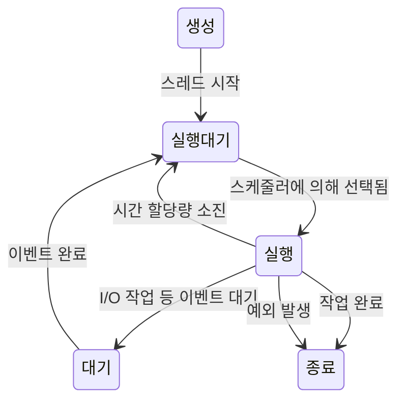

스레드(Thread)는 프로세스 내에서 실행되는 작업의 가장 작은 단위입니다. 하나의 프로세스는 여러 개의 스레드를 가질 수 있으며, 각 스레드는 동일한 프로세스 내의 자원을 공유하면서 독립적으로 실행됩니다. 이것이 바로 스레드가 '경량 프로세스'라고 불리는 이유입니다.

스레드는 현대 소프트웨어 개발에서 매우 중요한 개념으로, 멀티스레딩 기법을 통해 애플리케이션의 성능과 응답성을 크게 향상시킬 수 있습니다. 스레드를 이해하기 위해서는 먼저 [[프로세스(Process)]]와의 차이점을 이해하는 것이 중요합니다.

## 프로세스와 스레드의 차이
자세한 내용은 [[프로세스와 스레드의 차이]]를 참고해주세요
## 스레드의 구조

모든 스레드는 다음과 같은 구성 요소를 갖습니다:

1. **스레드 ID**: 각 스레드의 고유 식별자
2. **프로그램 카운터(PC)**: 다음에 실행할 명령어의 주소
3. **레지스터 세트**: 스레드 실행 상태를 저장
4. **스택**: 지역 변수와 함수 호출 정보를 저장

이러한 요소들은 각 스레드마다 독립적으로 존재하지만, 코드, 데이터 섹션, 파일과 같은 자원은 동일한 프로세스 내의 스레드들이 공유합니다.

## 스레드의 상태

스레드는 생명주기 동안 여러 상태를 거칩니다.



1. **생성(New)**: 스레드가 생성되었지만 아직 시작되지 않은 상태
2. **실행대기(Runnable)**: 스레드가 실행을 위해 기다리는 상태
3. **실행(Running)**: 스레드가 CPU를 점유하여 작업을 수행 중인 상태
4. **대기(Waiting/Blocked)**: I/O 작업이나 동기화 작업 등으로 인해 일시적으로 실행이 중단된 상태
5. **종료(Terminated)**: 스레드의 실행이 완료된 상태

## Java에서의 스레드 구현

Java에서 스레드를 구현하는 방법은 크게 두 가지가 있습니다:

### 1. Thread 클래스 상속

```java
public class MyThread extends Thread {
    @Override
    public void run() {
        // 스레드가 수행할 작업 정의
        System.out.println("스레드가 실행 중입니다.");
    }
    
    public static void main(String[] args) {
        MyThread thread = new MyThread();
        thread.start(); // 스레드 시작
    }
}
```

### 2. Runnable 인터페이스 구현 (권장)

```java
public class MyRunnable implements Runnable {
    @Override
    public void run() {
        // 스레드가 수행할 작업 정의
        System.out.println("스레드가 실행 중입니다.");
    }
    
    public static void main(String[] args) {
        Thread thread = new Thread(new MyRunnable());
        thread.start(); // 스레드 시작
    }
}
```

Runnable 인터페이스를 구현하는 방식이 더 권장되는 이유는 Java가 단일 상속만 지원하기 때문에, Thread 클래스를 상속받으면 다른 클래스를 상속받을 수 없게 되는 제약이 생기기 때문입니다.

## 스레드의 주요 메서드

Java의 Thread 클래스는 스레드를 제어하기 위한 다양한 메서드를 제공합니다:

- **start()**: 스레드를 시작합니다. 내부적으로 run() 메서드를 호출합니다.
- **run()**: 스레드가 실행할 작업을 정의합니다.
- **sleep(long millis)**: 지정된 시간(밀리초) 동안 스레드를 일시 중지합니다.
- **join()**: 호출된 스레드가 종료될 때까지 현재 스레드를 대기시킵니다.
- **yield()**: 현재 스레드가 다른 스레드에게 실행 기회를 양보합니다.
- **interrupt()**: 스레드의 작업을 중단시킵니다.
- **isAlive()**: 스레드가 살아있는지(아직 종료되지 않았는지) 확인합니다.

## 스레드의 우선순위

Java에서는 스레드에 우선순위를 부여할 수 있습니다. 우선순위는 1(가장 낮음)부터 10(가장 높음)까지의 값을 가질 수 있으며, 기본값은 5입니다.

```java
thread.setPriority(Thread.MAX_PRIORITY); // 10
thread.setPriority(Thread.NORM_PRIORITY); // 5
thread.setPriority(Thread.MIN_PRIORITY); // 1
```

하지만 스레드 우선순위는 단지 힌트일 뿐이며, 운영체제의 스케줄러에 따라 다르게 해석될 수 있습니다. 따라서 우선순위에만 의존한 스레드 제어는 피하는 것이 좋습니다.

## 스레드의 동기화

여러 스레드가 동시에 같은 자원에 접근할 때 예상치 못한 결과가 발생할 수 있습니다. 이를 [[경쟁 상태(Race Condition)]]라고 하며, 이를 방지하기 위해 동기화 메커니즘이 필요합니다.

Java에서는 다음과 같은 동기화 방법을 제공합니다:

### 1. synchronized 키워드

메서드나 코드 블록에 synchronized 키워드를 사용하여 한 번에 하나의 스레드만 접근할 수 있도록 합니다.

```java
public synchronized void increment() {
    counter++;
}

// 또는
public void increment() {
    synchronized(this) {
        counter++;
    }
}
```

### 2. Lock 인터페이스

java.util.concurrent.locks 패키지의 Lock 인터페이스는 synchronized보다 더 유연한 잠금 메커니즘을 제공합니다.

```java
import java.util.concurrent.locks.Lock;
import java.util.concurrent.locks.ReentrantLock;

private Lock lock = new ReentrantLock();

public void increment() {
    lock.lock();
    try {
        counter++;
    } finally {
        lock.unlock(); // 반드시 unlock 호출
    }
}
```

동기화에 대한 자세한 내용은 스레드 동기화 기법을 참고해주세요.

## 스레드 풀(Thread Pool)

매번 새로운 스레드를 생성하고 파괴하는 것은 비용이 많이 드는 작업입니다. 이러한 오버헤드를 줄이기 위해 스레드 풀을 사용할 수 있습니다. 스레드 풀은 작업 처리에 사용할 스레드를 미리 생성해 놓고 재사용하는 기법입니다.

Java에서는 Executors 클래스를 통해 다양한 스레드 풀을 쉽게 생성할 수 있습니다:

```java
import java.util.concurrent.ExecutorService;
import java.util.concurrent.Executors;

// 고정 크기 스레드 풀 생성
ExecutorService executor = Executors.newFixedThreadPool(5);

// 작업 제출
executor.submit(() -> {
    System.out.println("스레드 풀에서 작업 실행 중");
});

// 스레드 풀 종료
executor.shutdown();
```

스레드 풀에 대한 자세한 내용은 스레드 풀 활용법을 참고해주세요.

## 스레드의 장단점

### 장점

- **응답성 향상**: 사용자 인터페이스 스레드가 블로킹되지 않아 애플리케이션의 반응성이 좋아집니다.
- **자원 공유**: 프로세스 내의 스레드들은 메모리와 자원을 공유하여 효율적으로 작업할 수 있습니다.
- **경제성**: 프로세스 생성보다 스레드 생성이 더 경제적입니다.
- **확장성**: 멀티프로세서 또는 멀티코어 시스템에서 병렬 처리를 통해 성능을 향상시킬 수 있습니다.

### 단점

- **복잡성 증가**: 멀티스레드 프로그래밍은 동기화, 데드락 등의 문제로 개발이 복잡해질 수 있습니다.
- **디버깅 어려움**: 스레드 간 상호작용으로 인한 버그는 재현하기 어렵고 디버깅이 까다롭습니다.
- **안정성 문제**: 하나의 스레드 오류가 전체 프로세스를 중단시킬 수 있습니다.
- **스레드 안전성(Thread Safety)**: 공유 자원에 대한 접근을 제어하지 않으면 데이터 불일치가 발생할 수 있습니다.

## 실제 사용 사례

스레드는 다양한 상황에서 활용됩니다:

1. **웹 서버**: 각 클라이언트 요청을 별도의 스레드로 처리합니다.
2. **GUI 애플리케이션**: 사용자 인터페이스의 응답성을 유지하면서 백그라운드 작업을 수행합니다.
3. **게임 개발**: 렌더링, 물리 연산, AI 등을 별도의 스레드로 처리합니다.
4. **데이터 처리**: 대용량 데이터를 여러 스레드로 나누어 병렬 처리합니다.

## 스프링 프레임워크에서의 스레드 활용

스프링 프레임워크는 멀티스레딩을 효과적으로 관리하기 위한 다양한 기능을 제공합니다:

### @Async 어노테이션

메서드에 @Async 어노테이션을 붙이면 별도의 스레드에서 비동기적으로 실행됩니다:

```java
@Service
public class EmailService {
    
    @Async
    public CompletableFuture<Boolean> sendEmail(String to, String subject) {
        // 이메일 전송 로직 (시간이 오래 걸리는 작업)
        return CompletableFuture.completedFuture(true);
    }
}
```

@Async를 사용하기 위해서는 설정 클래스에 @EnableAsync 어노테이션을 추가해야 합니다:

```java
@Configuration
@EnableAsync
public class AsyncConfig {
    
    @Bean
    public Executor taskExecutor() {
        ThreadPoolTaskExecutor executor = new ThreadPoolTaskExecutor();
        executor.setCorePoolSize(5);
        executor.setMaxPoolSize(10);
        executor.setQueueCapacity(25);
        executor.initialize();
        return executor;
    }
}
```

스프링의 비동기 처리에 대한 자세한 내용은 스프링 비동기 처리를 참고해주세요.

## 스레드 디버깅 기법

멀티스레드 애플리케이션의 디버깅은 쉽지 않지만, 다음과 같은 방법으로 문제를 찾을 수 있습니다:

1. **스레드 덤프 분석**: 애플리케이션의 스레드 상태를 덤프하여 분석합니다.
2. **로깅**: 각 스레드의 활동을 로그로 남깁니다.
3. **스레드 시각화 도구**: JVisualVM, Java Mission Control 등의 도구를 사용합니다.
4. **코드 검토**: 동기화 문제, 데드락 가능성 등을 검토합니다.

자세한 디버깅 기법은 멀티스레드 디버깅 기법을 참고해주세요.

## 결론

스레드는 현대 소프트웨어 개발에서 필수적인 요소로, 적절히 활용하면 애플리케이션의 성능과 응답성을 크게 향상시킬 수 있습니다. 하지만 스레드를 안전하게 관리하고 동기화하는 것은 쉽지 않은 작업이므로, 스레드 안전성, 동기화 메커니즘, 스레드 풀 등의 개념을 잘 이해하고 적용하는 것이 중요합니다.

또한 현대적인 개발에서는 높은 수준의 추상화를 제공하는 Executor 프레임워크, [[CompletableFuture]], ReactiveX, [[코루틴 (Coroutines)]] 등의 기술을 사용하여 보다 쉽고 안전하게 비동기 프로그래밍을 구현할 수 있습니다.

## 참고 자료

- Effective Java, 3rd Edition - Joshua Bloch
- Java Concurrency in Practice - Brian Goetz
- 스프링 공식 문서(https://docs.spring.io/spring-framework/docs/current/reference/html/integration.html#scheduling)